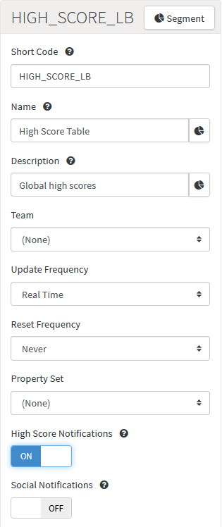

# How to Create and Award Achievements via a Leaderboard.

In this exercise we'll create an [Achievement](/Documentation/Configurator/Achievements.md) that is awarded to a player when they beat their current high score in a game:
* First, we'll need to create an [Event](/Documentation/Configurator/Events.md) and a [Leaderboard](/Documentation/Configurator/Leaderboards/README.md).
* When we've completed the configuration, we'll test it via the [Test Harness](/Documentation/Test Harness/README.md).

## Creating an Event

To start, we'll use the Configurator to create an Event that will allow your game code to log a score for the player with the GameSparks platform.

*1.* Go to *Configurator > Events*.

*2.* On the *Events* page, click to *Add* a new Event. The page adjusts to allow you to add the Event.

*3.* Now fill in the Event details for *Short Code*, *Name*, and *Description*.

*4.* Under the *Attributes* panel, click to *Add* an Attribute to the Event.

*5.* Configure the Attribute:

* *Short Code* - You'll use this as the key for the score that you post into the platform from your game code.
* *Name* - Enter a name for the Attribute.
* *Data Type* - Set this to *Number* for our current example of a high score table, because the incoming scores are integers and we want to be able to sort them into numerical order.
* *Default Value* - This field can be ignored for our example.
* *Default Aggregation Type* - In the case of a high score table, we want to track the highest score posted by each of the game's players. Therefore, select *Maximum*. This will result in  GameSparks platform storing one record per player and that record will contain the player's highest score.

*6.* Click to *Save and Close* your new Event with its single Attribute.

## Creating a Leaderboard

Next, we'll create a Leaderboard that will arrange the players' scores in order from highest to lowest.

*1.* Go to *Configurator > Leaderboards* and click to *Add* a new Leaderboard to represent the game's high score table.

*2.* Enter the details for the new Leaderboard:

* *Short Code* - Unique identifier for the Leaderboard.
* *Name* - A name for the Leaderboard.
* *Description* - A description explaining the purpose of the Leaderboard.
* *Team* - The type of Leaderboard - Team or Player based. For this example, we want a *Player* Leaderboard, so *do not select* a Team for the Leaderboard, which means it's a Player based Leaderboard.
* *Update Frequency* - Select the rate at which the Leaderboard will be updated. Here, we leave the default setting of *Real Time*.
* *Notifications* - Settings you can use to control the notifications that are sent through to players or their friends regarding their rankings on the Leaderboard. Here we'll switch on only *High Score Notifications*, which means players will be sent a [NewHighScoreMessage](/API Documentation/Message API/Leaderboards/NewHighScoreMessage.md) when they submit a new high score.

<q>**Note:** You'll use the Short Code when your game code posts scores into the GameSparks platform.</q>

*3.* In the *Fields* panel, add a *Running Total*:

* The *Running Total* field should be set to the *Score Event* that we created in the previous section. A Running Total was automatically created when you created that Event in the section above.
* In the *Collector* field, select the Event Attribute *SCORE_EVT.SCORE_ATTR* that we added to the *Score Event*.
* The *Filter Type* field is set to * (wildcard) so that all values are included.
* The *Filter Value* field is not relevant in this exercise.
* Finally, the *Sort* field is set to DESC (descending) to order the Leaderboard from highest player score to lowest.

<q>**Note:** [Running Totals](/Documentation/Configurator/Leaderboards/Running Totals.md) are an advanced topic that we don't need to worry about for this exercise.</q>

*4.* Click to *Save and Close* your Leaderboard.

## Creating an Achievement

Now, we can create an Achievement that is triggered when a new high score is posted to the Leaderboard.

*1.* Go to *Configurator > Achievements* and click to *Add* a new Achievement.

Enter the details of the new Achievement:
* *Short Code* \- A unique identifier for the Achievement for use elsewhere in the Portal and in Cloud Code.
* *Name* \- A name to help you find the Achievement in the Portal.
* *Description* \- A description explaining the purpose of the Achievement.
* *Virtual Good Award*- The Virtual Good to award a player as a reward for gaining the Achievement - for this example, no Virtual Good will be awarded.
* *Currency Awards* \- The amount of each of the Currencies to award a player as a reward for gaining the Achievement - here players receive 100 of each Currency.
* *Leaderboard* \- Achievements can be triggered from a Leaderboard or through a Cloud Code script.
  * Here we select the *High Score Table* Leaderboard we created earlier as the Leaderboard which will trigger the awarding of the Achievement..

  <q>**No Leaderboard?** You can trigger Achievements using a Cloud Code script, if no Leaderboard was selected. To do this, you wouldn't select a Leaderboard but *None - Triggered by Script* instead.</q>
* *Repeatable*  \- Enabling this means the Achievement can be earned multiple times.
* *Property Set* - Select the [Property Set](/Documentation/Configurator/Properties.md) to which you want the Achievement to belong.

*2.* In the *Triggers* panel, click to *Add* a new Trigger for the Achievement:

Enter the details for the Achievement Trigger:
* *Trigger Data* - Because we've selected the *High Score Table* Leaderboard for the Achievement, the Running Total *Fields* we added to the Leaderboard are available as the data that trigger the awarding of the Achievement.
* *Filter Type* - Operators which allow you to filter the trigger - here we select *greater than or equal to*.
* *Filter Value* - The value of the Filter - we've set the value at 100.

By linking our *High Score Achievement* to the *High Score Table* Leaderboard, using the *Score Attribute* field as the trigger data, and filtering that data, we ensure players are awarded the Achievement only when they score 100 or more on that Leaderboard.

*3.* Click to *Save and Close* the new Achievement.

## Testing Achievement, Leaderboard, and Event with Test Harness

In this section we'll use the Test Harness to register a test player with the preview version of the game, authorize this player and post a new high score to the GameSparks platform. We'll see the JSON requests and responses and then request the player's details to see that they have been gifted with some in-game currency.

### Register a Test Player

Select [RegistrationRequest](/API Documentation/Request API/Authentication/RegistrationRequest.md) from the *Test Harness > Requests > Authentication* menu. Now change the *userName* and *displayName* as shown below and send this JSON request to the GameSparks platform by clicking *Send Request*.

The *Inspector* shows the request (in green text) that was sent to the GameSparks platform via the WebSocket and the response (in blue text).

### Check the Player's Current Details

Select [AccountDetailsRequest](/API Documentation/Request API/Player/AccountDetailsRequest.md) from the *Test Harness > Requests > Player* menu. Examine the currency values for this player in the response, notice that they are all zero.

### Log Event

Select the [LogEventRequest](/API Documentation/Request API/Player/LogEventRequest.md) option on the *LogEvent* tab. Now select the *Score Event* menu option from the submenu:

* Notice that the *eventKey* field is set to *SCORE_EVT*, which is the Short Code of the Event that we created at the start of the exercise.
* Set the *SCORE_ATTR* value to 100.
* Click *Send Request*:

In the Inspector you can see the request you sent in green text and the response in blue text.

There will also be two Messages: an *AchievementEarnedMessage* and a *NewHighScoreMessage*. Both are asynchronous messages that the GameSparks platform has sent to this player:

### Check the Player's Updated Details

Finally repeat the [AccountDetailsRequest](/API Documentation/Request API/Player/AccountDetailsRequest.md) you performed earlier and notice that the player now has the new Achievement and 100 of each currency.

