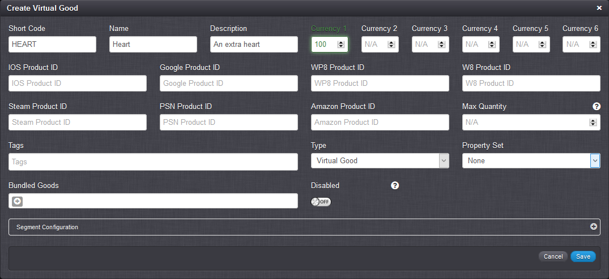
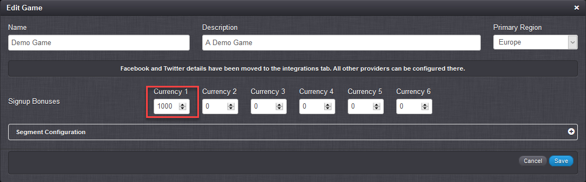

# How to do In-App Purchases

In this exercise we'll cover a few different scenarios around purchasing. We'll look at:
* Setting up a Virtual Good to be purchased using a Virtual Currency.
* Check the purchase of the Virtual Good as an authenticated player in the Test Harness.
* How you set up your Virtual Goods so you can also do purchases through third-party stores (Google Play, iOS App Store, Windows Store).

## Setting Up a Virtual Good for Purchasing with a Virtual Currency

*1.* Log in to the [GameSparks Developer Portal](https://portal.gamesparks.net) and go to *Configurator > Virtual Goods*.

*2.* Click  to create a new Virtual Good.



*3.* Enter the Virtual Good details:
* Give it a *Name* and a *Short Code* - we'll use the Short Code to refer to the item later on.
* Leave the *Type* as 'Virtual Good'. Note that the other option here is 'Currency Pack' which, instead of adding a good to your player when awarded, grants them some configurable quantity of currencies. This is a very useful type for Virtual Goods, but for now let's focus on the 'Virtual Good' type.
* *Currencies* - Because we're going to start with a Virtual Currency purchase, we need to specify a price for the Virtual Good here, so let's add a *Currency 1* value of 100. This means a player will be charged 100 units of Currency 1 when they buy this Virtual Good.

Let's now set up a player so that they can buy your Virtual Good.

*4.* Go to *Configurator > Overview*, click  and under *Signup Bonuses* add a *Currency 1* signup bonus of 1000.



Now whenever you register a player they will be granted 1000 units of Currency 1.

The next steps all take place within the *Test Harness*.

## Checking Purchases in the Test Harness

If you've been following along with the configuration set up above, you should be able to run these steps in the Test Harness.

*1.* Firstly, we register a new player (submit *Authentication > RegistrationRequest*): "PLAYER ONE"

```
{ "@class": ".RegistrationRequest",
"userName": "player1",
"password": "password",
"displayName": "PLAYER ONE"
}

```


```
{ "@class": ".RegistrationResponse",
"authToken": "6f19a38a-189a-43cb-b421-bd8218209c43",
"displayName": "PLAYER ONE",
"scriptData": null,
"userId": "53b136cbe4b0fd9efb39a692" }

```

*2.* And if we look at their account details (submit *Player > AccountDetailsRequest*) we can see our signup bonus has been awarded:

```
{ "@class": ".AccountDetailsResponse",
"currency1": 1000, "currency2": 0,
"currency3": 0,
"currency4": 0,
"currency5": 0,
"currency6": 0,
"displayName": "PLAYER ONE",
"location": { "latitide": 53.966705,
"longditute": -1.0832977, "city": "York", "country": "GB" },
"scriptData": null,
"userId": "53b136cbe4b0fd9efb39a692" }

```

*3.* If we list the available Virtual Goods (submit *Store > ListVirtualGoodsRequest*), we see our Heart listed:

```
{ "@class": ".ListVirtualGoodsResponse",
"scriptData": null,
"virtualGoods": [ { "description": "An extra heart", "name": "Heart", "shortCode": "HEART", "currency1Cost": 100 } ] }

```

*4.* To buy a Heart we submit a [BuyVirtualGoodsRequest](/API Documentation/Request API/Store/BuyVirtualGoodsRequest.md) (*Store > BuyVirtualGoodsRequest*):

```
{ "@class": ".BuyVirtualGoodsRequest",
"shortCode": "HEART",
"quantity": "1",
"currencyType": "1"
}

```
```

{ "@class": ".BuyVirtualGoodResponse",
"boughtItems": [ { "shortCode": "HEART", "quantity": 1 } ],
"scriptData": null }

```

*5.* And we submit a subsequent [AccountDetailsRequest](/API Documentation/Request API/Player/AccountDetailsRequest.md), which will show that the player now has a Heart available, and 100 less of Currency 1:

```
{ "@class": ".AccountDetailsResponse",
"currency1": 900,
"currency2": 0,
"currency3": 0,
"currency4": 0,
"currency5": 0,
"currency6": 0,
"displayName": "PLAYER ONE",
"location": { "latitide": 53.966705, "longditute": -1.0832977, "city": "York", "country": "GB" },
"scriptData": null,
"userId": "53b136cbe4b0fd9efb39a692",
"virtualGoods": { "HEART": 1 } }

```

*6.* Lastly, the player can now consume a Heart using the [ConsumeVirtualGoodRequest](/API Documentation/Request API/Store/ConsumeVirtualGoodRequest.md) (submit *Store > ConsumeVirtualGoodRequest*), which will remove the Virtual Good from their profile:

```

{ "@class": ".ConsumeVirtualGoodRequest",
"shortCode": "HEART",
"quantity": "1"
}

```
```

{ "@class": ".ConsumeVirtualGoodResponse",
"scriptData": null
}

```

## Integrating with Third-Party Stores

Using a Virtual Currency is one option when buying Virtual Goods. What if you want to hook up to a third-party store to handle real money transactions? GameSparks supports integration with Google Play, the iOS App Store, and Windows Store to allow you to do just that!

This section explains how to integrate each store type with the GameSparks platform. In all cases the underlying flow is the same:

1. The player requests a purchase to be made within the Game Client.
2. The Game Client calls the Store API on the device to process the transaction.
3. The Store API responds with a receipt.
4. The Game Client sends the receipt through to the GameSparks platform.
5. The GameSparks platform validates the receipt and adds the purchased Virtual Goods to the player's profile.

### Google Play

*1.* To make purchases using Google Play, you first need to set up your Virtual Good as a product in the Google Play Developer Console. See [Creating a Product List](https://developer.android.com/google/play/billing/billing_admin.html#billing-list-setup).

*2.* Now we need to tie the Virtual Good in your game to the product in Google Play. We do this in the GameSparks Developer Portal:
* Go to *Overview > Virtual Goods* and edit your Virtual Good.
* Insert the Product ID you gave your product within the Google Play Developer Console into the *Google Product ID* field.

*3.* Finally, to verify the purchase on the server we need to set up you Google Play public key within your game. Go to the GameSparks Developer Portal under *Configurator > Notifications > Google* and in the field *Google Play Public Key* enter the key obtained by following the steps in the section "Getting an app's license key" [here](http://developer.android.com/google/play/billing/billing_admin.html).

*4.* After making the purchase in the client, Google Play will invoke your response Intent as described in [Purchasing an Item](https://developer.android.com/google/play/billing/billing_integrate.html#Purchase). At this point you can get the purchase data and the signature:

```
String purchaseData = data.getStringExtra("INAPP_PURCHASE_DATA"); String dataSignature = data.getStringExtra("INAPP_DATA_SIGNATURE");

```

*5.* You then send the data to the GameSparks platform using a [GooglePlayBuyGoodsRequest](/API Documentation/Request API/Store/GooglePlayBuyGoodsRequest.md):

```
{ "@class": ".GooglePlayBuyGoodsRequest",
"signature": "dataSignature",
"signedData": "purchaseData"
}

```

The GameSparks platform will validate the purchase against the signature and, if it is valid, return with:

```
{ "@class": ".BuyVirtualGoodResponse",
"boughtItems": [ { "shortCode": "HEART", "quantity": 1 } ],
"scriptData": null
}

```  

At which point the player's profile will have been updated with the newly purchased Virtual Goods.

### iOS App Store

*1.* To make purchases using the iOS App Store, first you need to set up your Virtual Good in iTunes Connect, as described in [Configuring a Product](https://developer.apple.com/library/ios/documentation/LanguagesUtilities/Conceptual/iTunesConnectInAppPurchase_Guide/Chapters/CreatingInAppPurchaseProducts.html#//apple_ref/doc/uid/TP40013727-CH3-SW3).

*2.* Now we need to tie the Virtual Good in your game to the product in iTunes Connect. We do this in the GameSparks Developer Portal:
* Go to *Overview > Virtual Goods* and edit your Virtual Good.
* Insert the Product ID you gave your product within iTunes Connect into the *IOS Product ID* field.

*3.* After a purchase is made, get hold of the receipt as described in [Read the Receipt Data](https://developer.apple.com/library/ios/releasenotes/General/ValidateAppStoreReceipt/Chapters/ValidateRemotely.html#//apple_ref/doc/uid/TP40010573-CH104-SW2).

```
NSURL *receiptURL = [[NSBundle mainBundle] appStoreReceiptURL]; NSData *receipt = [NSData dataWithContentsOfURL:receiptURL]; if (!receipt) { /* No local receipt -- handle the error. */ }

```

*4.* You then send the receipt to the GameSparks platform using a [IOSBuyGoodsRequest](/API Documentation/Request API/Store/IOSBuyGoodsRequest.md):

```
{
"@class": ".IOSBuyGoodsRequest",
"receipt": "receipt"
}

```

The GameSparks platform will validate the purchase with the App Store and, if successful, return with:

```
{
"@class": ".BuyVirtualGoodResponse",
"boughtItems": [
{
"shortCode": "HEART",
"quantity": 1
}
],
"scriptData": null
}

```

At which point the player’s profile will have been updated with the newly purchased Virtual Goods.

### Windows Store

*1.* To make purchases using the Windows Store, first you need to set up your Virtual Good in the [Windows Phone Dev Center](https://developer.microsoft.com/en-us/).

*2.* Now we need to tie the Virtual Good in your game to the product in the Windows Phone Dev Center. We do this in the GameSparks Developer Portal:
* Go to *Overview > Virtual Goods* and edit your Virtual Good.
* Insert the Product ID you gave your product within the Windows Phone Dev Center into the *WP8 Product ID* field.

*3.* After a purchase is made, get hold of the receipt as described in [Use a receipt as proof of purchase on a server](http://msdn.microsoft.com/en-us/library/windowsphone/develop/jj206950.aspx#BKMK_CodeSamples).

*4.* You can then send the receipt to the GameSparks platform using a [WindowsBuyGoodsRequest](/API Documentation/Request API/Store/WindowsBuyGoodsRequest.md):

```
{
"@class": ".WindowsBuyGoodsRequest",
"receipt": "receipt"
}

```

The GameSparks platform will validate the signature contained in the receipt and, if successful, return with:

```
{
"@class": ".BuyVirtualGoodResponse",
"boughtItems": [
{
"shortCode": "HEART",
"quantity": 1
}
],
"scriptData": null
}

```

At which point the player’s profile will have been updated with the newly purchased Virtual Goods.
