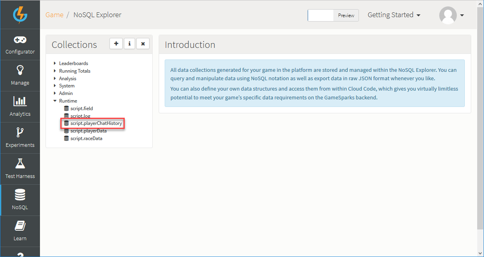

# How to Create Indexes for Custom Game Collections

Indexes on collections allow MongoDB to process queries more efficiently and speed up the time it takes to execute your Cloud Code scripts. For queries that don't use an index, MongoDB must scan all documents in a collection for documents that match the query. For large collections this can be an expensive operation.

In this tutorial, we'll create a custom collection and add an index to it via a Cloud Code script.

## Creating an Index

As a first step, let's create a runtime collection using the [NoSQL Explorer](/Documentation/NoSQL Explorer.md):

*1.* In the GameSparks developer portal, navigate to the *NoSQL* page.

*2.* Under *Collections*, click to add a new Collection:


A *Create Collection* dialog appears.

*3.* Enter a *Name* for your Collection and select the *Runtime* for *Type*:

*4.* Click to *Create* your custom Collection.


This creates a new Collection called *script.playerChatHistory*, which your game can use to store custom data and will be listed under *Runtime*:




For this example, let's assume that this collection contains documents that look like this:

```    
    {
     "_id": {
     "$oid": "53b155dfe4b04cfe90ec2315"
     },
     "player": "537f08e1e4b01fdedfa52c49",
     "dateOfChat": "2014-06-30T15:03:40.661Z",
     "chatData": "Hi buddy, fancy a game of Pong?"
    }
```
</br>
The next step is to write some Cloud Code that creates an index on this Collection. A sensible place to attach this type of script is the *Game Published* Event:

*1.* Navigate to the *Configurator >Cloud Code*.

*2.* Under *Scripts* click to expand *System*.

*3.* Click on the *Game Published* option to access that script:


*4.* Enter the following Javascript in the editor window and click the *Save* button:

```    
    var playerChatHistoryCollection = Spark.runtimeCollection('playerChatHistory');
    playerChatHistoryCollection.ensureIndex({"dateOfChat" : -1});
```

This script uses the [SparkMongoCollectionReadWrite](/API Documentation/Cloud Code API/Cloud Data/SparkMongoCollectionReadWrite.md) API *ensureIndex* method to add an index to the Collection on the *chatDate* field:
  * The *ensureIndex* method only creates an index if an index of the same specification does not already exist.
  * A value of 1 specifies that the index orders items in ascending order.
  * A value of -1 specifies an index that orders items in descending order.
  * This index will support queries that use the *chatDate* field.

*5.* You can also create compound index across multiple fields. For example:

```    
    var playerChatHistoryCollection = Spark.runtimeCollection('playerChatHistory');
    playerChatHistoryCollection.ensureIndex({"dateOfChat" : -1, "player" : 1});
```

## Testing the Index Script

To test our script we need to publish the game:

*1.* Navigate to the *Game Overview* page.

*2.* Click to *Create* a new Snapshot:


*3.* Enter a *Name* for your new Snapshot and click to *Create* it:


*4.* Publish the Snapshot by clicking the publish  icon:


Publishing the game will have triggered the Cloud Code script that we attached to the *Game Published* Event.

<q>**Tip!** You can check for Cloud Code script errors in the script.log collection from within the NoSQL Explorer tool.</q>
