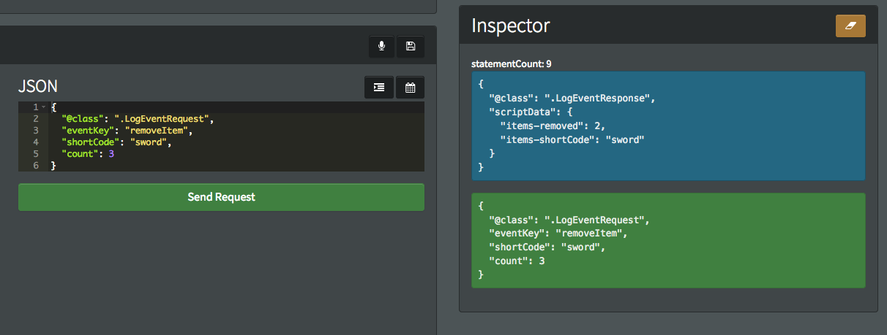

# Saving and Loading Data - Player Inventory and Item Management


## Introduction

This tutorial covers the basics of saving and loading data to and from your game using GameSparks custom Log Event requests. We'll start off with the basics of how to setup a simple player-inventory system in Cloud Code, and later we'll look at how to create a management screen for your items on GameSparks using dynamic forms.

## Inventory Items

To begin with, we're going to create a collection for all items in the game. This is where we'll keep the list of all items a player can get in the game. These items will have a simple-structure. All we need is an ID, a name (or short-code), display-name and description.

There's plenty of other attributes these items can have. For example, we can use a *type* field to filter specific items for specific areas or stores in your game. Or we can use the *type* field to filter only specific inventory items to be displayed in a store-front - that is weapons, potions, or armour. We could add another field which would similarly denote the level of the item, and could be used to only show the user items at their level. There are plenty of attributes we can add here that could be hooked into your game in various ways.

### Creating a Collection from Scratch

We can create a collection from scratch through the NoSQL explorer. Later on, in another tutorial, we'll go through how to create items using a CMS screen, but let’s save that for when we have everything working.

To do this go to the NoSQL tab on the portal and click on the plus [+] button on the *Collections* panel. We'll create a new *Metadata* collection called *items*:


#### Why Metadata Collection?

The reason we want this to be a meta-collection as opposed to a runtime collection is because meta-collections don’t get reset when you publish your game. Runtime-collections, such as the player collection or player inventory are only specific to the game.

The difference is that meta-collections can be moved from preview to live without being reset. That makes them very useful for persistent data like items.
It is also important to note that meta-collections are not editable while the game is live, so they are much safer to use for game-config information.

### Inserting New Items

The next thing we are going to do is to create a new item and insert it into our collection. We'll also do this through the NoSQL explorer. The item will have the following structure (below) and you can add or remove fields if you want.

To insert the new item, simply paste the following JSON structure into the text-field on the ‘insert’ tab.

```
{  "shortCode" : "hearthstone",  "name" : "Hearth Stone",  "description" : "Transports the user to their home", "type" : "item" }

```


You can add multiple items at once by using a comma between each item-definition and by wrapping them in bracket to create a JSON-array.


Now that we have some items defined we can start on our inventory system.

## Get Items

The first thing we are going to is create a new Event, which we'll use for getting a list of our items. We’ll need this first, in order to know what items we actually can add to our inventory.

Create a new Event called *getItems* and give it one field - a string called type. We'll use this to filter for items of a specific type.


Next, we'll open up the Cloud Code for this Event and start writing some code. What we want this script to do is return all items of the specific *type* we requested. This also means we want to return all items if no *type* was requested. So we'll first check if the *type* was an empty string, and if so, we return everything in that collection:

```
var type = Spark.getData().type; // get the type we passed in
if(type != ""){
    // if the type wasnt an empty string, then we can use the type in our query
    Spark.setScriptData('items', Spark.metaCollection('items').find({ "type" : type })
}else{
    // if the type was an empty string, we can forget the query as we just want to return everything
    Spark.setScriptData('items', Spark.metaCollection('items').find());
}


```


Note that you can also exclude certain fields from the response. In this example, we've excluded the ID of the item which we don’t need because it's not useful information for the client and leaving it out reduces the size of the data being sent back.

### Testing

Let’s test this script out in the [Test Harness](/Documentation/Test Harness/README.md). If we call this Event with no *type* set, we should get a full-list of items:


But if we only ask for the weapons, we should only get items with the weapon-type:


## Add Item

So now that we have a list of item-data being returned from our game, we can give our player the ability to add items to their inventory.

We are going to create a new Event called *addItem*, which will take the item’s Short Code. We'll check to see if that short-code exists, and if so, we'll add it to the player’s inventory:


There are several ways to create the inventory structure. The way we are going to do for this example will involve a separate document for each item in the player’s inventory. This method carries several advantages:

* The inventory is easier to query and modify, because we can let MongoDB do what it is designed for.
* Since we are using individual documents instead of an array, we don't have to write code to search, update and remove items ourselves.
* All of this means that operations on the inventory are more efficient.

The disadvantage of this way of setting up the inventory structure is that there are multiple documents for each player instead of one document per player so the collection is potentially much larger.

This Cloud Code script fro this event will have the following steps:
1.	Check that the Short Code entered corresponds to a valid item in our items collection.
2.	Construct a player inventory document from that item and the player’s ID (so we can check it later).
3.	Insert the doc into the *player_inventory* runtime collection.

Note that we don’t have to create the *player_inventory* collection as we did with the items collection. It will be created for us as soon as we run our code:

```
var shortCode = Spark.getData().shortCode; // get the shortcode passed into this event
// check that the shortcode is a valid item //
var item = Spark.metaCollection('items').findOne({ "shortCode" : shortCode }, { "_id" : 0 }); // we dont want the _id to be returned so we will exclude it from the returned fields
if(item){
    // item shortcode is valid lets make doc for our player's inventory//
    var newInvItem = { // new inventory item
        "player_id" : Spark.getPlayer().getPlayerId(), // we need the player id to be able to get the player's full inventory later on
        "item" : item
    }
    Spark.runtimeCollection('player_inventory').insert(newInvItem); // insert the new doc
    Spark.setScriptData('item-added', shortCode);

}else{
    // we want to return an error if the wrong code was submitted //
    // so here, we log that an incorrect code was submitted and return an error //
    Spark.getLog().debug("Add Item| Invalid Item ShortCode - "+shortCode);
    Spark.setScriptError('item', 'invalid-item-id');
}


```


### Testing

We can test this Event through the [Test Harness](/Documentation/Test Harness/README.md). If we enter a *shortCode* for the LogEventRequest, we know that into the *scriptData* field the response should return the item-added message:


We can check to see if our item actually was added, but checking to see if our player has a new entry in the *player_inventory* collection though the NoSQL explorer:


Something to note here is that this code does not check if the player already has an item before granting it. This is not difficult to implement, it just means that before we grant the item we query the collection for the short-code and *playerID* and see if there are any records before inserting the new doc into the collection.

But for this tutorial we aren’t worried about that as there is no limit to the amount of item a player can have.

## Removing Items

The next thing we want to do is to be able to remove items from our inventory. This is pretty straight-forward. It will also take an item short-code, but in this case we will also take a number, in case we want to drop more than one of an item (like dumping items from our inventory in bulk).

We are also going to use a default-value for the count. By setting the default value to ‘1’ we will save writing an extra piece of code to ensure this field is filled-out. By setting it to1 by default, it will always remove 1 item unless specified:


So in our cloud-code this script will have the following steps:
1.	We will query the *player_inventory* collection for the number of items requested.
We will use the *player_id* field to make sure we get the items for our player only.
2.	We will then loop through those items and remove them from the collection.
For this we will user the *\_id* field for each item to remove it.
3.	If there are no items to remove, we will return a message.

So our first step will take care of validating the short-code, as if the short-code is wrong, we won’t get any items to remove, therefore we avoid crashes or removing unwanted items if the short-code were invalid.

```
var shortCode = Spark.getData().shortCode; // get the shortcode passed into this event
var count = Spark.getData().count; // get the amount we want to remove
// we are going to use the limit function to get only the number of items we requested //
// we only care about the _id.$oid so thats all we nee to return. We will use that later to remove items //
var itemsToRemove =  Spark.runtimeCollection('player_inventory').find({ 'player_id' : Spark.getPlayer().getPlayerId(), 'item.shortCode' : shortCode }, { "_id": 1 }).limit(count);
var itemsCount = itemsToRemove.count();

if(itemsToRemove.count() > 0){ // check that we actually have items to remove
   while(itemsToRemove.hasNext()){
       // loop through all items and remove them using the remove() function
       Spark.runtimeCollection('player_inventory').remove({ "_id"  : {  "$oid" : itemsToRemove.next()._id.$oid }});
   }
   Spark.setScriptData('items-removed', itemsCount);
   Spark.setScriptData('items-shortCode', shortCode);
}else{
    // we want to log the error and return a message to the player //
    Spark.getLog().debug("Remove Item| Player Has No Items With ShortCode - "+shortCode);
    Spark.setScriptError('no-item-to-remove', shortCode);
}


```


### Testing

Before testing this code, you should make sure you have added a bunch of items to your player’s inventory. We need to test two things; first that we can remove multiple items, and also what happens when no items were found:



You can see that the way the code is written, even if I try to remove 3 items, having only two in my inventory, it will not fail, it will only remove the items it can and return the number of items that were removed:


However, if I then attempt to remove items, with none left in my inventory, it will get an error. This behavior can be modified if you like, but the basic idea is to catch invalid behaviors the client might cause.

### Get  Player Inventory

The next thing we need to do is to be able to get the player’s entire inventory. We will create a new event for this called *getPlayerInventory*. This event will take one field, a string called type and just like the *getItems* event, this event will have the ability to check only specific types of player items:


So, again here, I’ve used a default value, ‘all’.

I did this just to so you how we can use different word to denote these query-fields instead of an empty string.

This event will be the simplest so far, as all we will do is get the ‘type’ and return all items we find for the specified type. There doesn’t need to be any error messages as even if the player doesn’t have an inventory, or the type is invalid:

```
var type = Spark.getData().type; // get the type we passed in
if(type != "all"){
    Spark.setScriptData('items', Spark.runtimeCollection('player_inventory').find({ 'player_id' : Spark.getPlayer().getPlayerId(),
                                                                                    'item.type' : type }, { "_id" : 0 }));
}else{
    Spark.setScriptData('items', Spark.runtimeCollection('player_inventory').find({ 'player_id' : Spark.getPlayer().getPlayerId()}, { "_id" : 0 })
}


```


### Testing

We can again, test this through our [Test Harness](/Documentation/Test Harness/README.md). The player-ID is taken from the logged-in player, so we don’t have to worry about passing this into the event:


## Editing Item Details Using Dynamic Forms

The next part of this tutorial will be creating a management screen where you can list items, update them and create new ones.

This will be done using dynamic forms. Dynamic forms are very useful in GameSparks for creating your own management screens and they can be used for a variety of things. Dynamic forms can be a bit complicated so we advise you take a look over how they work. There are tutorials [here](/Tutorials/Analytics. Segmentation and Game Management/README.md) and there is a list of dynamic forms APIs [here](/API Documentation/Dynamic Forms API.md).

The first thing that is needed is to create a new management screen. To do this go to the *Manage* tab of your GameSparks portal and click the *Add* button:


In this screen all we need to do is setup the screen name and short-code and then add a little HTML so that we can setup a placeholder which will run a snippet called *items_view* - this is the first snippet we will be working on:


Next we are going to create the snippets we need for this manage screen. To do this we select the ‘Snippets’ tab and click on the ‘Add’ button again. We are going to create three snippets called *items_view*, *items_edit*, and *items_delete*.

### Item List

The first snippet we are going to look at is the *items_view* snippet. This is going to list details about the items currently in the collection and will allow us to delete, edit and add new items.

There are only two sections we need to worry about in these snippets, the *JavaScript* window and the *Handlebars* window.

In the JavaScript window, all we need to do is create a function that will return the list of items in the *items* meta-collection:

```
Spark.setScriptData("form", SnippetProcessor());

function SnippetProcessor(){

    var form = {};
    return view();

    function view(){

        form.itemList = Spark.metaCollection("items").find({}).sort({ "_id" : -1 });
        return form;
    }
}


```

And in the Handlebars window we will add some HTML for drawing the list. This HTML will also include a button which will run the *items_edit* snippet (where we can edit item details) and for each item there will be an icon which will allow you to edit an item (using the *items_edit* snippet again) or delete an item using the *items_delete* snippet.

```
<gs-title-block title="Manage Items" padding="10" margin="0">
    <gs-row>
        <gs-col width="10"><h4>Here you can View, Create, Edit or Delete Items.</h4></gs-col>
        <gs-col width="2">
            <gs-link snippet="items_edit?action=view" target="modal"><button>Create New</button></gs-link>
        </gs-col>
    </gs-row><hr/>
    <gs-row>
            <gs-col width="2"><h5>Item Name</h5></gs-col>
            <gs-col width="2"><h5>ShortCode</h5></gs-col>
            <gs-col width="4"><h5>Description</h5></gs-col>
            <gs-col width="2"><h5>Type</h5></gs-col>
            <gs-col width="1"><h5>[Edit]</h5></gs-col>
            <gs-col width="1"><h5>[Delete]</h5></gs-col>
    </gs-row><hr/>
    <gs-row>
        {{#each form.itemList}}
        <gs-row>
            <gs-col width="2">{{name}}</gs-col>
            <gs-col width="2">{{shortCode}}</gs-col>
            <gs-col width="4">{{description}}</gs-col>
            <gs-col width="2">{{type}}</gs-col>
            <gs-col width="1"><gs-link snippet="items_edit?action=view&itemId={{_id.$oid}}" target="modal-wide"><i data-toggle="tooltip" data-placement="top" title="Edit Item" class="icon-edit"/></gs-link></gs-col>
            <gs-col width="1"><gs-link snippet="items_delete?action=view&itemId={{_id.$oid}}" target="modal-small"><i data-toggle="tooltip" data-placement="top" title="Delete Item" class="icon-trash"/></gs-link></gs-col>
        </gs-row>
        {{/each}}
    </gs-row>
</gs-title-block>


```


Now if you save this snippet you will be able to go back to your manage-screen and see the list of items we’ve already created.


### Editing Items

For editing items, we are going to use the items_edit snippet. Now, when we start to get this snippet working we will need to pass some sample data into the snippet so that we know it is all working correctly.

In the items_view snippet, when we wanted to have this snippet run, we passed two fields into the snippet. The first was { “action” : “view” }, which is used to tell the snippet which action we want (later we will pass in { “action” : “save” },  for when we are saving the snippet). But when we want to edit the snippet we also want to pass in the ID for the item we want to edit.

So, in order to test this, we want to get the ID for an item that already exists. So you will need to go to the noSQL explorer and look up an object-ID for one of your existing items.

#### JavaScript Window

This section will have two functions, one for saving and one for drawing the event data. The way this is setup we will not need any extra code for a new event or one we want to edit. When we are creating a new event, there will be no data to display, so the HTML will automatically draw placeholder text instead. We will then use a MongoDB update method to edit or insert a doc automatically if one doesn’t exist.

```
Spark.setScriptData("form", SnippetProcessor(Spark.getData().scriptData))

function SnippetProcessor(data){

    var form = {};

    var action = data.action;

    switch(data.action){
        case "view":
            return view(data);
        case "save":
            return save(data);
    }

    function view(data){

        if(data.itemId != undefined){
            form.item = Spark.metaCollection('items').findOne({  "_id" : { "$oid" : data.itemId } });
        }
        return form;    
    }

    function save(data){

        Spark.metaCollection('items').update(
            {"name" :  data.name }
            {
                $set : { // all the fields we want to update go here
,
                    "shortCode" : data.shortCode,
                    "description" : data.description,
                    "type" : data.type
                }
            },
            true,
            false
            );        
        form.updated = true;

        return form;    
    }
}


```

An important part of the code above is the form.updated field in the save function. This is going to be used in the HTML code to tell the snippet that it should close the window when the user has hit the save button.

#### Handlebars Window

This part is pretty straight forward. It will have 3 parts:
1.	Check if the ‘updated’ field is present and if so, we close the window
2.	The main body of the window will contain fields we can edit. These will be wrapped in a form so that when we click on the ‘save’ button at the bottom, it saves all fields back to the snippet, but this time with the ‘view’ action.
3.	The last part is the body of the form which in this case is just text fields for name, shortcode, description and type.

```
{{#if form.updated}}
    <gs-modal-close></gs-modal-close>
    <gs-snippet snippet="items_view"></gs-snippet>  
{{else}}
<gs-row>
    <gs-title-block title={{#if form.items}}"Edit Item"{{else}}"Create New Item"{{/if}} padding="10" margin="0">
<input type="hidden" name='itemId' value="{{form.item._id.$oid}}"/>
            <gs-row>
                <gs-col width="6"><h5>Name</h5></gs-col>
                <gs-col width="6"><h5>Short Code</h5></gs-col>
            </gs-row>
            <gs-row>
                <gs-col width="6"><input type='text' placeholder="Item Name..." name='name' value="{{form.item.name}}"/></gs-col>
                <gs-col width="6"><input type='text' placeholder="Item ShortCode..." name='shortCode' value="{{form.item.shortCode}}"/></gs-col>
            </gs-row>
            <gs-row>
                <gs-col width="12">Description<br/>
                    <input type="text" name="description" value="{{form.item.description}}" required />
                </gs-col>
            </gs-row>
            <gs-row>
                <gs-col width="3"></gs-col>
                    <gs-col width="6">Type<br/>
                        <input type="text" name="type" value="{{form.item.type}}" required />
                    </gs-col>
                <gs-col width="3"></gs-col>
            </gs-row>
            <gs-row>
                <gs-col><gs-submit>Save</gs-submit></gs-col>
            </gs-row>
        </gs-form>
    </gs-title-block>
</gs-row>
{{/if}}


```


Now, when you save this you should be able to go back to your manage-screen (make sure to reload the page so the new code is updated) and you should be able to create new items and edit old ones.


### Deleting Items

Deleting items works similarly to how we edited items. This snippet will first draw a simple window showing the ID of the item you want to delete and it will include a button to delete it. When the user presses the button we will send the ID back to the snippet but this time it will remove the item from the collection and return the ‘updated’ bool so we know to close the window.

#### JavaScript Section


The two functions we have here will be view and deletion. We will use the MongoDB *findAndRemove* function to delete the item.

```
Spark.setScriptData("form", SnippetProcessor(Spark.getData().scriptData))

function SnippetProcessor(data){

    var form = {};

    switch(data.action){
        case "view":
            return view(data);
        case "delete":
            deletion(data);
            return view(data);
    }

    function view(data){

        form.itemId = data.itemId;
        return form;
    }

    function deletion(data){

        Spark.metaCollection('items').findAndRemove({"_id" : {"$oid" : data.itemId }});
        form.updated = true;
    }
}    


```

#### Handlebars Section

This code is also very simple, we just want to draw a title for the window containing the item’s ID and we will have a button which will send the item’s ID back to the snippet when clicked:

```
{{#if form.updated}}
    <gs-modal-close></gs-modal-close>
    <gs-snippet snippet="items_view"></gs-snippet>
{{else}}
    <gs-row>
        <gs-title-block title="Delete Items - {{form.itemId}}" padding="5" margin="0">
            <gs-row>
                <gs-col>
                    <h4>Delete Items with the ID: {{form.itemId}}?</h4>
                </gs-col>
            </gs-row>
            <gs-row>
                <gs-col><gs-link snippet="items_delete?action=delete&itemId={{form.itemId}}" target="items_ph"><button>Delete</button></gs-link></gs-col>
            </gs-row>
        </gs-title-block>
    </gs-row>
{{/if}}


```


## Summary

Through this tutorial you will be able to create request for updating and removing player inventory items as well as getting a list of available items and the player’s current inventory. We also covered building a simple manage-screen where you can create and edit items available to your player.

This was a very simple example. There is much more you could add to this for your own games. Adding new fields to the item-manager screen would allow you to define stats for you items such as health, damage, etc. You could also incorporate item-uses into your request so that items can be used an exhausted as players use them.

Another option could be to add prices to the items so that players could purchase items before they are added to their inventory. In this case you could is [SparkPlayer.debit](API Documentation/Cloud Code API/Player/SparkPlayer.md) to debit the player the price of the item you have set instead of using the built-in virtual goods if you like.

There are many ways to customize this to your own needs so please let us know if we can help.
