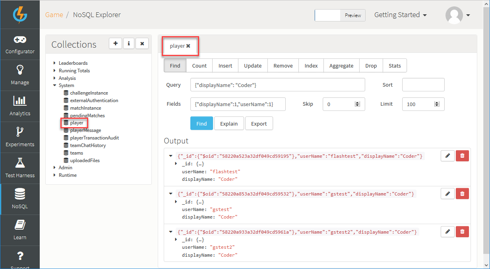

# Searching for Specific Players and Teams

## Introduction

The platform allows you to search for specific Players and Teams in your game with some very easy to use tools - no matter how big or small the collection.

This tutorial explains two ways you can search for players or teams, using:
* NoSQL Explorer.
* Cloud Code to find specific entries.  

## Searching with NoSQL Explorer

This powerful tool allows you to search for anything within your game, right down to the specifics of a certain index. For example, you can search for certain players who have exactly 530 ammunition in their inventory or search for players that share the same name - your search possibilities are endless!

<q>**More Information:** For more information about the SQL Explorer, click [here](/Documentation/NoSQL Explorer.md).</q>

### Searching the Player Collection

We'll use the NoSQL explorer to search for a specific player's display name. The display name we'll be looking for will be "Coder".

Here's how we set up the search in the explorer:
* *Collection* - Enter the *Player* collection to limit our search to players only.
* *Query* - Specify what exactly we'll be looking for. In our case, the displayName "Coder".
* *Fields* - Enter the fields for the query in the format: *{"displayName" : "Coder"}*.

Once we submit the search (Using enter, or the 'Find' button) the players which have 'Coder' as their display name will be retrieved and all their database data are displayed including scriptData, privateData, externalIDs, external authentication, and many more fields that you may or may not want to see. However, when you search for a certain specific field you can also limit what fields come back from the player database using the format *{"fieldName": 1}* to include fields or *{"fieldName": 0}* to exclude fields. So, for our purpose we're going to limit the search to return *displayName* and *userName* fields only:



### Searching the Team Collection

Following the search against the Player collection, by changing the collection to 'Team', you can now search for specific teams and view their members, which then allows you to take the member's ID and search for those members:
* If you submit an empty search for your Teams, you will retrieve a list of all your Teams and this will help you see the fields you can query.
* You can search for a specific member by ID to see which team that player belongs to or which teams have earned a certain achievement.


   

## Searching with Cloud Code

You can also search for Teams and Players in the *Cloud Code*, while your game executes the requests and responses. You can use this powerful capability to allow your users to find each other using events you've set up through Cloud Code.

We'll need to create a custom collection which keeps track of our user's ID and Username. To create a custom collection that saves your player details, do this:

1. Create a Runtime collection.
2. In your registration response have some Cloud Code which saves the player's ID and Username upon successful registration. Here's our example code:

Registration Response Cloud Code:
```
if(Spark.getData().error === null){
    //Load user details collection, pass in collection name
    var userCollection = Spark.runtimeCollection("userDetails");

    //Save the the username and ID on the runtime collection
    emailCollection.insert({"_id":{"$oid":Spark.getPlayer().getPlayerId()},"userName":Spark.getPlayer().getUserName()});
}
```

To retain that information in the future, use the function below anywhere in your Cloud Code:

```

    //SEARCHING PLAYERS
    //Getting a player based on Query
    var players = Spark.runtimeCollection("userDetails");

    var playerData = players.findOne({"userName" : "Coder"}, {_id : 1, userName:1}); //Find the username 'Coder' and return the players that have it.

    //Or you can have the player ID saved
    var playerID = "5602c3dce4b07961f34b68c3" //Manually set the ID

    //Finding the player through their ID
    var playerVar = Spark.loadPlayer(playerData._id.$oid); //or (playerID) //Make a reference for that player through their ID.

    //SEARCHING TEAMS
    //Or you can have the player ID saved
    var teamID = "GameSparks Team" //manually set the ID

    //Finding the player through their ID
    var teamVar = Spark.getTeams().getTeam(teamID) //Make a reference for that team through the ID

```
