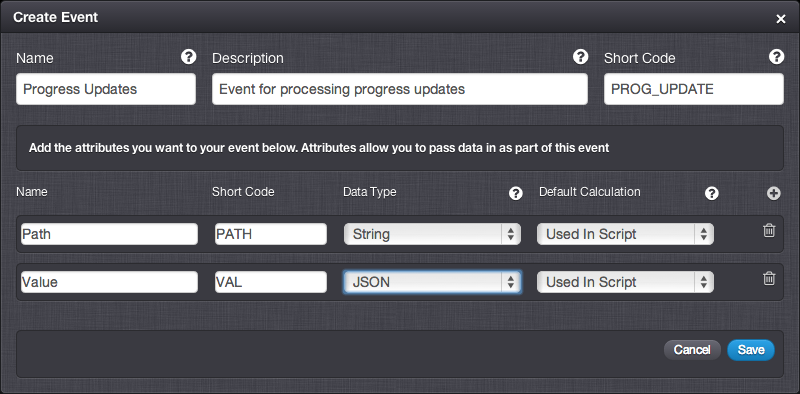

# How to do partial queries and updates to complex JSON document

There are times where you want to maintain a complex JSON document in a Mongo collection that you want to use for storing state.

In this example we'll assume the complete document is the full state of the game, but we do not want to pass the full document around every time we want to update it, and we may want to query for a particular section of the document without returning the full document. A good example of this may be where you are storing metadata about every level the player has ever played. When the player starts a level you want to return the current state from the server as a full document, but without the details of the other levels. We'll imagine we have a player who has already played level 1 and completed it, and has started level two but has not yet completed it. In this state the document we store against the user will look like this:

```
    {
      "_id": "playerid",
      "LEVEL_1": {
        "checkpoint": 5,
        "complete": 1
      },
      "LEVEL_2": {
        "checkpoint": 3,
        "complete": 0
      },
      "LEVEL_3": {
        "checkpoint": 0
      }
    }

```
</br>
<q>**More Information!** For further details and recommendations on how to use MongDB collections to store and manage your game data, see the [Managing Data Persistence](/Tutorials/Database Access and Cloud Storage/Managing Data Persistence.md) tutorial.</q>

## Configuring the Game

###  Creating the Event for Updating the Document.

We're creating a generic Event for updating a document. This Event will contain the path of the document we want to update and the value we want to set at that path. If this sounds a little complex, bear with us and work through the example - it should all become clear by the time you've work through the example!

We'll add a new Event in the portal that looks like this:



### Creating the Script to Process the Update Event

We now need to bind a Cloud Code script to this Event to access the data and make the document updates. This script uses a little bit of mongo magic to create the document if it doesn't already exist, and sets the value you want at the path you ask for.

  ```  
     var progressCollection = Spark.runtimeCollection("player_progress");

    //Get the value that was passed in for PATH
    var inputPath = Spark.data.PATH;
    //Get the value that was passed in for VAL
    var inputValue = Spark.data.VAL;

    //We need to create JSON object using a string as a key
    //We do this using the [] notation
    var updateObject = {};
    updateObject[inputPath] = inputValue;

    //Now do the mongo update.
    progressCollection.update(
      {"_id": Spark.getPlayer().getPlayerId()}, //Looks for a doc with the _id of the current player
      {"$set" : updateObject}, // Uses the $set mongo modifier to set value at a path
      true, // Create the document if it does not exist (upsert)
      false // This query will only affect a single object (multi)
    );
```
### Creating the Event for Querying the Document

We'll use the same pattern here for querying the document.  For the query Event only one attribute is required - the path of the document you want to retrieve.

We'll add a new Event in the portal that looks like this:


### Creating the Script to Process the Query Event

This script is a little more involved. The basic mongo find operators don't support getting a partial document. However, the aggregation framework does.

```  
    var progressCollection = Spark.runtimeCollection("player_progress");

    //Get the value that was passed in for PATH
    var inputPath = Spark.data.PATH;

    if(inputPath.length == 0){
      //No input path, we want the whole document
      var resultDocument = progressCollection.find({"_id" : Spark.getPlayer().getPlayerId()});
      //Put the results into the response.
      Spark.setScriptData("data", resultDocument);
    } else {
      //The query object for the aggregation
      var matchObject = {"$match" : {"_id": Spark.getPlayer().getPlayerId()}};

      //We want to use the last part of the path as the key in the returned data
      //We don't have to do it, but the result will make more sense
      var pathArray = inputPath.split(".");
      var lastPathString = pathArray[pathArray.length - 1];

      //Now we build up the object the spacified the fields we want to return  
      var projectData = {"_id":0 };
      //Using [] notation so we can use a variable as a JSON attribute name
      projectData[lastPathString] = "$"+inputPath;
      var projectObject = {"$project" : projectData};

      //Run the aggregation
      var partialResult = progressCollection.aggregate(matchObject, projectObject);

      //Put the results into the response.
      Spark.setScriptData("data", partialResult);
    }
```

## Execution of the Configuration

### Register a User to Use for the Tests

```    
    {
        "@class": ".RegistrationRequest",
        "userName": "gamesparks",
        "password": "gspwd",
        "displayName": "GameSparks Test",
        "requestId": "1392894961229"
    }
```
```    

    {
        "@class": ".RegistrationResponse",
        "authToken": "...",
        "displayName": "GameSparks Test",
        "requestId": "1392894961229",
        "scriptData": null,
        "userId": "5305e40f1c26ac2a6576c389"
    }
```
### Start Playing Level 1

We'll first check if the user has any data for level 1

```  
    {
        "@class": ".LogEventRequest",
        "eventKey": "PROGRESS_QUERY",
        "PATH": "LEVEL_1",
        "requestId": "1392895355079"
    }
```

```
    {
        "@class": ".LogEventResponse",
        "requestId": "1392895355079",
        "scriptData": {
            "data": []
        }
    }
```

We can see now that the user has no data for level 1.

### Reach a Checkpoint on Level 1

We want to update the document to put the checkpoint reached into the document.

```  
    {
        "@class": ".LogEventRequest",
        "eventKey": "PROG_UPDATE",
        "PATH": "LEVEL_1.checkpoint",
        "VAL": 1,
        "requestId": "1392895516999"
    }
```

```
    {
        "@class": ".LogEventResponse",
        "requestId": "1392895516999",
        "scriptData": null
    }
```

Once this request has been passed in, we can query the document to get the progress in the future if required

```    
    {
        "@class": ".LogEventRequest",
        "eventKey": "PROGRESS_QUERY",
        "PATH": "LEVEL_1",
        "requestId": "1392895355079"
    }
```

```
    {
        "@class": ".LogEventResponse",
        "requestId": "1392895614721",
        "scriptData": {
            "data": [
                {
                    "LEVEL_1": {
                        "checkpoint": 1
                    }
                }
             ]
    }
    }
```

### Completing Level 1

We'll assume the player has already reached every checkpoint, now we just need to update the "complete" attribute in the document.

```  
    {
    "@class": ".LogEventRequest",
    "eventKey": "PROG_UPDATE",
    "PATH": "LEVEL_1.complete",
    "VAL": 1,
    "requestId": "1392895719046"
    }
```

```
    {
    {
    "@class": ".LogEventResponse",
    "requestId": "1392895719046",
    "scriptData": null
    }
```
Again, we can now query the level 1 data for the user at any point and get the full details

```  
    {
    "@class": ".LogEventRequest",
    "eventKey": "PROGRESS_QUERY",
    "PATH": "LEVEL_1",
    "requestId": "1392895355079"
    }

```
