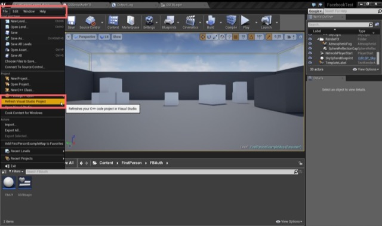
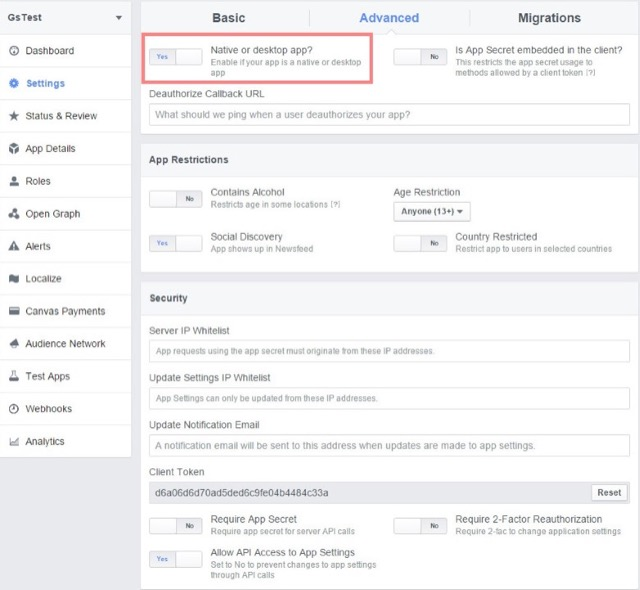
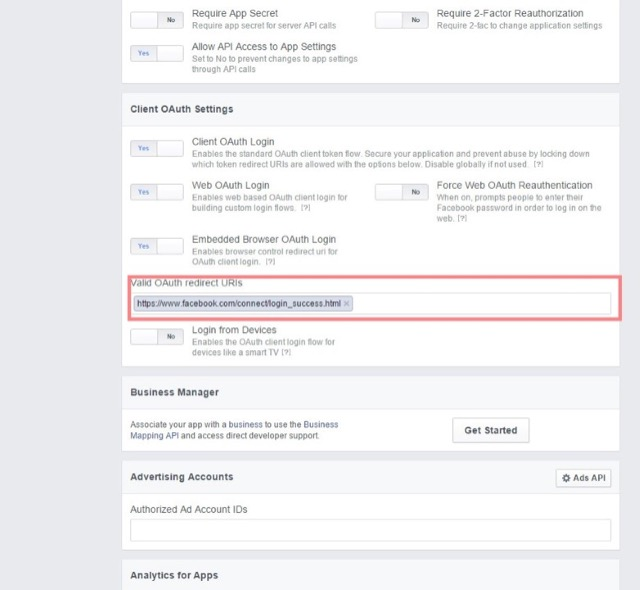
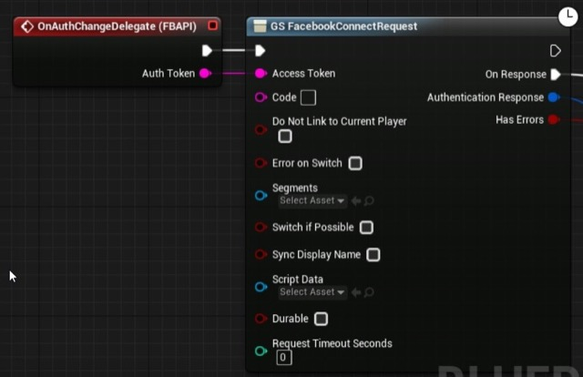

# Unreal Engine 4 GameSparks Facebook Authentication

## Introduction

GameSparks allows you to use social authentication to keep track of your players without registering them. This tutorial aims to get you started with Unreal Engine 4's Facebook online subsystem and using it to retrieve an authentication token which allows you to use GameSpark's social authentication.

<q>**Downloadables.** You can download the assets that support this tutorial [here](http://repo.gamesparks.net.s3.amazonaws.com/docs/tutorial-assets/SocialAuthFacebookSubsystem.zip).</q>

## Setting up your project


### Unreal Setup

 

#### DefaultEngine.ini

First you need to configure your game for the  Facebook online subsystem. For this you need to have a Facebook AppID which you can get from the Facebook developer page.


    [OnlineSubsystemFacebook]
    bEnabled = true

    [OnlineSubsystemFacebook.OnlineIdentityFacebook]
    ClientId = Your Facebook AppID


 

#### YourProject.Build.cs

In your project's build file, you need to include extra modules which will allow you to activate the interface to online subsystems and allow you to use the API to integrate Facebook into your project.


```
    using UnrealBuildTool;

    public class YourProjectName: ModuleRules
    {
        public YourProjectName(TargetInfo Target)
        {
            PublicDependencyModuleNames.AddRange(new string[] { "Core", "CoreUObject", "Engine", "InputCore" });

            PublicDependencyModuleNames.AddRange(new string[] { "OnlineSubsystem", "OnlineSubsystemUtils", "Networking", "Sockets" });

            PrivateDependencyModuleNames.AddRange(new string[] { "OnlineSubsystem", "Networking", "Sockets" });

            PrivateDependencyModuleNames.Add("OnlineSubsystem");

            //Add IOS if you're using it
            if ((Target.Platform == UnrealTargetPlatform.Win32) || (Target.Platform == UnrealTargetPlatform.Win64 ))
            {
                //Facebook API
                PublicDependencyModuleNames.AddRange(new string[] { "Facebook" });
                //Facebook Subsystem
                PrivateDependencyModuleNames.Add("OnlineSubsystemFacebook");

                //Include
                PublicIncludePaths.Add("Runtime/Online/OnlineSubsystemFacebook/Public");
                PublicIncludePaths.Add("Runtime/Online/OnlineSubsystemFacebook/Private/Windows");
            }
        }
    }
```

 

#### Refresh your visual studio project through the editor

After you include the modules into your project refresh your C++ files through the Editor so the changes are recognized in your project. Failing to do this step will result in your "Online.h" and "OnlineSubsystemFacebook.h" not being recognized.



 

### Facebook App Settings

 

In your Facebook settings advanced tab flip the button to state that your app is a native one if you're developing or debugging on desktop. For 'Valid OAuth redirect URIs' ensure that you add https://www.facebook.com/connect/login_success.html That is all you need, in the images you can see how we setup our App.





To use Facebook authentication with GameSparks follow the tutorial to setup Unreal for GameSpark integration, [here](/Getting Started/Creating a Game/Unreal Setup.md).
   

## Facebook API Component

 

### Header

This is the component which will expose the Online Subsystem API to the Blueprints. Exposing the API through a component allows us to use delegates comfortably and allows us to call the functions through GetGameMode->FBAPIComponent->Function from anywhere in BluePrint.

```
    	//GameSparks LTD
    #pragma once

    #include "Components/ActorComponent.h" //Parent, Actor component
    #include "OnlineSubsystemFacebook.h" //Facebook Online Subsystem
    #include "Online.h" // Online Subsystem
    #include "FBAPIComponent.generated.h" // Has to be last include otherwise you get an error


    UCLASS( ClassGroup=(Custom), meta=(BlueprintSpawnableComponent) )
    class FACEBOOKTEST_API UFBAPIComponent : public UActorComponent
    {
    	GENERATED_BODY()


    public:
    	// Sets default values for this component's properties
    	UFBAPIComponent();

    	DECLARE_DYNAMIC_MULTICAST_DELEGATE_OneParam(FOnAuth, FString, AuthToken);

    	//Delegate instance
    	UPROPERTY(BlueprintAssignable)
    		FOnAuth OnAuthChangeDelegate;


    	//UPROPERTY(EditAnywhere, BlueprintReadWrite, Category = "Online")
    	UPROPERTY(EditAnywhere, BlueprintReadWrite, Category = "Online")
    		FString AuthToken;

    	//Subsystem instance
    	IOnlineSubsystem* FBSubSystem;

    	//NewAcount instance
    	FOnlineAccountCredentials* NewAccount;

    	//UFunction to login using username/Email and password
    	UFUNCTION(BlueprintCallable, Category = "Online")
    		virtual void FacebookLogin(FString UserName, FString Password);

    	//Function which handles login and sets auth token
    	virtual void ReturnAuthToken(int32 LocalUserNum, bool bWasSuccessful, const FUniqueNetId& UserId, const FString& Error);

    	// Called when the game starts
    	virtual void BeginPlay() override;

    	// Called every frame
    	virtual void TickComponent( float DeltaTime, ELevelTick TickType, FActorComponentTickFunction* ThisTickFunction ) override;

    };
```

 

### CPP

```
//GameSparks LTD

#include "FacebookTest.h" //Your project name
#include "FBAPIComponent.h" // The header of this CPP

// Sets default values for this component's properties
UFBAPIComponent::UFBAPIComponent()
{
	// Set this component to be initialized when the game starts, and to be ticked every frame.  You can turn these features
	// off to improve performance if you don't need them.
	bWantsBeginPlay = true;
	PrimaryComponentTick.bCanEverTick = true;

	// ...
}

// Called when the game starts
void UFBAPIComponent::BeginPlay()
{
	Super::BeginPlay();

	//Make instance of online subsystem
	FBSubSystem = IOnlineSubsystem::Get(TEXT("Facebook"));

	//Init Subsystem
	FBSubSystem->Init();

	//Assign Delegate Function to handle login
	FBSubSystem->GetIdentityInterface()->AddOnLoginCompleteDelegate_Handle(0, FOnLoginCompleteDelegate::CreateUObject(this, &UFBAPIComponent::ReturnAuthToken));

}

void UFBAPIComponent::ReturnAuthToken(int32 LocalUserNum, bool bWasSuccessful, const FUniqueNetId& UserId, const FString& Error)
{
	//Returns AuthToken
	AuthToken = FBSubSystem->GetIdentityInterface()->GetAuthToken(0);
	//Broadcast this delegate which will contain the AuthToken to be used by the GSFacebookConnectRequest node
	OnAuthChangeDelegate.Broadcast(AuthToken);
}

void UFBAPIComponent::FacebookLogin(FString UserName, FString Password)
{
	//Exposed to Blueprint so UserName and Password can be passed in. Account type must be 'facebook' so the subsystem recognizes which authentication process to use.
	NewAccount = new FOnlineAccountCredentials;
	NewAccount->Id = UserName;
	NewAccount->Token = Password;
	NewAccount->Type = "facebook";

	//Use native subsystems' login
	FBSubSystem->GetIdentityInterface()->Login(0, *NewAccount);
}

// Called every frame
void UFBAPIComponent::TickComponent( float DeltaTime, ELevelTick TickType, FActorComponentTickFunction* ThisTickFunction )
{
	Super::TickComponent( DeltaTime, TickType, ThisTickFunction );

	// ...
}

```

## Unreal Engine Editor and Blueprint

To get the Facebook authentication to work for Blueprint:

*   Open your GameMode and add a GameSparks component and the FBAPI Component.
*   Follow the instructions to setting up GameSparks.
*   Drop a reference of the FBAPI component in the event graph and access its functions.
*   For the FBAPI Component you'll need an event or function which will call the C++ login function which takes a username and password parameters.
*   Click on the FBAPI component on the components list of your GameMode screen and in the details window add the 'On Auth Change' event. Connect the GameSparks Facebook Authentication Request node to the event, connecting the Auth token from the event to the access token slot in the GameSparks request node.
*   Design a way for your users to input their details or manually do so for testing.

We have attached uassets which show an example of this working with a UMG Widget interface.


