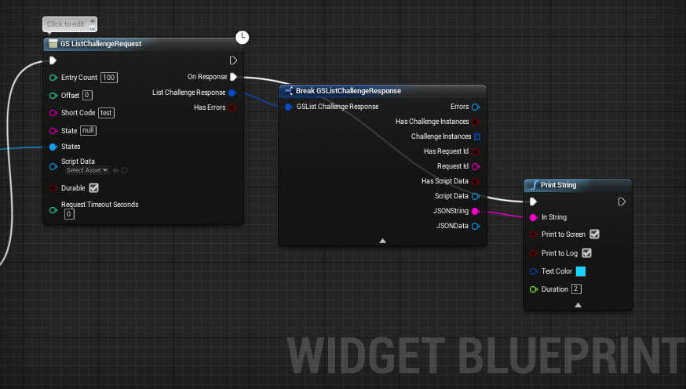
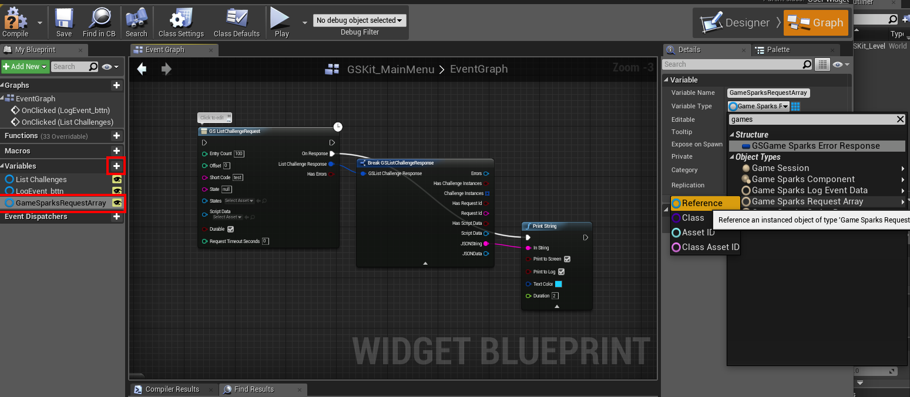
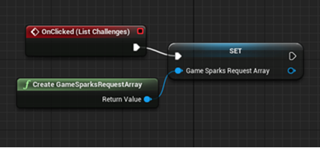
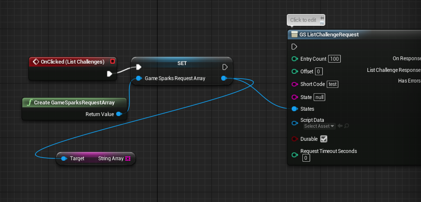
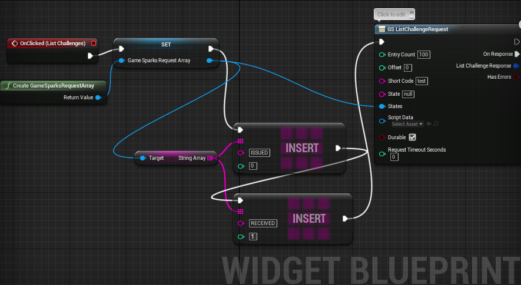
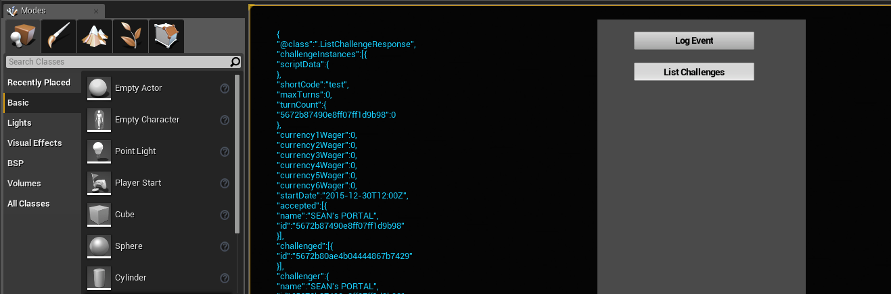
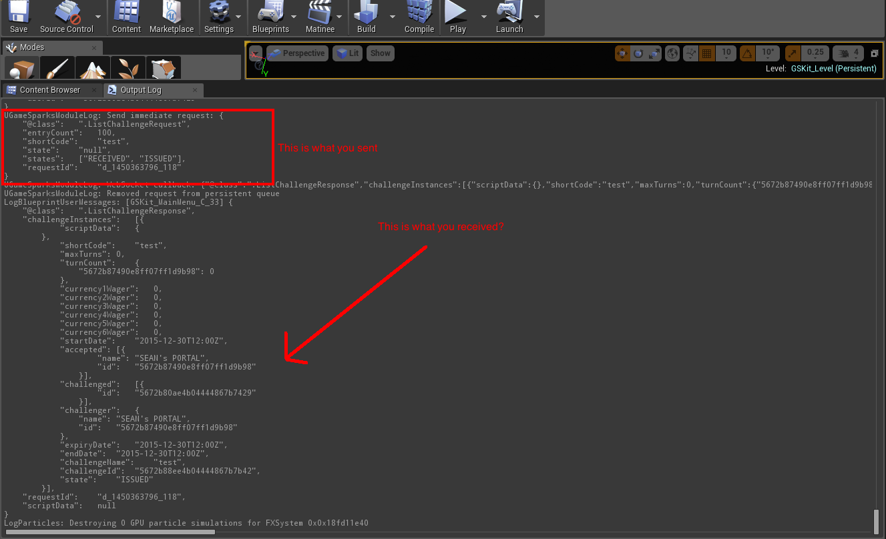
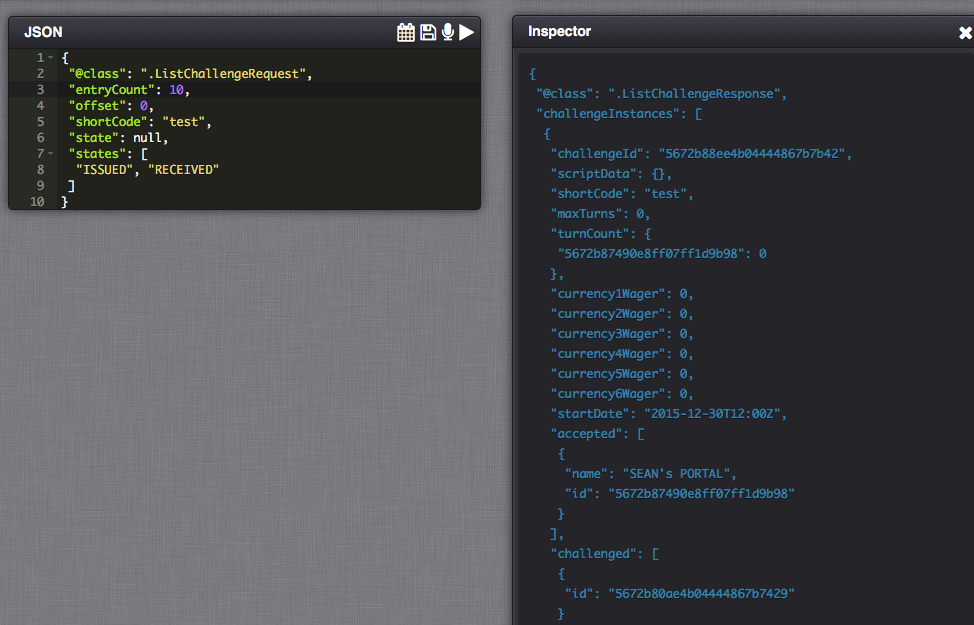
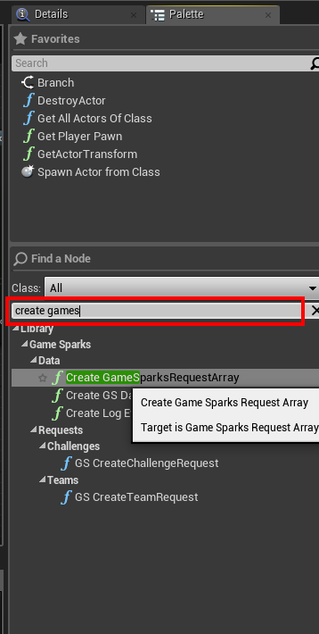

# UE4 Adding State-List to ListChallengeRequest

If you are using the Unreal Engine 4 (UE4) with the GameSparks platform, this tutorial explains how to add State-List for the GameSparks [ListChallengeRequest](/API Documentation/Request API/Multiplayer/ListChallengeRequest.md).

<q>**Pre-requisite!** In order for this to work, you'll need to set up some Challenges and issue them to the player you are authenticating with in UE4. If you call *ListChallengeRequest* by a player who is not involved in any Challenges, you'll always get null back in the script-data, so you should set this up first.</q>

*1.* To start, we'll set up *GS ListChallengeRequest* Node as below, and attached the response JSON string to print out to the screen. This is just for debugging, so we know exactly what we're receiving and if it's correct or not.

<q>**Note:** We've set the 'State' field to 'null' so that it ignores whatever is in there.</q>

*2.* The first step is to create a new *GameSparks Request Array* variable and set the variable type to *GameSparks Request Array Reference*:

*3.* Now drag that variable into your blueprint and select *Set*.

*4.* Before we do anything, we need to instantiate that variable with the *Create GameSparksRequestArray* Node.

<q>**Note:** In this example, we have this request set up to trigger when we click on a button, so you'll see the *OnClicked* event handler in the image too.</q>

*5.* Next you need to create a *Get String Array* Node.

You can find this under *Variables > GameSparks > Request Params* - when you drag off the output and unclick you can search for it in the option-list that appears. That's the easiest way to find it. While you do this, you can hook up the output of the Setter to this node, and hook the same output to the input of the *GS ListChallengeRequest* marked *States*.

*6.* The next step is to insert the two attributes into that array.

<q>**Note:** After we've set array reference, we insert the first element, then the second, and then call the *GS ListMessageRequest*. This is because we want to make sure that those elements are in the array before we send it.</q>

*7.* Now, you should be good to go. Provided you have some Challenges set up that this player is in, you should get the JSON string printed out to the console:

In the output log, you'll also see the form you send to the game. This should look identical to the one you'd use to test this in the test-harness. So if you have further problems you can always use the Test Harness and compare these two forms.

## Cannot Find Create GameSparksRequestArray?

UE4 is very search-sensitive with those fields, so you'll have to put the 'Create' in first or you won't find it.

If you are still having problems finding it, you can search the palette:

