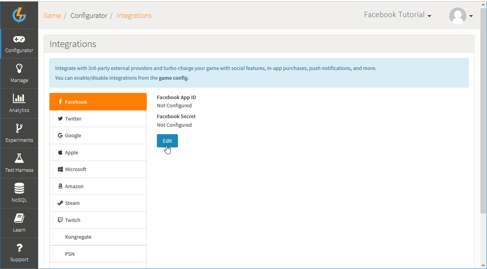
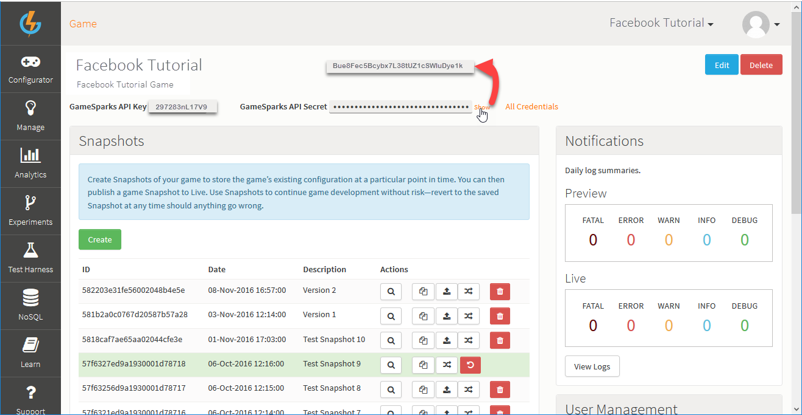
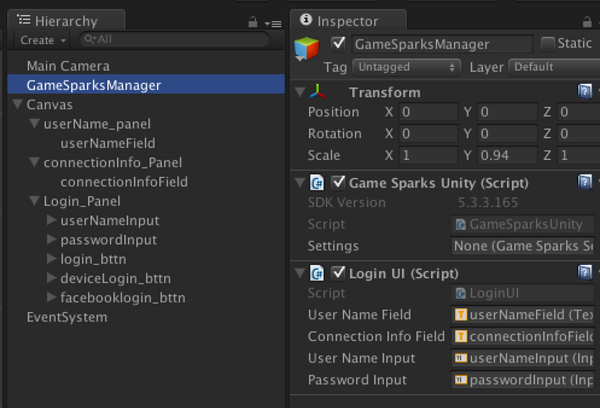
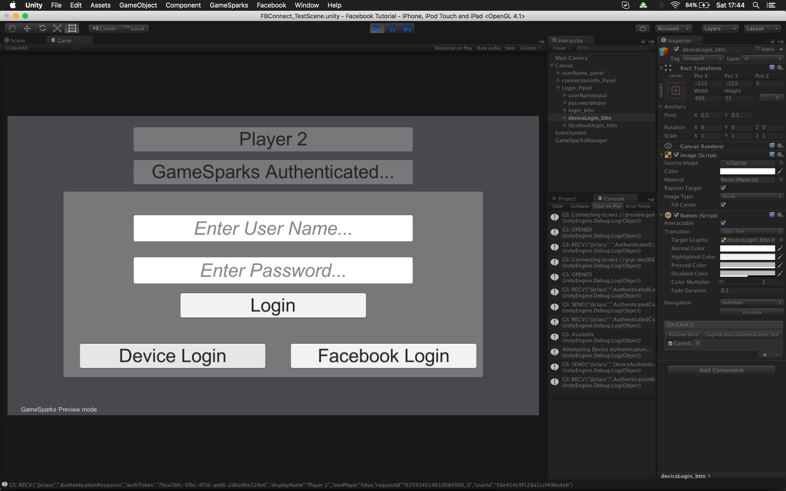

# Unity Facebook SDK and GameSparks

## Introduction

In this tutorial, we'll be covering how to integrate the Unity Facebook SDK into our GameSparks SDK and have your users authenticate or login to your game using their Facebook account.

For this tutorial you'll need:
* The current version of our GameSparks SDK, available [here](/SDK Center/Unity.md).
* The current version of the Facebook SDK, available [here](https://developers.facebook.com/docs/unity).

Secondly, for this tutorial we're using the following versions of these SDKs.
* gamesparks-unity-5.3.3.165
* facebook-unity-sdk-7.4

<q>**SDKs Subject to Change!** These SDKs are subject to change and often methods are made redundant or the format of logging into Facebook will change. We encourage you check the change-logs on the Unity-Facebook SDK website linked above to make sure the current version will work for you.
If a change has been made and this tutorial is not working for you, please let us know through our ticketing system and we'll update the tutorial as soon as possible.</q>

<q>**Assumed Knowledge?** This tutorial assumes a working understanding of the Unity3D platform, as well as how our GameSparks [authentication](/Getting Started/Using Authentication/README.md) works.</q>

In this tutorial we will look at the following topics
* [Creating a New Facebook App](#Creating a New Facebook App)
* [Integrating your Facebook App with GameSparks](#Integrating your Facebook App with GameSparks)
* [Setting Up your Unity Project](#Setting Up the Unity Project)
* [Creating a Test-Scene](#Setting Up the Test Scene)
* [The Login Script](#Login Script)
* [Connecting your Facebook Users with GameSparks](#Connecting your Facebook Users with GameSparks)

## Creating a New Facebook App

In order to connect your users to your game via Facebook, you'll first need to set up a new Facebook app.

Before you can do this, you'll need to register as a Facebook developer. We'll not be going through this process in this tutorial, but if you want to find out how to register there is a step-by-step guide available [here](http://www.wikihow.com/Become-a-Facebook-Developer).

*1.* Once you have logged into your developer profile, you can create a new app by navigating to the 'My Apps' drop-down panel in the top-right corner of the page.


<q>**Website Changes!** Facebook changes the layout of their website from time-to-time and this includes the Facebook Developer page, so this page may not look exactly like the image above.</q>

*2.* Select the *Add a NewApp* option. You'll be presented with a panel where you can select the platform you want to make an app for.

For this tutorial we'll select an iOS app, but the setup is practically the same for both iOS and Android, and for this tutorial you won't need a mac to complete it.


<q> **Apps for Desktops not Supported!** Currently Facebook don't support apps for desktop platforms. This means you won't be able to create an app compatible with Windows or Mac OS.</q>

When you select to create a new app, a pop-up appears which allows you to fill out your app details:


*3.* Enter the details for your new app:
* *Display Name* - The name your app will be given on its Facebook page.
* *Namespace* - An important unique ID for your app.
* *Category/Sub-Category* - The last thing to choose is a *Category* and *Sub-Category* for your app - we've chosen *Games/Puzzle* for this example.

<q> **Test Apps?** You can select your app to be a *test version* if you like. We encourage you to read the details about Facebook test version apps, but it's not necessary for this tutorial, so the choice is yours.</q>

*4.* Click *Create App ID*. Once your app is created, you'll be presented with the home-page for your app:


We'll come back to this page, but for now the important details are the *App ID* and the *App Secret*. We're going to need these in the next section when we set up our GameSparks game with our Facebook app.

## Integrating your Facebook App with GameSparks

This section of the tutorial assumes that you have already created a game on the GameSparks platform. However, if you're new to the platform, you can check out our quick start guide available [here](/Getting Started/Creating a Game/README.md).



So, the next thing we want to do is integrate our Facebook app with our GameSparks game. We do this by adding the Facebook app details into our list of third-party integrations.

*1.* When you enter the landing page of your game in the GameSparks portal, you'll need to navigate to *Configurator > Integrations*.

*2.* Select the *Facebook*.

*3.* Click *Edit*. The page adjusts to allow you to edit your Facebook configuration.

*4.* Enter the *Facebook App Id* and *Facebook Secret*, which you can get from your Facebook app's home page that we saw in the last section.


*5.* Click to *Save* the Facebook configuration.

When you've saved these details, your GameSparks game is ready to start authenticating your Facebook users.

## Setting Up the Unity Project

In this section, we're going to use a new 2D project so we can set up a very basic interface for connecting GameSparks to Facebook.


### Setting Up The GameSparks SDK

The first thing we need to do is import our GameSparks SDK package.

*1.* You can do this by navigating to the top-menu of the Unity3D editor and selecting Assets/Import Package/Custom Package.

*2.* Then select the package you downloaded from the link given in the [Introduction](#Introduction).

When the GameSparks SDK has been compiled you should see the *GameSparks* option appear in the top-menu bar of the Unity3D editor:


*3.* If you click on *Edit Settings* option in the drop-down menu, you'll get the *GameSparksSettings* Manager in the *Inspector* window.

The important details we need here are the *GameSparks API Key* and *Gamesparks API Secret*, which you can find in the *Overview* page of your GameSparks game:



*4.* Enter the *GameSparks API Key* and *GameSparks API Secret* into the respective fields under *GameSparksSettings* in the Unity3D editor. Once you've entered the key and secret, you can click the *Test Configuration* button - so make sure that your details are correct!

If you've entered the correct details, you should see GameSparks connect properly in the test-scene.


### Setting Up The Facebook SDK

So, we need to import the Facebook Unity SDK, and this is done the same way as was outlined for the importing of the [GameSparks SDK](#Setting Up The GameSparks SDK).

*1.* Once the package is done compiling you should see the *Facebook* option in the top-menu bar of the Unity3D editor.


*2.* If you select the *Edit Settings* option in the drop-down menu you should get the *FacebookSettings* window in the *Inspector* panel.

You don't have to worry about everything here, the important details are the *App Name* and *App Id*. Now, this is different to the details you used to link your GameSparks game with your Facebook App:

* The *App Id* is the same, but the *App Name* is the original name you gave your app:


*3.* Enter the *App Id* and *App Name* into the respective fields under *FacebookSettings* in the Unity3D editor:


Once you've entered the details into Unity, you are good to go!

## Setting Up the Test Scene

First of all, you'll need to create a new scene. In this example we will call it *FBConnect_TestScene*.

In this example, we're going to use the Unity-UI system and we need to set up the scene as follows.

1. Create a new empty game-object called *GameSparksManager*.
2. Apply the *GameSparksUnity.cs* script to that object.
3. Create a new UI/Canvas
4. Add two text-fields to the canvas:
  * We're calling these fields *userNameField* and *connectionInfoField* respectively.
  * We've also added a panel to the back of these fields so they stand out.
5. Add two input-fields:
  * We've called these *userNameInput* and *passwordInput* respectively.
  * We've also added a panel behind these fields so they stand out.
6. Add three new buttons to the panel:
  * We've called these buttons *Login*, *Device Login*, and *Facebook Login* respectively.

So with all these elements on the main canvas, your scene should look something like this:


## Login Script

Now that our test scene is set up, we need to link all the scene elements to our GameSparks and Facebook login calls and to the buttons.

*1.* The first thing to do is to add a script to the *GameSparksManager* object. In this tutorial,  we're calling this script *LoginUI.cs*.

*2.* First, we'll link the text-fields and input-fields to our *LoginUI* script. To do this, we just need to add some public variables in the *LoginUI* script.


```

public Text userNameField, connectionInfoField;
public InputField userNameInput, passwordInput;

```

*3.* You'll then need to link each of these variables to the UI objects we created in the scene:



## Checking When GameSparks Is Connected

At this point, the first thing we're going to code is something to give us some dialog which lets us know when GameSparks is connected. Our users should not attempt a login if GameSparks is not connected or the login will fail:
* In order to do this we'll use the *GS.GameSparksAvailable* delegate. This is called whenever GameSparks connects or disconnects.
* The best strategy is to put this in the *Awake()* or *Start()* methods and all we'll do for this tutorial is print out some dialog to the *connectionInfoField* that will let us know that we are connected to GameSparks:


```

// Use this for initialization
void Start(){
	GS.GameSparksAvailable += OnGameSparksConnected;
}

private void OnGameSparksConnected(bool _isConnected){
	(_isConnected) {
		connectionInfoField.text = "GameSparks Connected...";
	}
	else{
		connectionInfoField.text = "GameSparks Not Connected...";
	}
}

```

Now, if you run your scene, you should see after a second or two the *connectionInfoField* will show that you have been connected to GameSparks:


## User Authentication

Next, we'll set up user authentication using the *userNameInput*, *passwordInput*, and the login button.

For this tutorial, we're going to show a different approach to this authentication in order to show how registration and authentication can occur at the same time.

This process works as follows:
1. Send an [AuthenticationRequest](/API Documentation/Request API/Authentication/AuthenticationRequest.md) for the username and password entered.
2. If the response has no errors, then we let the user know they are authenticated.
3. If the response has the *'Details : Unrecognized'* error, then the user is not registered, so we send a registration request with the same details.
4. If the registration response has no errors then we let the user know they are authenticated.

*1.* This code will be in a public method which we'll link to the login button:


```

public void UserAuthentication_Bttn(){
	Debug.Log("Attempting User Login...");
	//print out the username and password here just to check they are correct //
	Debug.Log("User Name:"+userNameInput.text);
	Debug.Log("Password:"+passwordInput.text);
	new GameSparks.Api.Requests.AuthenticationRequest()
		.SetUserName(userNameInput.text)//set the username for login
		.SetPassword(passwordInput.text)//set the password for login
		.Send((auth_response)=>{ //send the authentication request
			if(!auth_response.HasErrors){ // for the next part, check to see if we have any errors i.e. Authentication failed
				connectionInfoField.text = "GameSparks Authenticated...";
				userNameField.text = auth_response.DisplayName;
			}
			else{
				Debug.LogWarning(auth_response.Errors.JSON); // if we have errors, print them out
				if(auth_response.Errors.GetString("DETAILS") == "UNRECOGNISED"){ // if we get this error it means we are not registered, so let's register the user instead
					Debug.Log("User Doesn't Exists, Registering User...");
					new GameSparks.Api.Requests.RegistrationRequest()
						.SetDisplayName(userNameInput.text)
						.SetUserName(userNameInput.text)
						.SetPassword(passwordInput.text)
						.Send((reg_response) =>{
							(!reg_response.HasErrors){
								connectionInfoField.text = "GameSparks Authenticated...";
								userNameField.text = reg_response.DisplayName;
						}
						else{
							Debug.LogWarning(auth_response.Errors.JSON); // if we have errors, print them out
						}
					});
				}
			}
	});
}

```
*2.* Now, back in your scene, you'll need to link your login button to the method we just created.


*3.* You should now be able to login using the username and password input fields:


## Device Login

The next login option we're going to cover is the device-login:
* This kind of authentication uses the device's unique identifiers to generate a profile for the user.
* If you try to authenticate with that device from then on, GameSparks will recognize that device as a unique user.

*1.* The code for this is very similar to the user authentication, except that it doesn't expect a username or password. It does, however, allow you to input a display name. We'll create a method to call this request from:


```

public void DeviceAuthentication_bttn(){
	Debug.Log("Attempting Device Authentication...");
	new GameSparks.Api.Requests.DeviceAuthenticationRequest()
		.SetDisplayName("Player 2")
		.Send((auth_response) => {
			if(!auth_response.HasErrors){ // for the next part, check to see if we have any errors i.e. Authentication failed
				connectionInfoField.text = "GameSparks Authenticated...";
				userNameField.text = auth_response.DisplayName;
			}
			else{
				Debug.LogWarning(auth_response.Errors.JSON); // if we have errors, print them out
		}
	});
}

```
*2.* Now, once you have your button linked up to the method, you'll have the option to authenticate your user using the unique device id.




## Connecting your Facebook Users with GameSparks

For the last part of this tutorial, we'll connect to Facebook and then have the user's Facebook account linked with GameSparks.

This process will work as follows:

1. We call the *FacebookConnect_bttn()* method from the scene-UI.
2. We check to see if the Facebook SDK is initialized, and, if so, then we'll activate the app. If not, then we'll attempt to initialize Facebook.
3. Once we know the Facebook app is activated, we can attempt to connect the GameSparks user to a Facebook account.
4. When we are logged-in, we'll then attempt to link the account to your GameSparks user using the Facebook access token.


```

Public void FacebookConnect_bttn(){
	Debug.Log("Connecting Facebook With GameSparks...");// first check if FB is ready, and then login //
	// if it's not ready we just init FB and use the login method as the callback for the init method //
	if(!FB.IsInitialized){
		Debug.Log("Initializing Facebook...");
		FB.Init(ConnectGameSparksToGameSparks, null);
	}
	else{
		FB.ActivateApp();
		ConnectGameSparksToGameSparks();
	}
}

///<summary>
///This method is used as the delegate for FB initialization. It logs in FB
/// </summary>
private void ConnectGameSparksToGameSparks()
{
	(FB.IsInitialized){
		FB.ActivateApp();
		Debug.Log("Logging Into Facebook...");
		var perms = new List<string>(){"public_profile", "email", "user_friends"};
		FB.LogInWithReadPermissions(perms,(result) => {
			(FB.IsLoggedIn){
				Debug.Log("Logged In, Connecting GS via FB..");						new GameSparks.Api.Requests.FacebookConnectRequest()
					.SetAccessToken(AccessToken.CurrentAccessToken.TokenString)
					.SetDoNotLinkToCurrentPlayer(false)// we don't want to create a new account so link to the player that is currently logged in
					.SetSwitchIfPossible(true)//this will switch to the player with this FB account id they already have an account from a separate login
					.Send((fbauth_response) => {
						(!fbauth_response.HasErrors){
							connectionInfoField.text = "GameSparks Authenticated With Facebook...";
							userNameField.text = fbauth_response.DisplayName;
					}
					else{
						Debug.LogWarning(fbauth_response.Errors.JSON);//if we have errors, print them out
					}
				});
		}
		else{
			Debug.LogWarning("Facebook Login Failed:"+result.Error);
		}
	});// lastly call another method to login, and when logged in we have a callback
	}
	else{
		FacebookConnect_bttn();// if we are still not connected, then try to process again
	}
}

```

Once you connect this method up to the Facebook login button, you should be able to perform the login process. The first thing you'll notice when you try to login is that you'll be met with the following panel:


This is a Facebook prompt, which is used for testing logins through the editor. This will not appear when the app is deployed to your device, but it does let you simulate a login from the editor while running the game off a desktop (remember that Facebook does not support desktop platforms):
* In order to login you'll need an access token.

*1.* Click on the *Find Access Token* button and you'll be brought to your Facebook developer profile and you'll be told you need to grant permissions to your app in order to get an access token:


*2.* If you go and click on this option, you'll be presented with an access token. You need to copy this token:


And use it in the *User Access Token* field back in the Unity editor:


*3.* Once you have the access token set, you can complete the login using the *Send Success* button. The scene should go through the Facebook login process and, once completed, it will use the Facebook access token to log into GameSparks.


Your user's Facebook profile is now linked to GameSparks.

## Summary

In this tutorial we covered:
* How to set up a new Facebook app and integrate that app into your GameSparks game.
* The basic method of authentication using the GameSparks platform and Unity3D.
* How to link the user's Facebook profile with a GameSparks account.
