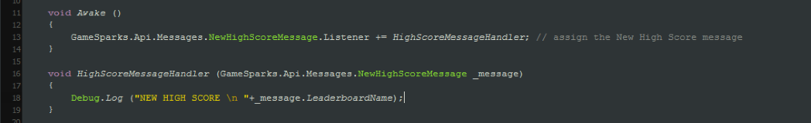
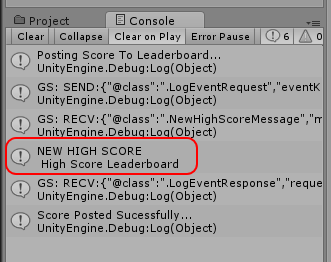
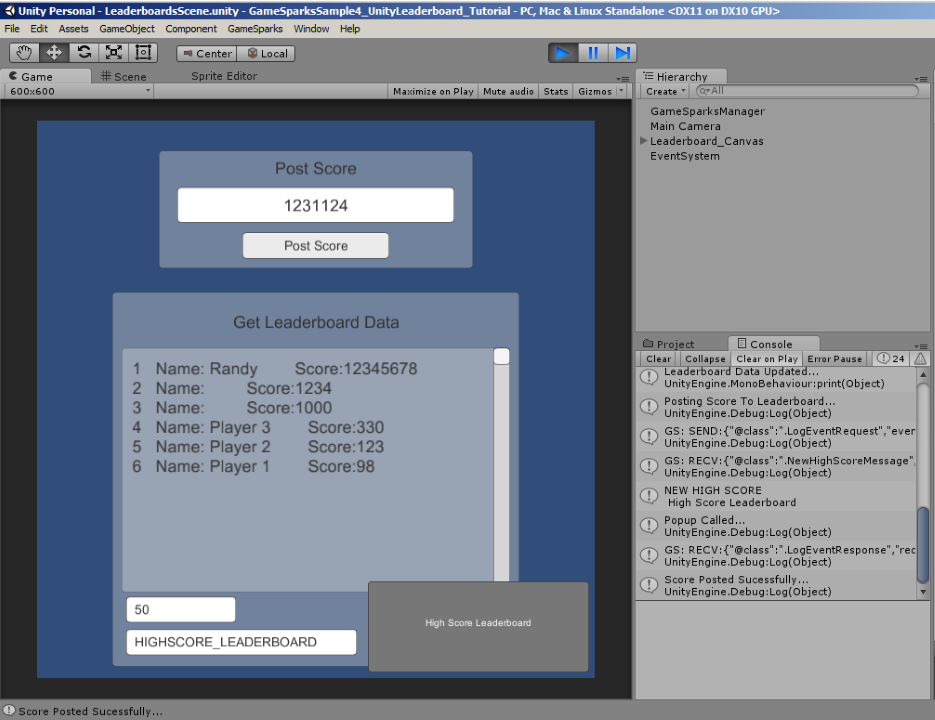

# Message Listeners and Handlers

## Introduction

When your players receive messages through sockets we need a way to intercept and use these messages to display them or use them in a sequence. To process messages our SDKs use listeners or handlers which are events that are triggered when a specific message type is received by the player's socket.  

Message listeners/handlers allow you to receive notifications and callbacks for:

* Achievement earned.
* Challenge accepted, changed, chat, declined, drawn, expired, issued, joined, lapsed, lost, started, turn taken, waiting, withdrawn, won.
* Friend message.
* Team message.
* Script message.
* Match found, not found, updated.
* New leaderboard highscore.
* New team leaderboard highscore.
* Session terminated.
* Social rank changed.
* Global rank changed.
* Team rank changed.
* Upload complete message.

For more information about each message and the parameters they include click [here.](/API Documentation/Message API/Player/AchievementEarnedMessage.md)

## General setup

All our SDKs share the same setup.

  1. You need to create a function/method/event which handles the message; taking in the parameters, processing them and using them in a sequence.
  2. You need to set the listener/Handler callback and link it to the function/method/event.


## Examples

### UE4

#### Setting up the Message Listener

First we'll need to create a *GSMessageListeners* component (located on the red bar on left) in the Game Mode. The GSMessageListeners component is an extremely useful tool which will allow you to intercept messages from the Portal to your authenticated player, then break them down and use them in your sequences. Here we're going to demonstrate the use of one message type interception by using the event *OnNewHighScoreMessage.* This can be dropped into the Event Graph after clicking the GSMessageListeners component and accessing its events (Green box on the right). Once we drop the Event in, we can break the message down and access data that is useful to us. For this tutorial we'll be retrieving the name of the Leaderboard to inform the player which Leaderboard they have achieved a High Score on.


### Unity

#### Message Listeners

Finally you'll want to hook up the *NewHighScoreMessage* listener so that you can have some custom code execute when the player receives a new High Score. In Unity player messages have listeners you can assign delegate functions to. Then, each time the player receives a message the method will execute and you can get details about the message from within these methods. Its best to apply the listener in an *Awake()* method, as the player could have messages waiting on the server for them that they might miss if the code cannot execute the moment they log on.

```  
    void Awake() {
    	GameSparks.Api.Messages.NewHighScoreMessage.Listener += HighScoreMessageHandler;
    }
    void HighScoreMessageHandler(GameSparks.Api.Messages.NewHighScoreMessage _message) {
    	Debug.Log("NEW HIGH SCORE \n " + _message.LeaderboardName);
    }
```
Now, to test this out, enter a new High Score for your player in the Unity sample project. You should see the “NEW HIGH SCORE” message appear in the console window.






 

### ActionScript

#### Setting up the Message Handlers

Once you've set your *LogEventRequest* to upload the Player's score, you can now set up a *NewHighScoreMessage* handler. *Handlers* are very useful tools which allow you to intercept *messages* that are passed in to your authenticated Player. For this tutorial, we'll be dealing with *NewHighScoreMessage*. We'll place the initialization of the message handler in the same function which connects the *GS* *module*. To do this use gs.getMessagerHandler() and resume to choose which type of message you wish to intercept, followed by the function which will deal with the message. In our case, *'HighScoreMessageListener*' is a variable of type *GS*.

```
    	gs.getMessageHandler().setNewHighScoreMessageHandler(HighScoreMessageListener);
```

Create the function which deals with the *message*. The parameters of the function would take a variable of type '*NewHighScoreMessage*'. This function will allow you to simplify the structure of the *message* and access a number of useful data. In this tutorial we retrieve the Leaderboard's name to show the highscore *message* as an alert.

```
    	private function HighScoreMessageListener(message:NewHighScoreMessage):void
    			{
    				Alert.show("You achieved the highscore in the leaderboard: " + message.getLeaderboardName(), "High Score Alert")
    			}

```
