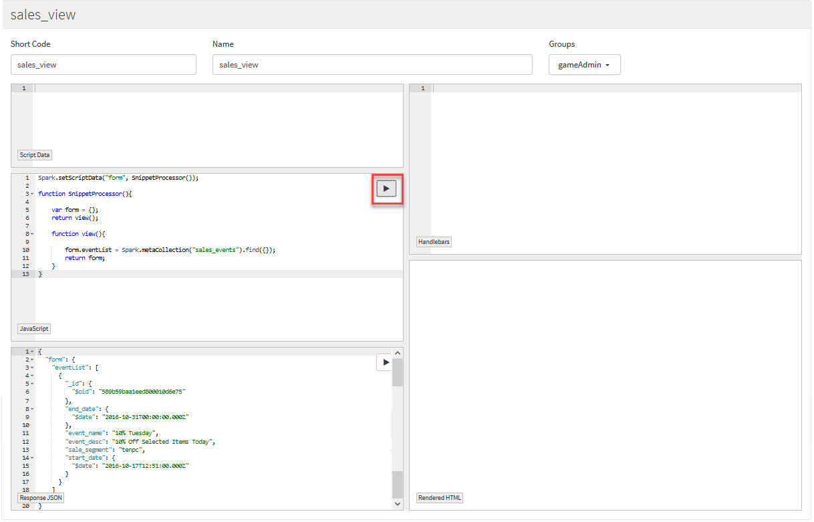
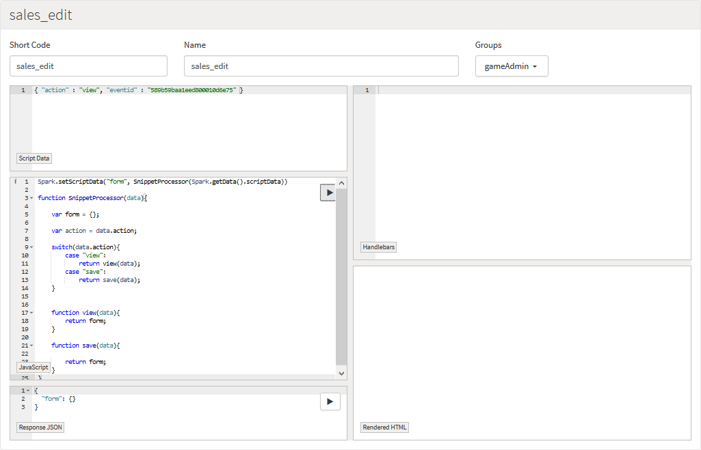

# Live Ops for Weekly Events

## Introduction

This tutorial explores how dynamic forms can be used to help support your game after it has gone live, specifically for common live operations uses cases that involve weekly Events. In this example, we'll create a management screen that will allow the user to configure promotions/sales on Virtual Goods between two dates:
* When an Event is active, players will be grouped into a particular sale Segment.
* While the Event is running they can then avail of a different price for any Virtual Goods in that segment.

This kind of example is widely customizable. Past examples include loot-drop distributions, Event-driven Leaderboards, quest-systems, and so on.

## Setting Up Sales Segments

The first thing we need to do before we start creating our management screens is set up the sales Segments.

To do this:

*1.* Go to *Configurator>Segments* in the portal.

*2.* Under *Segments* click to *Add* and *Save* a new Segment.

*3.* Edit the new Segment to add the required values to the Segment:


* We can set up a new Segment called *Sale* and for this segment we can create as many types of sales as we want. These will be used later to set up our Events.

## Segmenting Virtual Goods

The next step is to create some Virtual Goods so you can put them on sale.

*1.* Set up the Virtual Good with some basic information and give it a price.

*2.* We then can edit the Virtual Good to give it a new Segment value for one of our sales:


* For this example, we've chosen the 10% sale Segment value for this Virtual Good, and have set the value on this sale to be 90 - that is, 10% off:


Now that we have our Virtual Goods set up, we can start building our management screens.

## First Screen

Before we can start creating our Screen layout, we have to make our initial Screen. To do this:

*1.* Select *Manage>Admin Screens*.

*2.* Make sure you are on the *Screens* tab and then click *Add*. The *Add Screen* page opens and you can give your new Screen a name and *Short Code*:
* The *Short Code* is important to remember, because we'll be using it later.
* You can also set the Groups to *gameAdmin*. Groups allow you to set specific access permissions for users of your game's portal:


*3.* Once you’ve created your Screen, click the *Edit* button to start editing it:


This *Sales Events* window will act as a container where we can draw all our content. Therefore, we need to do two things here:
* Firstly, we'll create a placeholder. This will act like a reference to this window so if we want anything to be re-drawn or updated by this window, we can use that placeholder.
* The second thing we'll do is call our first Snippet. In this example, our first Snippet will draw a list of all the Events we have and their details.


```
<gs-placeholder id="sales_events_ph"> <!-- our sales window placeholder -->
    <gs-snippet snippet="sales_view" ></gs-snippet> <!-- then we call our snippet -->
</gs-placeholder>

```

At the moment we don’t have a Snippet called *sales_view*, so this won’t do anything yet!

## sales_view Snippet

In order to have this window draw something we have to create a Snippet. To do this:

*1.* In *Manage>Admin Screens* select the *Snippets* tab.

*2.* Click to *Add* a new Snippet:


* We’ve called the new Snippet *sales_view* so that it has the same Short Code as the one we referenced from the *Sales Events* screen we just made.
* It's generally a good idea to keep the names and Short Codes the same for Snippets to avoid confusion, but only the Short Code is important to remember, because that is what we'll be using as reference.

Now, we can review how this editor works - on the above example you can see the following labels for each panel:

  **1.**	This is the **JSON Input** panel. Here you can simulate data being sent from one Snippet to another or from a Screen to a Snippet. We'll not be using this panel for this Snippet, but in our *sales_event* editor Snippet we'll get to see some examples of how this is used.

  **2.**	This is our **JavaScript Editor** where we can run whatever code we need to before rendering our HTML.

  **3.**	After we have run our JavaScript code, we can see in the **JSON Output** panel the JSON-formatted response to the code we've written in the **JavaScript Editor** and what we'll be sending to the HTML screens. This is handy for debugging.

  **4.**	Using the info from panel **3**, we can use **HTML Editor** to write some HTML to put some visual structure on our information. In the case of this Snippet, we'll be creating a simple list with some buttons for creating, editing, and deleting Events.

  **5.**	Finally, we use the **Rendered HTML** panel to see what our HTML looks like rendered in this panel.

It's useful to think of this editor as a flow of information from panel **1** to **5**. This will help you identify where any bugs might be occurring.


### Getting Event Details

The first step is to get the Event details from our DB. Now, at the moment we don’t have any Events, so we should create some test Events so that we can make sure our Screens are being drawn correctly. To do this:

*1.* Select *NoSQL* on the portal.

*2.* On the *Collections* panel click the add  icon. The *Create Collection* dialog appears.

*3.* Select *Metadata* from the *Type* drop-down and enter the *Name* of the new Collection:


*4.* Click *Create*. The new Collection is created and is available for selection under *Metadata*:


Next, we're going to add some dummy-data into this Collection.

*5.* To do this, select it in the *Collections* panel and click the *Insert* tab:


The document we've inserted into the Collection is as follows:

```
{
        "event_name" : "10% Tuesday",
        "event_desc" : "10% Off Selected Items Today",
        "sale_segment" : "tenpc",
        "start_date": { "$date": { "$numberLong": "1476708660000" } },
        "end_date": { "$date": { "$numberLong": "1477872000000" } }
}

```

*6.* Click *Insert*.

So, now that we have a test-doc in our new collection, let’s go back to our *sales_view* Snippet and see if we can get that data.

We are going to do this in the **JavaScript Editor** panel. All we need to do is create a function which will get all the docs in the *sales_events* collection:
* The important thing here is to call *Spark.setScriptData()* so that we can send information to the HTML panel for rendering.

In the example below, the first line is going to send data to the HTML renderer. The first field is just the title of the data we want to send. It doesn’t have to be *form* as used below, it can be called anything.

Likewise, *SnippetProcessor()* and *view()* are names selected for this example, but can also be named anything you like:

```
Spark.setScriptData("form", SnippetProcessor());

function SnippetProcessor(){

    var form = {};
    return view();

    function view(){

        form.eventList = Spark.metaCollection("sales_events").find({});
        return form;
    }
}


```

You can see, if you click on the play button in the **JavaScript Editor** panel, that we can see the details of the dummy-event we created earlier in the **JSON Output** panel. Now we know we can use that information in our HTML panel!


* Note that you may to scroll the **Response JSON** panel to see the entire content or use the full-screen button to enlarge the Snippet editor.

### Drawing the Events List

There are a few parts to drawing this Events list, now that we have the information:
* The first is to create a title-bar explaining what the screen does, and where we can create a new Event.
* We'll then need a bar that describes each piece of information we are showing (basically a header for the list).
* Then we list all the Event details and provide options for deleting or editing them.

*1.* To begin with, we'll create the title for the screen:

```
<gs-title-block title="Sales Events" padding="10" margin="0">
    <gs-row>
        <gs-col width="10"><h4>Here you can View, Create, Edit or Delete Sales Events.</h4></gs-col>
        <gs-col width="2">
            <gs-link snippet="sales_edit?action=view" target="modal"><button>Create New</button></gs-link>
        </gs-col>
    </gs-row><hr/>
</gs-title-block>


```


So, if we take a look at the HTML code above we can get an idea for how things are laid out:
* We surrounded everything in a *gs-title-block* tag, which will put all our UI inside a border with a title we can set ourselves.
* Inside this we created a *gs-row* tag with two columns. The columns are given a width of 10 and 2, so they will be separated with the button on the right-hand-side.
* All columns must add up to 12 max. Otherwise elements will start to appear out of place.
* The first thing we have here is just a header explaining what this screen is for.
* The *gs-link* tag, however, is a special tag that allows us to run another Snippet when the button is pressed. For the *gs-link* tag, we give it the name of the Snippet we want to run, plus any extra data we want to have passed into the Snippet. In this case, we'll pass *action=view* into the Snippet, which will be explained later.

*2.* The next thing we'll draw is the header-bar for the Event list:

```
<gs-title-block title="Sales Events" padding="10" margin="0">
    <gs-row>
        <gs-col width="10"><h4>Here you can View, Create, Edit or Delete Sales Events.</h4></gs-col>
        <gs-col width="2">
            <gs-link snippet="sales_edit?action=view" target="modal"><button>Create New</button></gs-link>
        </gs-col>
    </gs-row><hr/>
    <gs-row>
            <gs-col width="2"><h5>Event Name</h5></gs-col>
            <gs-col width="2"><h5>Start Date</h5></gs-col>
            <gs-col width="2"><h5>End Date</h5></gs-col>
            <gs-col width="2"><h5>Status</h5></gs-col>
            <gs-col width="2"><h5>Segment</h5></gs-col>
    </gs-row><hr/>
</gs-title-block>


```


* This is pretty much the same as the previous HTML code.
* All we’ve done here is laid out the header titles and set some column widths.
* The only thing that may be unfamiliar is that we've added a field for *Status* to the headers. We are going to implement this in the next Screen. It will be used to show if an Event is running or not.

### Listing Events

In order to list Events we're going to use [handlebars](http://handlebarsjs.com/) so that we can loop through our list of Events (even though it only has one Event in it at the moment, but we'll be adding more later).

<q>**Handlebars?** We recommend you look into handlebars if you want to get a sense of what they can be used for, but we'll be using them extensively in this tutorial.</q>

```
<gs-title-block title="Sales Events" padding="10" margin="0">
    <gs-row>
        <gs-col width="10"><h4>Here you can View, Create, Edit or Delete Sales Events.</h4></gs-col>
        <gs-col width="2">
            <gs-link snippet="sales_edit?action=view" target="modal"><button>Create New</button></gs-link>
        </gs-col>
    </gs-row><hr/>
    <gs-row>
            <gs-col width="2"><h5>Event Name</h5></gs-col>
            <gs-col width="2"><h5>Start Date</h5></gs-col>
            <gs-col width="2"><h5>End Date</h5></gs-col>
            <gs-col width="2"><h5>Status</h5></gs-col>
            <gs-col width="2"><h5>Segment</h5></gs-col>
    </gs-row><hr/>
    <gs-row>
        {{#each form.eventList}}
        <gs-row>
            <gs-col width="2">{{event_name}}</gs-col>
            <gs-col width="2">{{start_date.$date}}</gs-col>
            <gs-col width="2">{{end_date.$date}}</gs-col>
            <gs-col width="2">{{status}}</gs-col>
            <gs-col width="2">{{sale_segment}}</gs-col>
            <gs-col width="1"><gs-link snippet="sales_edit?action=view&eventId={{_id.$oid}}" target="modal-wide"><i data-toggle="tooltip" data-placement="top" title="Edit Sale" class="icon-edit"/></gs-link></gs-col>
            <gs-col width="1"><gs-link snippet="sales_delete?action=view&eventId={{_id.$oid}}" target="modal-small"><i data-toggle="tooltip" data-placement="top" title="Delete Sale" class="icon-trash"/></gs-link></gs-col>
        </gs-row>
        {{/each}}
    </gs-row>
</gs-title-block>

```

* You’ll notice that there are two *gs-links* here too, and that they appear to draw two different icons. We are going to use these as buttons for editing and deleting Events.
* You can see that we call *sales_edit* and *sales_delete* Snippets, and we also pass in an attribute called *eventId*. What we do here is set the *eventId* parameter to be the id of the doc (*\_id.$oid*). That way, we can look-up the specific doc we selected from within those Snippets.
* Now, we haven’t created *sales_edit* and *sales_delete* yet so don’t worry - both these Snippets will be covered later.


Take note of the *oid* of this test-doc because we're going to use it in the next Snippet.


## sales_edit Snippet

Create a new snippet called *sales_edit*.  Before we start writing any JavaScript or HTML for this Screen, we're going to simulate what we might pass if we went to edit an Event:
* If you remember from above, when we want to edit an Event we pass in the *oid* of the Event we want to edit.
* We also pass in *action=view*:


Adding this line to the **JSON Input** panel allows us to do something with this information in the **JavaScript Editor** panel.

### Snippet Layout

In the last Snippet, all we needed to do was to get the list of Events and draw some HTML around that information. This Snippet will require us to save data as well as display information about the Event.

So our Snippet will have two functions - *view()* and *save()*.

```

Spark.setScriptData("form", SnippetProcessor(Spark.getData().scriptData))

function SnippetProcessor(data){

    var form = {};

    var action = data.action;

    switch(data.action){
        case "view":
            return view(data);
        case "save":
            return save(data);
    }


    function view(data){
        return form;    
    }

    function save(data){

        return form;    
    }
}


```




### Loading Event Details

Our JSON input is currently sending the event-id from our dummy-event into the Snippet, so we need to query for that document and send that back in the form so we can draw that information:

```

if(data.eventId != undefined){
            form.event = Spark.metaCollection('sales_events').findOne({  "_id" : { "$oid" : data.eventId } });
            form.event.start_date = new Date(form.event.start_date).toISOString().substring(0, 16);
            form.event.end_date = new Date(form.event.end_date).toISOString().substring(0, 16);
        }


```


### Event Editor Layout

Currently, our sales Events are pretty straightforward. We only have information about the name and description of the Event, the start and end dates, and we have an option to set which sale-segment we want to be active for that Event.

So this editor:
* Will be separated out into 3 rows (name & description, start & end date, and sales segment).
* We'll use a select tag so that we can get a drop-down menu of all the available sales Events.
* For the name and description, all we need is a text input field. The value of this input field is going to be the name and description of our Event. This will allow the user to see the current values of a sale, but also edit them.


* Note that you may to scroll the **Response JSON** panel to see the entire content or use the full-screen button to enlarge the Snippet editor.

```
<gs-row>
    <gs-title-block title={{#if form.event}}"Edit Sales Event"{{else}}"Create New Sales Event"{{/if}} padding="10" margin="0">
        <gs-row>
            <gs-col width="3"><h5>Name</h5></gs-col>
            <gs-col width="9"><h5>Description</h5></gs-col>
        </gs-row>
        <gs-row>
            <gs-col width="3"><input type='text' placeholder="Event Name..." name='event_name' value="{{form.event.event_name}}"/></gs-col>
            <gs-col width="9"><input type='text' placeholder="Event Description..." name='event_desc' value="{{form.event.event_desc}}"/></gs-col>
        </gs-row>
    </gs-title-block>
</gs-row>


```

Notice that:
* In the title-block that we use handlebars to decide to show either *Edit Sales Event* or *Create New Sales Event*.
* When we call this Snippet and want to create a new Event, we don’t pass an event ID into the Snippet, so we can tell from that if we are dealing with a new Event or editing an Event.

### Date Fields

For our date fields we'll need to create a short script in our HTML editor so that the date input fields can bring up the date-picker. Again, we'll set the values of these fields to be the start and end dates of the Event.


```
<gs-row>
    <gs-title-block title={{#if form.event}}"Edit Sales Event"{{else}}"Create New Sales Event"{{/if}} padding="10" margin="0">
        <gs-row>
            <gs-col width="3"><h5>Name</h5></gs-col>
            <gs-col width="9"><h5>Description</h5></gs-col>
        </gs-row>
        <gs-row>
            <gs-col width="3"><input type='text' placeholder="Event Name..." name='event_name' value="{{form.event.event_name}}"/></gs-col>
            <gs-col width="9"><input type='text' placeholder="Event Description..." name='event_desc' value="{{form.event.event_desc}}"/></gs-col>
        </gs-row>
        <gs-row>
            <gs-col width="6">Start Date<br/>
                <input type="text" class="datetimepicker" name="start_date" required value="{{form.event.start_date}}"/>
            </gs-col>
            <gs-col width="6">End Date<br/>
                <input type="text" class="datetimepicker" name="end_date" required value="{{form.event.end_date}}"/>
            </gs-col>
        </gs-row>
    </gs-title-block>
</gs-row>


<script>
    setTimeout(function(){
        $( ".datetimepicker" ).datetimepicker({
            dateFormat: "yy-mm-dd",
            separator:"T",
            timeFormat: "HH:mm"
        });
    }, 500);
</script>


```


### Drop-Down Menu Selector

For the selector we need to get an array of all Segment names, so we can list them in the drop-down menu.

This is pretty simple using the Spark API:

```
function view(data){

        if(data.eventId != undefined){
            form.event = Spark.metaCollection('sales_events').findOne({  "_id" : { "$oid" : data.eventId } });
        }

        form.sales_segments = Spark.getConfig().getSegment('sale').getValues();
        return form;    
    }


```

Now that we have this array being passed to the HTML editor, we can use handlebars to loop through each Segment name and draw the drop-down menu:

```
<gs-row>
            <gs-col width="3"></gs-col>
            <gs-col width="6">
                <select name="segment_name" class="input-block-level" style="margin-bottom:5px">
                    {{#each form.sales_segments}}
                        <option value="{{shortCode}}" {{#compare shortCode "===" ../shortCode}}selected{{/compare}}>{{name}}</option>
                    {{/each}}
                </select>
            </gs-col>
            <gs-col width="3"></gs-col>
        </gs-row>


```


### Submit Form

The next thing we need to make this work is to wrap these fields in a form so we can submit all these data.

We're going to use the Snippet itself as the target for the form, but we'll set the action to *save*. That way we can run the *save()* function:

```
<gs-row>
    <gs-title-block title={{#if form.event}}"Edit Sales Event"{{else}}"Create New Sales Event"{{/if}} padding="10" margin="0">
<gs-form snippet="sales_edit?action=save" target="sales_events_ph">
            <gs-row>
                <gs-col width="3"><h5>Name</h5></gs-col>
                <gs-col width="9"><h5>Description</h5></gs-col>
            </gs-row>
            <gs-row>
                <gs-col width="3"><input type='text' placeholder="Event Name..." name='event_name' value="{{form.event.event_name}}"/></gs-col>
                <gs-col width="9"><input type='text' placeholder="Event Description..." name='event_desc' value="{{form.event.event_desc}}"/></gs-col>
            </gs-row>
            <gs-row>
                <gs-col width="6">Start Date<br/>
                    <input type="text" class="datetimepicker" name="start_date" value="{{form.event.start_date}}" required />
                </gs-col>
                <gs-col width="6">End Date<br/>
                    <input type="text" class="datetimepicker" name="end_date" value="{{form.event.end_date}}" required />
                </gs-col>
            </gs-row>
            <gs-row>
                <gs-col width="12"><h5>Sale Segment</h5></gs-col>
            </gs-row>
            <gs-row>
                <gs-col width="3"></gs-col>
                <gs-col width="6">
                    <select name="segment_name" class="input-block-level" style="margin-bottom:5px">
                        {{#each form.sales_segments}}
                            <option value="{{shortCode}}" {{#compare shortCode "===" ../shortCode}}selected{{/compare}}>{{name}}</option>
                        {{/each}}
                    </select>
                </gs-col>
                <gs-col width="3"></gs-col>
            </gs-row>
            <gs-row>
                <gs-col><gs-submit>Save</gs-submit></gs-col>
            </gs-row>
        </gs-form>
    </gs-title-block>
</gs-row>

<script>
    setTimeout(function(){
        $( ".datetimepicker" ).datetimepicker({
            dateFormat: "yy-mm-dd",
            separator:"T",
            timeFormat: "HH:mm"
        });
    }, 500);
</script>


```

If we break down the form into just the tags we've added, you can see that we also set the target of the form is set to our Screen’s placeholder. This is so we can re-draw the Snippet back onto the Screen after we run the code to save it.

## Saving and Updating Events

Now that our action is set to save, when we click on the *save* button, we can run the code in the *save()* function. Here we'll use the *update()* function of mongoDB so that we can edit our existing Events, and we'll use the *upsert* functionality so that if the Event doesn’t exist (that is, we're creating a new one), we can insert a new Event into the *sales_events* collection.

You can check out more information about the *update()* function [here](/API Documentation/Cloud Code API/Cloud Data/SparkMongoCollectionReadWrite.md).

We can use the hidden field name's *event_id* to find the document we want to update:

```
<gs-row>
    <gs-title-block title={{#if form.event}}"Edit Sales Event"{{else}}"Create New Sales Event"{{/if}} padding="10" margin="0">
<gs-form snippet="sales_edit?action=save" target="sales_events_ph">
            <gs-row>
                <gs-col width="3"><h5>Name</h5></gs-col>
                <gs-col width="9"><h5>Description</h5></gs-col>
            </gs-row>
            <gs-row>
                <gs-col width="3"><input type='text' placeholder="Event Name..." name='event_name' value="{{form.event.event_name}}"/></gs-col>
                <gs-col width="9"><input type='text' placeholder="Event Description..." name='event_desc' value="{{form.event.event_desc}}"/></gs-col>
            </gs-row>
            <gs-row>
                <gs-col width="6">Start Date<br/>
                    <input type="text" class="datetimepicker" name="start_date" value="{{form.event.start_date}}" required />
                </gs-col>
                <gs-col width="6">End Date<br/>
                    <input type="text" class="datetimepicker" name="end_date" value="{{form.event.end_date}}" required />
                </gs-col>
            </gs-row>
            <gs-row>
                <gs-col width="12"><h5>Sale Segment</h5></gs-col>
            </gs-row>
            <gs-row>
                <gs-col width="3"></gs-col>
                <gs-col width="6">
                    <select name="segment_name" class="input-block-level" style="margin-bottom:5px">
                        {{#each form.sales_segments}}
                            <option value="{{shortCode}}" {{#compare shortCode "===" ../shortCode}}selected{{/compare}}>{{name}}</option>
                        {{/each}}
                    </select>
                </gs-col>
                <gs-col width="3"></gs-col>
            </gs-row>
            <gs-row>
                <gs-col><gs-submit>Save</gs-submit></gs-col>
            </gs-row>
        </gs-form>
    </gs-title-block>
</gs-row>

<script>
    setTimeout(function(){
        $( ".datetimepicker" ).datetimepicker({
            dateFormat: "yy-mm-dd",
            separator:"T",
            timeFormat: "HH:mm"
        });
    }, 500);
</script>


```

The last thing we want to do in the *sales_edit* Snippet is to have the window close when we save or update an Event. This is where the *form.update = true* line comes in.

We can use that to check if we should close the Snippet and then call the *sales_view* Snippet again to re-draw the updated list of Events.

```
{{#if form.updated}}
    <gs-modal-close></gs-modal-close>
    <gs-snippet snippet="sales_view"></gs-snippet>  
{{else}}
<gs-row>
    <gs-title-block title={{#if form.event}}"Edit Sales Event"{{else}}"Create New Sales Event"{{/if}} padding="10" margin="0">
        <gs-form snippet="sales_edit?action=save" target="sales_events_ph"><gs-row>
                <gs-col width="3"><h5>Name</h5></gs-col>
                <gs-col width="9"><h5>Description</h5></gs-col>
            </gs-row>
            <gs-row>
                <gs-col width="3"><input type='text' placeholder="Event Name..." name='event_name' value="{{form.event.event_name}}"/></gs-col>
                <gs-col width="9"><input type='text' placeholder="Event Description..." name='event_desc' value="{{form.event.event_desc}}"/></gs-col>
            </gs-row>
            <gs-row>
                <gs-col width="6">Start Date<br/>
                    <input type="text" class="datetimepicker" name="start_date" value="{{form.event.start_date}}" required />
                </gs-col>
                <gs-col width="6">End Date<br/>
                    <input type="text" class="datetimepicker" name="end_date" value="{{form.event.end_date}}" required />
                </gs-col>
            </gs-row>
            <gs-row>
                <gs-col width="12"><h5>Sale Segment</h5></gs-col>
            </gs-row>
            <gs-row>
                <gs-col width="3"></gs-col>
                <gs-col width="6">
                    <select name="segment_name" class="input-block-level" style="margin-bottom:5px">
                        {{#each form.sales_segments}}
                            <option value="{{shortCode}}" {{#compare shortCode "===" ../shortCode}}selected{{/compare}}>{{name}}</option>
                        {{/each}}
                    </select>
                </gs-col>
                <gs-col width="3"></gs-col>
            </gs-row>
            <gs-row>
                <gs-col><gs-submit>Save</gs-submit></gs-col>
            </gs-row>
        </gs-form>
    </gs-title-block>
</gs-row>

<script>
    setTimeout(function(){
        $( ".datetimepicker" ).datetimepicker({
            dateFormat: "yy-mm-dd",
            separator:"T",
            timeFormat: "HH:mm"
        });
    }, 500);
</script>

{{/if}}


```


Now you will be able to go back to your Screen and start creating more Events. You'll also notice that the *Edit* button in the sales-list will also bring up the Event details and allow you to edit them:


## Deleting Events

The last thing we have to do for the Snippets is to create a Snippet for deleting Events. This is going to be the simplest Screen we have done so far.

To begin with, create a new Snippet called *sales_delete*’. This Snippet will work in a similar way to the previous Snippet we worked on but this will have a function to delete the Event as well as view details.

For the HTML too, it will be similar:
* We'll have a button for deleting the Event, and a label to show the ID of the Event.
* We'll also user the *form.updated = true* line to close the Snippet and re-draw the list.


**JavaScript Editor**

```
Spark.setScriptData("form", SnippetProcessor(Spark.getData().scriptData))

function SnippetProcessor(data){

    var form = {};

    switch(data.action){
        case "view":
            return view(data);
        case "delete":
            deletion(data);
            return view(data);
    }

    function view(data){

        form.eventId = data.eventId;
        return form;
    }

    function deletion(data){

        Spark.metaCollection('sales_events').findAndRemove({"_id" : {"$oid" : data.eventId }});
        form.updated = true;
    }
}


```

**HTML Editor**

```
{{#if form.updated}}
    <gs-modal-close></gs-modal-close>
    <gs-snippet snippet="sales_view"></gs-snippet>
{{else}}
    <gs-row>
        <gs-title-block title="Delete Sales Event - {{form.eventId}}" padding="5" margin="0">
            <gs-row>
                <gs-col>
                    <h4>Delete Sales Event with the ID: {{form.eventId}}?</h4>
                </gs-col>
            </gs-row>
            <gs-row>
                <gs-col><gs-link snippet="sales_delete?action=delete&eventId={{form.eventId}}" target="sales_events_ph"><button>Delete</button></gs-link></gs-col>
            </gs-row>
        </gs-title-block>
    </gs-row>
{{/if}}


```


Now, if you save this Snippet and reload the main Screen, you'll be able to delete Events too.

Our management Screens are now complete. What's left is to create some code to activate and deactivate these Events, and finally to set players into these Segments if the Events are live.

## Activating and Expiring Events

To activate and expire Events, we just have to look up any inactive or active Events and check that the start and end dates have passed. This is pretty simple and we are going to do this in the *System > Every Hour* script.

For testing, you might want to put this into the *Every Minute* script. However, there is no need to check these Events every minute, and, although the process won’t be very intensive, it's best practice not to run code in the *Every Minute* script if it can be avoided.

You can access the *Every Hour* script by going to *Configurator>Cloud Code* in your portal and then selecting the *System* option:


The code we need for checking dates and updating Events is:

```
var events = Spark.metaCollection('sales_events').find({ "status" : { $in : [ "ACTIVE", "INACTIVE" ] } }).toArray();
// Spark.getLog().debug(events)
for(var i = 0; i < events.length; i++){
    if(events[i].status === "INACTIVE"){ // check the date past the active date, and if so, activate it
        if(new Date() >  events[i].start_date){
            Spark.metaCollection('sales_events').update({ "_id" : { "$oid" : events[i]._id.$oid } }, {
                $set : {
                    "status" : "ACTIVE"
                }
            });
            Spark.getLog().debug("Activated "+events[i].event_name)
        }
    }else if(events[i].status === "ACTIVE"){

        if(new Date() >  events[i].end_date){
            Spark.metaCollection('sales_events').update({ "_id" : { "$oid" : events[i]._id.$oid } }, {
                $set : {
                    "status" : "EXPIRED"
                }
            });
            Spark.getLog().debug("Expired "+events[i].event_name)
        }
    }
}

```


You can now see your Events being updated if you refresh the *Sales Events* screen.


## Placing Players into Sales Segments

Placing players into Segments is pretty straightforward. All we need to do is check for an active Event, and:
* If one exists, we assign the player into that sales Segment.
* If there is no active Event, then we need to set the sales Segment to null.

Now, this system doesn't allow a player to be assigned more than one sales Segment, but there are alternatives to this which you can explore yourself.

The following code will go in the *AuthenticationResponse* script so that we know that we have a player who is verified when we assign the Segment to them. Calling it upon login also removes the need for us to do heavy-duty operations like going through all players in your game and updating each one individually:

```
var event = Spark.metaCollection('sales_events').findOne({ "status" : "ACTIVE" });
if(event){
    Spark.getPlayer().setSegmentValue('sale', event.sale_segment);
}else{
    Spark.getPlayer().setSegmentValue('sale', null);
}

```


## Testing

So the desired behavior here from the Virtual Good we set up earlier, is that when our 10% off sale is running, the health potion will cost 90 instead of the regular 100.

To test this, we've first commented out the code that assigns a Segment so we can show that without the sale running the health potion costs 100. We're testing this using the *Test Harness*:


Now, using the Segment code, our player will be placed in the *tenpc* sales Segment when we login again. You can see this in the player collection through *NoSQL Explorer*:


Going back to the *Test Harness* and buying the health potion under this sales Segment we can see that the cost is now 90:


## Conclusion

Management Screens can be built to provide a variety of different live-ops functionality. This is a simple example that can be used to boost user interest without any change to the client. This example can be incorporated with Events to retrieve what sales are active, or messages can be pushed directly to players when a sale goes live.

The obvious advantage of these kinds of Events is that they can be set up months ahead of time and can be edited and maintained without any great overhead.

There are many ways you can expand management Screens such as these to allow more information to be added to an Event, running Events in conjunction with tournaments, or add giveaways to players that fall into certain sales Segments.

Please contact us for further information or advice on any management Screen functionality you are investigating.

## Accompanying Files

There are three files to accompany this tutorial. To download these files, click [here](http://repo.gamesparks.net.s3.amazonaws.com/docs/tutorial-assets/LiveOpsEvents.zip).
* The file named *sale_events_snippets.json* can be imported directly into you *Manage>Admin Screens* screens tab, where it will create all necessary Screens for this tutorial in your game.
* It will not import the necessary Events to activate Events and assign Segments, so those can be found in *AuthenticationResponse.js* and *GS_HOURLY.js*.
