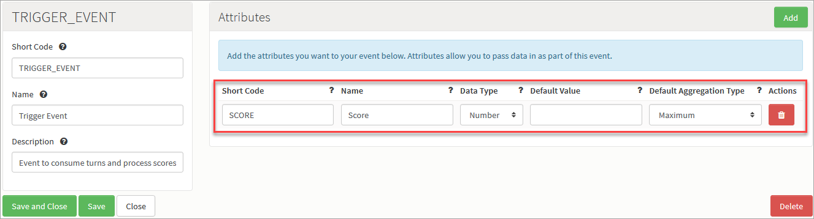
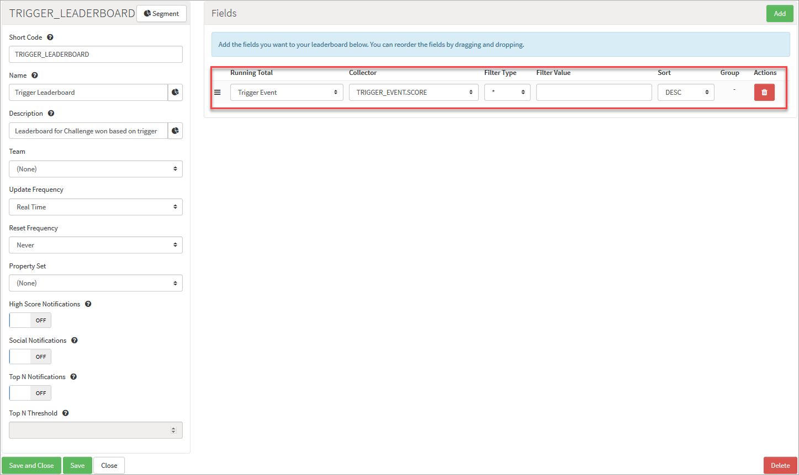
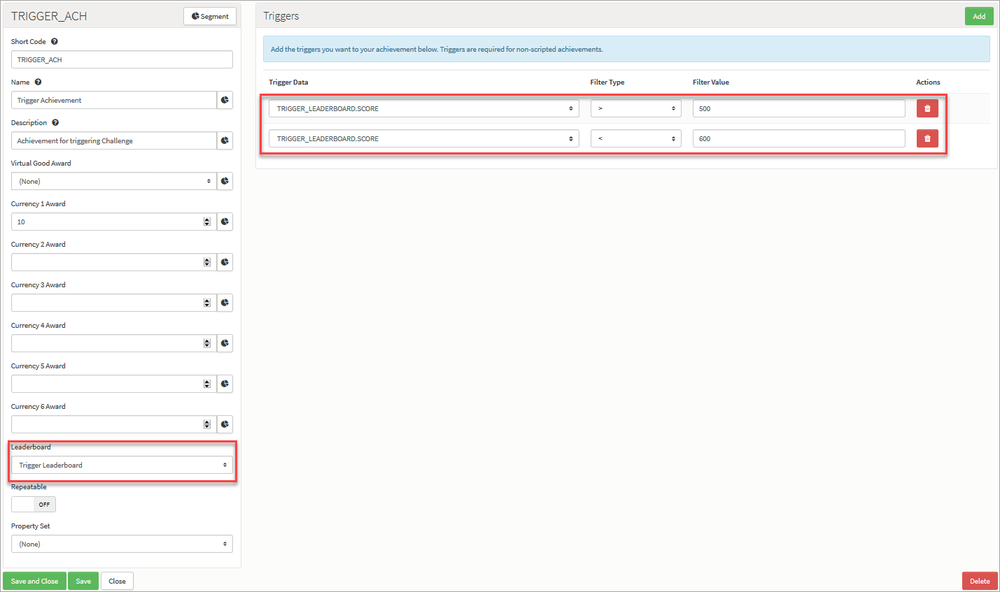
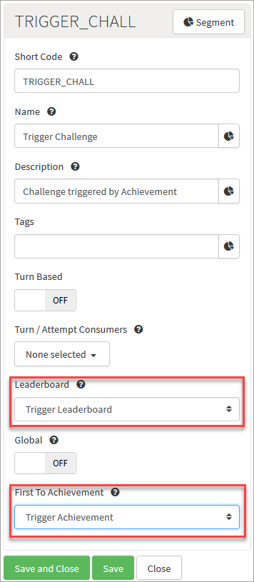

# Achievement Based Challenges

## Introduction

You can set up your Challenge to determine a winner based on who triggers a particular Achievement first:
* This is useful for an application where score doesn't matter but a set of accomplishments or a certain goal does.
* This Achievement can either be triggered manually using Cloud Code or set to trigger based on a score with the ability to filter the score.  

In this tutorial, we'll work through an example that illustrates the steps needed to set up things for an Achievement-based Challenge:
* [Create a Trigger Event](#Creating a Trigger Event)
* [Create a Trigger Leaderboard](#Creating a Trigger Leaderboard)
* [Create a Trigger Achievement](#Creating a Trigger Achievement)
* [Create a Challenge Triggered by the Achievement](#Creating a Challenge Triggered by the Achievement)

## Creating a Trigger Event

First, we need to create an Event as the trigger Event.

*1.* Navigate to *Configurator > Events*.

*2.* Click to *Add* a new Event and configure the Event as shown:
* Make sure you add an Attribute where the *Data Type* is set to *Number* and the *Default Aggregation Type* is set to maximum:

*3.* Click to *Save and Close* the new trigger Event.

## Creating a Trigger Leaderboard

Next, we need to create a Leaderboard for our Challenge.

*4.* Navigate to *Configurator > Leaderboards*. The page opens with the *Leaderboards* tab open.

*5.* Click to *Add* a new trigger Leaderboard and configure the Leaderboard as shown below. Make sure:
* You leave the *Team* selection at the default of *None*, which means this will be a *Player* Leaderboard type.
* In the *Fields* panel, you add a Running Total and set it to your trigger Event's *Score* attribute - you can link to the trigger Event's *Score* attribute using the *Collector* drop-down list:

*6.* Click to *Save and Close* the new trigger Leaderboard.

## Creating a Trigger Achievement

Now we can create a trigger Achievement and link it to the trigger Leaderboard.

*7.* Navigate to *Configurator > Achievements*.

*8.* Click to *Add* a new trigger Achievement and configure it as shown below:
* Use the *Leaderboard* drop-down to select our *Trigger Leaderboard* to link the new Achhieveent to it.
* In the *Triggers* panel, add as many trigger data as you want to customize the trigger to your challenge:
  * In our example we set the trigger to be between 500 to 600. If a player scores anything between 500 and 600 first during the challenge is the winner.

*9.* Click to *Save and Close* the new trigger Achievement.
 

### Creating a Challenge Triggered by the Achievement

Lastly, we create the Challenge and ensure winning the Challenge depends upon the conditions we have set up for awarding the Achievement.

*10.* Navigate to *Configurator > Multiplayer*. The page opens with the *Challenges* tab selected.

*11.* Click to *Add* a new Challenge and configure it as shown below:
* Use the *Leaderboard* drop-down to select our *Trigger Leaderboard*.
* Use the *First To Achievment* drop-down to select our *Trigger Achievement*

*11.* Click to *Save and Close* the new Challenge.

Now whenever our Achievement is triggered manually through Cloud code or by a score-based method via the Leaderboard, the player awarded this Achievement will win the Challenge.
