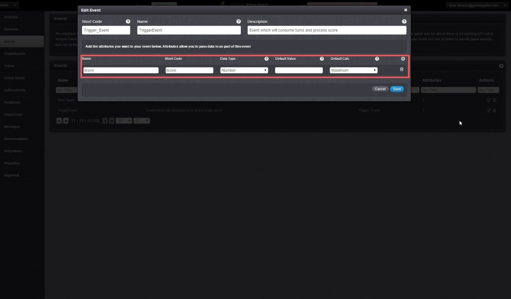
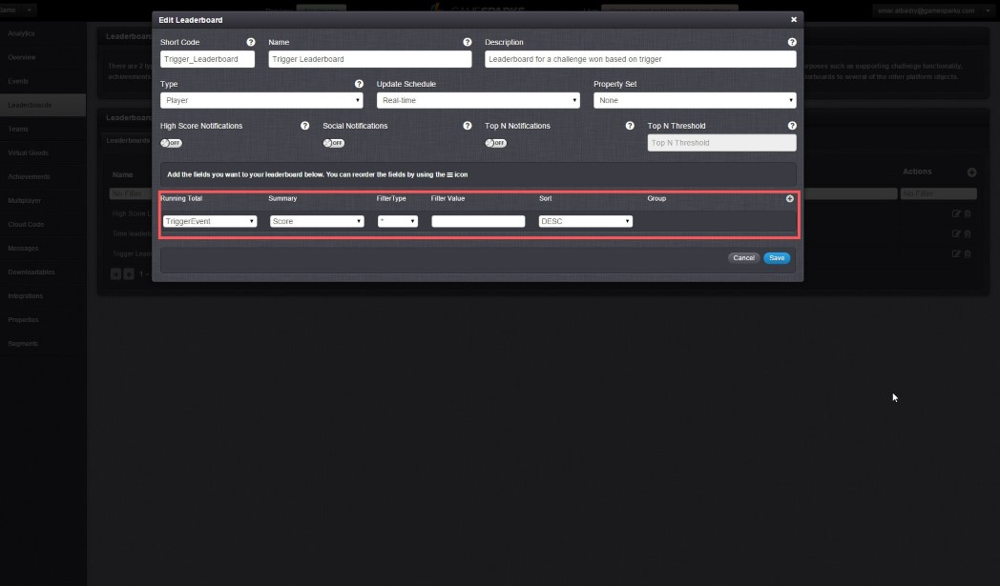
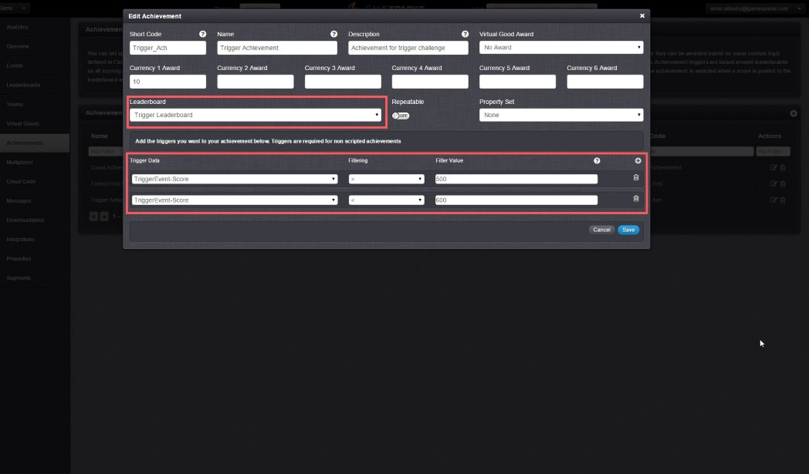
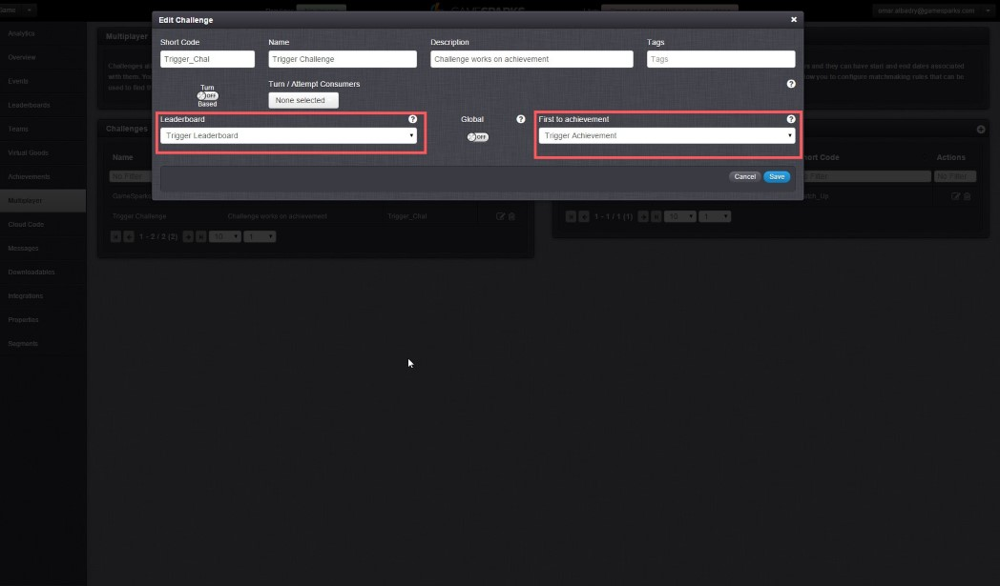

# Achievement Based Challenges

## Introduction

You can setup your challenge to determine a winner based on who triggers a particular achievement first. This is useful for an application where score doesn't matter but a set of accomplishments or a certain goal does. This achievement can either be triggered manually using Cloud code or set to trigger based on a score with the ability to filter the score.  

## The Setup

### Event

Create an event. In that event create an attribute of data type Number with the default calc set to maximum.

 

### Leaderboard

Create a Leaderboard for your challenge. Add a running total and set it to your event's score attribute. Link the event's attribute using the drop down list.

 

### Achievement

Create an achievement. Link this achievement to the challenge's Leaderboard. Add as many trigger data as you want to customize the trigger to your challenge. In our example we set the trigger to be between 500 to 600. If a player scores anything between 500 and 600 first during the challenge is the winner.

 

### The Challenge

Select your Leaderboard from the Leaderboard drop down list. Pick your achievement from the 'First to Achievement' drop down list. Now whenever your achievement is triggered manually through Cloud code or by a score based method via the Leaderboard the player awarded this achievement will win.

