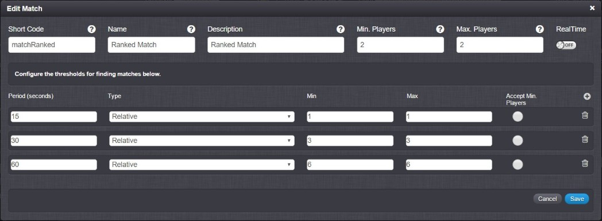
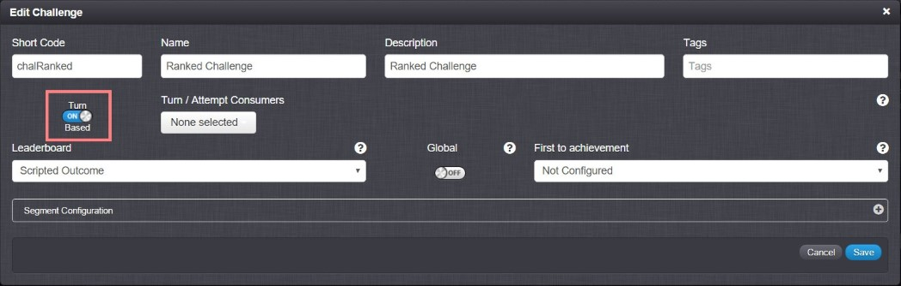

# Matchmaking

## The Procedure

The way we set up the matchmaking allows for the platform to automatically construct the right match, based on the players level. Once a match has been found the platform will automatically issue the correct challenge, accept it and initialize it.

## Creating the Match and Challenge Examples

Before we can continue we need to create a match and a challenge. These will be very simple.

The match:



The challenge:



Make sure that the challenge is turn based.

## The Match Event

Make an new event. This simple event will take one string that represents the shortCode of the match it's suppose to make. We'll name this event findMatch and the Cloude code will be:

```
//Get shortCode
var matchshortCode = Spark.getData().match_shortCode;

//If shortCode is equal to 'rankedMatch' send a matchmakingRequest for a ranked match
if (matchshortCode === "rankedMatch"){
    //Create the request
    var matchRequest = new SparkRequests.MatchmakingRequest();

    //Assign shortCode and skill based on player rank
    matchRequest.matchShortCode = matchshortCode;
    matchRequest.skill = Spark.getPlayer().getScriptData("rank");

    //Send request
    matchRequest.Send();
}
else if(matchshortCode === "casualMatch"){
    //Create the request
    var matchRequest = new SparkRequests.MatchmakingRequest();

    //Assign shortCode and skill as 0 so all players are matched
    matchRequest.matchShortCode = matchshortCode;
    matchRequest.skill = 0;

    //Send request
    matchRequest.Send();
}
```

Now once the match is found, we need to allow the platform to automatically create a challenge and accept the players in. We can do this using the Match Found message in the UserMessages tab in the Cloud code section.

## Match Found Message

We'll edit the Match Found message to contain this:

```
//If our match is ranked
if (Spark.getData().matchShortCode === "matchRanked")
{
    //If the first participant
    if(Spark.getPlayer().getPlayerId() === Spark.getData().participants[0].id){

        //Create a challenge request
        var request = new SparkRequests.CreateChallengeRequest();

        //Fill in the details, give a date in the future, the right shortCode,
        //make it a private challenge and invite participant 2
        request.accessType = "PRIVATE";
        request.challengeShortCode = "chalRanked";
        request.endTime = "2018-02-23T13:47Z";
        request.expiryTime = "2018-02-23T12:47Z";
        request.usersToChallenge = [Spark.getData().participants[1].id];

        //Send the request
        request.Send();

    }
}
```
After the challenge request is sent, the second participant will recieve a Message issued request. We will automatically accept the challenge request for that player by editing the Challenge Issued Message under the User messages tab.

## Challenge Issued Message

We will edit the Challenge Issued Message to contain:

```

//Easy access to data
var chalData = Spark.getData();
//New request to join the challenge automatically
var request = new SparkRequests.AcceptChallengeRequest();

//Retrieve the challenge ID to use it in the AcceptChallenge request
request.challengeInstanceId = chalData.challenge.challengeId;
request.message = "Joining";

//Send the request as the player recieving this message
request.SendAs(chalData.challenge.challenged[0].id);

```

## Challenge Started Message

After this, the challenge would have started and both players would receive the ChallengeStarted message. This is the perfect place to initialize the challenge and set it up for both our players. To avoid duplication we will only allow the challenger to set up the challenge.

```
//Declare challenge
var chal = Spark.getChallenge(Spark.getData().challenge.challengeId);

//Player IDs
var challengerId = chal.getChallengerId();
var challengedId = chal.getChallengedPlayerIds()[0];

//Initiation of the challenge settings through the challenger(similar to host)
if(Spark.getPlayer().getPlayerId() === challengerId){

    //Construct the play field JSON - Used for the playing field
    var playField = {};
    playField[challengerId] = {};
    playField[challengedId] = {};

    //Construct the current hand JSON - Used for the cards in the player's hands
    var currentHand = {};
    currentHand[challengerId] = {};
    currentHand[challengedId] = {};

    //Construct player details
    var playerStats = {};
    playerStats[challengerId] = {"overallMana": 1, "currentMana": 1, "playerHealth": 30, "cardsPulled": 0, "hasPulled": true, "tauntProtection":false }
    playerStats[challengedId] = {"overallMana": 1, "currentMana": 1, "playerHealth": 30, "cardsPulled": 0, "hasPulled": true, "tauntProtection":false }


    //Pull three cards for each player
    for(var i = 0; i < 3; i++){
        //First Id
        var pId = challengerId;
        require("pullCardModule");
        //second Id
        var pId = challengedId;
        require("pullCardModule");
    }


    //Save the contructed JSONs against the challenge's scriptData
    chal.setScriptData("playField",playField);
    chal.setScriptData("currentHand", currentHand);
    chal.setScriptData("playerStats", playerStats)
}
```

This will construct the game itself with all the details, which contains:

1. The playField which will represent the game board where players battle their cards. The playField consists of two objects, one for either player.
2. The currentHand which will represent the player's hand. Consists of two objects, one hand for either player.
3. playerStats which will house information about mana, health, how many cards pulled, if player has pulled a card this round and if there's a taunt card protecting the player.
4. Each player will recieve 3 starter cards which will end up in the currentHand object.
5. Saves all the initialized values.

## pullCard Module

The pullCardModule used in the ChallengeStarted message contains this code:

```
//Load deck
var deck = []
deck = Spark.getPlayer().getPrivateData("deck");

//Length and random number depending on length
var length = deck.length - 1;
var randNum = Math.floor(Math.random() * (length - 0 + 1));

//Retrieve random card stats from collection
var stats = Spark.runtimeCollection(deck[randNum]["tier"]).findOne({cardName: deck[randNum]["name"]});

//Construct card
randCard = {"type" : stats.cardName, "atk" : stats.attack, "hp" : stats.health, "maxHP": stats.health, "spawnCost" : stats.spawnCost, "effect": stats.effect};

//Retrieve the number of pulled cards so far
var numPulls = playerStats[pId].cardsPulled;

//Add the new card to the player hand and give it a unique name
currentHand[pId]["c" + numPulls.toString()] = randCard;

//Increment amount of cards pulled for future unique card names
playerStats[pId].cardsPulled = numPulls + 1;

//Return script with card pulled
Spark.setScriptData("result", randCard.type + " was pulled from deck");

```

This concludes the match making part of the tutorial. Now your players will be matched and a challenge will be started and initialized ready for the game to take part. Next tutorial will walk you through getting the players to take turns and use their cards.
