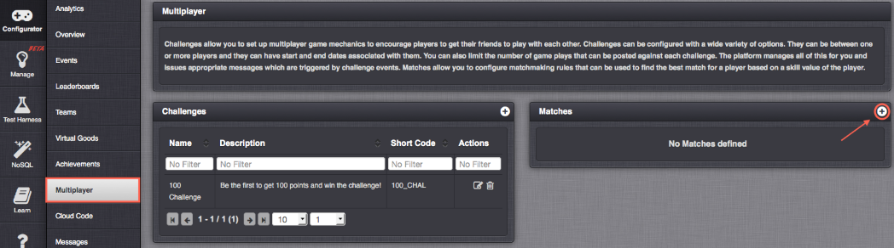
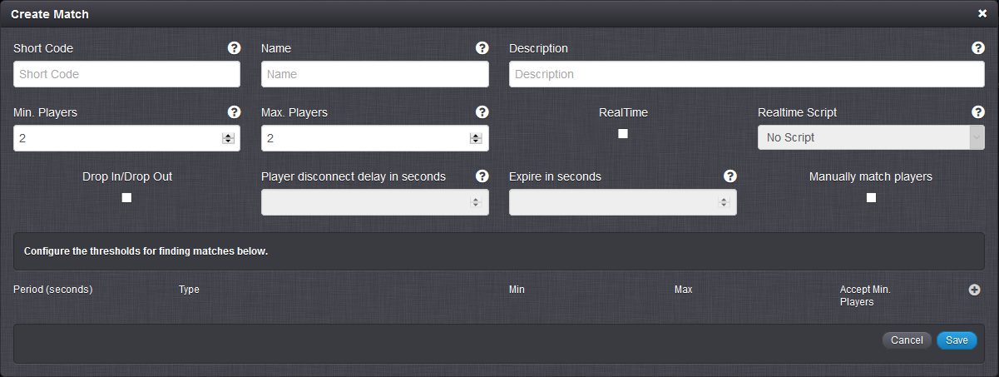
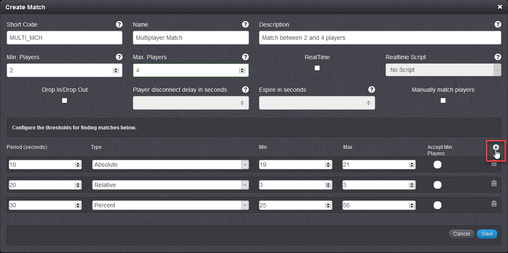
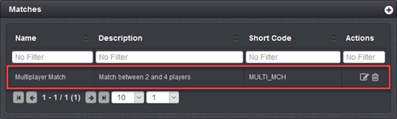
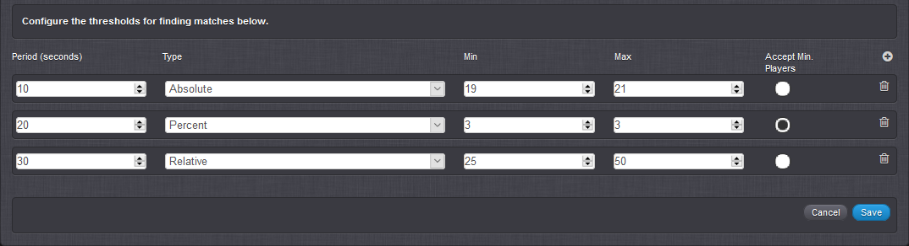
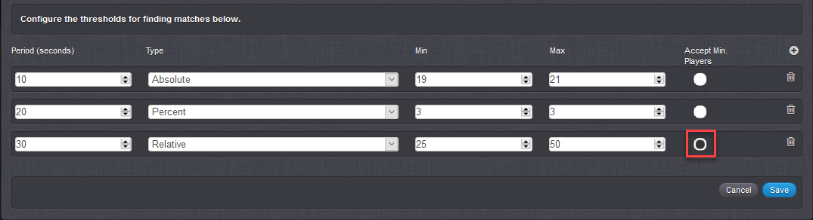
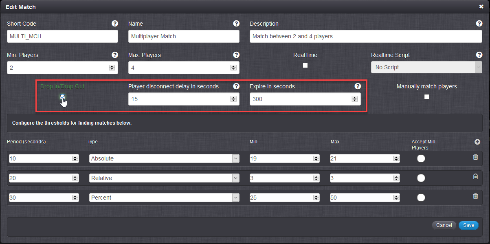
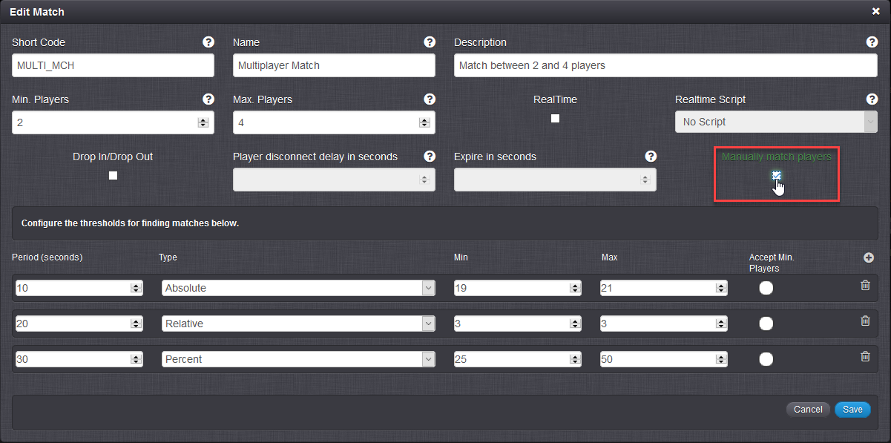

# How to Match Players

In this tutorial, we'll first explore the GameSparks matching framework to gain an understanding of how the system works to process and complete player matches on the basis of Match configurations.

With this background in place, we'll move on to create a Match configuration with customized Thresholds in the GameSparks Portal. We'll then use this configuration to perform a Match in the Test Harness that will match Players in the game. A typical example of matching players is where you want to match players based on their similar skill level in your game so that players can play against someone of equal ability to make it more enjoyable for all.

We'll also see how to enable and work with:
* **Drop In/Drop Out** - Have matching players added to or removed from the Match after the Match is first made.
* **Manual Matching** - Use a custom mechanism for completing a Match from the list of matching players the portal returns for the matching criteria.
* **Custom Matching** - Exploit further ways to fine-tune matchmaking for your game.

## The Matching Framework

Matching players in GameSparks starts when a *MatchMakingRequest* is issued. It proceeds according to the matching criteria the request contains, such as the player's skill level and the matching constraints built into the specific Match configuration the request uses. Matches are highly-configurable and include a timespan which defines how long the search for a match will continue. In many cases, the processing of the *MatchMakingRequest* will continue for some time - perhaps several minutes - before concluding in success (*MatchFound*) or failure (*MatchNotFound*).

If successful, the matchmaking process completes with a *Match Instance*. However, after a player has issued a *MatchMakingRequest* and until either a match is made or is not made, the status remains as a *Pending Match*. Let's follow a couple of simple examples that illustrate how the matchmaking process plays out from Pending Matches through to a Match Instance.

### Example 1

*1.* Suppose we have 4 players, who each request a match while playing your game. In this example, we assume that all players match on skill. The Match configuration you have built into the game imposes these matching constraints:
* Number of players - Minimum of 3 and maximum of 4 players.
* Timeframe - The search for a match continues for 40 seconds after a match request has been issued.

*2.* Now, suppose players 1, 2, 3 , and 4 issue their requests in this sequence:
* Player 1 submits a match request. A Pending Match (PM1) is started for this request.
* Player 2 submits a match request 20 seconds later. A Pending Match (PM2) is started for this request. Although players 1 and 2 match on skill, a Match Instance cannot be made because at least 3 players are required. However, because players 1 and 2 match on skill, a *joint* Pending Match is started (PMJ1). This merges player 1 and 2 under the same Pending Match and the player skill matching level is averaged for PMJ1. (In our current example, the skill-averaging operation has no effect because all players have the same skill level.)
* 40 seconds have elapsed since player 1 submitted a match request. PMJ1 drops player 1 and the skill-averaging is adjusted for the remaining players. (In our example, we now have only player 2 remaining and skill-averaging has no effect.)
* Player 3 submits a match request 41 seconds after player 1. A Pending Match (PM3) is started for this request. Although players 2 and 3 match on skill, a Match Instance cannot be made, because 3 players are required. However, because players 2 and 3 match on skill, player 3 is added to PMJ1 because we are still within the 40-second timeline since player 2 submitted a match request. Player skill matching level is averaged for the joint Pending Match. (Again, skill-averaging has no effect in this example.)
* Player 4 submits a match request 46 seconds after player 1. A Pending Match (PM4) is started for this request. Player 4 is added to PMJ1 because we are within the 40 seconds since player 2 submitted a match request and all players match on skill level. PMJ1 now contains the minimum number of players required for a match - 3. PMJ1 is deleted and is no longer available for matching. A Match Instance (MInst1) is created using the details from PMJ1.

### Example 2

This second example builds on example 1 but introduces players with different skill levels:
* Player 1 - 5
* Player 2 - 11
* Player 3 - 15
* Player 4 - 19


*1.* Suppose we have 4 players, who each request a match while playing your game. The Match configuration you have built into the game imposes these matching constraints:
* Number of players - Minimum of 3 and maximum of 4 players.
* Timeframe - The search for a match continues for 40 seconds after a match request has been issued.
* Skill level matching - a relative skill level matching is used: only players within plus/minus 6 skill level of each other can be matched.

*2.* Now, suppose players 1, 2, 3 , and 4 issue their requests in this sequence:
* Player 1 submits a match request. A Pending Match (PM1) is started for this request.
* Player 2 submits a match request 20 seconds later. A Pending Match (PM2) is started for this request. Although players 1 and 2 are matched on relative skill, a Match Instance cannot be made because at least 3 players are required. However, because players 1 and 2 match on skill, a *joint* Pending Match is started (PMJ1). This merges player 1 and 2 under the same Pending Match and the player skill matching level is averaged for PMJ1 - the matching skill level becomes 8.
* Player 3 submits a match request 10 seconds later, that is, 30 seconds after player 1 submitted a match request. A Pending Match (PM3) is started for this request. Although player 3 matches player 2 in relative skill level, player 2 is now part of PMJ1, where the averaged matching skill level of 8 excludes player 3, at 15, from being added into PMJ1.
* 40 seconds have elapsed since player 1 submitted a match request. PMJ1 drops player 1 and the skill-averaging is adjusted for the remaining player 2, so it jumps back up to 11. Player 3 is brought into PMJ1 - 15 now falls within the relative matching skill level of plus/minus 6. With player 3 added, the skill-averaging is applied to adjust PMJ1 again, taking it up to 13. A Match Instance cannot be made because at least 3 players are required.
* Player 4 submits a match request 46 seconds after player 1. A Pending Match (PM4) is started for this request. Player 4 is added to PMJ1 because we are within the 40 seconds since player 2 submitted a match request and a matching skill of 19 is within the plus/minus 6 relative matching skill level of PMJ1's averaged skill level of 13. PMJ1 now contains the minimum number of players required for a match - 3. PMJ1 is deleted and is no longer available for matching. A Match Instance (MInst1) is created using the details from PMJ1.


<q>**Note:** A Pending Match and a Match Instance are entirely separate collections in the Mongo database.</q>

### How does manual matching affect the matchmaking process?

If you select the manual matchmaking option, Pending Matches will be created automatically in the normal way but the automatic joining of Pending Matches as the matchmaking process plays out *is disabled*. You can then use manual matching to control which of the PMs are joined together. When a Pending Match that you have made manually meets all of the other matching criteria, a Match Instance will be formed.


## Creating a Match

*1.* To create a Match, navigate to the Portal's *Configurator *and go to the *Multiplayer* section.

*2.* Under *Multiplayer*, click the  icon for *Matches*:



  The *Create Match* form appears:



The *Create Match* form contains the following fields:

* *Short Code* \- Enter an identifier for the Match.
* *Name* \- Enter a name for the Match.
* *Description* \- Enter a description of the Match.
* *Min. Players* \- The minimum number of Players for the Match.
* *Max. Players* \- The maximum number of Players for the Match.
* *RealTime* \- Select for a Real-Time Match:
  * *Realtime Script* \- Select a script which will be run on the Real-Time server for the Real-Time Match.
* *Drop In/Drop Out* \- Select for a Drop In/Drop Out Match.
  * *Player disconnect delay in seconds* \- The number of seconds after a Match is found before a player in the Match who disconnects is removed from the Match. If you don't enter a value or enter zero, the player is removed instantly on disconnection.
  * *Expire in seconds* \- The number of seconds after a Match is made that players can drop in or drop out. If you don't enter a value or enter zero, the drop in/drop out period for the Match doesn't expire.
* *Manually match players* \- For custom completion of the matching process. Select this if you do not want the Match to complete automatically when all matching criteria have been met, but want to use your own custom mechanism to complete the Match. The platform will find players for you, but you control the choice of which players are put in the Match.


*3.* In the *Create Match* form, specify the *Short Code*, *Name* and *Description* of your Match and select the  icon to create the Thresholds you want to use in the Match.


  

In this example:
* We've added 3 Thresholds to determine player matching: *Absolute*, *Relative*, and *Percent*. (See below: *Working with Thresholds* for how to use these different types of Threshold in a Match.)
* We've specified a minimum of 2 and maximum of 4 players for the Match, which means this will be a *multiplayer Match*:
  * Multiplayer matching is based on synchronous messages that match players based on similar skill attributes, continuously adding players to the Match and updating those already in the Match until the specified maximum number of Players has been reached, similar to the way a Challenge works.
* We haven't selected *Accept Min. Players* for any of the Thresholds. This means that a Match will be found, only when 4 players meet the matching criteria that the Thresholds define.

<q>**Note:** You cannot set the minimum number of players for a Match to be fewer that 2. If you set the maximum number of players also at 2, then this is a Head-to-Head Match.</q>

In this example, we haven't:
* Selected for a Real-Time Match and no Realtime script will be executed on the Real-Time server when a Real-Time session starts. You can learn more about Real-Time services [here](/Tutorials/Real-Time Services/README.md).
* Selected for a Drop In/Drop Out Match. (See below: *Using Drop In/Drop Out* for more on how to use this feature for a Match.)
* Selected to Manually match players. (See below: *Manual Matching* for more on how to use this feature for a Match.)
 

*4.* Click to save the Match. The *Create Match* form closes and your Match is added to the *Matches* list under *Multiplayer*:



## Working with Thresholds

You can use the Thresholds that you add to a Match configuration to define the criteria that determine player matching. For each Threshold you can define:
* **Threshold Type.** You can choose from three types of Threshold and impose a different degree of precision to the matching process using these types.
* **Threshold Period.** Set a period to control how long you want the matching process to continue trying to find a Match using a Threshold.
* **Accept Minimum Players.** Match the players currently found in the Threshold period that meet the matching criteria, as soon as the number of players found and matched is equal to the value in the *Min. Players* field.

<q>**At Least One!** You must add at least one Threshold to the Match. If you do not have at least one Threshold in the Match, when you try to matchmake from the client you will get this error: "matchShortCode: NOT_FOUND".</q>

<q>**Example.** Here, we'll use the Thresholds defined for our example Match configuration to explain how you can use Threshold Types and Periods, and how to use Accept Minimum Players for a Threshold.</q>

  

### Threshold Types

A Match is built upon the different types of range criteria for the common attribute (that is, skill level) that we want to match players on. You can use 3 different types of range criteria for Thresholds to fine-tune your Matches and achieve more precision when matching players with similar attributes:

* *Absolute* \- Match Players that fall between the specified minimum and maximum range of absolute values.

  **Example:** During the first Threshold period, players will only be matched when each have a skill level between the values of 19 and 21.
* *Relative* \- Find a match between two players where their values are no wider apart than the specified minimum and maximum values.

  **Example:** During the second Threshold period, if player 1 submits a [MatchmakingRequest](/API Documentation/Request API/Multiplayer/MatchmakingRequest.md) with a skill level of X, player 1 will only be matched to another player who has a skill level 3 greater than or 3 less than X.
* *Percentage* \- Similar to Relative and finds a match between players when their values are no wider apart than the specified minimum and maximum percentage values.

  **Example:** During the third Threshold period, if player 1 submits a *MatchmakingRequest* with a skill level of X, player 1 will only be matched to another player who has a skill level between 25 percent less than and 50 percent greater than X.


### Threshold Periods

You can use the *Period* value for a Threshold in your Match to specify how long you want to look for a match based on that Threshold's criteria.

We saw in the example that we can create multiple Threshold periods during one Match and for those Periods of time specify different Threshold types on which players will be matched - we had 3 Threshold Types, all with different Periods. Once the *MatchmakingRequest* is executed, if a match is not found in the first period, the following periods will continue subsequently to try to find a match until their duration has expired. By having a combination of longer and shorter Periods for the Thresholds, we can fine-tune our Match criteria to be stricter or more relaxed, while the duration of the Match progresses.

Our example showed how the use of 3 Thresholds types allows you to control the matching process performed by the portal such that you get a decreasing degree of matching precision as the matching process runs through the 30 second total matching period - *Absolute* matching for 10 seconds, *Relative* matching for the next 10 seconds, and *Percent* matching for the next 10 seconds.

### Accept Minimum Players

Selecting this for one of the Thresholds in your Match instructs the Match to match all the players it has currently found, as soon as the number of players found and matched is equal to the value in the *Min. Players* field. If enough players according to this value have not been found, the Match continues to find players in the next Threshold.

**Example:** Suppose our first Threshold, using *Absolute* type, was selected to *Accept Min Players*. For *MULTI_MCH*, *Min. Players* is set at 2. Now suppose a player with skill level 20 issues a *MatchmakingRequest* using *MULTI_MCH*. If 1 other matching player is found in the first 10 seconds - at, say, 4 seconds in with skill level 21 - then the Match would be made for these 2 players and the matchmaking process would cease after only 4 seconds.

#### Accept Min. Players Only Applied to One Threshold

<q>**Important!** You can only apply *Accept Min. Players* to *one* Threshold in a Match.</q>

However, where there are multiple Thresholds there are two important things to note:
* A Pending Match will apply minimum players as soon as a Threshold period with *Accept Min. Players* starts:
  * **Example:** If the first *Absolute* Threshold doesn't have *Accept Min. Players* enabled and a match for the minimum of 2 players is found but a match for the maximum of 4 players is not found in the first 10 seconds and during the first Threshold period, a match *will not be made*. However, if *Accept Min. Players* is enabled for the second Threshold period - for the 10 to 20 seconds of the matchmaking process - then as soon as the second Threshold period starts, the match will be made for the 2 players matched for the first Threshold.
* *Accept Min. Players* will also be applied to any successive Thresholds used up to completion of the matchmaking process:
    * **Example:** If the first *Absolute* Threshold has *Accept Min. Players* enabled but the minimum of 2 matched players are not found in the first 10 seconds and during the first Threshold period, but 2 matched players are found after 12 seconds and during the *Relative* Threshold period, the match will be made and the matchmaking process will cease at 12 seconds.

<q>**Remember!**  If *Accept Min. Players* is not selected for any Threshold, and there aren't enough players found in the Match to reach the *Max. Players* value, no Match will be found, even if there are more players than the *Min. Players* value.</q> 

### Multiplayer Matching Examples

Using the three Thresholds in the above *MULTI_MCH* example and for a 3-player context with Accept Min Players enabled for the 2nd Threshold, here are some example scenarios to demonstrate just how the matching process works:

* **Scenario 1.** Players *1*, *2*, and *3* have skills of *20*, *15*, and *17* respectively. Each player submits a *MatchmakingRequest* in that order and each player's request is issued within player *1's* first Threshold period of 10 seconds. Players *1* and *3* would be matched based on the second Threshold which uses the Relative Match Type.

* **Scenario 2.** Players *1*, *2*, and *3* have skills of *20*, *15*, and *16* respectively. Each player submits a *MatchmakingRequest* in that order and each player's request is issued within player *1's* first Threshold period of 10 seconds. Players *2* and *3* would be matched based on the second Threshold which uses the Relative Match Type. Note here that because *Accept Min. Players* *is enabled* for the 2nd Threshold, player 1 would *not be matched*, since we reach the minimum number of players required for a Match in the 2nd Threshold - 2 and 3 - and we would have to wait until we are in the 3rd Threshold period for player 1 to be brought into the Match.

* **Scenario 3.** Players *1*, *2*, and *3* have skills of *20*, *15*, and *16* respectively. Player *1* submits a *MatchmakingRequest*. However, players *2* and *3* submit their requests later and during player *1's* *second* Threshold period, that is between *10* and *20* seconds after the matchmaking process starts. Players *1* and *3* are matched based on the third Threshold which uses the Percent Match Type.


## Multiplayer Matching in the Test Harness

To match multiple Players, we will use the [MatchmakingRequest](/API Documentation/Request API/Multiplayer/MatchmakingRequest.md) in the *Test Harness*.

*5.* First, for this example, we'll change the *Accept Min. Players* and apply it to the 3rd Threshold instead:



*6.* In the *Test Harness*, authenticate 4 Players (in separate browser tabs) and have them each submit a *MatchmakingRequest* within 10 seconds so that all Players can attempt to match each other in their first threshold period.

Players *1*, *2*, *3* and *4* should have a skill of *16*, *21*, *19* and *22* respectively.

```
{
 "@class": ".MatchmakingRequest",
 "matchGroup": "group1",
 "matchShortCode": "MULTI_MCH",
 "skill": 16
}
```
```
{
 "@class": ".MatchmakingRequest",
 "matchGroup": "group1",
 "matchShortCode": "MULTI_MCH",
 "skill": 21
}
```
```
{
 "@class": ".MatchmakingRequest",
 "matchGroup": "group1",
 "matchShortCode": "MULTI_MCH",
 "skill": 19
}
```
```
{
 "@class": ".MatchmakingRequest",
 "matchGroup": "group1",
 "matchShortCode": "MULTI_MCH",
 "skill": 22
}
```

As you will notice, Players *2* and *3* will be matched almost immediately, because their skill values fall within the *first* (Absolute) threshold period.

Player 3 *MatchUpdatedMessage:*

```

{
  "@class": ".MatchUpdatedMessage",
  "addedPlayers": [
   "577679844ff544049a84c6dc"
  ],
  "gameId": 358380,
  "matchGroup": "group1",
  "matchShortCode": "MULTI_MCH",
  "messageId": "57767afd4ff544049a84d118",
  "notification": true,
  "participants": [
   {
    "displayName": "PLAYER_2",
    "externalIds": {},
    "id": "577679844ff544049a84c6cd",
    "online": true
   },
   {
    "displayName": "PLAYER_3",
    "externalIds": {},
    "id": "577679844ff544049a84c6dc",
    "online": true
   }
  ],
  "playerId": "577679844ff544049a84c6dc",
  "summary": "MatchUpdatedMessage"
}


```

Around 10 seconds later, Player *4* will also be added to the Match, who will be matched based on his skill value falling within the *second* (Relative) threshold period.  As each Player is added to the Match, both the new and the existing Players in the Match receive a [MatchUpdatedMessage](/API Documentation/Message API/Multiplayer/MatchUpdatedMessage.md).

Player 3 *MatchUpdatedMessage:*

```

{
  "@class": ".MatchUpdatedMessage",
  "addedPlayers": [
   "577679844ff544049a84c6ec"
  ],
  "gameId": 358380,
  "matchGroup": "group1",
  "matchShortCode": "MULTI_MCH",
  "messageId": "57767b054ff544049a84d13c",
  "notification": true,
  "participants": [
   {
    "displayName": "PLAYER_2",
    "externalIds": {},
    "id": "577679844ff544049a84c6cd",
    "online": true
   },
   {
    "displayName": "PLAYER_3",
    "externalIds": {},
    "id": "577679844ff544049a84c6dc",
    "online": true
   },
   {
    "displayName": "PLAYER_4",
    "externalIds": {},
    "id": "577679844ff544049a84c6ec",
    "online": true
   }
  ],
  "playerId": "577679844ff544049a84c6dc",
  "summary": "MatchUpdatedMessage"
}


```


Finally, Player *1* will be added to the Match, who is matched based on his skill value falling within the *third* (Percent) threshold period.  This will result in a [MatchFoundMessage](/API Documentation/Message API/Multiplayer/MatchFoundMessage.md).


```


{
  "@class": ".MatchFoundMessage",
  "gameId": 358380,
  "matchGroup": "group1",
  "matchId": "57767b0f4ff544049a84d157",
  "matchShortCode": "MULTI_MCH",
  "messageId": "57767b0f4ff544049a84d168",
  "notification": true,
  "participants": [
   {
    "displayName": "PLAYER_2",
    "externalIds": {},
    "id": "577679844ff544049a84c6cd",
    "online": true,
    "peerId": 2
   },
   {
    "displayName": "PLAYER_1",
    "externalIds": {},
    "id": "577679844ff544049a84c6bf",
    "online": true,
    "peerId": 1
   },
   {
    "displayName": "PLAYER_3",
    "externalIds": {},
    "id": "577679844ff544049a84c6dc",
    "online": true,
    "peerId": 3
   },
   {
    "displayName": "PLAYER_4",
    "externalIds": {},
    "id": "577679844ff544049a84c6ec",
    "online": true,
    "peerId": 4
   }
  ],
  "playerId": "577679844ff544049a84c6dc",
  "summary": "MatchFoundMessage"
}

```

*7.* Repeat Step 6, but instead, change the skill value for Player *1* to be *12*. As Players *2*, *3* and *4* are added to the Match, the average skill value in the Match increases and Player *1's* skill value will be too far away from the average value in the Match, even during the *third* (Percent) threshold period to match them. A [MatchNotFoundMessage](/API Documentation/Message API/Multiplayer/MatchNotFoundMessage.md) message will be returned to Player *1*, whilst Players *2*, *3* and *4* will receive a *MatchFoundMessage* because the 3rd and last threshold will accept 3 players.


```
{
  "@class": ".MatchNotFoundMessage",
  "gameId": 358380,
  "matchGroup": "group1",
  "matchShortCode": "MULTI_MCH",
  "messageId": "57767bb64ff544049a84d6b3",
  "notification": true,
  "playerId": "577679844ff544049a84c6bf",
  "summary": "MatchNotFoundMessage"
}
```

As a result, no Match will be created. The Match we created earlier can be viewed using the [MatchDetailsRequest](/API Documentation/Request API/Multiplayer/MatchDetailsRequest.md). 

Here is the request submitted by Player *4*:

```
{
  "@class": ".MatchDetailsRequest",
 "matchId": "57767b0f4ff544049a84d157",
 "realtimeEnabled": false
}


```
And the *MatchDetailsResponse*:

```
{
  "@class": ".MatchDetailsResponse",
  "matchId": "57767b0f4ff544049a84d157",
  "opponents": [
   {
    "displayName": "PLAYER_2",
    "externalIds": {},
    "id": "577679844ff544049a84c6cd",
    "online": true,
    "peerId": 2
   },
   {
    "displayName": "PLAYER_1",
    "externalIds": {},
    "id": "577679844ff544049a84c6bf",
    "online": true,
    "peerId": 1
   },
   {
    "displayName": "PLAYER_3",
    "externalIds": {},
    "id": "577679844ff544049a84c6dc",
    "online": true,
    "peerId": 3
   }
  ],
  "peerId": 4,
  "playerId": "577679844ff544049a84c6ec"
}

```
<br>
### Cancelling a Match Request

*8.* To cancel an ongoing *MatchmakingRequest*, use the *action* parameter in the request with the value, *cancel*.

```
{
 "@class": ".MatchmakingRequest",
 "action": "cancel",
 "matchShortCode": "MULTI_MCH"
}
```

This will cancel a *MatchmakingRequest* that has not yet received a *MatchFoundMessage*.

## Using Drop In/Drop Out

In this type of Match, a Match is made in the normal way but the player list found for the Match doesn't remain fixed after the Match is made. Players that meet all of the matching criteria can enter or leave the Match.

Two constraints are imposed:
  * The number of players can change but cannot exceed the configured maximum number of players for the Match.
  * If all players drop out, then the Match is deleted.

<q>**Note:** The specified *minimum number of players* is applied for making the Match in the first place. However, after the Match has been made and during the Drop In/Drop Out period, player numbers *can fall below the minimum* and the Match will not be ended. This allows more players to drop in again and bring the number in the Match back up above the minimum.</q>

There are two important settings for this type of Match:
* *Player disconnect delay in seconds* \- The number of seconds after a Match is found before a player in the Match who disconnects is removed from the Match. If you do not enter a value or enter zero, then a player in the Match who disconnects is removed instantly.
* *Expire in seconds* \- The number of seconds after a Match is made that players can drop in or drop out. If you do not enter a value or enter zero, the drop in/drop out period for the Match doesn't expire.



Here, we've edited our earlier multiplayer Match example and enabled Drop In/Drop Out:
* Any player in the Match who disconnects will be removed from the Match after 15 seconds. If the player reconnects within 15 seconds, they will be retained in the Match.
* Matched players can drop in and drop out of the Match for up to 5 minutes after the Match was originally made.

## Manually Matching

You might want the GameSparks portal to process all the matching criteria you have built into a Match configuration, produce a list of players that meet those criteria, but not have the portal complete the Match in the normal way. Instead, you want to use your own custom mechanism to complete the Match and based on the player list found for the Match. You can use Manually Matching for this sort of case and you must select to *Manually match players*:



To build a custom completion mechanism for a Match, you will typically use [FindPendingMatchesRequest](/API Documentation/Request API/Multiplayer/FindPendingMatchesRequest.md) and [JoinPendingMatchRequest](/API Documentation/Request API/Multiplayer/JoinPendingMatchRequest.md).

<q>**Possible Availability Lag!** If you use manual matching, an "availabilty lag" might occur and prevent the Match being made. This would happen in cases where the matching process has presented the results for players meeting the matching criteria, but by the time your custom mechanism actually completes the Match one or more of the matched players is no longer available and the Match will not go through.</q>

### Manually Matching Players in the Test Harness

To manually match players, we'll use [FindPendingMatchesRequest](/API Documentation/Request API/Multiplayer/FindPendingMatchesRequest.md) and [JoinPendingMatchRequest](/API Documentation/Request API/Multiplayer/JoinPendingMatchRequest.md) in the Test Harness.

As an example, we'll use the Match configuration described in the previous section - MULTI_MCH:
* We'll enable *Manually match players*.
* We'll select to *Accept Min. Players*.

For manual matching, we'll adapt scenario 1:

  * **Scenario 1A.** Players *1*, *2*, and *3* have skills of *20*, *15*, and *17* respectively. Each player submits a *MatchmakingRequest* in that order and each player's request is issued within player *1's* first Threshold period of 10 seconds. At 12 seconds - that is, in the 2nd Threshold period for Relative skill-level matching - player 1 submits a *FindPendingMatchesRequest* and will get *FindPendingMatchesResponse* containing Player 3 as a possible Pending Match.

Players *1* and *3* will NOT be matched automatically BUT we can use *FindPendingMatchRequest* to find out who could potentially be matched, which allows you to decide who you want to match manually.

*1.* Player 1 submits a *FindPendingMatchesRequest* at 12 seconds:

```

{
 "@class": ".FindPendingMatchesRequest",
 "matchGroup": "group1",
 "matchShortCode": "MULTI_MCH",
 "maxMatchesToFind": 10
}

```

<q>**Note:** Here, we've arbitrarily set the maximum numbers of Pending Matches we want returned at 10.</q>

*2.* Player 1 receives the response:


```

{
 "@class": ".FindPendingMatchesResponse",
 "pendingMatches": [
  {
   "id": "579756b33a32df04880bc2d9",
   "matchGroup": "group1",
   "matchShortCode": "MULTI_MCH",
   "matchedPlayers": [
    {
     "location": {
      "type": "Point",
      "coordinates": [
       -1.08270263671875,
       53.95759582519531
      ]
     },
     "playerId": "5792410f6cc8e27fffe92509",
     "skill": 17
    }
   ],
   "skill": 17
  }
 ]
}


```

This tells us that there is an available Pending Match at this point for player 3 (by the "playId" and "skill" returned).

If player 3 were to have submitted the *FindPendingMatchesRequest* at 12 seconds he'd get a similar *FindPendingMatchesResponse* but showing an available Pending Match for player 1.

*3.* However, if player 3 submitted a *FindPendingMatchesRequest* at 22 secs - that is, into the 3rd Threshold period for Percent skill-level matching - the response would show no possible Pending Matches, that is, empty:


```

{
 "@class": ".FindPendingMatchesResponse"
}


```

This does not mean that there are NO Pending Matches at all, but, simply and correctly, that none of the available Pending Matches at that point in the matchmaking process are suitable for matching with player 3.

*4.* If player 3 submitted a *FindPendingMatchesRequest* but hadn't *previously* submitted a *MatchMakingRequest*, the *FindPendingMatchResponse* would show an error:

```

{
 "@class": ".FindPendingMatchesResponse",
 "error": {
  "match": "NOT_IN_PROGRESS"
 }
}

```

This makes perfect sense - a player can't be put into any Pending Match unless they've first issued a *MatchMakingRequest*!

*5.* Lastly, player 1, having seen the possible Pending Match returned at 12 seconds, submits a *JoinPendingMatchRequest* at 18 seconds - that is, still within the second Threshold period for relative skill-level matching - and uses the returned Pending Match id for this request:

```

{
 "@class": ".JoinPendingMatchRequest",
 "matchGroup": "group1",
 "matchShortCode": "MULTI_MCH",
 "pendingMatchId": "579756b33a32df04880bc2d9"
}


```

Because the first Threshold in the Match configuration is selected to *Accept Min. Players* (that, is at least 2) when player 1 joins the Pending Match, a Match Instance is created and the player receives a *MatchFoundMessage*:

```

{
 "@class": ".MatchFoundMessage",
 "gameId": 358719,
 "matchData": {},
 "matchGroup": "group1",
 "matchId": "579756fb3a32df04880bc49f",
 "matchShortCode": "MULTI_MCH",
 "messageId": "579756fb3a32df04880bc4aa",
 "notification": true,
 "participants": [
  {
   "displayName": "PLAYER_THREE",
   "externalIds": {},
   "id": "5797427a3a32df04880b2e56",
   "online": true,
   "peerId": 2
  },
  {
   "displayName": "PLAYER_ONE",
   "externalIds": {},
   "id": "579742353a32df04880b2c15",
   "online": true,
   "peerId": 1
  }
 ],
 "playerId": "579742353a32df04880b2c15",
 "summary": "MatchFoundMessage"
}


```

And then receives a *JoinPendingMatchResponse*:

```

{
 "@class": ".JoinPendingMatchResponse",
 "pendingMatch": {
  "id": "579756af3a32df04880bc2d3",
  "matchGroup": "group1",
  "matchShortCode": "MULTI_MCH",
  "matchedPlayers": [
   {
    "location": {
     "type": "Point",
     "coordinates": [
      -1.08270263671875,
      53.95759582519531
     ]
    },
    "playerId": "579742353a32df04880b2c15",
    "skill": 20
   },
   {
    "location": {
     "type": "Point",
     "coordinates": [
      -1.08270263671875,
      53.95759582519531
     ]
    },
    "playerId": "5797427a3a32df04880b2e56",
    "skill": 17
   }
  ],
  "skill": 18.5
 }
}

```


## Customizing Matching
There are other mechanisms you can use to introduce further matching customization into your game.

### Participant Data and Match Data

Other types of data can be added for matchmaking:
* **Participant Data** - You can add custom data to each participant in a Pending Match. These data will be transferred to the Match Instance that is made from the Pending Match.
* **Match Data** - You can add custom data as Match Data to the Match Instance. You do this in one of two ways:
  * **Directly** - Add Match Data directly to the Match Instance, such as adding a host player for a multiplayer game. Use *SparkMatch.setMatchData* and *SparkMatch.getMatchData* for this method.
  * **Using MatchMakingRequest** - To get Match Data in the Match Instance, you can set it on the *MatchMakingRequest* and it will be added to the Pending Match and then be transferred to the Match Instance made from the Pending Match. Match Data allows for the sort of use case where only one *MatchMakingRequest* will contain Match Data. For example, you can define the player who makes the request with Match Data as the *host player* for a multiplayer game and other players making match requests (without Match Data attached to their requests) want to be *guest players* to the single host player.  

### Custom Query

You can use *Custom Query* when you want more complex rules for grouping Pending Matches. Each participant in a Pending Match can have a Custom Query, which is specific to them as a player seeking a match, that can be run against a different Pending Match to see if the two Pending Matches can be joined. In this way, you can use a Custom Query to impose tight conditions on when Pending Matches can be joined.

A simple example of using this capability would be for players who only want to be matched with people playing in their own country. To do this, each *MatchMakingRequest* will contain Participant Data and a Custom Query to prevent the requesting player from being put into a Pending Match where there are players from another country.

<q>**Using Custom Query!** Custom Query is not restricted to use for fine-tuning the matchmaking process but can be very usefully deployed elsewhere.</q>
