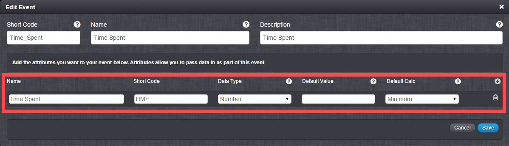
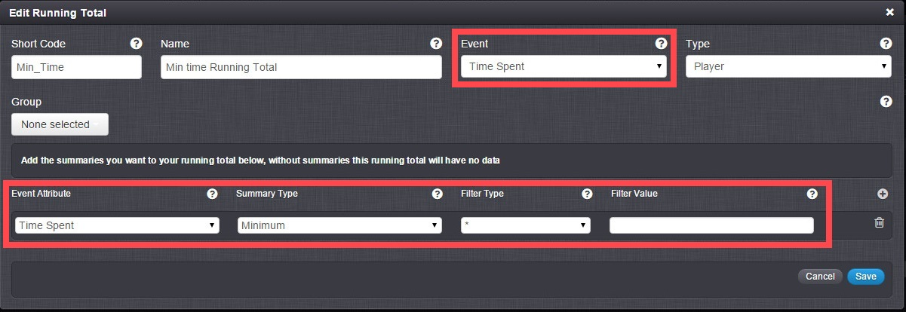
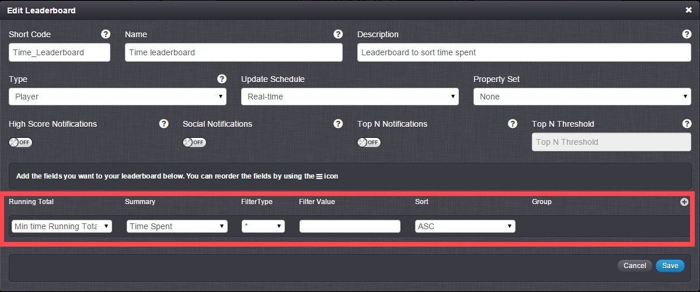
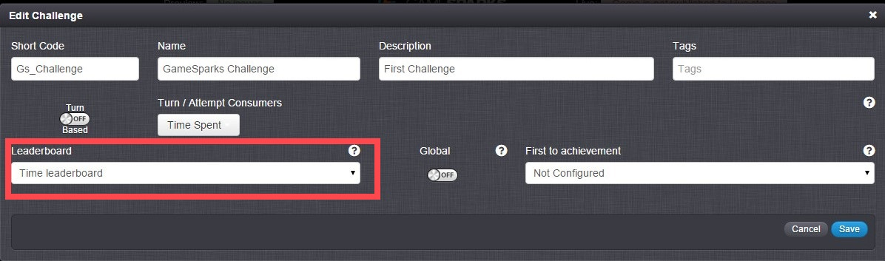

# Score Based Challenges

## Introduction

One of the most basic ways to win the challenge is to score the highest, or the lowest depending on what your score represents. In this tutorial, we will show examples of how to set up a challenge which:
* Ranks players on highest score.
* Ranks players on lowest score.  

## The Setup

### Event

1. Create an event.
2. In that event create an attribute of data type Number.  If you want the challenge to be won for:

  * Highest Score: Set the attribute's *Default Calc* to Maximum.
  * Lowest Score: Set the attribute's *Default Calc* to Minimum.

 

### Running Total (For Lowest score ONLY)

1. Create a running total.
2. Link the running total to the event that you created for the challenge using the event drop down list.
3. Add a new attribute and from the drop down list select the attribute you created for the event.
4. From the summary type drop down menu select Minimum.

 

### Leaderboard

Create a leaderboard for your challenge.  If you want the challenge to be won for:

  * Highest Score: Don't do anything else to the leaderboard.
  * Lowest Score: Add a new running total. From the drop down list. Change the sorting to ASC.

 

### The Challenge

Select your leaderboard from the leaderboard drop down list.  Optionally you can:

  * Make the challenge turn-based by switching the *Turn Based* button on and assigning a *Turn/Attempt Consumers* event. (When this event is called using challenge event log it will consume a turn for the player which called it.)
  * Make the challenge achievement-based by choosing an achievement from the *First to achievement* drop down list.

