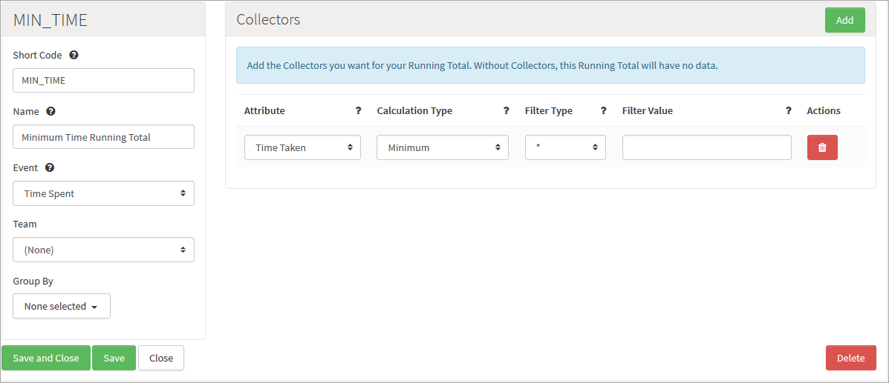

# Score Based Challenges

## Introduction

One of the most basic ways to win a Challenge is to score the highest, or the lowest depending on what your score represents. In this tutorial, we will show examples of how to set up a Challenge which:
* Ranks players on highest score.
* Ranks players on lowest score.  

## The Setup

### Creating an Event

First, we create an Event for the Challenge.

*1.* Navigate to *Configurator >Events*.

*2.* Click to *Add* a new Event and configure the Event as shown below:
* Add an Attribute with A *Data Type* of *Number*.
* If you want the Challenge we're going to use this Event for to be won for highest score, set the *Default Aggregation Type* to Maximum.
* If you want the Challenge we're going to use this Event for to be won for lowest score, set the *Default Aggregation Type* to Minimum.

*3.* Click to *Save and Close* the new Event.
 

### Creating a Running Total (For Lowest score ONLY)

In this next stage, we're going to create a Running Total for lowest score.

*4.* Navigate to *Configurator > Leaderboards*. The page opens with the *Leaderboards* tab selected.

*5.* Select the *Running Totals* tab, click to *Add* a new Running Total, and configure this as shown below:
* Use the *Event* drop-down to link the Running Total to the *Time Spent* Event that we created earlier for the Challenge.
* Under *Collectors* add a new Attribute:
  * Use the drop-down to select the attribute we added to the *Time Spent* Event.
  * Set the *Calculation Type* to *Minimum*.

 
*6.* Click to *Save and Close* the new Running Total.

### Creating a Leaderboard

For this stage, we create a Leaderboard for your Challenge. 

*7.* Navigate to *Configurator > Leaderboards* and click to *Add* a new Leaderboard.

*8.* Configure the Leaderboard as shown below.

*9.* If you want the Challenge to be won for:
* Highest Score: Don't do anything else to the Leaderboard.
* Lowest Score: Under *Fields* add a new Running Total and use the *Sort* drop-down to change the sorting to *ASC*.

 
*10.* Click to *Save and Close* the new Leaderboard.

### Creating the Challenge

The last stage of our setting up is to create the Challenge.

*11.* Navigate to *Configurator > Multiplayer*. The page opens with the *Challenges* tab selected.

*12.* Click to *Add* a new Challenge and configure it as shown below:
* Select your *Time Leaderboard* using the Leaderboard drop-down.
* Optionally you can:
  * Make the Challenge turn-based by switching the *Turn Based* button on and assigning a *Turn/Attempt Consumers* Event. (When this Event is called using Challenge event log, it will consume a turn for the player which called it.)
  * Make the Challenge Achievement-based by choosing an Achievement from the *First To Achievement* drop-down.

*13.* Click to *Save and Close* the new Challenge.
