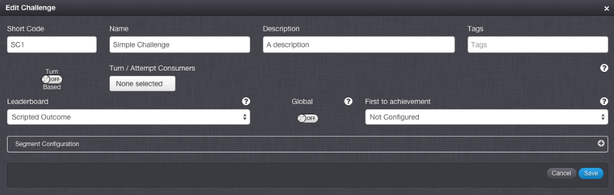

# Challenge Eligibility

## Introduction

In this tutorial, we'll look at setting up matchmaking based on a player's segments. To do this, we'll use segmentation to group players together and we'll use eligibility criteria to filter challenges for those players. We'll also see how we can override a current player's settings to allow the client to determine what available challenges to show at any time, and allow the player to join them. To start with, let's set up a simple challenge. We can then look at how to match players up.

1. Navigate to *Configurator > Challenges*.

2. Add a new Challenge.

3. Give it a *Short Code* of *SC1*.

4. Give it a name. Let's just call it *Simple Challenge*:

 

That's all we need for the purposes of this tutorial, so let's head over to the Test Harness and get our players set up.

## Using a Player's Segments

We're going to segment our players based on *level*, with the aim of matching players who are the same level as each other to play against. Let's register our first two players, setting their level to "Newbie".

```
[{
"@class": ".RegistrationRequest",
"displayName": "challengePlayer1",
"password": "password",
"segments": {
"level": "Newbie"
},
"userName": "challengePlayer1"
},{
"@class": ".RegistrationRequest",
"displayName": "challengePlayer2",
"password": "password",
"segments": {
"level": "Newbie"
},
"userName": "challengePlayer2"
}]
```

Leave yourself authenticated as *challengePlayer2* and let's create the Challenge instance. Since *challengePlayer2* and *challengePlayer1* don't yet know each other, we want to create a PUBLIC challenge and, importantly, we'll specify our eligibility criteria:

```
{
"@class": ".CreateChallengeRequest",
"accessType": "PUBLIC",
"challengeShortCode": "SC1",
"eligibilityCriteria": {
"segments": {
"level": "Newbie"
}
},
"endTime": "2015-03-25T12:00Z"
}
```

What this means is that to be eligible to find or join this challenge you must have a segment called *level*, with the value *Newbie*. The eligibility criteria can be more complex than this and we'll go into some more detail on this later.

Now we have our Challenge instance, let's authenticate as *challengePlayer1* and find it.

Make a [FindChallengeRequest](/API Documentation/Request API/Multiplayer/FindChallengeRequest.md) specifying an *accessType* of *PUBLIC* and our Challenge Short Code of *SC1*:
```
{
"@class": ".FindChallengeRequest",
"accessType": "PUBLIC",
"shortCode": "SC1"
}
```
And you should see the Challenge instance we just created:

```
{
"@class": ".FindChallengeResponse",
"challengeInstances": [
{
"challengeId": "5510136de4b08269846ec481",
"state": "ISSUED",
"scriptData": {},
"shortCode": "SC1",
"accepted": [
{
"name": "challengePlayer2",
"id": "55100e8ce4b0a0e0ea03291b"
}
],
"startDate": null,
"challenger": {
"name": "challengePlayer2",
"id": "55100e8ce4b0a0e0ea03291b"
},
"expiryDate": null,
"turnCount": {
"55100e8ce4b0a0e0ea03291b": 0
},
"endDate": "2015-03-25T12:00Z",
"challengeName": "Simple Challenge"
}
],
"scriptData": null
}
```

Now we can send a [JoinChallengeRequest](/API Documentation/Request API/Multiplayer/JoinChallengeRequest.md) with this *challengeInstanceId*:
```
{
"@class": ".JoinChallengeRequest",
"challengeInstanceId": "5510136de4b08269846ec481"
}
```
And we've just matched *challengePlayer1* and *challengePlayer2* based on their level. It really is that simple!

Let's add a new player, *challengePlayer3*. This player is a bit more experienced than our first two players, so their level is *Advanced*.

```
{
"@class": ".RegistrationRequest",
"displayName": "challengePlayer3",
"password": "password",
"segments": {
"level": "Advanced"
},
"userName": "challengePlayer3"
}
```

Create a Challenge with *challengePlayer3* as we did above, but this time set the level to be *Advanced*:

```
{
"@class": ".CreateChallengeRequest",
"accessType": "PUBLIC",
"challengeShortCode": "SC1",
"eligibilityCriteria": {
"segments": {
"level": "Advanced"
}
},
"endTime": "2015-03-25T12:00Z"
}
```

 Now authenticate as *challengePlayer1* and let's see if we can find this Challenge to join.

```
{
"@class": ".FindChallengeRequest",
"accessType": "PUBLIC",
"shortCode": "SC1"
}
```

 We can see that the *Advanced* Challenge created by *challengePlayer3* doesn't show up here. However, we can register another *Advanced* player:

```
{
"@class": ".RegistrationRequest",
"displayName": "challengePlayer4",
"password": "password",
"segments": {
"level": "Advanced"
},
"userName": "challengePlayer4"
}
```

 And now do a [FindChallengeRequest](/API Documentation/Request API/Multiplayer/FindChallengeRequest.md):

```
{
"@class": ".FindChallengeRequest",
"accessType": "PUBLIC",
"shortCode": "SC1"
}
```
```
{
"@class": ".FindChallengeResponse",
"challengeInstances": [
{
"challengeId": "55102540e4b08269846f0952",
"state": "ISSUED",
"scriptData": {},
"shortCode": "SC1",
"accepted": [
{
"name": "challengePlayer3",
"id": "551010d7e4b08269846eb7b4"
}
],
"startDate": null,
"challenger": {
"name": "challengePlayer3",
"id": "551010d7e4b08269846eb7b4"
},
"expiryDate": null,
"turnCount": {
"551010d7e4b08269846eb7b4": 0
},
"endDate": "2015-03-25T12:00Z",
"challengeName": "Simple Challenge"
}
],
"scriptData": null
}
```

 Not only do they see the *Advanced* Challenge, but they don't see the *Newbie* Challenge.

## Overriding Eligibility in the Client

We've seen that we can use segments to categorize players, and match players based on this. What if we'd rather it was just the Challenges that are categorized to make them more readily searchable, but any player could join them? No problem, we can do this as well.

Let's go back to using *challengePlayer1* and *challengePlayer2*. We're not going to be using *level* any more, so it doesn't actually matter which players we use for this.

Authenticate as *challengePlayer2* and let's create another Challenge. This time specify some other segment name, let's call it "category" - this is an arbitrary choice, it could be anything:

```
  {
"@class": ".CreateChallengeRequest",
"accessType": "PUBLIC",
"challengeShortCode": "SC1",
"eligibilityCriteria": {
"segments": {
"category": "friendly"
}
},
"endTime": "2015-03-25T12:00Z"
}
```

Now authenticate as *challengePlayer1* and let's try and find that Challenge:

```
{
"@class": ".FindChallengeRequest",
"accessType": "PUBLIC",
"shortCode": "SC1"
}
```

You can see the Challenge we have just created doesn't show up. Let's modify that request slightly. Since we're using eligibility criteria to categorize Challenges rather than to group players, the client is going to own what the eligibility for the request is:

```
{
"@class": ".FindChallengeRequest",
"accessType": "PUBLIC",
"shortCode": "SC1",
"eligibility" : {
"segments" : {
"category" : "friendly"
}
}
}

```
 Here you can see we're specifying the eligibility for this request, which means the platform will use that value rather than taking the segments from the player. Now we can indeed see the Challenge we created. As before, we will not be able to join this Challenge unless we're eligible, and the same mechanism applies:

```
{
"@class": ".JoinChallengeRequest",
"challengeInstanceId": "55102a77e4b08269846f1d2a",
"eligibility" : {
"segments" : {
"category" : "friendly"
}
}
}
```

We're telling the server what the eligibility should be, without it the player's segments would again be used.

## Advanced Eligibility Criteria

The eligibility criteria specified in the [CreateChallengeRequest](/API Documentation/Request API/Multiplayer/CreateChallengeRequest.md) can be more complex than a simple name and value of a segment. We currently support specifying multiple segments, and for each a list of values. So we could do something like this:

```
{
"@class": ".CreateChallengeRequest",
"accessType": "PUBLIC",
"challengeShortCode": "SC1",
"eligibilityCriteria": {
"segments": {
"level": ["Newbie", "Advanced"],
"country" : "UK"
}
},
"endTime": "2015-03-25T12:00Z"
}
```

When multiple segments are specified a player must match **ALL** of them. In the above example, our player would need to have both *level* AND *country* segments. When multiple segment values are specified, a player must match **ONE** of them (a player can only have one value for a segment, after all). So we could join the above Challenge with the player:

```
{
"segments" : {
"level" : "Advanced",
"country" : "UK"
}
}
```

or player:

```
{
"segments" : {
"level" : "Newbie",
"country" : "UK"
}
}
```

but not:

```
{
"segments" : {
"level" : "Newbie",
"country" : "US"
}
}
```

or:

```
{
"segments" : {
"level" : "Newbie"
}
}
```
