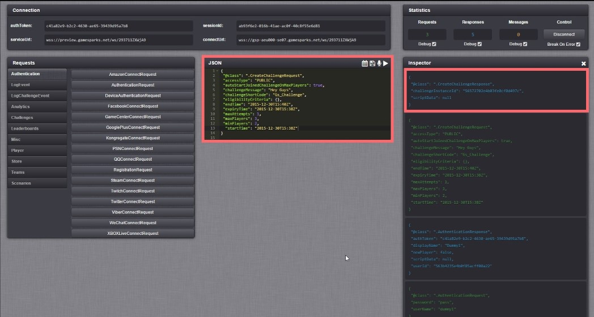
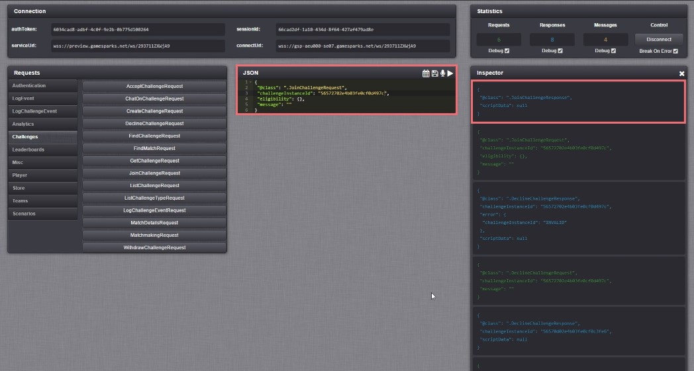
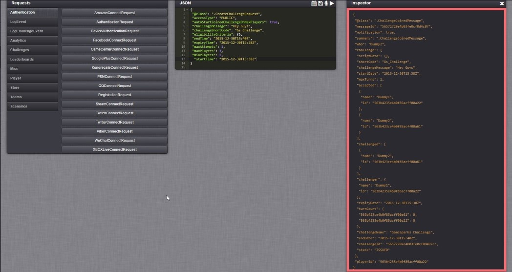
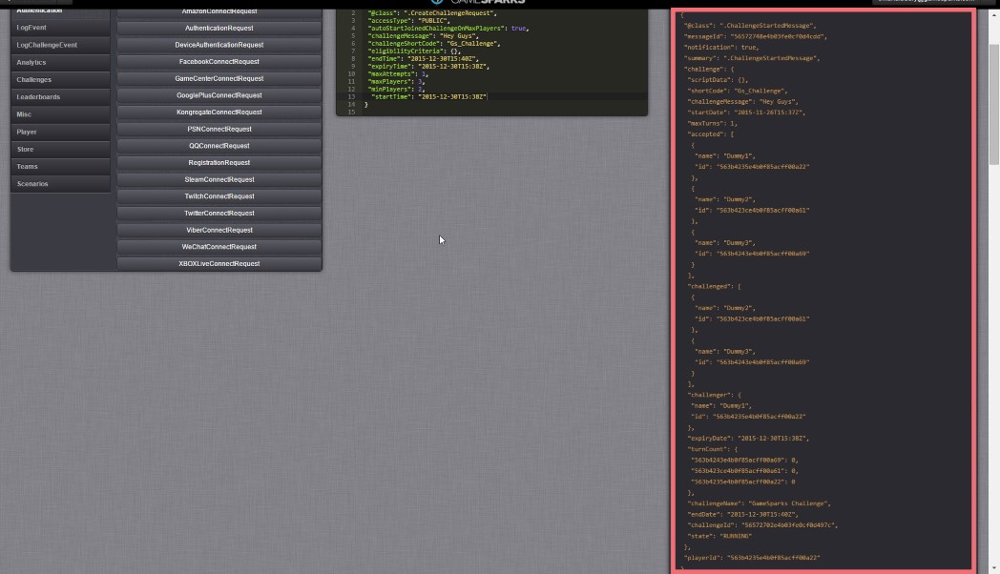

# Understanding Challenges

## Introduction

Once a Challenge has been created, it needs to be tested to ensure it behaves the intended way. This tutorial will explain the best practices to follow so that a Challenge and the associated Players can be verified before it is integrated into the SDK.

## Understanding Challenges

Before testing a Challenge, there are certain aspects to be learned, which will help to construct more effective Challenges to meet the needs of the application.

### Challenge States

The challenge states are as follows:

  * *WAITING* : The challenge has passed the expiry time with the right conditions to start but the start time hasn't been met.
  * *RUNNING* : The challenge is active.
  * *ISSUED* : The challenge has been issued by the challenger and is now waiting for the start condition to be met or expiry time to be met to transition to "WAITING" or go straight into "RUNNING".
  * *EXPIRED:* Expiry time has been met before start conditions could be met.
  * *COMPLETE* : The challenge has completed.
  * *RECEIVED* : The challenge has been issued to the current player and is waiting to be accepted. (Private challenge)
  * *DECLINED* : The challenge has been issued by the current player and has been declined. (Private challenge)

Challenge transition from "*ISSUED*" state to "*RUNNING*" state:

  * Declaring a start time won't start the challenge if min players are met - you need to manually run it through cloud code using getChallenge(ChallengeID).startChallenge().
  * Not declaring a start time will start the game if the minimum amount of players are met, if minimum players is not declared, challenge will start when at least one player joins the challenger.
  * If "autoStartJoinedChallengeOnMaxPlayers" = true then challenge will start when maxPlayers value is met (If start time is declared, if not then the game will start when minimum players is met).

Challenge transition from "*ISSUED*" state to "*EXPIRED*" state:

  * When challenge conditions are not met before the expiry time is met.
  * If challenge has a start time and "autoStartJoinedChallengeOnMaxPlayers" = false and the challenger doesn't start the challenge manually before the expiry time is met.
  * if challenge has a start time and "autoStartJoinedChallengeOnMaxPlayers" = true and max players condition is not met before the expiry time is met.

Challenge transition from "*ISSUED*" to "*WAITING*":

  * Start conditions and expiry time have been met but the start time is yet to be met.

Challenge transition from "*WAITING*" to "*RUNNING*":

  * When start time is met.

Challenge transition from "*RUNNING*" to "*COMPLETE*":

  * When all players participating in the challenge have spent their turn counts.
  * When the end time is met.
  * When a player wins or challenge is drawn manually through cloud code.
  * When a player is first to earn an achievement (If challenge is configured to end on earning an achievement).
 

### Manipulating your challenge through Cloud code

By using cloud code through challenge event logs you can pass in the challenge ID and access methods that affect that challenge by using Spark.getChallenge(ChallengeID). Here's a list of some of the most useful things you  can do:

  * You kick or remove players from a challenge using .removePlayer(PlayerID).
  * You can bring a challenge to an end by drawing all players manually using .drawChallenge().
  * You can manually choose a winner for the challenge aswell as end it using .winChallenge(playerID).
  * You can manually change the state of the challenge from "ISSUED" or "WAITING" to "RUNNING" using .startChallenge().
  * You can access information about the players in the challenge using getChallengedPlayers() and getAcceptedPlayers().
  * You can save, track, use and remove persistent data saved on a challenge to do your own custom logic to determine who wins, who loses and what sequences of logic is followed by your challenge using scriptData. You can manipulate scriptData using getscriptData(), setscriptData() and removescriptData() methods.
 

## Testing your Challenge

To simulate multiple player interactions with a challenge we recommend that you open a number of tabs on your browser and use the test harness to simulate interaction from clients. For this test, open three tabs on your browser and authenticate a player on every tab.

First authenticated player will create a challenge. For this example, we'll make it a public challenge which will start when the maximum amount of players is met.

Second authenticated player joins the challenge using challenge ID.

When you switch to the first authenticated player's tab you can see a message (In orange, these messages can be caught by listeners) indicating that a player has joined the challenge. The challenge state will remain "ISSUED" until the max amount of players join the challenge.

Finally after the third authenticated player join the challenge through the third tab the other two players will receive a message (In orange) indicating that a player has joined the challenge and the state of the challenge would change to "RUNNING" because the maximum amount of players has been achieved.

 

## Challenge Chat

You can use the challenge ID to reference a challenge and send a message to everyone involved. The message contains a string determined by the player and the rest is information about who sent the message and the challenge details. Simply calling the request and supplying it with a message string will take care of distributing it to the rest of the players involved. Use challenge message listeners to intercept these messages and extract the message string and who the message is from. You can then display the messages to players in-game.
