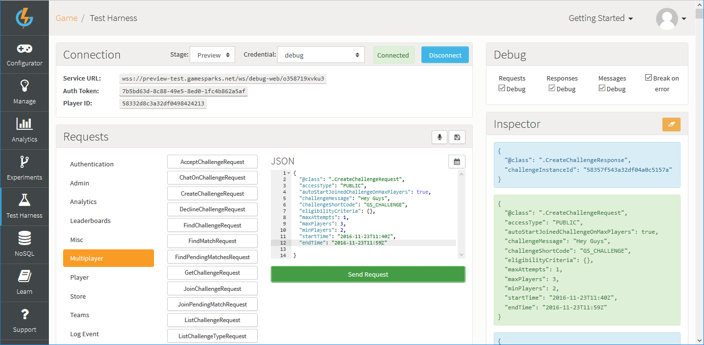
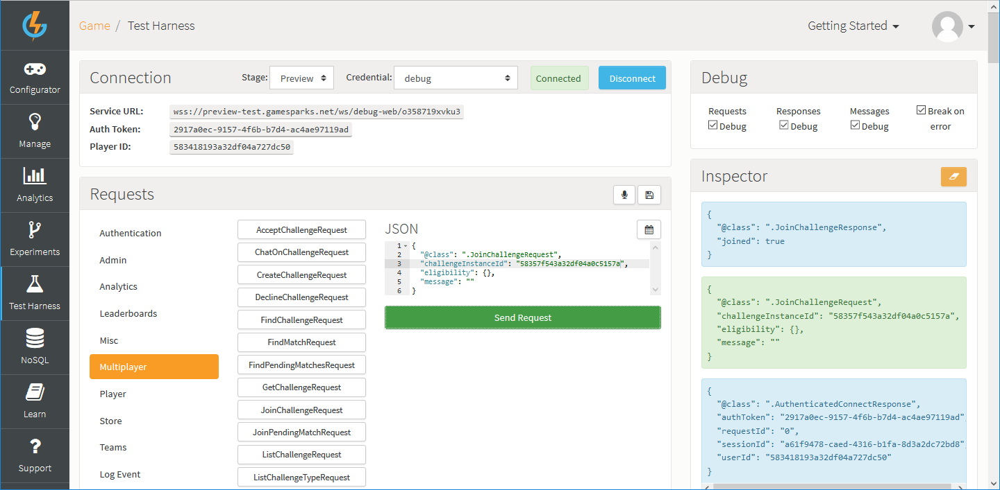
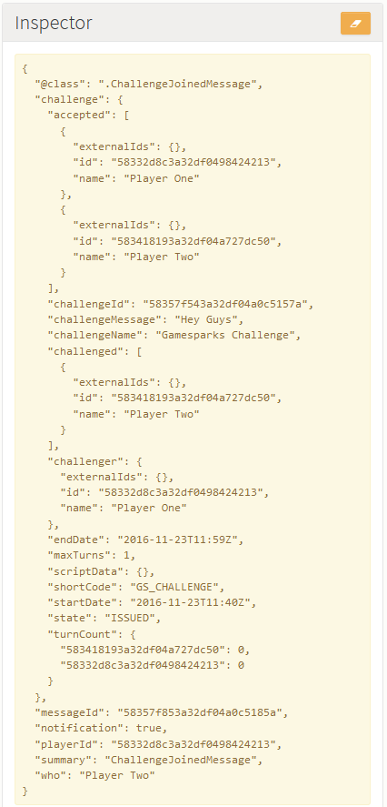
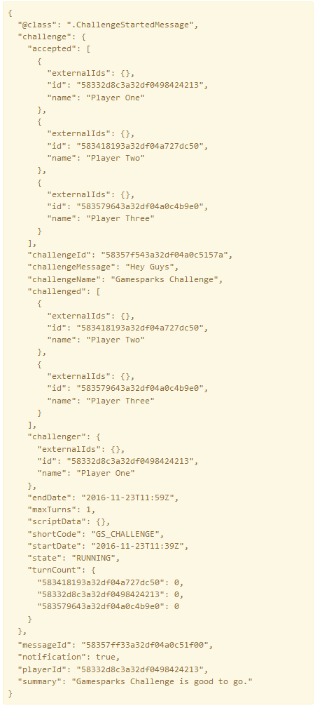

# Understanding Challenges

## Introduction

Once a Challenge has been created, it needs to be tested to ensure it behaves the intended way. This tutorial will explain the best practices to follow so that a Challenge and the associated Players can be verified before it is integrated into the SDK.

## Understanding Challenges

Before testing a Challenge, we need to fully understand all aspects of Challenges. This will help us to construct more effective Challenges to meet the needs of the application.

### Challenge States

The Challenge states are as follows:

  * *WAITING* : The Challenge has met the right conditions to start and is still within the expiry time but the start time hasn't been reached.
  * *RUNNING* : The Challenge is active.
  * *ISSUED* : The Challenge has been issued by the challenger and is now waiting for the start condition to be met or expiry time to be met to transition to *WAITING* or go straight into *RUNNING*.
  * *EXPIRED:* Expiry time has been met before start conditions could be met.
  * *COMPLETE* : The Challenge has completed.
  * *RECEIVED* : The Challenge has been issued to the current player and is waiting to be accepted. (Private Challenge)
  * *DECLINED* : The Challenge has been issued by the current player and has been declined. (Private Challenge)

### Challenge Transitions

Challenge transition from *ISSUED* state to *RUNNING* state:

  * Declaring a start time means the Challenge won't start if minimum players are met - you need to manually run it through Cloud Code using *getChallenge(ChallengeID).startChallenge()*
  * Not declaring a start time means the Challenge will start if the minimum number of players are met. If minimum players is not declared, the Challenge will start when at least one player joins the Challenge.
  * If *autoStartJoinedChallengeOnMaxPlayers = true*, then the Challenge will start when *maxPlayers* value is met (If start time is declared. If start time is not met, then the game will start when minimum players is met).

Challenge transition from *ISSUED* state to *EXPIRED* state:

  * When Challenge conditions are not met before the expiry time is met.
  * If Challenge has a start time and *autoStartJoinedChallengeOnMaxPlayers = false* and the challenger doesn't start the Challenge manually before the expiry time is met.
  * If Challenge has a start time and *autoStartJoinedChallengeOnMaxPlayers = true* and max players condition is not met before the expiry time is met.

Challenge transition from *ISSUED* to *WAITING*:

  * Start conditions have been met, the expiry time has not been reached yet, but the start time has not yet been reached.

Challenge transition from *WAITING* to *RUNNING*:

  * When start time is met.

Challenge transition from *RUNNING* to *COMPLETE*:

  * When all players participating in the Challenge have spent their turn counts.
  * When the end time is met.
  * When a player wins or the Challenge is drawn manually through Cloud Code.
  * If the Challenge is configured to end on earning an Achievement, when a player is first to earn that Achievement.
 

### Manipulating your Challenge through Cloud Code

By using Cloud Code through Challenge event logs, you can pass in the Challenge ID and access methods that affect that Challenge by using *Spark.getChallenge(ChallengeID)*. Here's a list of some of the most useful things you  can do:

  * You kick or remove players from a Challenge using *.removePlayer(PlayerID)*.
  * You can bring a Challenge to an end by drawing all players manually using *.drawChallenge()*.
  * You can manually choose a winner for the Challenge as well as end it using *.winChallenge(playerID)*.
  * You can manually change the state of the Challenge from *ISSUED* or *WAITING* to *RUNNING* using *.startChallenge()*.
  * You can access information about the players in the Challenge using *getChallengedPlayers()* and *getAcceptedPlayers()*.
  * You can save, track, use, and remove persistent data saved on a Challenge to do your own custom logic to determine who wins, who loses, and what sequences of logic is followed by your Challenge using *scriptData*. You can manipulate *scriptData* using the *getscriptData()*, *setscriptData()* and *removescriptData()* methods.
 

## Testing your Challenge

To simulate multiple player interactions with a Challenge, we recommend that you open a number of tabs on your browser and use the [Test Harness](/Documentation/Test Harness/README.md) to simulate interaction from clients. For this test, open three tabs on your browser and authenticate a player on every tab.

*1.* Use you first authenticated player to submit a [CreateChallengeRequest](/API Documentation/Request API/Multiplayer/CreateChallengeRequest.md). For this example, we'll make it a public Challenge, which will start when the maximum numbers of players is met:

The first player receives a *CreateChallengeResponse* containing a *challengeInstanceId*.

*2.* Use your second authenticated player to submit a [JoinChallengeRequest](/API Documentation/Request API/Multiplayer/JoinChallengeRequest.md) using this *challengeInstanceID*:

*3.* Switch back to the first authenticated player's tab. You'll see a message in yellow in the Test Harness *Inspector* - these messages can be caught by listeners - indicating that a player has joined the Challenge. The Challenge state will remain at *ISSUED* until the maximum number of players join the Challenge:

*4.* Finally, use your third authenticated player to submit a *JoinChallengeRequest*. After the third authenticated player joins the Challenge through the third tab, the other two players will receive a message - in yellow in the *Inspector* - indicating that another player has joined the Challenge and the state of the Challenge would change to *RUNNING* because the maximum amount of players has been achieved.

 

## Challenge Chat

You can use the *challengeInstanceId* to reference a Challenge and send a message to everyone involved. The message contains a string determined by the player and the rest is information about who sent the message and the Challenge details. Simply calling the request and supplying it with a message string will take care of distributing it to the rest of the players involved. Use Challenge message listeners to intercept these messages and extract the message string and who the message is from. You can then display the messages to players in-game.
