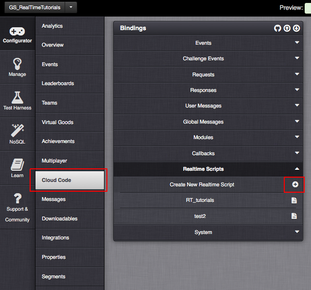
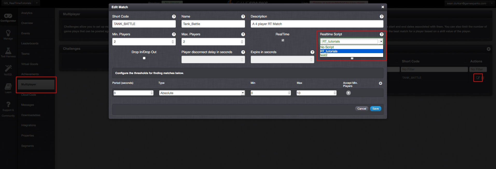
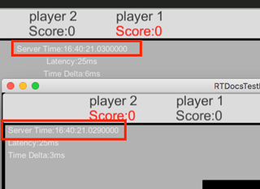
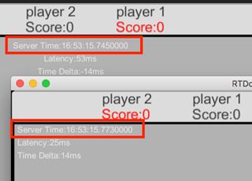
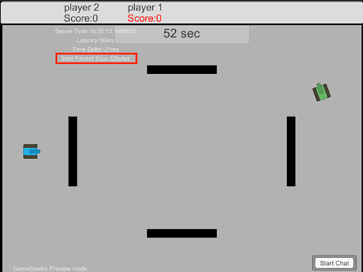
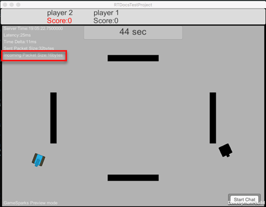

# Clock Synchronization and Network programming


## Introduction

In this tutorial, we're going to explore some further concepts in multiplayer network programming, such as clock synchronization and packet analytics.

Parts of this tutorial follow on from the previous tutorials for making a tank-game in Unity3D. However, this tutorial is not specific to Unity3D but covers general key concepts inherent in network programming. You do not need the previous tutorials to understand some of these concepts, even though we'll be referring to the previous tutorials in some examples given here.

<q>**Note:** In this tutorial we'll be going between C# scripts for Unity3D and JavaScript for our RT-scripts in the GameSparks portal.</q>

## Creating a Real-Time Script

The first thing we need to do is create a new real-time script and add it to our match. Real-time scripts operate in a similar way to Cloud Code scripts.

<q>**More on RT Scripts?** For more details on creating and using Real-Time scripts, see this [RT Scripts](/Tutorials/Real-Time Services/Creating and Using Real-Time Scripts.md) tutorial.</q>

To create a new RT-script:

*1.* Go to *Configurator > Cloud Code* in your portal and select the *Realtime Scripts* drop-down.

*2.* Then Click the plus  icon in order to create a new script:



When you have created your script, we need to add it to our match.

*3.* Click on *Configurator > Multiplayer* in your portal and find your match. The match we used in the previous lesson was called ‘TANK_BATTLE’.

*4.* When you have selected that match, you need to select the RT script from the *Realtime Script* dropdown:



When your match has an associated script, you are ready to go! Anytime a new match starts, this script will execute.


## Checking All Players Have Joined

In this example, we'll use the RT-script for our *TANK_BATTLE* match to check when all players have joined.

We do this by creating an *OnPlayerConnect()* callback in the RT-script. This callback will simply check an array of players that have joined, and add any new players if they are not in the array. When the list of joined players has reached the max (or min) number of players for that match, it will send an empty packet back to all players:

```

var playersJoined = []; // this is only used at the start to make sure each player is connected

RTSession.onPlayerConnect(function(player){
    // first we check to see if the player has already joined the match
    if(!contains(player.getPeerId(), playersJoined)){
        playersJoined.push(player.getPeerId()); // and add them if not
    }
// next we check to see the max (or min) number of players has joined that match
    if(playersJoined.length === 4){
        RTSession.newPacket().setOpCode(100).setTargetPeers().send(); // send an empty pack back to all players

    }
});

function contains(a, obj) { // this is a simple method that just checks if an element is in an array or not
    for (var i = 0; i < a.length; i++) {
        if (a[i] === obj) {
            return true;
        }
    }
    return false;
}

```


### Getting the Match Details

In the above example, we're setting the number of players we expect to join manually. However, it may be more useful in some cases to use the match details to find out how many players we actually have in the match, especially if the max and min players of the match are different.

In this case, we can create a new request to get the match-details and from this we can get the number of players in the match.

To get the match details we can use the *RTSession.getSessionId()* method to get the session-id/match-id:

```

var playersJoined = []; // this is only used at the start to make sure each player is connected
var totalPlayers = 0;

RTSession.onPlayerConnect(function(player){

    if(totalPlayers === 0){

        RTSession.newRequest().createMatchDetailsRequest()
            .setMatchId(RTSession.getSessionId())
            .setPlayerId(player.getPlayerId())
            .setRealtimeEnabled(true)
            .send(function(response){
                totalPlayers = response.opponents.length + 1; // we add one to this because the opponents list doesn't include us
            });
    }

    // first we check to see if the player has already joined the match
    if(!contains(player.getPeerId(), playersJoined)){
        playersJoined.push(player.getPeerId()); // and add them if not
    }
    // next we check to see the max (or min) number of players has joined that match
    if(playersJoined.length === totalPlayers){
        RTSession.newPacket().setOpCode(100).setTargetPeers().send(); // send an empty pack back to all players

    }
});


```


Now back in our Unity3d *GameSparksManager.cs* class we need to make two changes:

*1.*	Remove the line which loads the level in the *OnRTReady()* method.

```

private void OnRTReady(bool _isReady){
        if (_isReady) {
            Debug.Log ("GSM| RT Session Connected...");
        }
    }


```


*2.*	Add a new case to the switch-case statement in the *OnPacketRecieved()* method which is going to load the level when the op-code marked ‘100’ is received from the server.

```

case 100:
            Debug.Log ("GSM| Loading Level...");
            SceneManager.LoadScene ("GameScene");
            break;


```

You should now be able to test out this new configuration, which will only start the level when all players have been connected.

## What Is Clock Synchronization?

In most multiplayer networked games it's important that both the client's and server's clocks are synchronized. This is important because any time-based interpolation (like updating the enemy tank’s position in the previous tutorial) will require the client and server to agree on what time it is and therefore at what position your interpolated object should be.

### Game Example

Drawing from the work done for the tank game in the previous tutorials:
* We'll use clock synchronization to implement a count-down timer for our game and which will be synced between all players.
* The game will start and end at the same time for all players.

### Getting Server Data

As described in the section above, syncing our clock requires the following steps:
1.	We send a packet with our client’s local timestamp to the server.
2.	The server takes this timestamp and adds new data with their own local time to a packet, and sends this back to the original sender.
3.	The client receives this packet and compares their original sent time to their current time to get the round-trip time.
4.	Half the round-trip calculates the latency.
5.	Subtract the server-time from the client’s local time to get the difference between server’s time and client’s time (that is: *serverDelta*).
6.	We can then use the *serverDelta* plus the latency to find and adjust any time coming from the server to what it is when we received it, therefore syncing all clients to the same time.


<q>**Notes:** There is one issue not dealt with in this tutorial and which should be noted. Internet speeds do vary, and with someone using mobile-internet, their bandwidth could vary widely if, for example, they are traveling on a train. Therefore, it is advised that these metrics disregard packets, which have latency above a certain threshold. When latency is too high for one player, it lowers the experience for all other players. To avoid this, the latency is checked across several packets and averaged. Any packets higher than the median latency are automatically disregarded. And when average latency gets too high, the player should be disconnected.</q>

### Step 1 - Send a Packet with the Client's Local Time

The code here is pretty straightforward. We just construct a Unix timestamp and send it as *RTData* with our packet. The packet should only be sent to the server, so we set its *targetPlayers* to peerId ‘0’. This will make sure it reaches the server and no one else.

#### Clock Synch Drift

Even though the clients are running the same code, slight changes between server and client, as well as tiny differences in calculations can lead to the clock gradually drifting out of sync, even if the clock was in perfect sync to start with.

To avoid this, we usually repeat the synchronization procedure every few seconds. You do not want to sync frequently in your game, because it causes unnecessary bottlenecks. Syncing every 1-5 second is standard for an action game, and even longer syncs for turn-based or strategy games.

```

/// <summary>
    /// Sends a Unix timestamp in milliseconds to the server
    /// </summary>
    private IEnumerator SendTimeStamp(){

        // send a packet with our current time first //
        using (RTData data = RTData.Get ()) {
            data.SetLong (1, (long)(DateTime.UtcNow - new DateTime(1970, 1, 1, 0, 0, 0)).TotalMilliseconds); // get the current time as unix timestamp
            GameSparksManager.Instance ().GetRTSession ().SendData (101, GameSparks.RT.GameSparksRT.DeliveryIntent.UNRELIABLE, data, new int[]{ 0 }); // send to peerId -> 0, which is the server
        }
        yield return new WaitForSeconds (5f); // wait 5 seconds
        StartCoroutine (SendTimeStamp ()); // send the timestamp again
    }


```

We then call this Coroutine at the bottom of the *GameController.cs* Start() Method:

```

StartCoroutine (SendTimeStamp ());


```

### Step 2 – Server Response with Server Time

*This next step involves RT-script code.*

We'll setup a packet intercept callback in our RT-script, which will take the timestamp the client has sent, add it to a new packet along with the server’s local time, and send the packet back to the sender.

```

// packet 101 is a timestamp from the client for clock-syncing
RTSession.onPacket(101, function(packet){
    var rtData = RTSession.newData().setNumber(1, packet.getData().getNumber(1)) // return the timestamp the server just got
                                    .setNumber(2, new Date().getTime()) // return the current time on the server
    // players.push(packet.getSender().getPeerId());
    RTSession.newPacket().setData(rtData).setOpCode(101).setTargetPeers(packet.getSender().getPeerId()).send(); // send the packet back to the peer that sent it
    // we've also set this packet to be op-code 101.
    // we used 101 to send the packet, but we only ever send the packet from client-to-server
    // which means we can re-use the op-code to receive packets with the same op-code
});


```

### Step 3 to 6 – Receiving the Clock Sync Packet

First we'll create a new method in the *GameController.cs* class called ‘CalculateTimeDelta’ which will take an *RTPacket* type. Then we'll create a new case in the *OnPacketReceived()* method of our *GameStateManager.cs* class, which will call this method whenever a 101 packet comes in:

```

// REGISTER NETWORK INFO //
        case 100:
            Debug.Log ("GSM| Loading Level...");
            SceneManager.LoadScene ("GameScene");
            break;
        case 101:
            GameController.Instance ().SyncClock (_packet);
            break;

```

We're going to need two variables right now, so we can keep track of the round-trip, latency, and time-delta. Really, we only need to cache the time-delta to be used when syncing the clock, because this is the important result. However, many games show players their round-trip and latency times, so we'll keep them for display.

We'll also be using the latency and time-delta in the next section so we can use them to make our predictive movement more accurate and compensate for latency.

We've also added in another variable called ‘clock’, which we'll use later to make sure our clock is synced.

```

DateTime serverClock;
    private int timeDelta, latency, roundTrip;

    /// <summary>
    /// Calculates the time-difference between the client and server
    /// </summary>
    public void CalculateTimeDelta(RTPacket _packet){
        // calculate the time taken from the packet to be sent from the client and then for the server to return it //
        roundTrip = (int)((long)(DateTime.UtcNow - new DateTime(1970, 1, 1, 0, 0, 0)).TotalMilliseconds - _packet.Data.GetLong (1).Value);
        latency = roundTrip / 2; // the latency is half the round-trip time
        // calculate the server-delta from the server time minus the current time
        int serverDelta = (int)(_packet.Data.GetLong (2).Value - (long)(DateTime.UtcNow - new DateTime (1970, 1, 1, 0, 0, 0)).TotalMilliseconds);
        timeDelta = serverDelta + latency; // the time-delta is the server-delta plus the latency
    }


```

For this example, we've also added these variables to output to the screen using the *OnGUI()* method.

```

void OnGUI(){
        GUI.Label (new Rect(10, 50, 400, 30), "Server Time:"+serverClock.TimeOfDay);
        GUI.Label (new Rect(10, 70, 400, 30), "Latency:"+latency.ToString()+"ms");
        GUI.Label (new Rect(10, 90, 400, 30), "Time Delta:"+timeDelta.ToString()+"ms");
    }


```

### Sending the Clock Update

For the next example, we are just going to make sure that the clients are running the same clock as the server. In this example, we are going to send an update every second, because we'll use this later as a countdown timer. However, in normal clock syncing we might also be updating our clock locally and using the update from the server to re-align the clock for any discrepancies. This is why calculating the delta-time is so important.

<q>**Note:** We will be doing this in the RT-scripts.</q>

All we are going to do is set up an interval of 1000ms, which will send the current server time to all players.

We will start this interval in the *onPlayerConnect()* callback, so it begins only when all players have started:

```

RTSession.onPlayerConnect(function(player){
    // first we check to see if the player has already joined the match
    if(!contains(player.getPeerId(), playersJoined)){
        playersJoined.push(player.getPeerId()); // and add them if not
    }
    RTSession.getLogger().debug(playersJoined.length);
    // next we check to see the max (or min) number of players has joined that match
    if(playersJoined.length === 2){
        RTSession.newPacket().setOpCode(100).setTargetPeers().send(); // send an empty pack back to all players

        RTSession.setInterval(function(){ // send current server time to all players every 1second
            RTSession.getLogger().debug(new Date().getTime());
            RTSession.newPacket().setOpCode(102).setTargetPeers().setData( RTSession.newData().setNumber(1, new Date().getTime() )).send();
        }, 1000);
    }
});


```

## Synching Clock Time

The last thing we need to do to get our clock synced is to set up a method for when the server time is received.

We are using ‘102’ for the op-code, so in *GameSparksManager.cs OnPacketReceived()* we add another case for that op-code, along with another method called ‘SyncClock’ to our *GameController.cs* class.

```

// REGISTER NETWORK INFO //
        case 100:
            Debug.Log ("GSM| Loading Level...");
            SceneManager.LoadScene ("GameScene");
            break;
        case 101:
            GameController.Instance ().CalculateTimeDelta (_packet);
            break;
        case 102:
            GameController.Instance ().SyncClock (_packet);
            break;


```

We're then going to adjust the local time based on the server time we have just received and the time-delta we calculated. The result should be as close to the current time on the server as possible, negating slight changes in latency and time taken to process packets and calculate data.

```

/// <summary>
    /// Syncs the local clock to server-time
    /// </summary>
    /// <param name="_packet">Packet.</param>
    public void SyncClock(RTPacket _packet){
        DateTime dateNow = new DateTime(1970, 1, 1, 0, 0, 0, 0, System.DateTimeKind.Utc); // get the current time
        serverClock = dateNow.AddMilliseconds (_packet.Data.GetLong (1).Value + timeDelta).ToLocalTime (); // adjust current time to match clock from server
    }


```

If you run the game now, you'll notice that, as the time-delta is updated, the server-time clock gets pretty accurate between clients. Also notice that the longer the time between updates, the more the server-time drifts.

In our example, we update every 5-seconds, which will not cause much drift. But, if you play around with the update speed, you'll start to notice substantial drift after a minute or so of game-time.

### Drift with 5 Second Updates



The server-time in the window above is the Unity-editor running the game, and the window below is the client-application. Notice that the time-delta is much higher for the editor (that is, higher latency or slower speed) but the clock is only running 1ms behind the client-application which has a faster internet connection.

### Drift with 3 Minute Updates



Here, you can see that after 3 minutes without an update, the server clock has started to run fast on the client-application compared with the game running in the editor. The difference is only 28 milliseconds, but this all adds up over time.

## Game Over Countdown

So, let's tie this example into our previous gameplay tutorial. We're going to have the game end when the time reaches zero, and we'll use the server-clock to make sure that the countdown timer is in sync between all clients.

We won't do anything special here, just disconnect the player and send them back to the lobby.

First, we'll need a few more variables so we can display and check this countdown timer:
* We'll create a bool, which we will use to make sure the end time is recorded only once.
* We'll store the end time as a *DateTime* variable.
* Lastly, we need a *GUI* text variable so we can display the time left.

Calculating the time left is simple. In the *SyncClock()* method we'll set the end Time variable to be 60000ms (1 minute) plus our *timeDelta* to keep the countdown in sync.

```

/// <summary>
/// Syncs the local clock to server-time
/// </summary>
/// <param name="_packet">Packet.</param>
public void SyncClock(RTPacket _packet){
    DateTime dateNow = new DateTime(1970, 1, 1, 0, 0, 0, 0, System.DateTimeKind.Utc); // get the current time
    serverClock = dateNow.AddMilliseconds (_packet.Data.GetLong (1).Value + timeDelta).ToLocalTime (); // adjust current time to match clock from server

    if (!clockStarted) { // make sure that we only calculate the endtime once
        endTime = serverClock.AddMilliseconds (60000 + timeDelta); // endtime is 60seconds plus the time-offset
        clockStarted = true;
    }
    // set the timer each time a new update from the server comes in
    timeLeft_Txt.text = (endTime-serverClock).Seconds.ToString()+" sec";
    if((endTime-serverClock).TotalMilliseconds <= 0){ // if the time is out, return to the lobby
        Debug.Log ("GC| GAME OVER!");
        GameSparksManager.Instance ().GetRTSession ().Disconnect ();
    }
}


```

You might notice, if your timer is displaying seconds only, that one of the players could be off by one second. This is due to the seconds reading having been rounded off. However, the total-milliseconds should still be very closely in sync so both clients will disconnect at the same time (+/- a few milliseconds).

## Packet Analytics

In this section, we are going to look at some features built into the GameSparks’ Real-Time service, but which we have not touched upon yet.

When we send and receive packets it's important for developers to know the size of those packets. Then, if they wish to, they can record the average size and store those packets for analytics.

Here:
* We'll show you how you can get these data from packets and display them.
* *We won't* explore how to graph these analytics.

### Custom SendData Method

We're going create our own *SendData()* method so that each time we want to send some *RTData* we can track the size of the packet we sent.

We'll do this in the *GameController.cs* calls. And, once we create our method, it's a good idea to go through all the *SendData* methods we have done in the previous tutorials and replace them so we can get a reading for the packet-size we send throughout our game.


```

private int packetSize_sent;
/// <summary>
/// Sends RTData and records the packet size
/// </summary>
/// <param name="_opcode">Opcode.</param>
/// <param name="_intent">Intent.</param>
/// <param name="_data">Data.</param>
/// <param name="_targetPeers">Target peers.</param>
public void SendRTData(int _opcode, GameSparksRT.DeliveryIntent _intent,  RTData _data, int[] _targetPeers){
    packetSize_sent = GameSparksManager.Instance ().GetRTSession ().SendData (_opcode, _intent, _data, _targetPeers);
}
/// <summary>
/// Sends RTData to all players
/// </summary>
/// <param name="_opcode">Opcode.</param>
/// <param name="_intent">Intent.</param>
/// <param name="_data">Data.</param>
public void SendRTData(int _opcode, GameSparksRT.DeliveryIntent _intent,  RTData _data){
    packetSize_sent = GameSparksManager.Instance ().GetRTSession ().SendData (_opcode, _intent, _data);
}


```



### Received Packet Size

We can check the size of any packets that we receive from the server. In our game example, we would do this in our *GameSparksManager.cs* script’s *OnPacketReceived()* method. Here we can send the details from all packets to the game-controller so we can use it as you please.

In this example, we're just going to send the packet size from the incoming packet to the *GameController.cs* class so we can log the incoming packet size:

```


    private int packetSize_incoming;
    /// <summary>
    /// Records the incoming packet size
    /// </summary>
    /// <param name="_packetSize">Packet size.</param>
    public void PacketReceived(int _packetSize){
        packetSize_incoming = _packetSize;
    }


```


And in the *GameSparksManager.cs* class, we add this code to the top of the *OnPacketRecieved()* method:

```

if (GameController.Instance () != null) {
           GameController.Instance().PacketReceived(_packet.PacketSize);
       }


```



## Ping and Player Experience

"Ping" is a term often used in networked multiplayer games to describe what we have called latency in this tutorial.

Ping represents the time it takes for a packet to get from the client to the server and back from the server to the client: the time taken for the round-trip. Internet speed and geo-location are the biggest contributors to high-ping, For instance, if you are in India trying to play a game hosted by a server in the US, the server is physically farther away and therefore it takes longer for your packet to get there and back.

But there are other factors that contribute to ping (though they usually are much-less likely to contribute substantially), such as firewalls and the time it takes to process the packet on the server and client.

As discussed in the previous section on clock syncing, it's sometimes a good idea to ignore packets that have high latency if the average is pretty good. However, the convention in network programming is to set an upper limit for latency. If any player hits that upper limit for a certain amount of time, the client will automatically disconnect.
