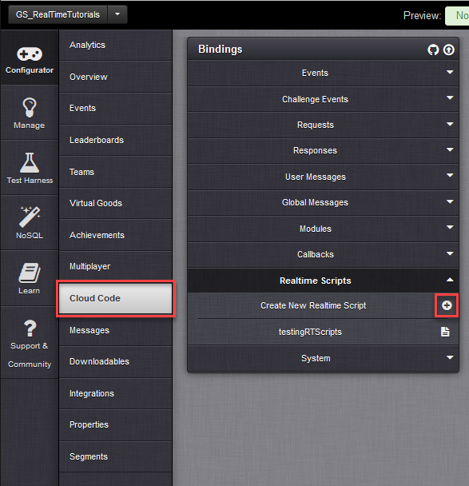
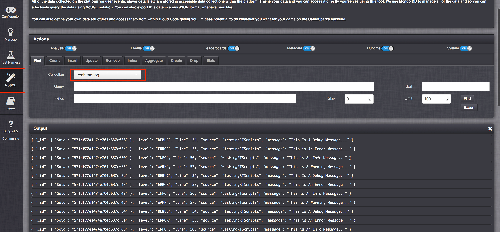

# Creating and Using Real-Time Scripts

## Introduction

Real-Time scripts are designed to be used alongside GameSpark’s Real-Time services. They allow you to perform specific operations on packets that reach the server, as well as sending new packets and requests.

In this tutorial, we'll go through setting up a new Real-Time script and explain what each of the functions available through the [RTSession](/API Documentation/Realtime API/RTSession.md) API do, along with examples of how to use them.


## Creating Real-Time Scripts

*1.* In the portal, go to *Configurator > Cloud Code* and select *Realtime Scripts*.

*2.* Click the plus  icon to create a new Real-Time script:



## RTSession API

Real-Time scripts do not operate like our other scripts, which use the Spark API. Instead, RT scripts use the [RTSession](/API Documentation/Realtime API/RTSession.md). This means that all real-time functions begin *RTSession*.

Refer to the [RTSession](/API Documentation/Realtime API/RTSession.md) API Documentation for a list of all the functions that can be called from the *RTSession*. In the following sections, we'll go through each of these in detail.


## Script Set Up

If a new script has been created or a match is being setup for the first time, the server will cache the script and all global variables. This will sometimes delay the start of the session because the script is being cached.

For live games, scripts are only re-cached when a new session ends, which is done 5 minutes after the last player is disconnected. So, consider this when testing Real-Time scripts - your changes may not take immediate effect when testing from the client.

For games on preview servers, changes to scripts only take a couple of seconds, but the game needs to be disconnected for the changes to take effect.


## Intercepting packets

Probably the most useful feature of the [RTSession](/API Documentation/Realtime API/RTSession.md) API is the ability to intercept packets in flight between players. This will allow you to retrieve/add information to and from the packet or cancel packets under certain conditions.


To use the onPacket callback, you'll need to provide an op-code for the packet you wish to intercept. For example:

```

// this function will be triggered when any packet with the op-code 100 reaches the server //
RTSession.onPacket(100, function(packet){

});


```

For example, these callbacks are used in our [Clock Synchronization](/Tutorials/Real-Time Services/Clock Synchronization and Network Programming.md) tutorial to take a timestamp sent from the player to check it against the server time and send back the difference.

Another example might be to validate player-collisions or kills against what the server expects to prevent cheating.

In a later example, we will also look at how you can send a packet from your Real-Time game and have it connect with your database and game-data on the regular GameSparks platform.


### Sending New packets

From within the *onPacket* method you will have access to the [RTPacket](/API Documentation/Realtime API/RTPacket.md) object, which represents the packet being intercepted.


### Packet RTData

The [RTData](/API Documentation/Realtime API/RTData.md) is a data-structure created specifically for RT packets. It allows you to set/get different data-types in your RT packet.

To get data from the packet you will need to specify the type of data you want and the index it can be found at.

## Sender IDs

As with our client API, packets in the RT-scripts API have reference to the sender’s peerId in the RT-session. However, we can also get the sender's playerId.

```

// this function will be triggered when any packet with the op-code 100 reaches the server //
RTSession.onPacket(100, function(packet){
    var senderPeerId = packet.getSender().getPeerId(); // get sender's peerID
    var senderPlayerId = packet.getSender().getPlayerId(); // get sender's playerID
});


```

### Target Players

We can also get the peerId of the player(s) the packet is being sent to.

```

RTSession.onPacket(100, function(packet){
    var senderPeerId = packet.getSender().getPeerId(); // get sender's peerID
    var senderPlayerId = packet.getSender().getPlayerId(); // get sender's playerID

    if(packet.getTargetPlayers().length > 0){
        for(var i = 0; packet.getTargetPlayers().length; i++){
            var targetPeerID = packet.getTargetPlayers()[i];
        }
    }else{
        // if the target-player list is empty then the packet is to being sent to everyone so //
    }
});


```

<q>**Note:** If the packet is set to be sent to all players, the list of target players will be empty.</q>


### Cancelling packets

Under certain conditions you might want to use these callbacks to make sure that packets from certain players or that packets containing certain data do not get sent on. To cancel a packet, simply return false from the callback function.

For example, if we want to cancel any packets that are older than 1 second or to cancel any packets from a certain player, we could use the following code:

```

RTSession.onPacket(102, function(packet){
    var dateNow = new Date().getMilliseconds(); // get the current time in milliseconds
    if(dateNow - (packet.getData().getNumber(1)) < 1000){ // check if the packet was sent more than one second ago...
        return false; // cancel the packet
    }
    else if(packet.getSender().getPeerId() === 4){ // or check if a certain player sent the packet ...
        return false; // cancel the packet
    }
});


```

## onPlayerConnect

This function is called whenever a player connects to the RT-session.  It gives you access to the RTPlayer that just connected so you can get their playerId and peerId.

```

// this function is called when a player connects to an RT Session
RTSession.onPlayerConnect(function(player){

    var playerPeerId = player.getPeerId(); // gets sender's peerID
    var playerPlayerId = player.getPlayerId(); // gets sender's playerID
});

```

## onPlayerDisconnect

This function is called whenever a player disconnects from the RT-session.  It gives you access to the RTPlayer that just connected so you can get their playerId and peerId.

```

RTSession.onPlayerDisconnect(function(player){

    var playerPeerId = player.getPeerId(); // gets sender's peerID
    var playerPlayerId = player.getPlayerId(); // gets sender's playerID
});


```


## Sending packets

We can also send packets using the RTSession API. However, before we can send a packet, we must provide it with some data. To do this, we can use the RTData object, which we can assign using the *RTSession.newData()* function.

```

var rtData = RTSession.newData();


```

Similar to how we retrieve RTData from a packet, there are various types of RTData we can *set*. Each time you add a new piece of data, you must assign a key/index to the data so that you have a reference to what type of data is stored at each index when you want to retrieve the data.

See [RTData](/API Documentation/Realtime API/RTData.md) for a list of various data-types that can be set as RTData.

```

RTSession.onPacket(100, function(packet){
    var rtData = RTSession.newData(); // create a new RTData object
    // check the peerId of the sender
    if(packet.getSender().getPeerId() === 1){
        rtData.setString(1, Date().getMilliseconds()); // if the sender is 1, then send back the current date
    }else{
        rtData.setNumber(1, 100); // otherwise send back a number
    }
    // construct a new RT-packet with op-code 1 using the rt-data we set
    RTSession.newPacket().setOpCode(101).setData(rtData).send();
});


```


<q>**Note:** You can also send an empty packet without any RTData if you would like to use the packet as a signal or trigger in the client.</q>

## Sending Requests

RT-scripts do not have access to the Spark API, so you are limited in what functions you can call. However, one of these functions is *RTSession.newRequest()*. Using this function you can construct a new request for any of the requests you could send from the client or you could send using our non-RT services.

You can retrieve information from the response and use it to send another packet.

For example, when a player connects to the RT-session we can get their account details and share specific details with the other players in the session:

```

// this function is called when a player connects to the RT session //
RTSession.onPlayerConnect(function(player){
    // construct a new account details request with the ID of the player that just connected //
    RTSession.newRequest().createAccountDetailsRequest().setPlayerId(player.getPlayerId()).send(function(response){
        // construct a new RTData object with the player's display name //
        var rtDataToSend = RTSession.newData().setString(1, response.displayName);
        // send the display name to all the players //
        RTSession.newPacket().setOpCode(101).setData(rtDataToSend).send();
    });
});


```


## RTSession Logging

Because we don’t have access to the Spark API, we can't log messages in the same way we do when using our normal services. However, logging messages does work in a similar way.
To log a message, you can use the function *RTSession.getLogger()*. There are several different levels at which log-messages can be set.

```

RTSession.onPacket(100, function(packet){
    RTSession.getLogger().debug("This Is A Debug Message...");
    RTSession.getLogger().error("This is An Error Message...");
    RTSession.getLogger().info("This is An Info Message...");
    RTSession.getLogger().warn("This is A Warning Message...");
});


```

You can then access these logs from the *NoSQL Explorer* in the portal. All RT-logs are stored in a collection called ‘realtime.log’:




## Get Player(s)

You can retrieve info on the players currently connected to the RT-session. You can either lookup a player by their peerId or you can get a list of players. In both cases you have access to the player’s PeerID in the session and their playerID.

For example, we could use the playerID to get a list of all achievements each player possesses:


```

// get the ID of a player at a certain index in the player array //
var playerZeroID = RTSession.getPlayers()[0].getPlayerId();
var playerZeroPeerID = RTSession.getPlayers()[0].getPeerId();
// get the ID of a player who's peerID is known
var playerID = RTSession.getPlayer(1).getPeerId();
var playerPeerID = RTSession.getPlayer(1).getPlayerId();
// we can use the playerID to check achievements for each player, for example //
RTSession.newRequest().createListAchievementsRequest().setPlayerId(playerID).send(function(response){
    var achList = response.achievements; // returns a list of achievements
});


```


## Get Session ID

If you need to get data from the current session, you can get the sessionID/matchID using *RTSesssion.getSessionId()*.

## Set Interval

You can also do repeated actions with the RTSession API using the *RTSession.setInterval()* function. For example, you could use this to sync clocks by having the server send its current time every second:

```

// a new setInterval callback function //
RTSession.setInterval(function(){
    // get the current server-time in milliseconds //
    var rtData = RTSession.newData().setString(1, new Date().getUTCMilliseconds());
    RTSession.newPacket().setOpCode(101).setData(rtData).send(); // send the packet to all players
}, 1000); // set the time interval to be 1 second


```


## Clear Interval

You can stop one of these interval functions by setting its ID as a global variable. You can then cancel the interval using the *RTSession.clearInterval()*.

For example, you could send a packet each second for ten seconds and then cancel the packet:

```

var count = 0;
// a new setInterval callback function //
var everySecond = RTSession.setInterval(function(){
    if(count++ <= 10){
        // get the current server-time in milliseconds //
        var rtData = RTSession.newData().setString(1, new Date().getUTCDate());
        RTSession.newPacket().setOpCode(101).setData(rtData).send(); // send the packet to all players
    }else{
        RTSession.clearInterval(everySecond);
    }
}, 1000); // set the time interval to be 1 second

```

## Set Timeout

You can use *RTSession.setTimeout()* to schedule some code to run after a certain amount of time.

For example, we could tie this into some of the other functions of RTSession we’ve used by sending messages to players about a live session they have just left. You could use this sort of example to encourage the player to re-join the session:

```

// this function is called when a player disconnects from the RT session //
RTSession.onPlayerDisconnect(function(player){
    // we start a new timeout function in 20 seconds //
    RTSession.setTimeout(function(){
        // after 20 seconds we send a message to the player using a log-event request //
        RTSession.newRequest().createLogEventRequest()
                                .setEventKey("sendMessageToPlayer")
                                .setScriptData({ "Message" : "Your Friends Are Having Fun Without You!" })
                                .send(function(response){});
    }, 20000);
});


```


## Clear Timeout

You can also cancel timeouts in the same way as we did for the intervals. You will need the ID of the timeout, and then you call the RTSession.clearTimeout().

```

RTSession.clearTimeout(timeoutId);

```
