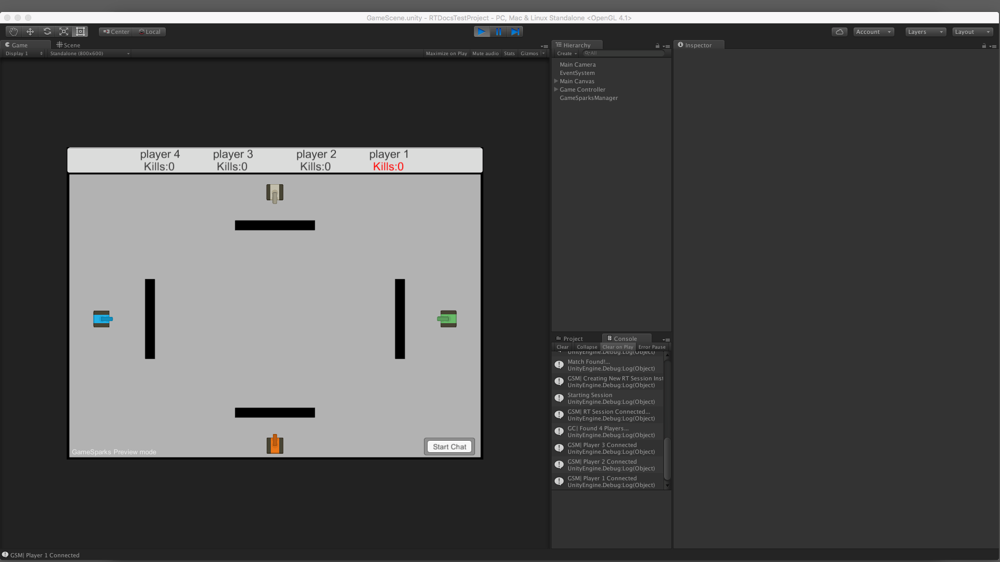
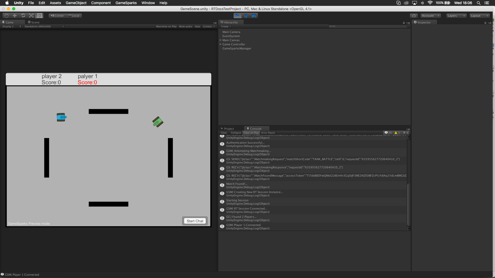

# Real-Time Multiplayer Game Example

In the previous tutorial, we looked at how to set up a simple chat-system so that players found through the match-making process can communicate with each other. It included a simple introduction to how packets are sent and received using our real-time services.

In this final tutorial, we follow the previous one and use the real-time services to create a simple multiplayer game based on Atari’s Tank! (1974).

## Introduction

The tutorial splits into several parts:
* To get started, we'll create a scene and set up all of our game-objects such as the spawn-points, tanks, shells, and walls as well as our HUD.
* Then we'll set up the scripts we need to control the game and instantiating our players into the level.

This will constitute our scene setup. From there:
* We'll be handling all the events and collisions in-game.
* Sending updates about each tank to all other players.

## Scene Setup

In order to follow this tutorial you will need the game-assets available in [here](http://repo.gamesparks.net/docs/tutorial-assets/Real-TimeMultiplayerGameExample-Assets.zip).

<q>**THANKS!** *The assets used in this tutorial are open-source and many thanks to the creator for providing these assets.*</q>

Once you have those assets downloaded, you can add the *Textures* folder to the *Assets* folder of your project. The important texture for this tutorial is the one called ‘tankSprites’. You need to set this texture to the multiple sprite-mode and then split the sprite-sheet yourself using the automatic-splice option. We've set the pixel per unit size to 150 for this tutorial, but you can leave it at 100 if you like.

Once you have the tank-sprites ready, we can move onto the main-game scene. We'll focus on five parts for setting up the scene:
1.	The Game Heads-Up Display (HUD)
2.	The borders and obstacles
3.	Player Spawn-Points
4.	Player Tanks
5.	Tank Shells


## The Game HUD

Our game's head-up display (HUD) will contain two pieces of information:
* A text-field for each player’s name.
* A second text-field for the number of enemies each player has destroyed.

The HUD will therefore look something like this:


To set up your HUD like this, follow these steps:
1.	Add a new *UI Panel* to the ‘Main Canvas’ object in the scene hierarchy. This panel should cover the screen from left to right, but only come down a few pixels (we used a height of 50 pixels).
2.	For each player, add a new empty *GameObject* and name the object. Space these objects equidistant from each other along the HUD bar.
3.	Add two *UI Text* objects to each player’s empty *GameObject* and name them ‘player_name’ and ‘player_score’. The only other thing we've done for these text-fields is center the text and align them to fit one above the other.

### Sorting Layers

Before we finish with the game HUD, we need to plan out our sorting layers. There will be a number of sprites in this game and each of them will need to be drawn on different layers. Most importantly, the HUD needs to be always drawn on top of everything else.

1. To set the draw-order of our HUD, select the ‘Main Canvas’ object and then click on the *Sorting Layer* drop-down menu:

  

2. Now select *Add New Sorting Layer*. We want to create three layers, Shell, Tank and HUD. And set the sorting layer of your Main Canvas to ‘HUD’.

  

## Borders and Obstacles

Next, we'll create some barriers/walls, which will surround our scene and stop tanks from being able to leave the camera boundaries. We'll also add some obstacles to give the players something to navigate around.

To start:
* We’ll create a new empty *GameObject* in our scene hierarchy and name it ‘Game Controller’. This is where all our game-elements will be kept.
* Inside this game object, we need to create another empty *GameObject* called ‘Level Obstacles’. All objects which the player’s tank cannot pass through will go here.

The obstacles we are going to create will be very simple: they will just be a sprite with a *BoxCollider2D* component attached. We’ve also added the *pixel_White* sprite to the object. This will allow you to add whatever color you wish to the sprite.


You will also need to give these objects a tag, which we will use later to register collisions. We've called this tag ‘Barrier’:


After we have the level borders set up, we can add some obstacles to the middle of the scene:


Now we have our barriers, we can start putting in our spawn-points.

## Player Spawn-Points

The player spawn-points are going to be very simple. They are just an empty *GameObject* with a name for each player.

All we need from these objects is the position and rotation when each player is created at the start of the game. For this level, we're going to place each spawn-point behind an obstacle so that other players cannot immediately kill each other when they spawn. We've also added icons to each of these items so that the game-object stands out a little more in the scene.


Before we finish off these spawn-points, we need a way of giving them each an index, which will later relate to which player gets spawned from which point. This is really important in making sure each player is spawned from the same place for all instances of the game.

So, we'll add a new C# script to each spawn point. All we need for that script is one public integer, which will denote which spawn-point is for which player.

```

using UnityEngine;
using System.Collections;

public class SpawnPoint : MonoBehaviour {

    public int playerPeerId;
}

```

We then need to set the peer-ID of each player we wish to spawn at each point:


<q>**Note:** You could skip adding the script if you like and just name each spawn-point ‘1’,’2’,’3’, and so on after each player’s peerId and use that as the spawn-id instead.</q>


## Player Tanks

Now we will setup our player-tank objects.

*1.* We'll create a new **Sprite** and add one of the tank-sprites to the object.

### Tank Sorting Layer

*2.* Now we need to set the sorting layer of the tank to ‘Tank’ so that the tank is always drawn underneath the HUD.

### Tank Box Collider

*3.* We then add a *BoxCollider2D* component to the tank and set it up to be just around the body of the tank:


### Tank Rigidbody

*4.* The last thing we need on this sprite is a *Rigidbody2D*. The rigidbody will allow our tanks to detect collisions. We aren’t going to use any force on our tanks, but they do also need to be stopped by our obstacles.

And for this rigidbody we'll set the gravity scale to zero, but we don’t need to change any other attributes right now:


### Tank Tag

We also need to add a tag to the tank, which we'll use later for collision detection:


### Shell Spawn-Point

We are going to add an empty *GameObject* to our tank now. This game-object gives the shells we fire a spawning position instead of spawning them from the tank’s center. We'll put this empty *GameObject* at the barrel of the tank’s gun, so there is some distance from the tank.


### Tank.cs Class

We also need to give this tank its own class so create a new C# script called Tank.cs and add it to the tank.

### Tank Prefabs

The only thing left to do is to create four prefabs for each color of tank and for each prefab add the correct sprite. Then rename your tank-prefabs to match the colors:


The tank object is now setup and ready. We will move onto the *Shell* object.

## Tank Shells

These are the objects that are being fired by the tanks. You can call them shells or bullets or whatever you prefer. The important thing is that these objects are a simple sprite with a small box-collider and a rigidbody.

Notably, we want these objects to bounce off the walls as they do in Atari’s TANK! To achieve this behavior, we'll create a physics material and apply this to the rigidbody.

### Shell Sprite

*1.* To start, create a new Sprite and name it ‘Shell’. For this game example, we used one of the assets that come with every Unity project for the shell-texture: the ‘UISprite’ texture. This texture suits the look of our shell without needing to bring in additional assets, but feel free to change the sprite if you wish.

Play around with the shell size compared to the tank’s gun until it looks right.

### Shell Layer and Tag

*2.* If you remember, when we set up the tank we gave it a sorting layer. Now we'll do the same for this shell. We'll also need to tag this shell ‘Shell’ and use the tags to detect collisions between the tank and shells.


### Box-Collider and Rigidbody

*4.* Next, we need a *BoxCollider2D* component and a *Rigidbody2D* component. As with the tank, the rigidbody will have a gravity-scale of zero. Other than that, you don’t need to change any attributes.

### Bouncy Material

*5.* To give the shell the ability to bounce off walls, we'll need to create a new physics material.

To do this right-click in the project tab and select *Create -> Physics2D Material*:


We’ve called this material *Shell_PhysMat*. Select this material and set the *Friction* to 0 and the *Bounciness* to 1.

Lastly, add this material to the material field of the shell’s box-collider:


### The Shell.cs Script

We also need to add a script to the shell object so that we can control it. We've called this script ‘Shell.cs’.

### The Shell Prefab

The last thing we need to do for this section is create a prefab from this shell. We can then make reference to it and we'll use it later for creating new shells.

## Setting Up the Game Controller

The game-controller script is the most important part of this game-scene. In this script, we'll set up our level and load all the player tanks to the right positions and give them the right attributes.

It will also receive all the packet information from the *GameSparksManager.cs* and send it on to update the opponent’s shells and tanks. It's responsible for making sure all the opponent information is in sync with the instance of the game you are running.

To start, we'll go through setting up the *GameController.cs* class. Later, we'll re-visit this class so we can get our tanks spawned into the scene.

The first things you need to do is create a new script called *GameController.cs* and add it to the ‘Game Controller’ object in your scene’s hierarchy.

### Gamecontroller Singleton

For this example, we create a singleton for our *GameController.cs* script. This is going to be very simple example, one where we just set up a getter for the singleton and return it in a static method:

```

private static GameController instance; // this is the singleton for the game-controller class
public static GameController Instance(){
        return instance;
}
void Awake(){
        instance = this;
}


```

<q>**Note:** If you are averse to using singletons, then feel free to restructure this class. However, a reference to the game-controller will be needed by the tank class to reward points, and by the *GameSparksManager* class to be able to send the right packets to the game-controller.


### Object Lists

After the singleton, all of the class members we need to set up the game-controller are actually arrays of either game-objects or text-fields for our HUD. So, I will go through them one-by-one.

|Class Member   |Description   |
|---|---|--------------------------------|
|*public GameObject[] tankPefabs* |We’ll load each tank-prefab into the script through the editor. This will then be used to assign colors to each player.   |
|*private Tank[] playerTanksList*    |Each time we create a new tank for the player and set it up, we'll add it to this list. Later we'll use this list to update tank positions and rotations and make sure each player has been assigned the right points. We'll also create a getter for this list so we can access it from other classes.|
|*public Text[] playerKillsHUDList, playerNamesHudList* |These represent the player_score and player_names text-fields in the HUD panel. We'll add these manually through the editor to make sure that the order of players in the HUD appears the same for each player.|
|*private static Shell[] shellPool = new Shell[13]* |This is the object pool for all the shells our players can instantiate from. Instead of creating a new shell, we'll replace objects in this pool thereby reducing overheads for instantiation and garbage collection. For this example, we've decided on 13 shells in the pool. This is calculated from the fire rate of 1 shell per second, and each shell has a lifetime of two seconds. So, each player can have a total of 2 shells in the scene at any time, with a slight possibility of an extra shell (if the fire-rate overlaps). So, with 4 players, there can be a total 12 shells in the scene at any time (plus one extra for safety).|


```

public GameObject[] tankPrefabs; // this is the list of tank-prefabs we set from the editor
public GameObject shellPrefabRef;
private Tank[] playerTanksList;
public Tank[] GetAllTanks(){  
        return playerTanksList;    
 } // we do need to reference tanks outside the game-controller so we'll use this

public Text[] playerKillsHUDList, playerNamesHUDList; // these are the text-fields for each player's kills and name in the HUD panel. This is set from the editor

private static Shell[] shellPool = new Shell[16]; // this is the cached pool of shells we'll be creating shell-instances from

public static Shell[] GetShellPool(){    
        return shellPool;    
    } // and we have a getter for the shell pool


```


Once you have built the script, head back into Unity and link all of these arrays with the correct objects in the scene hierarchy:


### Handling Packets

After the initial setup (which we will get to later) the *GameController.cs* class handles all the different kinds of packets relating to game-data that are received.

We need to set up our *GameSparksManager.cs* class to pass these packets on, but before we do that, we need to create these methods:

|Method   |Description   |
|---|---|--------------------------------|
|**public void** *UpdateOpponentTanks*(RTPacket \_packet) |This will handle data coming from packets sent only by opponent tanks. It will update the position and rotation of the tank.   |
|**public void** *InstantiateOpponentShells*(RTPacket \_packet)   |When a player fires a shell, they will send off a packet to all players telling them they should instantiate a shell with their ID. This method will create that shell and assign values of the owner to the new shell.|
|**public void** *UpdateOpponentShells*(RTPacket \_packet) |This method will handle updating that information for opponent shells.|
|**public void** *RegisterOpponentCollision*(RTPacket \_packet)|When an enemy shell hits your tank, you will need to broadcast a message to all other players to tell them to reset your tank.|
|**public void** *OnOpponentDisconnected*(int \_peerId)|When a player disconnects we will disable their colliders and turn the sprite black. This will convey to other players that they have dropped out.|

```

/// <summary>
/// Updates the opponent tank's position, rotation, and if they have been reset
/// </summary>
/// <param name="_packet">Packet Received From Opponent Player</param>
public void UpdateOpponentTanks(RTPacket _packet){

}
/// <summary>
/// Instantiates the opponent shells with the id of the opponent
/// </summary>
/// <param name="_packet">Packet Received From Opponent Player</param>
public void InstantiateOpponentShells(RTPacket _packet){

}
/// <summary>
/// Updates the opponent shell's rotation and position
/// </summary>
/// <param name="_packet">Packet Received From Opponent Player</param>
public void UpdateOpponentShells(RTPacket _packet){

}
/// <summary>
/// This is called when an opponent has registered a collision.
/// It will remove the shell that hit, reset the opponent's tank, and update the
/// score of the owner of the shell that hit.
/// </summary>
/// <param name="_packet">Packet Received From Opponent Player</param>
public void RegisterOpponentCollision(RTPacket _packet){

}
/// <summary>
/// This method is called when a player disconnects from the RT session
/// </summary>
/// <param name="_peerId">Peer Id of the player who disconnected</param>
public void OnOpponentDisconnected(int _peerId){

}

```


### Hooking Up these Methods to GameSparksManager.cs

So the next thing we need to do is pass on all the packets to these methods. We are going to do this in our *GameSparksManager.cs* class, and specifically in the *OnPacketReceived()* method where we had our chat manager set up.

In this method, we are going to add 4 more cases for the op-code of the packet, each passing back the packet corresponding to that op-code (see code below).

<q>**Important!** It's important that you match the op-code with the correct method as in the code below, because not all of these packets will contain the same information:</q>

```

private void OnPacketReceived(RTPacket _packet){

        switch (_packet.OpCode) {
        // op-code 1 refers to any chat-messages being received by a player //
        // from here, we will send them to the chat-manager //
        case 1:
            if (chatManager == null) { // if the chat manager is not yet set up, then assign the reference in the scene
                chatManager = GameObject.Find ("Chat Manager").GetComponent<ChatManager> ();
            }
            chatManager.OnMessageReceived (_packet); // send the whole packet to the chat-manager
            break;

        case 2:

            GameController.Instance ().UpdateOpponentTanks (_packet);
            break;

        case 3:
            GameController.Instance ().InstantiateOpponentShells(_packet);
            break;

        case 4:
            GameController.Instance ().UpdateOpponentShells (_packet);
            break;

        case 5:
            GameController.Instance ().RegisterOpponentCollision (_packet);
            break;

        }
    }


```


### Settting Up the Tank Object

Before we can set up the game-scene we have to make a detour to the *Tank.cs* class. Here we are going to create an empty method, which we'll use to finish setting up the *GameController.cs* class in the next section.

To set up the tank we'll need three attributes, which will be stored by each player’s tank:
1.	The spawn-position of the tank.
2.	Whether or not this tank is the player or not.
3.	A reference to the player’s score text-field.

```

/// <summary>
    /// Takes the details needed to set up each tank and to separate the player from
    /// opponent tanks
    /// </summary>
    /// <param name="_spawnPos">The position and rotation of the player's spawn-point</param>
    /// <param name="_isPlayer">If set to <c>true</c> is player.</param>
    /// <param name="_myScoreTxt">this is a reference to the player's score text in the HUD.</param>
    public void SetupTank(Transform _spawnPos, bool _isPlayer, Text _myScoreTxt){

    }

```


For the moment, we'll not do anything in this method, until we are sure that we are passing the right values in.

### Gamecontroller.cs Start() Method

We're going to set up the scene in the *Start()* method of the *GameController.cs* class.

Our set up process will follow these steps:
1.	Create our shell-pool by instantiating the shell-prefab.
2.	Get a reference to all the spawners in our scene.
3.	Create a new tank object from the prefab.
4.	Pass in the correct variables to set up the tank.
5.	Add the new tank to its place in the tank-list array.
6.	Set the corresponding player-name in the HUD to be the player we just created.
7.	Clean up any unused players in the HUD by setting the names and scores to be empty strings.

### Instantiating the Shell Pool

Instantiating the shell-pool is simple. We just iterate through the number of objects in the pool and create a new shell-prefab each time. We then set the parent of the shell to be an empty *GameObject* (just to make our hierarchy appear neater) and immediately disable the object so the shell’s script cannot run (remember our shells will have a lifetime of 2 seconds, so we don’t want the timer to start until they've been fired).

Before creating any code create an empty *GameObject* on your ‘Game Controller’ object called ‘Shell Pool’:

```

#region Instantiate Shell-Pool
Transform shellPoolObj = GameObject.Find ("Shell Pool").transform; // we'll stick all the shells we create into an object so they are tidy
for (int i = 0; i < shellPool.Length; i++) {
    GameObject newShell = Instantiate (shellPrefabRef, Vector2.zero, Quaternion.identity) as GameObject; // create the shell (it doesn't matter where)
    newShell.gameObject.SetActive (false); // immediately disable the game-object so the script can run
    newShell.transform.SetParent (shellPoolObj); // set the parent to be the shell-pool object
    shellPool [i] = newShell.GetComponent<Shell> (); // add this newly created object to a corresponding reference in the shell-pool array.
}
#endregion


```


### Get Spawners

Now, we'll get all the spawners in the scene using the *FindObjectsOfType()* method. This will get any objects which have the *Spawner.cs* class attached. Since we may not always have 4 spawners in our scene, it is important to let the game collect this data using the existing API calls if possible, rather than setting the spawners through the editor.

```

SpawnPoint[] allSpawners = FindObjectsOfType (typeof(SpawnPoint)) as SpawnPoint[]; // find all objects with the spawner script attached


```

### Set Up each of the Player Tanks

This section has several steps:
1.	Initialize the playerTanksList array with the number of players there are in the session.
2.	We'll then start to loop through the player list.
3.	Inside the player-list loop, we'll start to loop through the spawner-list.
4.	We'll check that the player’s peerId corresponds to the spawner you have set for that player.
5.	Instantiate a new tank GameObject using the prefab at the same index as the current player in the loop (this will be the same for every user so all the colored tanks will correspond to the same players in each instance of the game).
6.	Set the name of the tank to be the player’s peerId. We'll use this to find matching tanks from received packet data later on using the packet’s SenderId.
7.	Check to see if the player in the loop is the current player (that is, the peerId of this player matches the peerId of the player we are at in the loop). Using this info we can set up the tank as a player or opponent.
8.	Add the newly created tank to the corresponding reference in the playerTankList.
9.	Set the display name of the player to the text-field in the HUD.

```

#region Setup Player Tanks
playerTanksList = new Tank[(int)GameSparksManager.Instance().GetSessionInfo().GetPlayerList().Count];  
Debug.Log ("GC| Found "+playerTanksList.Length+" Players...");
for (int playerIndex = 0; playerIndex < GameSparksManager.Instance ().GetSessionInfo ().GetPlayerList ().Count; playerIndex++) {  
    for (int spawnerIndex = 0; spawnerIndex < allSpawners.Length; spawnerIndex++) {  
        if (allSpawners [spawnerIndex].playerPeerId == GameSparksManager.Instance ().GetSessionInfo ().GetPlayerList () [playerIndex].peerID) {
            GameObject newTank = Instantiate (tankPrefabs[playerIndex], allSpawners [spawnerIndex].gameObject.transform.position, allSpawners [spawnerIndex].gameObject.transform.rotation) as GameObject;
            newTank.name = GameSparksManager.Instance ().GetSessionInfo ().GetPlayerList () [playerIndex].peerID.ToString();
            newTank.transform.SetParent (this.transform);  
            if (GameSparksManager.Instance ().GetSessionInfo ().GetPlayerList () [playerIndex].peerID == GameSparksManager.Instance ().GetRTSession ().PeerId) {
                newTank.GetComponent<Tank> ().SetupTank (allSpawners [spawnerIndex].gameObject.transform, true, playerScoreHUDList[playerIndex]);
            } else {
                newTank.GetComponent<Tank> ().SetupTank (allSpawners [spawnerIndex].gameObject.transform, false, playerScoreHUDList[playerIndex]);
            }

            playerTanksList [playerIndex] = newTank.GetComponent<Tank>(); // add the new tank object to the corresponding reference in the list
            playerNamesHUDList [playerIndex].text = GameSparksManager.Instance ().GetSessionInfo ().GetPlayerList () [playerIndex].displayName; // set the HUD of this player to be the display name
            break;
        }
    }
}
#endregion


```

This code uses the indexes of the player-list to set the correct HUD components. This is because we know that the order of the player-list for everyone running the game is the same. So, if we use that as a constant, we know that each tank will have the right color, and each player’s HUD will be correct in each instance.

### Clearing HUD Elements for Players not in the Session

Our game example is setup for 4 players. But if there are not 4 players connected, we want to clear the HUD elements for the missing players. To do this, we just loop through the HUD elements starting at the index corresponding to the number of players in the scene and setting each element to be an empty string.


```

// lastly, go through the list of HUD elements, starting with the number of players and clear any HUD for players that aren't in the session //
        for (int i = GameSparksManager.Instance().GetSessionInfo().GetPlayerList().Count; i < playerScoreHUDList.Length; i++) {
            playerScoreHUDList [i].text = playerNamesHUDList [i].text = string.Empty;
        }

```

<q>**Note:** You could skip this step by having the HUD appear clear when the level starts. However, this would make it harder to setup the HUD in the first place. The choice is yours.</q>

### Testing

Once you have all the set up code in place and all your prefabs and object-arrays are linked through the editor, we can test out the code. If everything is set up correctly, you'll see 4 tanks of different colors appear at the spawn-points for each of your game instances. You should also see that the position of each color of tank is the same for each game:




## Tank.cs Setup

The next thing we are going to focus on is the tank class. We want to be able to:
* Move the tank as well as broadcast that movement.
* Fire shells.
* Detect collisions and broadcast those collisions to our opponents.

Those are the basics capabilities we want the tank class to achieve but there are a number of others we should think about just to make this a more complete game:

|Capability   |Specification   |
|---|---|--------------------------------|
|**Player’s Firing Rate** |We don’t want the player to fire every time they press a button. Firstly this makes the game very hectic and unbalanced but it will also cause a bottleneck of packets arriving with shell updates, which will slow the game down.   |
|**Reset Players Position On Collision**|When a player gets hit, we want to reset their position back to the original spawn-point. This is so opponents cannot camp out in one spot and continually attack the player.|
|**Temporary Invincibility For Reset Players** |There is a warning against the previous point, which we must allow for. An opponent can camp at the player’s spawn-points and just keep hitting them. They will re-spawn in the same position, so as long as the opponent is aimed at that point they can continue to kill the player tank. So to combat this we will add a 4 second invincibility to the player.|
|**Update Player Score** |We also want to be able to update a player’s score when they kill an opponent’ tank.|

### Tank Class Variables

Each of the points we just discussed will require variables in our tank class. We'll group these variables to the specific functions they are used for.

#### Spawning and Movement

For this we need a reference to the spawn-position as well as a *bool* to tell if this tank is the player’s tank. You will remember in the *GameController.cs* setup we passed this bool into the *SetupTank()* method:

```

private Transform spawnPos;
private bool isPlayer;

```

#### Predictive Movement

Predictive movement will be used to make sure our tanks have smooth movement behaviors between position updates coming in from other players. This involves quite a few variables. So, we set those here and we'll come back to explaining what each one is used for later:

```

private Vector3 prevPos, velocity;
private float updateRate = 0.1f;
public Vector2 goToPos;
public float gotoRot;


```


#### Firing Shells

For this we are going to need a bool to tell us whether or not we can fire. We'll also need a reference to that shell-spawn position game-object we added to tank, and finally we will need a public *Color* variable.

The color variable is going to be used to apply player colors to the shells so opponents can tell the difference between their own shells and their opponent’s. We will set this on each prefab from the editor:

```

private Transform shellSpawnPos;
private bool playerCanFire = true;
public Color tankCol;


```

#### Player Invincibility

For this we only need two things: a *bool*, which will:
* Tell when we are invincible.
* Dictate to an opponent if their version of our tank can be hit.

```

private bool isInvincible;

```

### Player Score

And finally we need an *integer* for the player score and we need a reference to the player score in the HUD and this will be a *Text* object.


```

private Text myScoreText;
private int myScore;


```

Together, these variables are as follows:

```

#region Player Movement & Reset
    /// <summary>This is the position where the tank is spawned and reset at</summary>
    private Transform spawnPos;
    /// <summary>denotes when the tank is the current player or a representation of the opponent's tank</summary>
    private bool isPlayer;
    #endregion

    #region Firing Shells
    /// <summary>This is the position at which shells are spawned</summary>
    private Transform shellSpawnPos;
    /// <summary>dictates when the player can fire a shell</summary>
    private bool playerCanFire = true;
    /// <summary>This is the color of the shells the player fires. Set in the editor</summary>
    public Color tankCol;
    #endregion
    // PLAYER RESET INVINCIBILITY //
    /// <summary>This is used to dictate when the player is invulnerable</summary>
    public bool isInvincible;
    // UPDATING PLAYER SCORE //
    /// <summary>This is a reference to the player-score in the HUD</summary>
    private Text myScoreText;
    /// <summary>This is the actual value of the player score incremented when a collision occurs</summary>
    protected int myScore;
    /// PREDICTIVE MOVEMENT //
    /// <summary>
    /// The position of the tank the last time an update came in
    /// </summary>
    private Vector3 prevPos, velocity; // used to calculate velocity
    /// <summary> The rate at which the tank sends out position updates. 0.1f is 6 fps</summary>
    private float updateRate = 0.1f;
    /// <summary>When the update-packet comes in. This is used to store the new position of the enemy tank</summary>
    public Vector2 goToPos;
    /// <summary> When the update packet comes in. This is used to store the new rotation the enemy tank should go to </summary>
    public float gotoRot;


```


### SetUpTank() Method

Setting up the tank is pretty straightforward. We just need to assign those few values we passed in earlier:

```

/// <summary>
    /// Takes the details needed to set up each tank and to separate the player from
    /// opponent tanks
    /// </summary>
    /// <param name="_spawnPos">The position and rotation of the player's spawn-point</param>
    /// <param name="_isPlayer">If set to <c>true</c> is player.</param>
    /// <param name="_myScoreTxt">this is a reference to the player's score text in the HUD.</param>
    public void SetupTank(Transform _spawnPos, bool _isPlayer, Text _myScoreTxt){

        spawnPos = _spawnPos; // set the spawn position
        shellSpawnPos = this.transform.GetChild (0).transform; // get a reference to the transform of the shell-spawn point
        isPlayer = _isPlayer; // set the player

        myScoreText = _myScoreTxt; // set the player's score
        myScoreText.text = "Score:0"; // we'll also set the text to zero to start with


        if (_isPlayer) {
            myScoreText.color = Color.red;
        }
    }


```


### Tank Movement

So now that our tank is set up, it's time we started having it actually do something. Our movement is going to be very simple and we are going to take advantage of Unity’s input-axis controls so we don’t have to code results for each button-press.

For input-axis we can get a simulated joy-stick reading for WASD or the arrow keys, along with analog axis from a game-pad or controller. We'll be using the vertical axis for forward/back movement and the horizontal for rotation.

This of course will only occur for our player tank, so all this code will go inside an if-statement to check if this tank is the player tank. And all of this will go in the *Update()* method:

```

// Update is called once per frame
    void Update () {

        #region Player Movement
        if (isPlayer) { // check that this is the player's tank

            float translation = Input.GetAxis ("Vertical") * 5f; // get the input multiplied by the movement speed
            float rotation = Input.GetAxis ("Horizontal") * 55f; //get the input multiplied by the rotation speed
            transform.Translate (0, -translation * Time.deltaTime, 0); // translate the forward movement
            transform.Rotate (0, 0, -rotation * Time.deltaTime); // rotate the tank
        }
    }


```


#### Anti-Cheating Tips

You’ll notice that we've hard-coded the translation and rotation speeds in the above example. You may want to have a variable for speed and rotation that you can change them to get things just right. There is one disadvantage to having public variables in networked games: it allows hackers to modify those values on the client, thereby giving themselves an unfair advantage in the game.

For speed, there is a very simple trick to avoid this kind of hacking, and that is to clamp the translation and rotation speeds to within a certain range.

The hacker can then alter the speed values all they like but it will not give them any advantage!

```

// Update is called once per frame
void Update () {

    #region Player Movement
    if (isPlayer) { // check that this is the player's tank

        float translation = Mathf.Clamp(Input.GetAxis ("Vertical") * speed, -2f, 2f); // get the input multiplied by the movement speed
        float rotation =  Mathf.Clamp(Input.GetAxis ("Horizontal") * rotSpeed, -55f, 55f); //get the input multiplied by the rotation speed
        transform.Translate (0, -translation * Time.deltaTime, 0); // translate the forward movement
        transform.Rotate (0, 0, -rotation * Time.deltaTime); // rotate the tank
    }
}


```


### Broadcasting Tank Movement

This is a very important part of your networking code and it is going to involve several steps.
When broadcasting position or direction updates, we generally don’t want to send these updates at the same rate as we move on the client (that is, 60fps), because this can be a load on the network and slow everything down. Instead, we broadcast at a set rate, and we interpolate the enemy tanks between updates.

This means that we compare where we are with where the update tells us we should be and we then move to that new position.

#### Sending Position Updates

We are going to use a Coroutine for sending the tank’s position updates to other players. The process follows these steps:

*1.*	Check to see that we actually are moving by checking the controller-input.

  Occasionally we could be hit by a tank or bump into a tank. We should send a position update if this happens, even if we aren’t at the controls, so we also check our position is the same as our previous position.

*2.*	We then add our position x and y and our velocity x and y to an RTData object.

*3.*	We add our z-rotation to the RTData object.

*4.*	We send the packet.

*5.*	We reset the prevPos variable, because we are now in the same position as the last update (the update we just sent).

*6.*	And lastly, we get the Coroutine to wait for a set amount of time, and then start the Coroutine again.

We are going to send this data as *UNRELIABLE_SEQUENCED*. If you remember from the last tutorial, this will send the packet using the UDP protocol, which is faster than TCP though more unreliable. Furthermore, these UDP packets will be sequenced so that if a packet arrives out or order, it will drop the old packet for the newer.

This is important for sending positions, because we don’t want an older position to be updated over a more recent one.

```

/// <summary>
/// Sends the tank position, rotation and velocity
/// </summary>
/// <returns>The tank movement.</returns>
private IEnumerator SendTankMovement(){
    // we don't want to send position updates until we are actually moving //
    // so we check that the axis-input values are greater or less than zero before sending //
    if ((this.transform.position != prevPos)  || (Math.Abs(Input.GetAxis ("Vertical")) > 0) || (Math.Abs(Input.GetAxis ("Horizontal")) > 0)) {
        using (RTData data = RTData.Get ()) {  // we put a using statement here so that we can dispose of the RTData objects once the packet is sent
            data.SetVector4 (1, new Vector4 (this.transform.position.x, this.transform.position.y, velocity.x, velocity.y)); // add the position at key 1
            data.SetFloat (2, this.transform.eulerAngles.z); // add the rotation at key 2
            GameSparksManager.Instance().GetRTSession().SendData(2, GameSparks.RT.GameSparksRT.DeliveryIntent.UNRELIABLE_SEQUENCED, data);// send the data
        }
        prevPos = this.transform.position; // record position for any discrepancies
    }

    yield return new WaitForSeconds (updateRate);
    StartCoroutine (SendTankMovement ());
}


```


<q>**Notes: 1.** We are sending the z-angle of the Euler-angles of our tank’s transform. Since this is a 2D object, we don’t need to worry about Quaternions, but we also don’t need to worry about my Vector3 Euler-angles either. Our tank can only rotate on one axis, so we only send one float. **2.** Wherever possible, try to consider attributes that will be empty or zero and try not to send them. This will keep the packet small.</q>


There are a few more steps we need before this will work. Firstly, we need to set all these values and start the Coroutine running. We'll do this in the *SetupTank()* method.

```

/// <summary>
    /// Takes the details needed to set up each tank and to separate the player from
    /// opponent tanks
    /// </summary>
    /// <param name="_spawnPos">The position and rotation of the player's spawn-point</param>
    /// <param name="_isPlayer">If set to <c>true</c> is player.</param>
    /// <param name="_myScoreTxt">this is a reference to the player's score text in the HUD.</param>
    public void SetupTank(Transform _spawnPos, bool _isPlayer, Text _myScoreTxt){

        spawnPos = _spawnPos; // set the spawn position
        shellSpawnPos = this.transform.GetChild (0).transform; // get a reference to the transform of the shell-spawn point
        isPlayer = _isPlayer; // set the player

        myScoreText = _myScoreTxt; // set the player's score
        myScoreText.text = "Score:0"; // we'll also set the text to zero to start with

        if (_isPlayer) {
            myScoreText.color = Color.red;
            prevPos = transform.position;
            StartCoroutine (SendTankMovement ());
        } else {
            goToPos = this.transform.position;
            gotoRot = this.transform.eulerAngles.z;
        }
    }


```


#### Updating Position and Velocity

Next we want go back to the *Update()* method of our tank and calculate the velocity. We'll also have to update any enemy tank to move between their current position and their ‘goToPos’. The *goToPos* is going to be the position that they receive from the packet we send in the *SendTankMovement()* method. We will also do the same for the tank’s rotation.

Lastly, we'll calculate the velocity of the tank to be the difference between the current position and the last position. This will come to be important later.

We'll then clear any velocity the tank’s rigidbody has acquired that frame, so we stop the tank drifting when the player is not at the controls:

```

// Update is called once per frame
void Update () {

    #region Player Movement
    if (isPlayer) { // check that this is the player's tank

        float translation = Mathf.Clamp(Input.GetAxis ("Vertical") * speed, -2f, 2f); // get the input multiplied by the movement speed
        float rotation =  Mathf.Clamp(Input.GetAxis ("Horizontal") * rotSpeed, -55f, 55f); //get the input multiplied by the rotation speed
        transform.Translate (0, -translation * Time.deltaTime, 0); // translate the forward movement
        transform.Rotate (0, 0, -rotation * Time.deltaTime); // rotate the tank
    }
    else {
        this.transform.position = Vector2.Lerp(transform.position, goToPos, Time.deltaTime/updateRate); // lerp the enemy tank to the new position
        this.transform.eulerAngles = new Vector3(0, 0, Mathf.LerpAngle(this.transform.eulerAngles.z, gotoRot, Time.deltaTime/updateRate)); // lerp the enemy tank to the new angle
    }

    velocity = this.transform.position - prevPos; // calculate velocity
    this.GetComponent<Rigidbody2D> ().velocity = Vector2.zero; // cancel any acquired velocity
    this.GetComponent<Rigidbody2D> ().angularVelocity = 0f; //cancel any angular velocity
    #endregion
}


```


### Testing Tank Movement

So now we should be able to move our player tank. But before we do that, we also want to check that our opponents received our movement updates. You can test this very simply by adding a *Debug.Log()* to the *UpdateOpponentTanks()* method of your *GameController.cs* class. This log will just print out the whole packet to a string.

```

Debug.Log (_packet.ToString());

```

We can now build the game and test it out. You'll be able to move your tank around the scene. While controlling the opponent, you'll notice the logs being printed to your editor console:


<q>**Tip!** If you want to check the packets being received by opponents, you can also do this with a Debug.Log(). With your game set to be a development build, you can print Debug.LogError() to a small console that will appear in your game.</q>

### Updating Tank Positions

Now we know that our opponents are receiving our tank-data, we need to get them to update our tank in their versions of the game.

We know we have the position, velocity, and rotation in the packet. But we also have another piece of info, which can be really useful to us: the *SenderId*.

The *SenderID* corresponds to the peerId of the player who sent the packet, and we used the peerId to setup our scene in the *GameController.cs* class. This means that we can check the tank with the same name as the *SenderID* and update only that tank. This is another handy tip to make sure your players are synced correctly  and also to keep your packets a little smaller, because you don’t need to provide extra details about the tank you want to update in the packet.

The following code will go in the *UpdateOpponentTanks()* method of your *GameController.cs* class:

```

/// <summary>
/// Updates the opponent tank's position, rotation and if they have been reset
/// </summary>
/// <param name="_packet">Packet Received From Opponent Player</param>
public void UpdateOpponentTanks(RTPacket _packet){
    for (int i = 0; i < playerTanksList.Length; i++) {
        if (playerTanksList[i].name == _packet.Sender.ToString()) { // check the name of the tank matches the sender
            // we calculate the new position the tank should go to be the position they are at plus the velocity. That is, their position plus the distance they traveled according to their last speed
            playerTanksList[i].goToPos = (new Vector2(_packet.Data.GetVector4(1).Value.x, _packet.Data.GetVector4(1).Value.y)) + (new Vector2(_packet.Data.GetVector4(1).Value.z, _packet.Data.GetVector4(1).Value.w));
            playerTanksList [i].gotoRot = _packet.Data.GetFloat (2).Value;
            break; // break, because we don’t need to update any other tanks.
        }
    }
}


```


So what are we doing here?

* Firstly we check to see if we have a tank in the list with the same name as the sender: this is the tank we want to update.
* We then set the goToPos variable of that tank to be the last position of the tank, plus the velocity of the tank. The reason we want to incorporate the velocity is so that we can extrapolate the position the enemy tank might be at now, because some time has passed between the enemy sending their position and us receiving it.

### Testing Opponent Movement

This is all we need to now test that the movement of our opponents are being updated. If you play with the update-rate of the *SendTankMovement()* Coroutine, you will find that this method gets erratic when the updates are very slow.

<q>**Important! Note 1:** This is only one way to perform predictive movement and dead-reckoning in your game. It's worth looking up which formula suits your game best, because latency and the nature of your game (that is, action, turn-based, and so on) will have a huge impact on how you will interpolate movement. **Note 2:** It is also worth noting that very often in network programming, the server is the one that calculates positions and broadcasts updates. In this case, you would send the movement packets to the server, the server would perform these calculations, and send the calculated position back to all other players.</q>




## The Shell.cs Class

Before we start programming our tanks to start firing shells, we need to add some details to the *Shell.cs* script:
* First we'll set the *ownerPeerId* of the shell.


```

/// <summary>This just keeps track of the time with Time.deltaTime</summary>
private float countDownTimer;
/// <summary>The duration the shell will stay enabled</summary>
private float lifeTime = 5f;
/// <summary> The peerId of the tank that fired this shell </summary>
private int ownerPeerId;


```

* Next we'll create a countdown-timer which will countdown the lifetime of the shell. Once the time is out, we'll disable the game-object and reset the timer:

```

void Update () {
    // counts down as the update continues //
    if (gameObject.activeSelf) {
        countDownTimer += Time.deltaTime;
        if (countDownTimer >= lifeTime) { // if the timer reaches the lifetime, then disable the game object
            this.gameObject.SetActive (false);
            countDownTimer = 0; // ... and reset the timer
        }
    }
}


```

### Resetting Shells

Before firing a shell, we'll have to check to see if there is an available shell-object ready for us to use in the shell-pool. We'll then set the attributes of that shell and enable it again.

We therefore need a *ResetShell()* method so that in the next section we can fire shells and have them instantiate in both ours and our opponent’s games.

This *ResetShell()* method is simple. We pass it in:
1.	A unique-Id (so that we can easily identify shells), which becomes its name.
2.	The peerId of the player firing it, which we call the ownerId.
3.	The Color of the owner, so we can color the shell the same as the tank who fired it.
4.	The position and rotation of the shell.

Two final steps:
1.	We reset the countdown timer.
2.	Enable the game-object.

```

/// <summary>
/// Resets the shell.
/// </summary>
/// <param name="_ownerId">Owner identifier.</param>
/// <param name="_uid">Uid.</param>
/// <param name="_col">Color</param>
/// <param name="_pos">Position.</param>
/// <param name="_rot">Rotation</param>
public void ResetShell(int _ownerId, string _uid, Color _col, Vector3 _pos, float _rot){

    gameObject.name = _uid; // set the uid for the name
    ownerPeerId = _ownerId; // set the owner
    GetComponent<SpriteRenderer> ().color =  _col; // set the color to the color of the owner

    transform.position = _pos; // set the position
    transform.eulerAngles = new Vector3(0, 0, _rot); // set the rotation

    countDownTimer = 0; // reset the timer in case this shell happens to have been recently disabled
    gameObject.SetActive (true); // turn the gameobject back on
}


```


## Firing Shells

So now we need to go back to the *Tank.cs* class and tell it when to fire a shell. To start, we'll create an *IEnumerator* method, which we'll call from the *Update()* method whenever the space-bar is pressed. We'll put this inside the if-statement where we check if the tank is our player:

```

/// <summary>
/// Fires the shell.
/// </summary>
private IEnumerator FireShell(){

    playerCanFire = false;
    Debug.Log ("Firing Shell...");
    yield return new WaitForSeconds (1f);
    playerCanFire = true;
}


```

And in the *Update()* method:


```

if (Input.GetKeyDown (KeyCode.Space) && playerCanFire) {
                StartCoroutine( FireShell () );
            }


```

You should now be able to test your firing rate in the game. If you want to tweak it, you can create new public variable (float) called *fireRatePerSecond* and play around with the fire-rate until it feels right.


### Instantiating Shells

Where we put the debug-log for firing shells we'll now call another method for instantiating shells. It’s actually not accurate to say we are instantiating shells, because the objects all already exist. We are in fact resetting them and then enabling them again:
* When we want a shell, we first have to check for an inactive shell in the pool.
* We then claim that shell, give it a new ID and reset its position, rotation, owner, and so on.

```

/// <summary>
/// Instantiates a shell
/// </summary>
/// <param name="_senderPeerId">The peerId of the owner of the shell</param>
/// <param name="_uid">UID</param>˘
public void InstantiateShell(int _ownerPeerId, string _uid){

    for (int i = 0; i < GameController.GetShellPool().Length; i++) {
        if (!GameController.GetShellPool()[i].gameObject.activeSelf) { // find an inactive shell
            // Update the shell position and rotation and pass in the UID, ownerId, and color so we can reset those too //
            GameController.GetShellPool () [i].ResetShell (_ownerPeerId, _uid, tankCol, shellSpawnPos.position, this.transform.eulerAngles.z);
            GameController.GetShellPool () [i].GetComponent<Rigidbody2D> ().AddForce (-this.transform.up * 200f, ForceMode2D.Force);
            break;
        }
    }
}


```

* We then add force to the shell to move it. However, there is an important part to this method. It is not only going to be used to fire shells, but in our *FireShell()* method, we'll send off a packet telling the other players that they should recreate the shell we are about to fire. When they receive that packet, they will also use this method to recreate the shell on their side.

* This method will therefore need the ID of the sender and the UID of the shell. In this example, we'll use the *Guid* class to generate a unique id for each shell.

So the *FireShell()* method becomes:

```

/// <summary>
    /// Fires the shell.
    /// </summary>
    private IEnumerator FireShell(){

        playerCanFire = false;
        using (RTData data = RTData.Get ()) {
            Guid guid = Guid.NewGuid();
            data.SetString(1, guid.ToString());
            GameSparksManager.Instance ().GetRTSession ().SendData (3, GameSparks.RT.GameSparksRT.DeliveryIntent.UNRELIABLE, data);
            InstantiateShell ((int)GameSparksManager.Instance().GetRTSession().PeerId, guid.ToString());
        }
        yield return new WaitForSeconds (fireRatePerSecond);
        playerCanFire = true;
    }


```

### Instantiating Shells for Opponents

Instantiating shells on the opponents end is actually very easy because we can use the SenderID of the packet to check which tank should instantiate the shell. We'll then pass in the SenderID and the UID we sent when we created the shell to make sure the shells match.

This code goes in the *InstantiateOpponentShells()* method of the *GameController.cs* class:

```

/// <summary>
    /// Instantiates the opponent shells with the id of the opponent
    /// </summary>
    /// <param name="_packet">Packet Received From Opponent Player</param>
    public void InstantiateOpponentShells(RTPacket _packet){
        for (int i = 0; i < playerTanksList.Length; i++) {
            if (playerTanksList[i].name == _packet.Sender.ToString()) {
                playerTanksList [i].GetComponent<Tank> ().InstantiateShell ((int)_packet.Sender, _packet.Data.GetString(1));
            }
        }
    }


```


### Testing Shells Fire

You should now be able to test firing shells between your games. We haven't yet implemented the code, which will adjust the shell’s course throughout the level, so you'll notice that occasionally one of the shells appears in the wrong place. If you extend the lifetime of the shells to, say 10 seconds, this becomes very obvious.

This is tough to overcome, because it is due to small differences in how Unity calculates physics on its rigidbodies, as well as the slight differences in time between when we fired the shell and our opponents received the packet to re-create the shell. So, the collisions between the shells and the obstacles are not always exactly the same for all games.

So, the next thing we need to do is correct the course of our shells by sending an update whenever a shell fired by our tank hits an obstacle.


## Shell/Barrier Collisions

When it comes to this game, there are several types of collisions we are concerned with:
1.	Shells and Tanks
2.	Shells and Barriers/Obstacles
3.	Shell and Shells

The last section is going to deal with what happens when a shell hits a tank, and in this section we're going use the shell/barrier collision to adjust the course of our shells.

However, this does not account for what happens if a shell hits a shell. So we are going to ignore these kinds of collisions completely by turning off physics interaction between shells and shells in the *Physics2d Settings*:


### Collision Detection

We want to check for collisions between the shell and any barrier and then broadcast the shell’s position and rotation. To find the shell our opponents need its UID.

But what use is this to us? If we send the position and rotation of the shell to our opponents the moment it hits a barrier, we only know where was the moment of the collision, and not the direction it will end up going in, which is what is important for us.

So, to solve this we are going to use the *OnCollisionExit2D()* method. This allows us to send a packet with our position, rotation, UID, and velocity at the moment we leave the barrier surface.

This will go in the *Shell.cs* class:

```

void OnCollisionExit2D(Collision2D _coll) {

    if (_coll.gameObject.tag == "Barrier"  ) {
        if (GameSparksManager.Instance ().GetRTSession ().PeerId == ownerPeerId) {
            GetComponent<Rigidbody2D> ().angularVelocity = 0f; //cancel any angular velocity
            using (RTData data = RTData.Get ()) {  // we put a using statement here so that we can dispose of the RTData objects once the packet is sent

                data.SetVector4 (1, new Vector3 (this.transform.position.x, this.transform.position.y, this.transform.eulerAngles.z)); // send position and rotation
                data.SetString (2, gameObject.name); // add the UID of the shell
                data.SetVector2 (3, GetComponent<Rigidbody2D> ().velocity); // add the velocity
                GameSparksManager.Instance().GetRTSession().SendData(4, GameSparks.RT.GameSparksRT.DeliveryIntent.UNRELIABLE_SEQUENCED, data);
            }
        }
    }
}


```


The steps here are pretty straightforward:
1.	We check the tag of the object we collided with.
2.	We then check to see if we own the shell that just had the collision, because we are responsible for updating only our own shells, not the enemies.
3.	We cancel the angular velocity. This makes the shells have more of a ‘pong’ type movement: they do not roll and turn while moving so much.
4.	We then send a packet consisting of the position, rotation, UID, and velocity of the shell.

### Updating Opponent Shells

Next, we want to update any shells we get packets from. We can do this in the *UpdateOpponentShells()* method we created earlier.

Updating opponent shells requires the following steps:
1.	Get check the shell-pool for a shell with the same UID as the one we just received an update from.
2.	We set the position and rotation of that shell.
3.	We cancel the velocity and angular velocity of the shell’s rigidbody so that it doesn’t accumulate speed in the wrong direction. The shell is now effectively motionless, but at the right position and rotation.
4.	Lastly, we add force to the shell using the velocity of the shell. This gives us a vector for the direction the shell was going in when it exited the barrier.


```

/// <summary>
/// Updates the opponent shell's rotation and position
/// </summary>
/// <param name="_packet">Packet Received From Opponent Player</param>
public void UpdateOpponentShells(RTPacket _packet){

   for (int i = 0; i < shellPool.Length; i++) {
       if ((shellPool[i].gameObject.name == _packet.Data.GetString (2))) {
           shellPool[i].gameObject.transform.position =  new Vector3(_packet.Data.GetVector3 (1).Value.x, _packet.Data.GetVector3 (1).Value.y) ;
           shellPool[i].gameObject.transform.eulerAngles = new Vector3 (0, 0, _packet.Data.GetVector3 (1).Value.z);
           shellPool[i].gameObject.GetComponent<Rigidbody2D> ().velocity = Vector2.zero; // cancel any acquired velocity
           shellPool[i].gameObject.GetComponent<Rigidbody2D> ().angularVelocity = 0f; //cancel any angular velocity
           shellPool[i].gameObject.GetComponent<Rigidbody2D> ().AddForce (_packet.Data.GetVector2 (3).Value*50f, ForceMode2D.Force); // add force to the shell
       }
   }
}


```

### Testing

You should now be able to test your shell collisions. If everything is set up right, you should see the shells being instantiated in the right place, traveling in the same direction for all instances of the game, and then altering their course whenever they hit a barrier.

#### Possible Improvements

This tutorial is really intended to cover the basics of how the GameSparks real-time services can be used to create a multiplayer network game. This game is by no means complete, so you may see that the shells still occasionally drift out of sync.

There is some improvement you could do to prevent this, and since we have already covered how to implement these improvements, we leave it to you to decide how you want to improve the accuracy of your shells:
* *Send an update when the shell hits a wall, and when a shell exits the wall.*
This will make sure the shell is at the right position when we adjust its trajectory on the way out.
* *Send occasional position updates for live shells, and have opponent’s adjust their positions.*
This ensures that even if a shell starts in the wrong place, it will be adjusted to the right position and should therefore always hit the same place in all games. This might be a bit excessive in most games, because the only problem we have with this tank game is slight variations in the collision detection.
* *Send the exact position and rotation of the tank, along with the UID when instantiating shells.*
This will make sure that the shell is instantiated in exactly the right place, because latency could cause the enemy tank’s position to be slightly different when they fire the shell.

## Tank Collisions

Registering collisions is very simple using Unity3D. However, when it comes to multiplayer programming it can get quite complicated. There are a few things to consider when we are talking about collisions in a networked system.

One thing to think about is who registers the collision? All players have an instance of each other’s tanks in their own game.

If a shell from player1 hits player2, should player1 register the collision and broadcast that to player2? What if the shell was a little late and in player2’s game they never saw that they got hit? The game would appear very unfair.

The solution to this is to only let each player register collisions on their own tank and only they broadcast the collision to the opponents. This is a good solution. We still have the same problem with shell being out of sync, but at least the player who gets hit will always see the shell that hit them.

### Shell/Tank Collisions

The first thing we're going to do is get the shell to check if it has collided with a tank. This is where our ‘Tank’ tag comes into use. We don’t just want to broadcast when a shell hits a tank, however. We want to:
* Check if the tank is ours.
* Check if we are currently invincible.
* Disable the shell so it is removed from the scene.

```

void OnCollisionEnter2D(Collision2D _coll) {

    if (_coll.gameObject.tag == "Tank") {
        gameObject.SetActive (false); // disable the shell so it is removed from the scene
        // tank that got hit and the shell that hit it //
        if ((_coll.gameObject.name != ownerPeerId.ToString()) && (!_coll.gameObject.GetComponent<Tank>().isInvincible)) { // check to make sure the shell is not mine and I am not invincible
            _coll.gameObject.GetComponent<Tank> ().ResetTank (); // reset the tank
            GameController.Instance ().BroadcastHit (_coll.gameObject.name, this.ownerPeerId.ToString (), this.gameObject.name); // broadcast to other players that I have been hit
        }
    }
}


```

### Reset Tank

There are two methods here that we will need to create. But, to begin with we will go back to our *Tank.cs* class and create the *ResetTank()* method.

This method will perform several actions:
1.	We check to see if we are currently invincible.
2.	If we are not currently invincible, we start a Coroutine, which we'll create that will count down our invincibility period and reset it.
3.	We'll reset our position and rotation back to the spawn-point’s position and rotation.

```

/// <summary>
/// This method is called by the player tank when they are hit
/// and by the opponent's game when the collision is registered on their end
/// </summary>
public void ResetTank(){

    if (!isInvincible) {
        invincibility = SetPlayerInvincible (4f);
        StartCoroutine (invincibility);
        // reset all the positions and rotations to the spawn-point//
        this.transform.position = goToPos = prevPos = spawnPos.position;
        this.transform.eulerAngles = spawnPos.eulerAngles;
        this.gotoRot = spawnPos.eulerAngles.z;
    }
}


```

### Invincibility

Now we'll create the invincibility Coroutine. All this method is going to do is set our player as invincible, and then wait a period of time before setting invincibility to false again.

We will add some code to the *Update()* method to make the player’s tank flash when they are invincible.

We are also going to store a reference to this Coroutine, which will be used to make sure invincibility is reset when a player disconnects, because we don’t want to have the player disconnect but still be flashing:

```

/// <summary>
/// This method is called when the player is hit by a shell
/// </summary>
/// <returns>The player invincible.</returns>
/// <param name="_time">Time.</param>
private IEnumerator SetPlayerInvincible(float _time){
    isInvincible = true;
    yield return new WaitForSeconds (_time);
    GetComponent<SpriteRenderer> ().color = Color.white;
    isInvincible = false;
}
private IEnumerator invincibility;


```


### Flashing Colors to Indicate Invincibility

And now we are going to add the code to make the tank flash colors while it is invincible. This is pretty simple. We just create a value from a sine function, which will go between two points. In our case these two points will represent a color between white and red. The tank will therefore flash between its normal color and red. This code goes in the *Update()* method of your *Tank.cs* class:

```

if (isInvincible) {
            float deltaC = (Mathf.Sin (Time.time * 25f) + 1) / 2.0f;
            this.GetComponent<SpriteRenderer> ().color = Color.Lerp (Color.white, Color.red, deltaC);
        }


```

### Getting Around Latency Issues

There is always going to be a delay inherent in any multiplayer networking game. It's unavoidable even in the fastest systems. Our invincibility highlights a common problem that latency creates.

Let's assume the following situation:
1.	Player1 sends a message to Player2 telling them they are invincible now. At the same time Player1 starts their invincibility timer.
2.	Player2 receives the message and sets the invincibility timers of Player1’s tank in their own game. But it took some time (say 20ms) for Player2 to receive that packet.
3.	Player1’s invincibility timer ends after 4 seconds.
4.	Player2’s version of Player1’s invincibility timer therefore ends 4 seconds + a delay of 20ms.

You can already guess the problem here. One player gets hit by a shell and is invincible, but the player who hit them sees them as normal because the timers are out of sync.

There are a few solutions to this problem. One is to use a slightly shorter invincibility time for the opponent than we use on our tank. Another more accurate way is to subtract the latency period from the invincibility time.

However, we'll not be dealing with latency until the [next tutorial](/Tutorials/Real-Time Services/Clock Synchronization and Network Programming.md), so let's move on.

### Update Score

Before we finish with our *Tank.cs* class, we're going to add one more method, which will be used to update the score of the tank whose shell has just hit us. We'll need this in the *BroadcastHit()* method we're about to create in the *GameController.cs* class.

```

/// <summary>
/// Updates the score by adding one, and sets the new score to the HUD text
/// </summary>
public void UpdateScore(){
    myScoreText.text = "Score:"+(++myScore).ToString();
}


```


### Broadcast Hit

Now we go back to our *GameController.cs* class and create the *BroadcastHit()* method. This method takes three strings representing the name of the tank that got hit, the peerId of the shell, and the shell’s UID.
This method will have several steps:
1.	We find the tank that's the owner of the shell that hit us and we update its score.
2.	Create a packet with our tank’s name, the shell owner’s Id, and the shell name, and send the packet to all players.

```

/// <summary>
/// Broadcasts a collision between a tank and a shell
/// </summary>
/// <param name="_tankHitName">Tank hit name.</param>
/// <param name="_shellOwnerId">Shell owner identifier.</param>
/// <param name="_shellName">Shell name.</param>
public void BroadcastHit(string _tankHitName, string _shellOwnerId, string _shellName){

    for (int i = 0; i < playerTanksList.Length; i++) {
        // find the tank that owned the shell that hit us and update its score //
        if (playerTanksList [i].name == _shellOwnerId) {
            playerTanksList [i].UpdateScore ();
        }
    }

    using (RTData data = RTData.Get ()) { // construct a packet from the hit details
        data.SetString (1, _tankHitName).SetString (2, _shellOwnerId).SetString (3, _shellName);
        GameSparksManager.Instance().GetRTSession().SendData (5, GameSparks.RT.GameSparksRT.DeliveryIntent.UNRELIABLE, data);
    }
}


```


### Register Opponent Collisions

Now that we have our tanks broadcasting their collisions, we need to use the *RegisterOpponentCollision()* we created earlier to reset tanks in our opponent’s games. We'll also be updating the scores of the right tanks, and we'll use the UID of the shell to make sure that the shell that hit us is removed from all other games.

This goes in our *GameController.cs* class:

```

/// <summary>
/// This is called when an opponent has registered a collision.
/// It will remove the shell that hit, reset the opponent's tank and update the
/// score of the owner of the shell that hit.
/// </summary>
/// <param name="_packet">Packet Receieved From Opponetn Player</param>
public void RegisterOpponentCollision(RTPacket _packet){

    for (int i = 0; i < playerTanksList.Length; i++) {
        // if the tank is the tank that just got hit, reset it //
        if (playerTanksList [i].name == _packet.Data.GetString (1)) {
            playerTanksList [i].ResetTank ();
        }
        if (playerTanksList [i].name == _packet.Data.GetString (2)) { // find the tank that scored the hit and update the score
            playerTanksList [i].UpdateScore ();
        }
    }

    for (int i = 0; i < shellPool.Length; i++) {
        if (_packet.Data.GetString (3) == shellPool [i].gameObject.name) { // find the shell with the name of the one involved in the collision
            shellPool [i].gameObject.SetActive (false); // and remove it from the scene
        }
    }
}


```


### Testing Updates and Scores

You should now have everything you need to test out your game. Your tanks should reset positions back to the spawn-point when hit and the score of the opponent who hit you should get updated.


## Showing Players Have Disconnected

The last thing we need to do is add something to show when a player has been disconnected or has left the game. For this example, we're just going to set their sprite to be totally black and to make sure they cannot be interacted with.

We will set their *BoxCollider2D* component to be a trigger.

<q>**Note:** We could destroy the tank, thus removing it from the scene completely, but you might want to give the player the ability to come back into the game!</q>

This will go into the *OnOpponentDisconnected()* method we created earlier in the *GameController.cs* class:


```

/// <summary>
    /// This method is called when a player disconnects from the RT session
    /// </summary>
    /// <param name="_peerId">Peer Id of the player who disconnected</param>
    public void OnOpponentDisconnected(int _peerId){

        for (int i = 0; i < playerTanksList.Length; i++) {
            if (playerTanksList [i].name == _peerId.ToString ()) {
                playerTanksList [i].DisableTank ();
                break;
            }
        }


```

And next we need to create this *DisableTank()* method in our *Tank.cs* class. This method will change the box-collider to a trigger and reset the color, as we mentioned above. However, it will also need to disable the invincibility of the tank using the *StopCoroutine()* method:

```

/// <summary>
/// Removes the tank from play so players cannot interact with it
/// </summary>
public void DisableTank (){
    isInvincible = false;
    if (invincibility != null) {
        StopCoroutine (invincibility);
    }
    GetComponent<SpriteRenderer> ().color = Color.black;
    GetComponent<BoxCollider2D> ().isTrigger = true;


```

## Summary

In this series of tutorials, we've covered a lot of concepts relating both to the implementation of the GameSparks real-time services and relating to multiplayer networking in general.

In the [next tutorial](/Tutorials/Real-Time Services/Clock Synchronization and Network Programming.md), we're going to look at some more tips and tricks as well as important paradigms used in multiplayer network programming.
