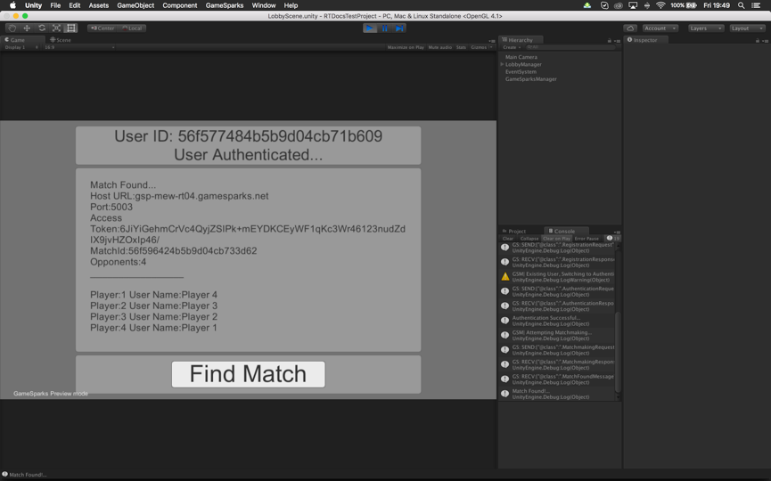

# Real-Time Matchmaking and Player Lobby

## Introduction

In this tutorial, we'll follow on from the initial setup work in the last tutorial and:
* Set up a simple login screen where your players can login.
* Then we'll create a screen for finding a match and displaying the RT session details received from a successful match-matching request.
* Finally, we'll use those details to create a new RT Session and, once the session is initialized, load the main-game scene.

<q>**Unity SDK.** See the [Unity Setup](/Getting Started/Creating a Game/Unity Setup.md) getting started tutorial for how to set up the SDK.</q>

## Lobby Manager Layout

The lobby manager scene will be the first scene encountered when the game is launched. We want to be able to log the player in and then check for a match with any other players that match the criteria we set up in the last tutorial.

This scene layout will be split up into several panels:

*Top Panel*

This panel will have two text-fields which will show the current player's ID, once they have been logged in, and the connection status as they are logging in or finding a match.

*Login Panel*

This will be the first panel to show when the game starts and will have an input-field for the username and password.

*Player List*

Once the player's match has been found, the list of players suitable for the match will be displayed.

*Bottom Panel*

This is where all buttons for logging in, finding a match, and starting the game will appear.

### Top Panel

To begin with, we'll create a new UI Canvas called ‘LobbyManager’, and attach a new script to this object also called *LobbyManager.cs*.


You should then create a new panel inside this canvas called ‘Top Panel’. Then add your two text-fields called userId and connectionStatus.


The next step is to create variables for these fields in our *LobbyManager.cs* class and link those variables to these objects.

We will create two public Text variables in the *LobbyManager.cs* class.

```
public Text userId, connectionStatus;

```

<q>**Note:** If you cannot see the Text object or it is causing a compiling error, you can right-click on the word and select *Resolve-> Using UnityEngine.UI*.</q>

### Login Panel

Next we'll create a larger panel with two input-fields called userNameInput and passwordInput.


And in our *LobbyManager.cs* we'll create two public InputField variables and link them to the objects we have just created. We also need one more variable, a public GameObject, that we'll link to the panel so that when GameSparks has logged the player in, we can switch from the login panel to the matchmaking panel.

```

public InputField userNameInput, passwordInput;
public GameObject loginPanel;

```

### Bottom Panel

For the bottom panel we're going to have several buttons, which will enable/disable depending on if we are logging-in, searching for a match, or starting a new game. Each of these buttons will be in the same place, so the layout will look like this:


In our *LobbyManager.cs* script we'll then add three public Button variables and link these three buttons in the editor up to those variables.

```

public Button loginBttn, matchmakingBttn, startGameBttn;

```

### Match Details Panel

The last panel will display the details of the match we have found through the matchmaking. All we need in this case is a text-field, which is where we will print out these details.

```

public Text userId, connectionStatus;

```

And in our *LobbyManager.cs* script we will create a public Text variable called matchDetails and a public GameObject, which will act as a reference to this panel so it can be enabled/disabled upon login.

```

public Text matchDetails;
public GameObject matchDetailsPanel;

```

Now we are ready to start logging players in and finding matches for our main game.

## The GameSparksManager.cs class

The first thing we need to do before we tie all the lobby elements together is to add in some requests to your GameSparks game which will allow players to login and start the match-making process.

Before you create this class, we must setup a ‘GameSparksManager’ object in our scene to add this class to, and we will also need to add the *GameSparksUnity.cs* class to this object. The *GameSparksUnity.cs* script will allow your project to connect to your GameSparks game.


If you play the game now you, should see some dialog appear in the console window showing the SDK connecting to your game.


<q>**Note:** If you have not received the 'GS:Available' you may need to check how your GameSparks Unity SDK is setup in your project. You can check out a tutorial on how to do this again [here](/Getting Started/Creating a Game/Unity Setup.md).</q>


### The GameSparks Manager Singleton

We're going to make a singleton in this class so that we can access the *GameSparksManager.cs* class from the lobby manager and later from the main-game class.

```

/// <summary>The GameSparks Manager singleton</summary>
private static GameSparksManager instance = null;
/// <summary>This method will return the current instance of this class </summary>
public static GameSparksManager Instance(){
  if (instance != null) {
    return instance; // return the singleton if the instance has been setup
  } else { // otherwise return an error
    Debug.LogError ("GSM| GameSparksManager Not Initialized...");
  }
  return null;
}
void Awake() {
  instance = this; // if not, give it a reference to this class...
  DontDestroyOnLoad(this.gameObject); // and make this object persistent as we load new scenes
}

```

### Authentication

Next, we can start putting in some of our code for logging in your players. For this example, we are going to use an *adaptable login* method, which:
* Attempts a login.
* If the player hasn't been registered, attempts registration with the same details and logs them in that way.

This is very useful for initial testing, because it removes the need for an extra registration screen upon login, and allows you to test with distinct usernames while building your project.

This login method has 4 parts:

*	The RegistrationResponse Callback
*	The AuthenticationResponse Callback
*	RegistrationRequest
*	AuthenticationRequest

So, we're using a callback to allow the lobby manager to update the user's ID and connection-status only when we have received a valid response. The reason for the two callbacks is that the RegistrationResponse and AuthenticationResponse are slightly different. So we want to pass in separate responses:

```

#region Login & Registration
public delegate void AuthCallback(AuthenticationResponse _authresp2);
public delegate void RegCallback(RegistrationResponse _authResp);
/// <summary>
/// Sends an authentication request or registration request to GS.
/// </summary>
/// <param name="_callback1">Auth-Response</param>
/// <param name="_callback2">Registration-Response</param>
public void AuthenticateUser (string _userName, string _password, RegCallback _regcallback, AuthCallback _authcallback)
{
  new GameSparks.Api.Requests.RegistrationRequest()
  // this login method first attempts a registration //
  // if the player is not new, we will be able to tell as the registrationResponse has a bool 'NewPlayer' which we can check
  // for this example we use the user-name was the display name also //
            .SetDisplayName(_userName)
            .SetUserName(_userName)
            .SetPassword(_password)
            .Send((regResp) => {
                if(!regResp.HasErrors){ // if we get the response back with no errors then the registration was successful
                    Debug.Log("GSM| Registration Successful..."); 
                    _regcallback(regResp);
                }else{
                    // if we receive errors in the response, then the first thing we check is if the player is new or not
                    if(!(bool)regResp.NewPlayer) // player already registered, lets authenticate instead
                    {
                        Debug.LogWarning("GSM| Existing User, Switching to Authentication");
                        new GameSparks.Api.Requests.AuthenticationRequest()
                            .SetUserName(_userName)
                            .SetPassword(_password)
                            .Send((authResp) => {
                                if(!authResp.HasErrors){
                                    Debug.Log("Authentication Successful...");
                                    _authcallback(authResp);
                                }else{
                                    Debug.LogWarning("GSM| Error Authenticating User \n"+authResp.Errors.JSON);
                                }
                            });
                    }else{
                      // if there is another error, then the registration must have failed
                      Debug.LogWarning("GSM| Error Authenticating User \n"+regResp.Errors.JSON); 
                    }
                }
            });
    }
#endregion

```

<q>**Note:** If AuthenticationResponse or RegistrationResponse are not recognized or are throwing a complier error, you can fix this by right clicking on them and selecting *Resolve-> using GameSparks.Api.Responses*.</q>

### Displaying Login Status

Once we have this login method setup we can go back into the LobbyManager.cs script and start linking the input-fields and text-fields to the callbacks.

However, the first this we are going to do is to update the connection status to let us know that GameSparks has been connected. For this we are going to use the GameSparksAvailable delegate.

```

    // Use this for initialization
    void Start () {

        // we wont immediately have connection, so at the start of the lobby we will set the connection status to show this
        connectionStatus.text = "No Connection..."; 

        GS.GameSparksAvailable += (isAvailable) => {
            if(isAvailable){
                connectionStatus.text = "GameSparks Connected...";
            }else{
                connectionStatus.text = "GameSparks Disconnected...";
            }
        };
    }

```

### Logging into GameSparks

We'll use a listener for our loginBttn variable to call the GameSparksManager authentication method when it is clicked.

We are also going to create two methods, which will be the callback methods for when the player is authenticated or registered. These methods will update the player ID and connection status. Now that we're ready to setup the scene, what we'll also add to the start method is some code to disable the buttons we don't need right now, and the match-details panel.

```

    // Use this for initialization
    void Start () {

        // we wont start with a user logged in so lets show this also
        userId.text = "No User Logged In..."; 

        // we wont immediately have connection, so at the start of the lobby we
        // will set the connection status to show this
        connectionStatus.text = "No Connection..."; 
        GS.GameSparksAvailable += (isAvailable) => {
            if(isAvailable){
                connectionStatus.text = "GameSparks Connected...";
            }else{
                connectionStatus.text = "GameSparks Disconnected...";
            }
        };
        // only the login panel and login button is needed at the start of the scene, so disable any other objects //
        playerListPanel.SetActive(false);
        matchmakingBttn.gameObject.SetActive (false);
        startGameBttn.gameObject.SetActive (false);
        // we add a custom listener to the on-click delegate of the login button so we don't need to create extra methods //
        loginBttn.onClick.AddListener(()=>{
            GameSparksManager.Instance().AuthenticateUser(userNameInput.text, passwordInput.text, OnRegistration, OnAuthentication);
        });
    }
    /// <summary>
    /// this is called when a player is registered
    /// </summary>
    /// <param name="_resp">Resp.</param>
    private void OnRegistration(RegistrationResponse _resp){
        userId.text = "User ID: "+_resp.UserId;
        connectionStatus.text = "New User Registered...";
    }
    /// <summary>
    /// This is called when a player is authenticated
    /// </summary>
    /// <param name="_resp">Resp.</param>
    private void OnAuthentication(AuthenticationResponse _resp){
        userId.text = "User ID: "+_resp.UserId;
        connectionStatus.text = "User Authenticated...";
    }

```

You should now be able to start your game and login as a new player.


There is only one last thing to do before we move onto the next section. Once the player has been logged in, we want to disable the login panel, and show the match-details panel. At the same time we want to disable the login button and enable the matchmaking button.

This code will go in the OnRegistration and OnAuthentication callback methods.

```

    /// <summary>
    /// this is called when a player is registered
    /// </summary>
    /// <param name="_resp">Resp.</param>
    private void OnRegistration(RegistrationResponse _resp){
        userId.text = "User ID: "+_resp.UserId;
        connectionStatus.text = "New User Registered...";
        loginPanel.SetActive (false);
        loginBttn.gameObject.SetActive (false);
        matchmakingBttn.gameObject.SetActive (true);
        playerListPanel.SetActive (true);
    }
    /// <summary>
    /// This is called when a player is authenticated
    /// </summary>
    /// <param name="_resp">Resp.</param>
    private void OnAuthentication(AuthenticationResponse _resp){
        userId.text = "User ID: "+_resp.UserId;
        connectionStatus.text = "User Authenticated...";
        loginPanel.SetActive (false);
        loginBttn.gameObject.SetActive (false);
        matchmakingBttn.gameObject.SetActive (true);
        playerListPanel.SetActive (true);
    }

```

Now when your player has logged in they will be shown the option to find a match.


## Player Matchmaking

Next we'll setup the player matchmaking.

There are two important things to note:
* For this game example, we have set up a 4-player match in the previous tutorial. This means that we'll need 4 instances of our game running and for each of those instances have a logged in player seeking a match. If the max number of players is not found, the match will not be made.
* Even though a successful matchmaking response will be returned from the server, it is the MatchFoundMessage that is most important to us here, because it will be in this message that we will receive the information we need to create a new real-time session.

So, our matchmaking will have two steps:

*	Send a MatchmakingRequest to find other players.
* Create a listener for the MatchFoundMessage and extract the data we need to create a real-time session.

### Matchmaking request

This request will go in our GameSparksManager.cs script.

```

    #region Matchmaking Request
    /// <summary>
    /// This will request a match between as many players you have set in the match.
    /// When the max number of players is found each player will receive the MatchFound message
    /// </summary>
    public void FindPlayers(){
        Debug.Log ("GSM| Attempting Matchmaking...");
        new GameSparks.Api.Requests.MatchmakingRequest ()
            .SetMatchShortCode ("TANK_BATTLE") // set the shortCode to be the same as the one we created in the first tutorial
            .SetSkill (0) // in this case we assume all players have skill level zero and we want anyone to be able to join so the skill level for the request is set to zero
            .Send ((response) => {
                if(response.HasErrors){ // check for errors
                    Debug.LogError("GSM| MatchMaking Error \n"+response.Errors.JSON);
                }
            });
    }
    #endregion

```

Now, in the *LobbyManager.cs* script we will add a listener to the matchmakingBttn variable, which will call this method when it is clicked. We will also add some updates to the match-details text-field so that we know we are currently looking for a match.


```

  matchmakingBttn.onClick.AddListener (() => {
    GameSparksManager.Instance().FindPlayers();
    playerList.text = "Searching For Players...";
  });

```

Now, if you login and hit the ‘Find Match’ button, you should see the player-list text change, and you will also see the console has a log that the request has been sent.


Now there are two things we must do before we can really test this. We need to set up listeners for when the player receives a MatchFoundMessage, but we should also set one up for when a match is not found. In the latter case, the player will receive a MatchNotFoundMessage.

### MatchNotFoundMessage Listener

For this example, we can use the delegates for these two message-listeners, and to get the information we need from the MatchFoundMessage. This code will also go in the Start() method of the *LobbyManager.cs* script.

```

  // this listener will update the text in the player-list field if no match was found //
  GameSparks.Api.Messages.MatchNotFoundMessage.Listener  = (message) => {
    playerList.text = "No Match Found...";
  };

```

Now, when you try to make a match, you should get about 10 seconds (which we set in the match in the game's portal) and then, if no match was found, you will see the match-details text change to “No Match Found...”.


### MatchFoundMessage Listener

This listener will be setup similar to the MatchNotFoundMessage listener, only we won't use a lambda expression here, because there will be a lot of data to be extracted from this message.

To begin with, we'll validate that the data is there by printing the data to the player-list test field using a StringBuilder.

The important information here is:

*Host URL*

This is used to point the real-time session instance to the correct server.

*Port*

This is used to know which port to connect to for the real-time server.

*Access Token*

The access-token is used to authenticate the player for the match they are being connected to.

However, there is other information that we can get from this response that is going to be useful to us later. Specifically, we can obtain the participants/player list, which we'll use so that each instance of the game knows the IDs of all other players.

To begin with, we'll hook up the MatchFoundMessage listener to a method of our own.

```

  GameSparks.Api.Messages.MatchFoundMessage.Listener += OnMatchFound;

```

Next, we'll setup a StringBuilder object, which we'll use to append the information we want to display onto the match-details field from the message.

```

  private void OnMatchFound(GameSparks.Api.Messages.MatchFoundMessage _message){
        Debug.Log ("Match Found!...");
        StringBuilder sBuilder = new StringBuilder ();
        sBuilder.AppendLine ("Match Found...");
        sBuilder.AppendLine ("Host URL:" + _message.Host);
        sBuilder.AppendLine ("Port:"+_message.Port);
        sBuilder.AppendLine ("Access Token:"+_message.AccessToken);
        sBuilder.AppendLine ("MatchId:"+_message.MatchId);
        sBuilder.AppendLine ("Opponents:"+_message.Participants.Count());
        sBuilder.AppendLine ("_________________");
        sBuilder.AppendLine (); // we'll leave a space between the player-list and the match data
        foreach(GameSparks.Api.Messages.MatchFoundMessage._Participant player in _message.Participants){
            sBuilder.AppendLine ("Player:"+player.PeerId+" User Name:"+player.DisplayName); // add the player number and the display name to the list
        }
        playerList.text = sBuilder.ToString (); // set the string to be the player-list field
    }

```

<q>**Note:** You may have to add the following using statements to the top of your class in order for this to compile.</q>

```

using System.Text;
using System.Linq;

```

## Tips for Testing

In order to test that you've successful made a match, you'll have to be able run 4 instances of the game on your desktop. You can try this on 4 separate devices of course, but it will take time to deploy new builds to each device.

For a windows machine it is not difficult to run multiple instances. However, on a mac you will have to run each instance from the terminal. There is an account of how to do this available [here](http://osxdaily.com/2011/05/11/multiple-instances-application-mac/). It is not a difficult process so don't worry.

We suggest that you run one instance as the editor, and 3 separate instances. This presents a problem, however, because the default behavior for the Unity editor is to disconnect web-sockets when the app is not in focus. Because you'll have to go from window-to-window logging in and searching for the match, this will disconnect successive instances from GameSparks when they are not in focus and the match will therefore fail. To prevent this, you can set the app to 'run In Background' in the player settings.

We also suggest that, for initial testing, you make the windows smaller than usual. This allows you to easily navigate between them when setting up a match. In this example, we used 800x600 resolution so I could fit at least 2 instances on the same screen.

Once you have your 4 instances of the game running, you will need to click on the ‘Find Match‘ button on each instance. When you click on the last instance you should immediately received the MatchFoundMessage in all windows and they will display the match details as below.



<q>**Note 1:** You can also modify the max/min player amount of the match in your game’s portal if you want to test the game with only 2 or 3 instances. However, make sure to test with the full amount of players at some point, because a 2-player match may mask bugs that only appear when there are multiple players sending packets.</q>

<q>**Note 2:** If for some reason these details do not show properly (that is, there are blank fields for the port, host or access-token), then it's possible that your match is not setup to be a real-time match. You can correct this by clicking on the **RealTime** toggle switch in the match panel of your game's portal.</q>

## The RTSessionInfo Class

Now we have our players logging-in and creating successful matches, the next step is to cache this data and save the data as an object in code. In this step, we assume the player wants to wait to start the game after the match has been successful. Therefore, the match details are saved temporarily and used later to make an instance of the real-time session.

The *RTSessionInfo* class will have references for the port, host, and access-token. It will also contain a list of participants of the match and their details. For this game, we're only going to be using the display-name, userId, and the peerId, but extra data can also be obtained from the participant information.

### MatchFoundMessage.\_Participant

This object contains details about the current participants of the match and is returned in the MatchFoundMessage. It contains the following data:

| Parameter      | Type               | Description
| -------------- | ------------------ | -----------
|  Achievements  |  List&lt;string&gt;| This is a list of achievements the player has earned.
|  DisplayName   | string             | The user’s display name.
|  ExternalIds   | GSData             | This is a list of ids related to third party social integrations this player has.
|  Id            | string             | This is the player’s GameSparks ID.
|  VirtualGoods  | List&lt;string&gt; | This is a list of the short-codes of all virtual goods the player owns.
|  PeerId        | int                | This is the peerId the player is given in relation to others in the match. The first player to join the match is given peerId '1'.

For this example, the *RTSessionInfo* class goes at the bottom of the *GameSparksManager.cs* script. You can create your own class for this, but it doesn't need to extend Monobehaviour.

```

public class RTSessionInfo
{
    private string hostURL;
    public string GetHostURL(){    return this.hostURL;    }
    private string acccessToken;
    public string GetAccessToken(){    return this.acccessToken;    }
    private int portID;
    public int GetPortID(){    return this.portID;    }
    private string matchID;
    public string GetMatchID(){    return this.matchID;    }

    private List<RTPlayer> playerList = new List<RTPlayer> ();
    public List<RTPlayer> GetPlayerList(){
        return playerList;
    }

    /// <summary>
    /// Creates a new RTSession object which is held until a new RT session is created
    /// </summary>
    /// <param name="_message">Message.</param>
    public RTSessionInfo (MatchFoundMessage _message){
        portID = (int)_message.Port;
        hostURL = _message.Host;
        acccessToken = _message.AccessToken;
        matchID = _message.MatchId;
        // we loop through each participant and get their peerId and display name //
        foreach(MatchFoundMessage._Participant p in _message.Participants){
            playerList.Add(new RTPlayer(p.DisplayName, p.Id, (int)p.PeerId));
        }
    }

    public class RTPlayer
    {
        public RTPlayer(string _displayName, string _id, int _peerId){
            this.displayName = _displayName;
            this.id = _id;
            this.peerId = _peerId;
        }

        public string displayName;
        public string id;
        public int peerId;
        public bool isOnline;
    }
}

```

Now, all we need to do is use the MatchFoundMessage to create and store a temporary record of the match instance until the start-game button is clicked. We will also need a private RTSessionInfo variable.

First, we'll create the variable and then add a listener to the startGameBttn in the start method of the *LobbyManager.cs* script.

We'll also create a method in the *GameSparksManager.cs* class, which we'll use later to create a new Real-Time session instance. In this example, it's called StartNewRTSession().

```

  private RTSessionInfo tempRTSessionInfo;

  // this is a listener for the startGameBttn. Onclick, we will will pass the stored RTSessionInfo to the GameSparksManager to create a new RT session //
  startGameBttn.onClick.AddListener(() => {
    GameSparksManager.Instance().StartNewRTSession(tempRTSessionInfo);
  });

```

In the OnMatchFound() method we'll use the message details to create a new RTSessionInfo object stored in the tempRTSessionInfo variable. We are going to do one last thing here, which is to disable the ‘Find Match’ button and enable the ‘Start Game’ button.

```

  tempRTSessionInfo = new RTSessionInfo (_message); // we'll store the match data until we need to create an RT session instance
  matchmakingBttn.gameObject.SetActive(false);
  startGameBttn.gameObject.SetActive(true);

```

If you test the game with 4 game instances, you should now notice that, once a new match is found, the button should switch to the ‘Start Game’ button automatically.

## Configuring the Realtime Session

Several things are needed to create a new real-time session. The class we use to create these sessions is the *GameSparksRTUnity.cs* class. So, we'll create a private variable for this, along with a getter, which we can use to access the real-time session when the game is running.

```

  private GameSparksRTUnity gameSparksRTUnity;

  public GameSparksRTUnity GetRTSession(){
    return gameSparksRTUnity;
  }

```

We also need to add the *GameSparksRTUnity.cs* to the GameSparksManager object in our scene. However, we're going to do this programmatically, when a new instance is being created.

We are also going to create a local private variable, so that we have access to the RTSessionInfo we used to create the session. We'll need this many times to get the right display names for each player.

```

    private RTSessionInfo sessionInfo;

    public RTSessionInfo GetSessionInfo(){
        return sessionInfo;
    }

```

Now, in the StartNewRTSession() method we can create the new session by passing in the match details. In order to create a new RT session, we need a FindMatchResponse. This would usually come from the server after a successful match. However, in our case we want to create a session on the push of a button. To do this, we need to create a mocked response using the match details and pass this mocked-response to create the RT session.

So, our StartNewRTSession() Method will look like this:

```

  public void StartNewRTSession(RTSessionInfo _info){
        Debug.Log ("GSM| Creating New RT Session Instance...");
        sessionInfo = _info;
        gameSparksRTUnity = this.gameObject.AddComponent<GameSparksRTUnity>(); // Adds the RT script to the game
        // In order to create a new RT game we need a 'FindMatchResponse' //
        // This would usually come from the server directly after a sucessful FindMatchRequest //
        // However, in our case, we want the game to be created only when the first player decides using a button //
        // therefore, the details from the response is passed in from the gameInfo and a mock-up of a FindMatchResponse //
        // is passed in. In normal operation this mock-response may not be needed //
        GSRequestData mockedResponse = new GSRequestData()
                                            .AddNumber("port", (double)_info.GetPortID())
                                            .AddString("host", _info.GetHostURL())
                                            .AddString("accessToken", _info.GetAccessToken()); // construct a dataset from the game-details

        FindMatchResponse response = new FindMatchResponse(mockedResponse); // create a match-response from that data and pass it into the game-config
        // So in the game-config method we pass in the response which gives the instance its connection settings //
        // In this example i use a lambda expression to pass in actions for 
        // OnPlayerConnect, OnPlayerDisconnect, OnReady and OnPacket actions //
        // These methods are self-explanitory, but the important one is the OnPacket Method //
        // this gets called when a packet is received //

        gameSparksRTUnity.Configure(response, 
            (peerId) =>  {    OnPlayerConnectedToGame(peerId);  },
            (peerId) => {    OnPlayerDisconnected(peerId);    },
            (ready) => {    OnRTReady(ready);    },
            (packet) => {    OnPacketReceived(packet);    });
        gameSparksRTUnity.Connect(); // when the config is set, connect the game

    }

    private void OnPlayerConnectedToGame(int _peerId){
        Debug.Log ("GSM| Player Connected, "+_peerId);
    }

    private void OnPlayerDisconnected(int _peerId){
        Debug.Log ("GSM| Player Disconnected, "+_peerId);
    }

    private void OnRTReady(bool _isReady){
        if (_isReady) {
            Debug.Log ("GSM| RT Session Connected...");
        }

    }

    private void OnPacketReceived(RTPacket _packet){
    }

```

The last thing we need to do is create a new scene, the game-scene, which we'll load when the real-time session starts:

```

    private void OnRTReady(bool _isReady){
        if (_isReady) {
            Debug.Log ("GSM| RT Session Connected...");
            SceneManager.LoadScene ("GameScene");
        }

    }

```

You'll now be able to setup and test your 4 instances. When a match is found, you will have the option to start a new real-time instance, which will load your main-level once setup.

## Creating a new Realtime Session Instance

This tutorial requires the match details obtained from the MatchFoundMessage. It assumes that your project has set up a listener in order to get these details. You can find out more about the MatchFoundMessage [here](/API Documentation/Message API/Multiplayer/MatchFoundMessage.md).

You'll need the follow details from the MatchFoundMessage:

*	Host URL
*	Port No
*	Access Token

In order to create a new RT session we need a FindMatchResponse. This would usually come from the server directly after a successful FindMatchRequest. However, in this case, we want the session to be created only programmatically. Therefore, the details from the response are passed into a mocked FindMatchResponse, which we create in code. 

You'll also need to add the *GameSparksRTUnity.cs* script to whatever Game-Manager object you are using in your scene. In order to configure a new RT session instance, you'll need a reference to that class.

```

  GameSparksRTUnity gameSparksRTUnity = this.gameObject.AddComponent<GameSparksRTUnity>(); 
    GSRequestData mockedResponse = new GSRequestData().AddNumber("port", (double)port).AddString("host", host).AddString("accessToken", accessToken); 
    FindMatchResponse response = new FindMatchResponse(mockedResponse); 

    gameSparksRTUnity.Configure(response, 
            (peerId) =>  {    OnPlayerConnected(peerId);  },
            (peerId) => {    OnPlayerDisconnected(peerId);    },
            (ready) => {    OnRTReady(ready);    },
            (packet) => {    OnPacketReceived(packet);    });

    gameSparksRTUnity.Connect(); // when the config is set, connect the game

    private void OnPlayerConnected(int _peerId){
        Debug.Log ("Player " + _peerId + " Connected");
    }

    private void OnPlayerDisconnected(int _peerId){
        Debug.Log ("Player " + _peerId + " Disconnected");
    }

    private void OnRTReady(bool _isReady){
        if (_isReady) {
            Debug.Log ("RT Session Connected...");
        }
    }

    private void OnPacketReceived(RTPacket _packet){
        
    }

```

### OnPlayerConnected

This method is called when a new player connects to the RT session.

| Parameter | Description |
| --------- | ----------- |
| int peerId | This is the peerId of the player that just connected. You can use this with the list of active peers from the RT session to get the details of the player who just connected.|

### OnPlayerDisConnected

This method is called when a player disconnects from the RT session.

| Parameter | Description |
| --------- | ----------- |
| int peerId | This is the peerId of the player that has just disconnected. You can use this with the list of active peers from the RT session to get the details of the player who disconnected.|

### OnRTReady

This method is called when the RT session has started. Something to note when using this callback is that it's possible for players to be already connected before this callback is triggered, because it's also possible for players not to be connected when this is called.

Therefore, it's not safe to assume that all players are connected to the session if you are using this method to initialize your game.

| Parameter | Description |
| --------- | ----------- |
| bool isReady | This bool will tell you if the session is ready or not.|

### OnPacketReceived

Whenever a packet is received by the player, this callback will be triggered. It contains details about the sender as well as the data that has been sent.

| Parameter | Description |
| --------- | ----------- |
| RTPacket packet | This packet contains details about the sender and the data that was sent. |

For more details on the RTPacket object, consult the API documentation available [here](/API Documentation/Realtime API/RTPacket.md).

### Starting the Game

The last thing we'll do in this tutorial is load the game-scene once the RT-session is ready. Before we do this though, we need to create a new scene called ‘GameScene’. You should also add both the lobby-scene and the game-scene to the build-settings.

We will then add a line to the OnRTReady() method of the *GameSparksManager.cs* to load the game-scene.

```

    private void OnRTReady(bool _isReady){
        if (_isReady) {
            Debug.Log ("GSM| RT Session Connected...");
            SceneManager.LoadScene ("GameScene");
        }
    }

```

Our game will now start a new level once the RT-session starts.

In the [next tutorial](/Tutorials/Real-Time Services/Implementing Real-Time Chat Services.md), we'll add a simple chat-service to this new level so that we can start sending and receiving packets between players.


