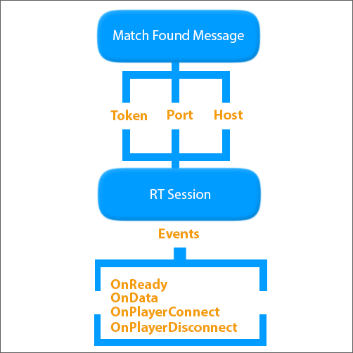
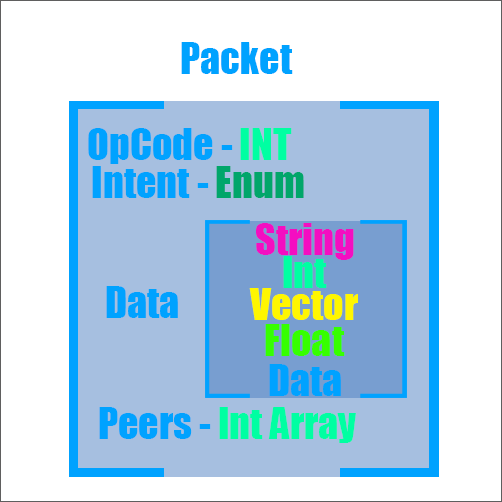
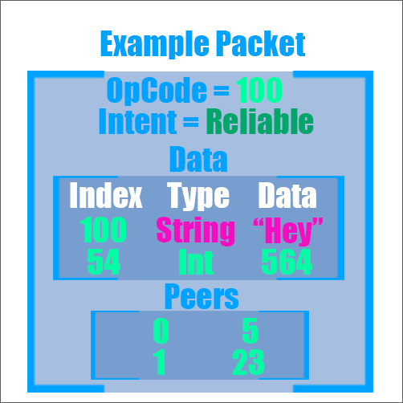

# Understanding GameSparks Real-Time

This tutorial provides an introductory overview for working with GameSparks real-time.

## Creating a Real-Time session

Real-Time sessions are dependent on Real-Time matches. A Match must be configured to support a real-time session once it is found. When a Match has been found, a [MatchFoundMessage](/API Documentation/Message API/Multiplayer/MatchFoundMessage.md) will be sent to the players involved with three important variables:
* *Port Number*
* *Access Token*
* *Host Server*

These three variables are what a client needs to establish a connection to the Real-Time session.

The GameSparks SDK has the *Create Session* function that allows you to connect to a session using the *Port Number*, *Access Token*, and *Host Server*.

The session comes with four useful Events, which help you to organize players, manage games and logic, and use data sent to or from the server or other peers:

* *OnReady* is triggered when the client is connected to the session.
*	*OnData* is triggered when a new packet is received.
*	*OnPlayerConnect* and *OnPlayerDisconnect* are triggered when players join or leave the session.

In addition to these Events, you also have *Stop*, *Start*, *GetPeers* and *Send* functions:

* *Start* and *Stop* functions establish or end the connection to the real-time session.
* *GetActivePeers* returns an array of ints corresponding to the active peers sharing the session.
* *Send* allows the client to send packets of data to the server or other peers. These packets will be intercepted using *OnData* Event.

## Packets and Connection

* Active clients in the Real-Time session can send packets to any one of their peers.
* Clients can also send the packets directly to the server for it to be processed through Cloud Code.

Real-Time sessions have access to every part of the backend and can execute logic on behalf of any player. You can add logic to your server by creating a Real-Time script in the Cloud Code section and configuring the Match to use that script.

You can place logic in the script that reacts to packets, to players connecting, and to players disconnecting using the same functions:
* *OnData*
* *OnPlayerConnect*
* *OnPlayerDisconnect*

The packets sent and received have four attributes:

* *OpCode* - Mandatory. Helps distinguish the packet. For example, you can reserve *OpCode 100* for movement logic so whenever the client receives a packet with the *OpCode 100* it knows to retrieve a vector and update that client’s position in game.

<q>**Important!** Note that *OpCode 0* Does not work. Do not address Packets with *OpCode 0*.</q>

* *Intent* - Mandatory. The Intent options we offer are:
  * *Reliable* - Makes sure that packets sent are received.
  * *Unreliable* - Doesn't ensure packets are received but can discard packets if the bandwidth cannot support them (ideal for cosmetic purposes).
  * *Unreliable_Sequenced* - Similar to Unreliable but packets will be discarded if not received in the correct sequence.
* *Data* - Optional. Sometimes it’s enough to send a packet without data to act as a trigger. The data in packets can be a string, int, vector, float, and nested data. Each piece of data is saved in an index that you must set.
* *Peers* - Mandatory. An int array of which peers to send to. *Peer ID 0* is the peer address of the server. The other peers are those sharing the session with the client.

## Example

To retrieve Data from a packet you would use *Has Type* and *Get Type* functions. For example, if you were trying to retrieve a string from index 20 you would:
* First check if this string exists by using *Has String* in reference to index 20.
* If Index 20 does indeed contain a string, then the function will yield true and allow you to dictate what happens depending on a condition which is usually followed by *Get String*.
* If you’re confident that your packet will always have a string, you can bypass the need to check for data but it’s safer to keep checking, especially for unreliable packets.

## Summary

* When a *MatchFoundMessage* for a real-time match has been received, it will contain an *Access Token*, *Port Number*, and *Host Server*, which are used to call the *Create a Session* function which connects the client to the session.
* The session will not be connected to until the client calls the *Start* function. Similarly, a player will disconnect from a session if the *Stop* function is called.
* Packets can be sent to the server and any active peers directly.
