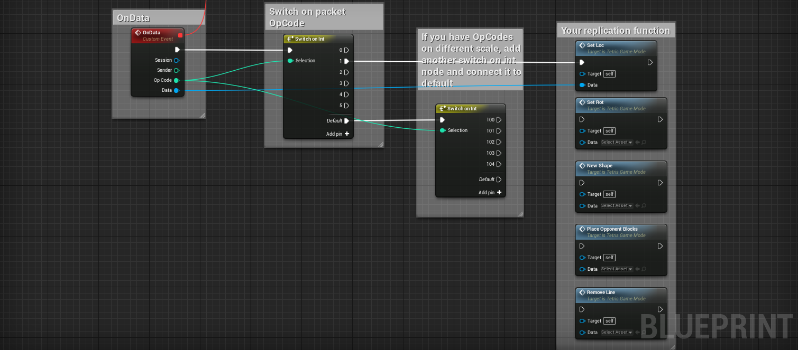
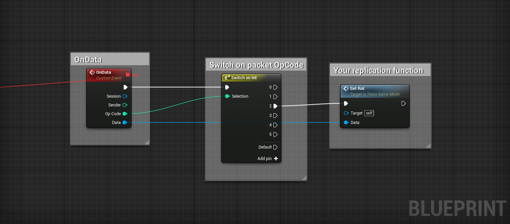

# Unreal Real-Time Guide and Replication Example

GameSparks' real-time capabilities are easy to learn and use and offer game developers working in Unreal an easy multiplayer option without having to rent servers and host their game instances online:
* Real-time sessions allow users to send data packets to each other. This is a substitute for Unreal's networking layer.
* All variable replication and spawning of other client actors will have to be done manually.

To run a real-time session you'll need :

- To create a real-time Match on the portal under *Configurator -> Multiplayer*. For details on how to do this, follow [this](https://docs.gamesparks.com/tutorials/real-time-services/setting-up-real-time-matchmaking.html ) tutorial.
- Allow a player to authenticate and call a [MatchmakingRequest](/API Documentation/Request API/Multiplayer/MatchmakingRequest.md) from your game. Set the *MatchmakingRequest* to take the Short Code of your real-time Match.
- On *Message Found* message, initialize a real-time session and bind its Events to Custom Events in Unreal (In your gamemode).
- Send and receive packets from clients.
- Replicate data from clients in local game.

<q>**Game Seems Slow?** Your game will seem slow when testing in multiple editors if you don't go to *Editor Preferences -> General -> Miscellaneous* and untick the *Use Less CPU when in background checkbox*.</q>

This tutorial:
* Shows you how to initialize for a real-time session.
* Provides an example of [function execution and replication](#Example of Function Execution and Replication).

<q>**Gamemode!** The following will take place in your gamemode.</q>

## Authenticating and Calling a Matchmaking Request for Testing

This is only intended for testing. Your authentication and function-calling solutions will have to fit your application's needs.

### GSMessageListeners Ccomponent and Session Initialization

- Add a *GSMessageListeners* component.
- From the component, create a *Match Found* event. This will fire when a Match has been found.
- You want to create a real-time session from the three variables - *Port Number*, *Host*, and *Token* - that become available when a *Match Found* message is received.
- Create a reference for the real-time session for future calls.  

### RT Session Events

- Create bindings for the 4 real-time Events.
- Grab the Event node from the bind node and type "Add Custom Event" and click on the function, this will create the necessary Custom Event with the appropriate output nodes.

- The Events are as follows:

  - The *OnReady* delegate will notify the client that it's connected to the server. Here you can do any game initialization you wish.
  - The *OnPacket* delegate will notify the client whenever a new packet is received. This will be used to notify the client of game changes or data to be replicated.
  - The *OnPlayerConnect* and *OnPlayerDisconnect* will notify the client of any players joining or leaving the session.
  - Remember to add the *Start Session* node, which connects that client to the session. This will trigger the *Player Connected* Event to other users currently in the session and the server. The user's *OnReady* Event will fire with the *Ready* Boolean set to True.  

### Sending packets

This is the core replication aspect in GameSparks' real-time SDK. Unlike Unreal's inbuilt networking layer, you'll have to manually spawn, remove, and set the location of your actors. Our Tetris example comes fully commented in Blueprint so you can see how gameplay sequences end with functions made to replicate changes. Replication functions send packets to other clients who receive these and update actors representing other clients.

* **Minimal Size Packets**
  * A packet doesn't need data in it apart from the *OpCode*, intent, and targeted peers.
  * An empty packet can be sent to other clients to represent an Event, such as the death of client's character or a move in a direction. For example, if a client receives a packet with *OpCode 50* in a head-to-head game, the client will know that means the opponent has activated their ultimate mode and that will be reflected in their game.
  * The smaller the packet, the less bandwidth it uses, which means more packets can be exchanged faster and more reliably.
  * *OpCode* 0 does not work, do not address packets with *OpCode* 0.

* **Packets with Extra Data**
  * Some packets need extra data to be translated into something useful when delivered.
  * Packets can take vectors, Fvectors, Floats, Ints, Strings, and nested Data objects.
  * Variables occupy fixed index positions in the packet. When you declare a variable, it is referenced via index number not variable name.

  <q>**Server Address?** Peer ID 0 is reserved for server. If you wish to send information exclusively to the server then create an Int array with the value 0 in the first index.</q>

### Receiving packets

If you've bound the *OnData* Event to a Custom Event in your gamemode, then clients will be able to receive packets:
* Packets are delivered with an *OpCode*, sender's peer ID, the data/payload/variables, and reference to the session.
* The *OpCode* is useful to determine what kind of packet is received and what sequence it should follow.
* In our example we switch on *Int* value of *OpCode* to determine if the packet is relevant for location, rotation, or other gameplay instructions:

Once that information is delivered you can use it to make changes to the actor representing the opponent's client in the local player's game/world. Each client has their own world, map, or level. Other clients are represented through actors present in those levels, whether they are a character or a Tetris piece. Packets coming in are used to update these actors to represent change made by that client.

The process is as follows:

- Client A makes a move to the left.
- A function will run the logic to move the client to the left (Gameplay logic).
- At the end of function, the new location information will be sent to other clients through a packet with an *OpCode* reserved for location. This packet will contain the current location of Client A's actor.
- Client B will receive a packet with the *OpCode* for location, which will be processed when received. For the Tetris example we have a function to check for the location data. If that data is available, then we apply it to the actor which represents Client A.

<q>**Optimizing Packet Size!** The trick becomes - how do you deliver the information in the smallest size possible to represent the change made by a client?</q>

## Example of Function Execution and Replication

The rest of this guide demonstrates how an input from a client turns into packet information that is delivered to another client and processed. The process is as follows:

* Player hits 'W' to rotate.
* Rotation logic is processed.
* If player is allowed to rotate, then a rotation packet is sent to other clients involved.
* The rotation packet is delivered, broken down, and used in a set rotation function for the replicated shape owned by the client that sent the rotation logic.

*1.* This is a simple function triggered via input. The function checks if the local player's Tetris piece (Active Shape) is allowed to rotate. All of this is done on the client side so hacking is possible. A possible solution is saving values and invoking functions through the GameSparks real-time server first but we'll cover that in another tutorial.

*2.* Once the function gives the player the ability to rotate, it will also start the process of sending that information to other clients in the real-time session by calling the Event from the gamemode responsible for sending rotation packets.

*3.* The rotation Event is fed to the local player's controlled shape's rotation. The rotation information is then saved in a vector in the data object, placed in index 1 in the packet's data object, and sent to all active peers in the session with *OpCode 2*.

*4.* When that packet is received by the opponent player, it will be known that this packet is a rotation packet because of its *OpCode*. We switch the sequence based on the *OpCode* and feed the data into the appropriate function - in this instance we're calling the rotation function that will replicate the sender's controlled shape's rotation.

*5.* The function will check if the data is present (Safety check). If that data exists, break down the vector and extract the XYZ variables, and set the replicated shape's rotation.

*6.* To spawn the shape we assigned an Int for every shape type:
* When the local player spawns a new shape, they'd send a packet with the Int that corresponds to the shape they just spawned (For example Int = 1 for shape 1).
* Their opponent would receive the packet, get that Int, and spawn the correct shape and set that shape as the opponent's replicated shape which location and rotation packets will affect.

<q>**Download Sample Project?** You can download the Sample project with the Unreal SDK and have a look at the functions to see how we've attempted to replicate the information. Each function is commented for your convenience.</q>
