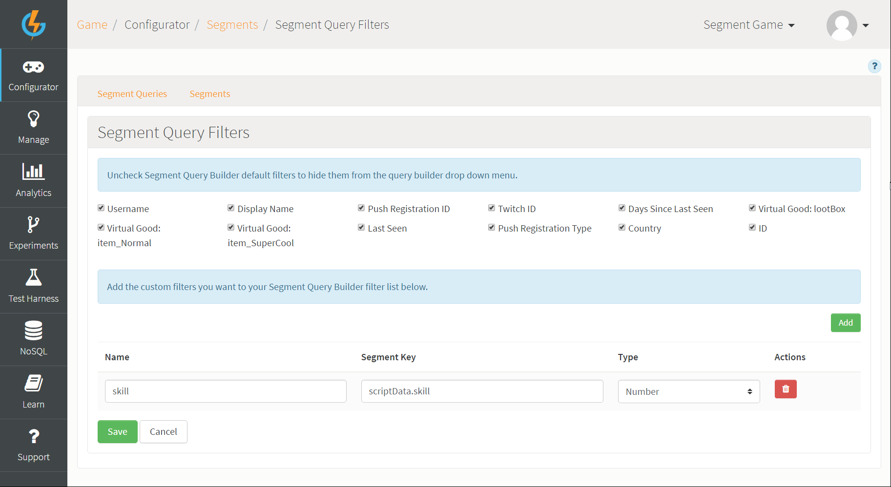
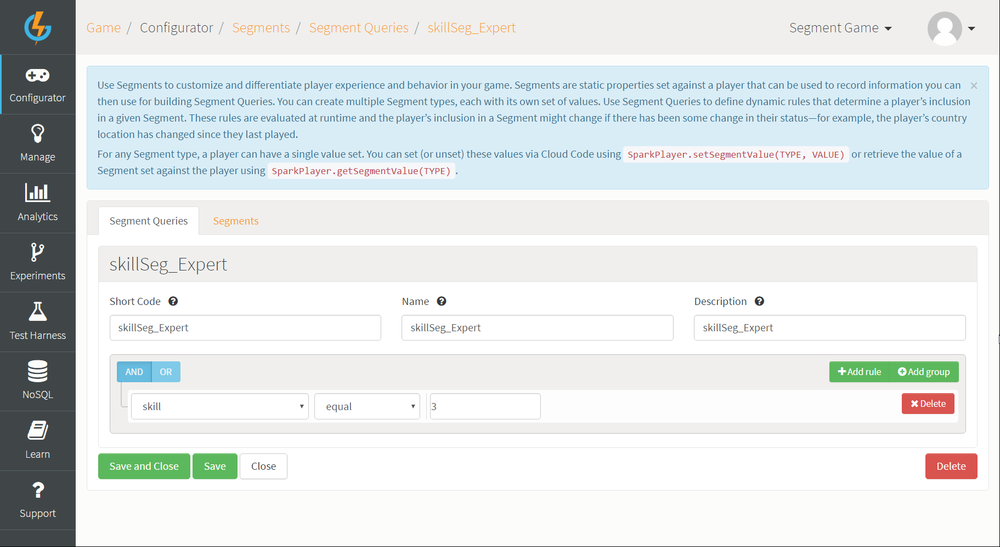
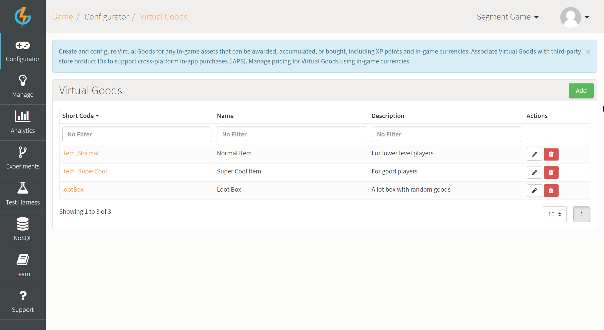
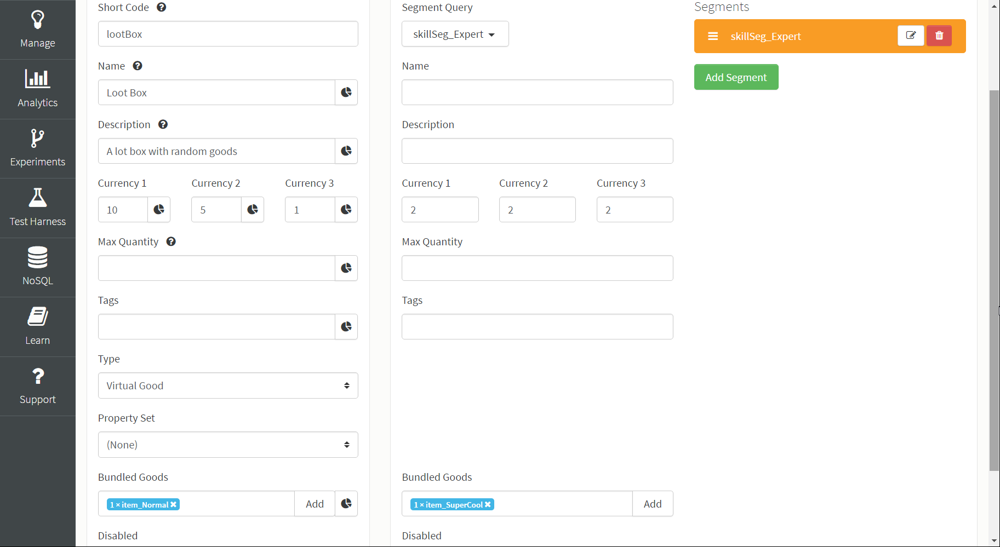

# Using Custom Segment Query Filters

This tutorial shows you how to create custom segment query filters and use them in a real-life scenario. Segment Query Filters allow you to create queries from custom variables set by you. For this tutorial we'll create a skill variable for our players and create a Segment Query Filter that allows us to customize the player's experience based on their skill.

## Creating the Skill Variable for Player

For this step, we create a number variable within the player's scriptData and name it *skill*. To do this, we use Cloud Code attached to an Event:

```
Spark.getPlayer().setScriptData("skill", 3);

```

## Creating the Custom Segment Query Filter

*1.* Go to *Configurator>Segments*.

*2.* On the *Segment Queries* tab, click the *Segment Query Filters* button.

*3.* Click to *Add* a new custom Segment Query Filter.
* We'll call the custom filter *skill*.
* For the *Segment Key* field enter *scriptData.skill*.
* Select *Number* as the custom filter *Type*.

*4.* Click to *Save* the new custom Segment Query Filter:



## Creating the Segment Query

We'll be creating a Query Segment to track high-level players. This Segment Query will then be available for use throughout the platform.

*1.* Go to *Configurator>Segments*.

*2.* On the *Segment Queries* tab, click to *Add* a new Segment Query.

*3.* Give the Query a *Short Code*, *Name*, and *Description*.

*4.* Configure a Query *Rule* and use the custom Segment Query Filter that we created [above](#Creating the Custom Segment Query Filter):
* In the rule drop-down, you'll find it in the Custom section.
* Create a rule for "skill equal to 3". If the player's skill level is equal to 3, then they'll qualify to be an expert player.



## Segmenting a Virtual Good using the Segment Query

We'll be using Virtual Goods as an example of how to apply our Segment Query that uses a custom Segment Query Filter. Because our player is an expert, we're going to award them better items in the bundles they get when they buy Virtual Goods:

*1.* Go to *Configurator>Virtual Goods*.

*2.* Add two new Virtual Goods:
* Name the first one *item_Normal*.
* Name the second one *item_SuperCool*.

The other details of these Virtual Goods are not important for this tutorial.

*3.* Add a third Virtual Good and call this one *lootBox*. This is the Virtual Good that we'll segment:



*4.* Click to edit  the *lootBox* Virtual Good:
* Enter the cost of the Virtual Good in Currencies 1, 2, and 3.
* On the *Bundled Goods* field, click to *Add* the *item_Normal* as a bundled good.

*5.* Click the *Segment* button at the top. The *Segment Configuration* panel opens.

*6.* Click to *Add Segment*.

*7.* In the *Segment Query* drop-down, select the *skillSeg_Expert* query that we created [earlier](#Creating the Segment Query).

*8.* Enter the alternative Virtual Good values you want for the high-level players that satisfy the Segment Query rule of having a skill level equal to 3:
* Currency 1, 2, and 3 - enter alternative Virtual Good costs.
* Bundled Goods - add the *item_SuperCool* Virtual Good.

*9.* Click to *Save and Close* the segmented Virtual Good:



## Testing your Segmentation in the Test Harness

Before testing your segmentation of a Virtual Good, ensure your segmentation is set up correctly. Check the following:

* That your player has the variable 'skill' in their scriptData and is set to 3 or value higher. To check this, call the *AccountDetailsRequest* and check the scriptData object, it should look like the following:

```
"scriptData": {
    "skill": 3
  }

```
If you do not see this, you can run the Event you've attached the Cloud Code to for creating the [player's skill variable](#Creating the Skill Variable for Player).  

* That your [Segment Query Filter](#Creating the Custom Segment Query Filter) segment key is correct. It needs to contain 'scriptData.' followed by your variable name.
* That your [Segment Query's rule](#Creating the Segment Query) is correctly set up. For this example we're using "skill equal to 3".
* That your [segmented Virtual Good](#Segmenting a Virtual Good using the Segment Query) is using the correct Segment Query and the values set for Currencies 1, 2, and 3 and the bundled good are correct.

**To test your setup:**

*1.* Go the the [Test Harness](/Documentation/Test Harness/README.md) and authenticate a player - one with the *skill* variable in their scriptData.

*2.* Use the *BuyVirtualGoodsRequest* to purchase the segmented *lootBox* Virtual Good using Currency 1, 2, or 3:
* If everything is configured correctly, your player will be charged the alternative currency costs for the Virtual Good and receive the *item_SuperCool* Virtual Good as a bundled good.
* You should see that these alternative segmented values have been applied to the player in the *BuyVirtualGoodsResponse* in the Test Harness in the *Inspector Window*.

## Conclusion

Segment Queries can be used in many other areas in the portal to customize the experience of players who satisfy the rules you have set up for a particular segmentation query.
