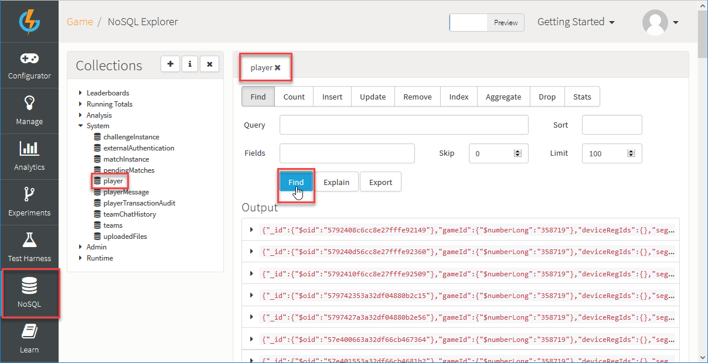
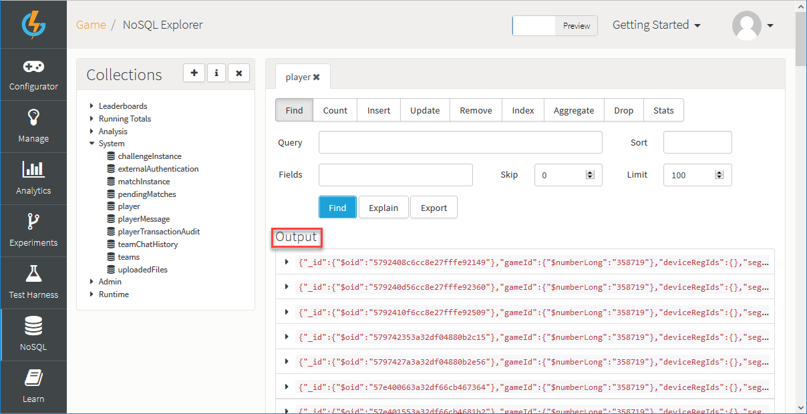

# Accessing and Updating Player Records

## Introduction

An important capability for a back-end is that it gives you the ability to access your player's info in real-time and allows you to change this data. GameSparks gives you the ability to do this using multiple approaches.

This tutorial explores how to access player records using the NoSQL Explorer and Cloud Code.  

## Working with the NoSQL Explorer

The *NoSQL Explorer* is a powerful tool you can use to access and find any Collection of data you have in your game:

*1.* To open the NoSQL Explorer, click *NoSQL* in the left-hand navigation panel.

*2.* To access player data, under *Collections* expand the *System* heading and select *player*. An interactive panel for the *player* Mongo database Collection opens, which contains options for submitting the available database operations for this Collection. The operations panel opens with the *Find* operation selected by default.

*3.* Click the *Find* button:



You can enter a *Query* to find specific players but simply clicking *Find* runs a search for all players and the result is returned into the *Output* panel below:



*3.* When records are retrieved, you can click on them to expand them. Once expanded you can see all the data that are linked to the player including data you can't normally see when you call an account details request - data such as authentication tokens, external IDs, reserved currency, and private data, which you may not see and use often.

Here's an example of a newly created player's record:


<q>**More Information!** For more information about using the NoSQL Explorer, click [here](/Documentation/NoSQL Explorer.md).</q>

## Using the Player Management Screen

You can use the player management screen to offer a visual experience while you access player data and change variables realtime. The player management screen can be found in the manage section of the portal.

*1.* To access player data, click *Manage>Players*.

*2.* On the *Player Search* panel, build and submit a query for the player data you want. The results of the query are returned into the *Results* panel.

*3.* To view the player data for a result, click the edit  icon. The *Edit Player* screen appears:


* You can use the dynamic forms builder to customize this screen in whatever way you like.
* You can tailor your team's experience and design what is shown on the screen to suit different users. For example, you can offer special screens for customer service, where they are allowed to change certain values, while your programmers have access to a different screen.

<q>**More Information!** For more information about dynamic forms, click [here](/Documentation/Manage/Working with Dynamic Forms.md).</q>

## Accessing Data through Cloud Code

You can use Cloud code to retrieve players and access their records. You can do this through a specified ID which you can retrieve from [AccountDetailsRequest](/API Documentation/Request API/Player/AccountDetailsRequest.md).

```

//You can have the player ID saved or manually passed in
var playerID = "5602c3dce4b07961f34b68c3" //Manually set the ID

//Finding the player through their ID
var playerVar = Spark.loadPlayer(playerData.$oid); //or (playerID) //Make a reference for that player through their ID.
```
