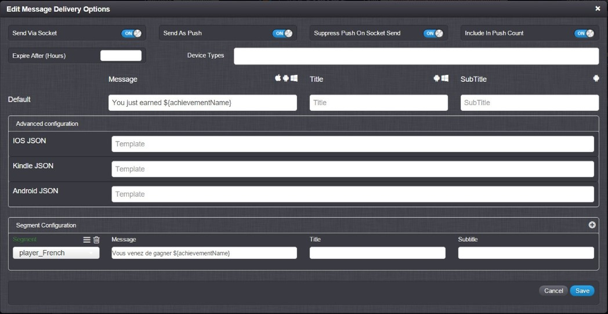

# Communicating with Players

## Introduction

You'll need to be able to communicate to your players for various reasons. Maybe you want to display a daily message, inform a player of a certain promotion, or send a player a token which they can use to retrieve their password.

GameSparks offers you several ways to send messages to your players with incredible ease, flexibility, and customization:
* Messaging through sockets (in-game).
* Push notifications.
* Using Cloud code.
* E-mail.  

## Messages

Messages are used to notify your players with events or information. GameSparks includes many native messages such as earning a new achievement, acquiring a new highscore, or losing a position on a Leaderboard. You can customize these messages or create new ones:
* **Sockets.** Messages can be sent to your players through sockets, so players only receive them once they're authenticated and in-game, which would be intercepted and outputted to the player using message listeners.
* **Push Notifications.** Messages can also be sent to your players through push-notifications.
* **Customized Messaging.** You can update any of the native GameSparks native messages to suit your game and segment the messages depending on the player and display different message entirely. You can also format your message depending on OS and include or omit players with a specific OS.



 

## Messages through Cloud Code

Cloud code is a great way to dynamically change strings/images/values within your game in real time to communicate with your players. Some examples:
* You can have a message of the day or news column in your main menu which is regularly updated by the game's development team.
* You can also use this type of communication for version checking to ensure that online and multiplayer features are only activated if the player has the latest build.
* Using Cloud Code to supply players with the IP address to join a server.

```
    //Sets the IP Address for the player to retrieve
    Spark.setScriptData("serverIPAddress", "127.0.0.1");
    //Sets message of the day to view in-game, updates realtime
    Spark.setScriptData("dayMessage", "Smile! One day until the weekend!");
    //Sets buildVersion to control who gets to access to multiplayer
    Spark.setScriptData("buildVersion", "1.7");

```

 

## Using SendGrid to Send E-Mails

GameSparks comes integrated with *SendGrid* which gives you the ability to send E-mails to your players but make sure to save E-mails against your player for reference. For an example of how to use SendGrid for a password retention process, click [here](/Tutorials/Social Authentication and Player Profile/Automating User Password Change.md).

<q>**More Information!** For more information about SendGrid, click [here](/API Documentation/Cloud Code API/Integrations/SendGrid.md).</q>
