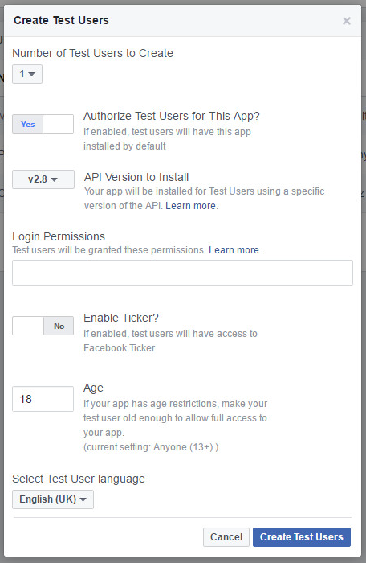

# How to Authenticate a Player using their Facebook Account

You can use Facebook authentication to offer your players a simple way to sign in with their Facebook account details. The GameSparks platform can then use a player’s profile to drive its social features.

In this tutorial, we’ll go through setting up the necessary configuration with Facebook and explain how you can then use that to connect your players.

## Setting up a Facebook Application

*1.* Go to the [Facebook developer portal](https://developers.facebook.com/) and sign in (or sign up to Facebook first).

*2.* Now select the *Register* option:


*3.* Accept the Facebook Platform Policy and the Facebook Privacy Policy in the dialog that appears.

*4.* Next, verify your account by obtaining and entering a code via your mobile phone.


Now you’re ready to create your app.

*5.* Click* My apps->Add a New App.*


*6.* Fill in the *Display Name* and *Contact Email* fields, select your *Category* and *Sub-Category* in the drop-down menus then click *Create App ID*.


And that’s it, you now have a Facebook application.

There are various configuration options you can play around with, but for now all you’re interested in are the *App ID* and *App Secret*.


*7.* In a separate tab/window, head over to [the GameSparks developer portal](https://portal.gamesparks.net/) and click the *Configurator* -> *Integrations*

*8.* Under *Providers* -> *Facebook*, click *Edit*:


The *Edit Facebook Configuration* dialog appears:


*9.* Go back to the Facebook application and copy and paste the *App Id* and *App Secret* (click the *Show* button to reveal the secret) values into the *Facebook App Id* and *Facebook Secret* fields respectively on the dialog.

*10.* Click *Save*.

Your GameSparks game is now configured to use your newly-created Facebook application: you’re set up to authenticate your players via Facebook, and the GameSparks platform can access their profile to drive its social features.

## Authenticating a Player Using their Facebook Account

Authentication via Facebook is done using the [FacebookConnectRequest](/API Documentation/Request API/Authentication/FacebookConnectRequest.md).  To do this, you need to obtain an Access Token for your player.  Facebook's authentication flows are based on the [OAuth 2.0](http://tools.ietf.org/html/draft-ietf-oauth-v2) protocol.  Facebook recommend you read their[ Facebook Login guides](https://developers.facebook.com/docs/facebook-login/) for examples of how to use the Login Dialogs on any device or environment.

For the purpose of this tutorial, you can just get hold of the access token for a test user within the Facebook application that you created.

*1.* First select your application in the Facebook developer portal from the *Apps* menu.

*2.* Then select *Roles* from the left hand menu.

*3.* Then under *Test Users* tab, click *Add*. The *Create Test Users* dialog appears:

*4.* In the *Create Test Users* dialog, select the number of test users that you require and switch *Authorize Test Users for This App* to *YES*.



*5.* Click to *Create Test Users*. The created test user(s) will be displayed in the list.

*6.* Click *Edit* and on the drop-down select to get the access token for the test user:


*7.* Copy the access token.  You will use it in the GameSparks portal Test Harness in the next section.


## Trying out Facebook Authentication in the Test Harness

*1.* Back in the GameSparks developer portal, click on the *Test Harness* button.

*2.* Within *Authentication*, click *FacebookConnectRequest*, and fill in the accessToken field value with the access token that you obtained above and remove the 'code' field and value.

*3.* Click the send icon.  You should see an *.AuthenticationResponse* containing a *displayName* for the player that the platform has looked up from the Facebook profile.

```    
{
 "@class": ".FacebookConnectRequest",
 "accessToken": "accessToken",
 "requestId": "1400764433829"
}
```  

If the authentication with Facebook is successful you will see a response like this:

```    
{
 "@class": ".AuthenticationResponse",
 "authToken": "c450ed6c-98e0-41f4-af04-539ad4099151",
 "displayName": "Player One",
 "requestId": "1400764433829",
 "scriptData": null,
 "userId": "537df8f1e4b01fdedfa3770f"
}

```

<q>**Multiple Social Authentications!** If you try to authenticate another test user through the same GameSparks user account *BEFORE* disconnecting the first linked account or *BEFORE* refreshing the session, you will receive an error because the account remains linked:</q>

```

{
 "@class": ".AuthenticationResponse",
 "error": {
  "accessToken": "ACCOUNT_ALREADY_LINKED"
 },
 "newPlayer": false
}

```

<q>**Use a Tab per User.** If you want to want to work with multiple Facebook accounts in the Test Harness at the same time, we recommend you use a separate browser tab for each user to avoid this error.</q>

## Checking Facebook Friends

*1.* Now, create another test user in the Facebook developer portal and under *Edit* select the *Manage this test user's friends* icon.


*2.* Add the other test user as a friend to this user.


*3.* Now, obtain an access token for this new test user and send a *FacebookConnectRequest* to the GameSparks platform via the Test Harness.

*4.* Next, in the Test Harness click on *User* -> *ListInviteFriendsRequest* and you should see that the list of friends contains the other Facebook test user.

```

{
 "@class": ".ListInviteFriendsRequest",
 "requestId": "1400765749481"
}

```

```

{
 "@class": ".ListInviteFriendsResponse",
 "friends": [
  {
   "id": "FB:107131019762602",
   "displayName": "Mark Alacigaabfjei Panditsky",
   "profilePic": "http://graph.facebook.com/100008325436352/picture"
  }
 ],
 "requestId": "1400765749481",
 "scriptData": null
}

```

Now head on over to [Social Capabilities](/Documentation/Key Concepts/Social Capabilities.md) to see how you can make the most of social integration.
