# How to Authenticate a Player Using their Google+ Account

You can use Google+ authentication to offer your players a simple way to sign in with their Google+ account details. The GameSparks platform can then use a player’s profile to drive its social features.

In this tutorial, we'll go through setting up the necessary configuration with Google and explain how you can then use that to connect your players.

## Setting up an Application with Google

*1.*  Head over to the [Google Developer Console](https://console.developers.google.com) and sign in if you already have an account.  Sign up if you don't.

*2.* Go to [Google Play Game Services](https://developers.google.com/games/services/).  Follow the relevant *Getting Started* section based on the application type that you are creating by navigating to [Set up Play Games Services](https://developers.google.com/games/services/console/enabling).  The most important step to understand is the *Add your game to the Google Play Developer Console*.

<q>**TIP!**  If you've got time, it's worth a read.  There is a wealth of information hidden away in these pages! If you're targeting more than one platform (Android, IOS, Web, and so on...), just pick one to start with - a chunk of the setup will only need to be done once.</q>

*3.* While setting up your application in the *Google Play Developer Console*, also add a "Web" linked application.  This will serve as our "Server" client in later steps. It's important that this be created through the [Google *Play* Developer Console](https://play.google.com/apps/publish/), instead of through the standard Google *Developer* Console. If you don't do it this way, when you try to get a token later it will fail to work correctly.

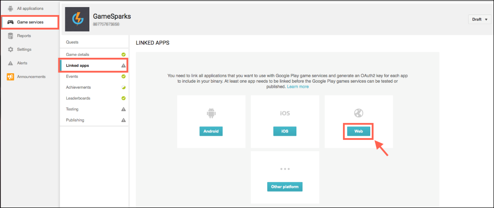  

*4.* Make a note of the *OAuth Client Id* that is generated when the application is set up.

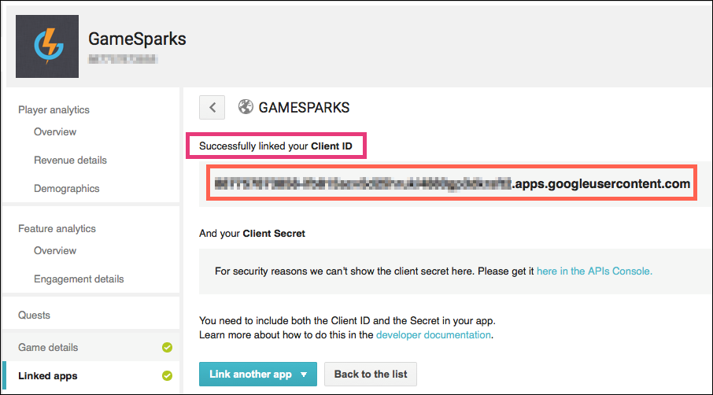
  
*5.* After setting up the application, follow the steps from the [Google+ documentation](https://developers.google.com/+/). The relevant section is "Enable server-side API access for your app", located [here for Android](https://developers.google.com/+/mobile/android/sign-in#enable_server-side_api_access_for_your_app) and [here for iOS](https://developers.google.com/+/mobile/ios/sign-in#enable_server-side_api_access_for_your_app) (for a web application the relevant section is under [Server Side Flow](https://developers.google.com/+/web/signin/server-side-flow)). This explains how you are going to get hold of the access code that we need to pass through to the server later on.

<q>**Important!** If the instructions talk about "your server's client ID", this is where we need to substitute in the *OAuth Client Id* from the Web application we created within *Google Play Developer Console*. If you begin to distribute your game on more than one device, it's always this Web Application that we use as the "Server" Client ID. When requesting the token, you are required to provide the "*scopes*" of the token which determine what you can gain access to.  Currently, the only scope we require to support our social features is "https://www.googleapis.com/auth/plus.login"</q>

*6.*  Go into the [Google Developer Console](https://console.developers.google.com), select your project and under *APIs & auth* and click *Consent Screen*.

*7.* Fill in the *Email Address* and *Product Name* fields, click *Save*. Again, without doing this we can end up with some failures later on.

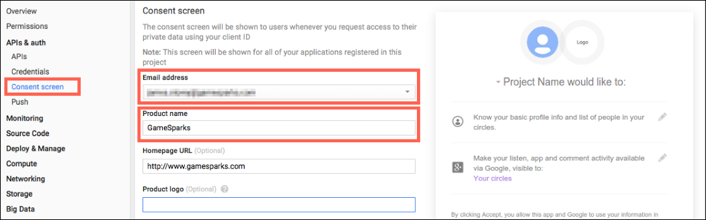  

## Configuring your GameSparks Game

Now we've done that, here comes the easy part.

*8.* Go into the [GameSparks Developer Portal](https://portal.gamesparks.net/) for the game, and go to *Configurator* > *Integrations*.

*9.* Select the Google* tab and click *Edit*.

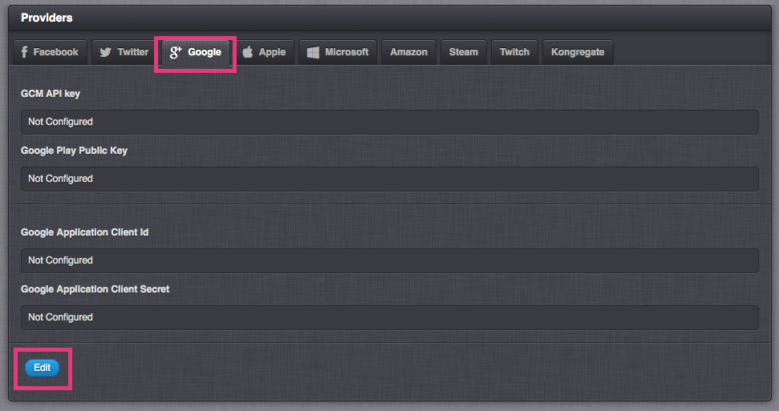  

You can view the Application Client Id through the [Google *Play* Developer Console](https://play.google.com/apps/publish/), *BUT* you can *only access* the Client Secret under the standard [Google *Developer* Console](https://console.developers.google.com):

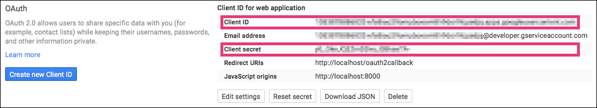  

*10.* Fill in the fields *Google Application Client Id* and *Google Application Client Secret* using the *Oauth Client Id* and *Client secret* from your Google Web Application and click *Save*.

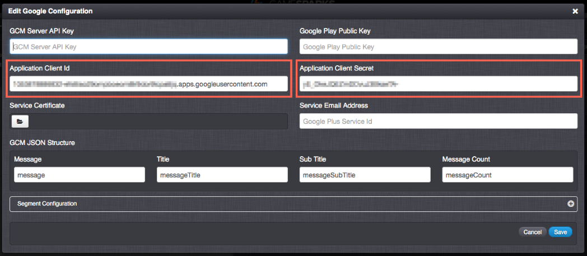  

That's all there is to it. Now we're ready to make a [GooglePlusConnectRequest](/API Documentation/Request API/Authentication/GooglePlusConnectRequest.md).

*11.* Get an access code using the method described in the relevant Google documentation above, then go to the [Test Harness](/Documentation/Test Harness/README.md).

*12.* Under *Authentication*, choose the *GooglePlusConnectRequest*. You can now send the access code through as the "code" parameter, and your Google+ profile will be connected!

```
     { "@class": ".GooglePlusConnectRequest",
       "code": "4/kHkxY8JbQ4bDBxabWyHyrVI3oROi8LcF_Fk25DF3bWM.QpEEsFOJzU8RJvIeHux6iLahn6g8kgI",
     }
```

Response:

```
     {
     "@class": ".AuthenticationResponse",
     "authToken": "1c9314ad-6309-40aa-9ef6-03544047c78a",
     "displayName": "David Clark",
     "requestId": "1413552906008",
     "scriptData": null,
     "userId": "5418461b1c26e32e438653d4"
     }
```

That's it!  You are now authenticated with Google!

As a basic setup of the Google authentication, these are the only steps you will need. However, if you are interested in knowing other alternative ways on how to authenticate your Players with Google, then read on...

## Authenticating via the Redirect URI

If you have a local web server available, it can be used to authenticate your game and Client ID to generate an access code using a *redirect* *URI.* The resulting POST message will contain the access code to authenticate your Google Plus account with the GameSparks platform.

*13.* On your local web server, you'll need to create a HTML page that will contain the Google Sign in button.  The HTML page should contain the following pre-requisites:

It should also contain the *signInCallback* JavaScript function used to process the sign-in result containing the authentication code and access token:

```
<script>
function signInCallback(authResult) {
  if (authResult['code']) {
    console.log(authResult['code']);
    console.log(authResult['access_token']);
  }else{
   console.log(authResult);
  }
}
</script>

```

Finally, it should include the details for the sign-in button itself, including your *Client ID* for the web application created earlier in the [Google Developer Console:](https://console.developers.google.com "Google Developer Console")

```

<div id="signinButton">
  <span class="g-signin"
    data-scope="https://www.googleapis.com/auth/plus.login"
    data-clientid="[your Client ID.apps.googleusercontent.com]"
    data-accesstype="offline"
    data-redirecturi="postmessage"
    data-approvalprompt="force"
    data-cookiepolicy="single_host_origin"
    data-callback="signInCallback">
  </span>
</div>

```

*14.* Save the changes to the HTML file and load the page through your web server.  You will see a Google *Sign in* button:

  

*15.* Click the *Sign in* button.  A popup window will open informing you that your game would like to have offline access.  Select *Accept*.

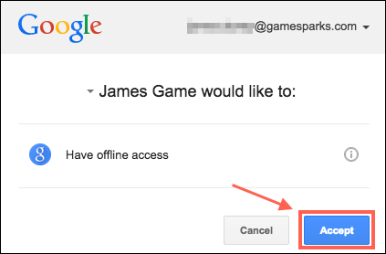  

The POST response from the page will contain an access code (as well as an access token) that can be used to authenticate:

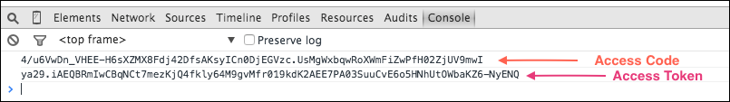  

*16.* Go to the *Test Harness* in the GameSparks Portal.

*17.* Because we already have the Client ID and Secret integrated into our game from *Step 10*, authenticate a player by doing a *GooglePlusConnectRequest*.
* Remember to add the access code from the response within our HTML page.
* Also, we need to add the value, *"postmessage"* to the *redirectURI* parameter in the request:

```
{
 "@class": ".GooglePlusConnectRequest",
 "code": "4/u6VwDn_VHEE-H6sXZMX8Fdj42DfsAKsyICn0DjEGVzc.UsMgWxbqwRoXWmFiZwPfH02ZjUV9mwI",
 "redirectUri": "postmessage"
}
```

Response:

```
{
 "@class": ".AuthenticationResponse",
 "authToken": "1ef98051-6683-4661-ac1d-d5ae2d9d81f4",
 "displayName": "PLAYER ONE",
 "newPlayer": false,
 "scriptData": null,
 "userId": "54d09747e4b0f076824b9d8f"
}
```

The Player is connected to the GameSparks platform!  

## Domain-Wide Authority

### Using Certificate Authentication instead of the Client Secret

As well as being able to establish manual authentication by using the Client ID and Client Secret, we can use Google's domain-wide delegation of authority to authenticate Players.  This can be done through the use of a Certificate stored in the GameSparks platform for the game.

<q>**More Information!** For more information on how to set up Service accounts, go [here](https://developers.google.com/+/domains/authentication/delegation "Google Service accounts").</q>

In order to utilize these features, our game must make use of an extra API - the *Google+ Domains API*.

*18.* Go to the [Google *Developer* Console](https://console.developers.google.com "Google Developer Console").

*19.* In the sidebar on the left, select *APIs & auth*.

*20.* Find the *Google+ Domains API*  service by searching for it and select it.

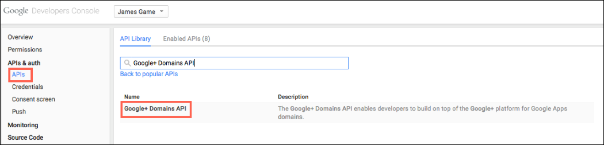  

*21.* Select *Enable API.*

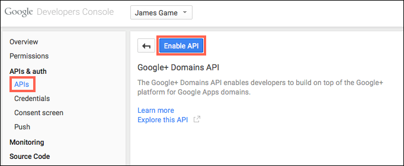  

To use this alternative type of authentication, we need to create a separate Client ID for our game based on a *Service account*.

*22.* In the sidebar, select *Credentials*.

*23.* In the OAuth* of the page, select *Create New Client ID*.

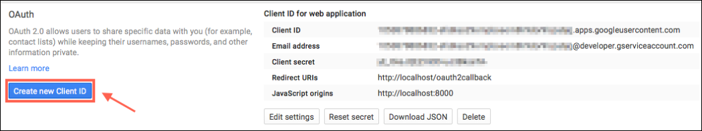  

*24.* In the *Application type* section, select *Service account*.  In the *Key type* section, select *P12* key then finally select *Create Client ID*.

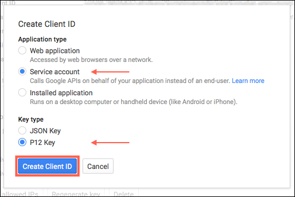  

 *25.* A prompt will be displayed to download the certificate key (.p12 file) to the local machine.  Save the file and make a note of the certificate password displayed on screen in case you may ever need it.  It will not be required to authenticate to the GameSparks platform.  The new Service account Client ID will appear in the list:

 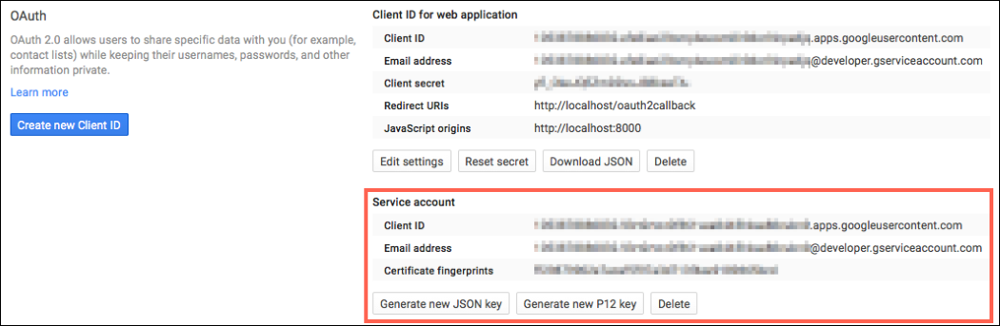  

 *26.* Go into the [GameSparks Developer Portal](https://portal.gamesparks.net/) and for your game, and go to *Configurator* > *Integrations*.

 *27.* Select the *Google* tab and click *Edit*.

 *28.* Fill in the fields, *Service Certificate* and *Service Email Address* using the downloaded certificate key and the *Email address* from your Google Web Application and click *Save*.  Choose the downloaded .p12 certificate key to be uploaded into the *Service Certificate* *field* and select *Save.*

 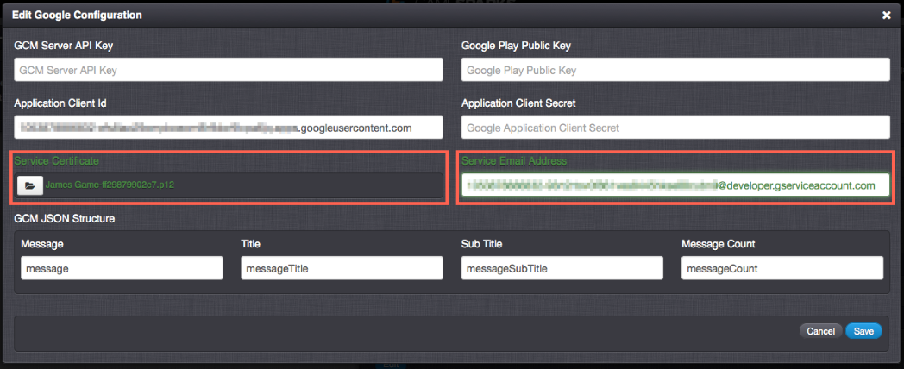  

<q>**Note:** If this type of authentication is to be used always, the *Application Client Secret* is no longer required.  You can remove it from the form if desired.</q>  

 *29.* Generate another access code and token as in *Step 12*, this time taking a note of the *access token*, instead of the code.

 *30.* Go to the *Test Harness*.

 *31.* Authenticate a player by doing a [GooglePlusConnectRequest](/API Documentation/Request API/Authentication/GooglePlusConnectRequest.md).  Remember to add the *access token* from the response within our HTML page:

```
{
 "@class": ".GooglePlusConnectRequest",
 "accessToken": "ya29.iQGREB3-74paFwff4Hq131JqnM_HSo_qb34CJ7Mpx85uWGwDuZjJs8xp0fEm07CfywjVmeGFuDvg5A"
}
```

Response:
```
>{
 "@class": ".AuthenticationResponse",
 "authToken": "fc25acd1-6dea-436f-89ba-e84c1dba7b8b",
 "displayName": "PLAYER ONE",
 "newPlayer": false,
 "scriptData": null,
 "userId": "54d09747e4b0f076824b9d8f"
}
```
The Player is connected to the GameSparks platform via the Service account and certificate key.
