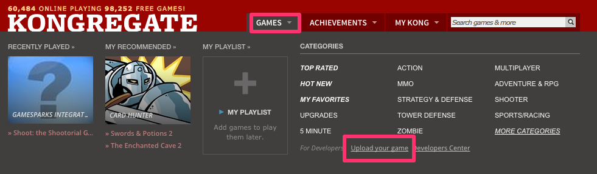
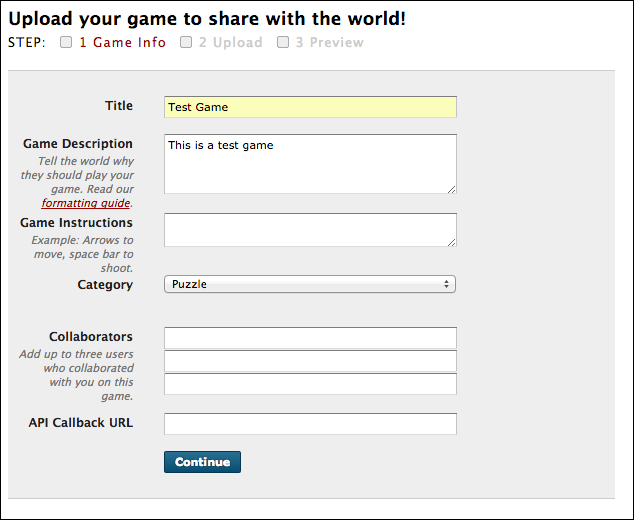
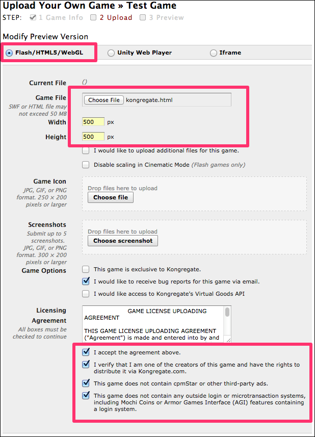
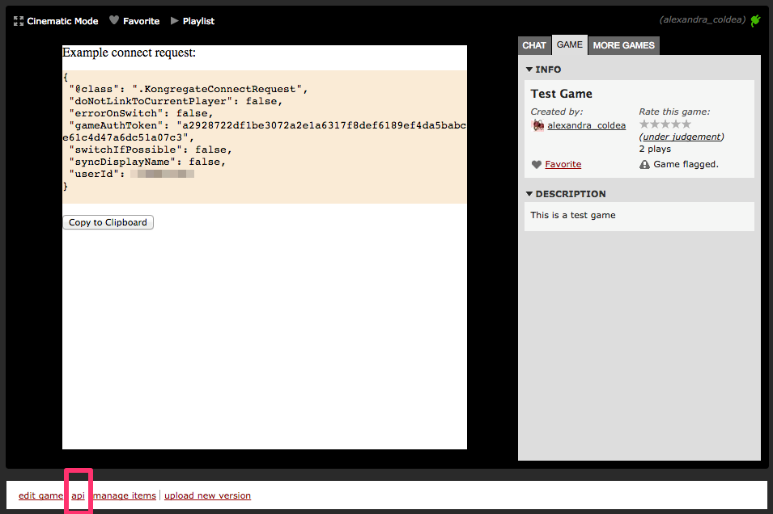
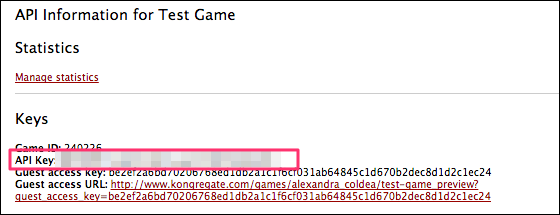
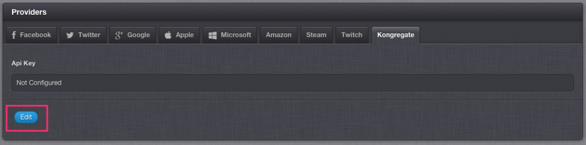

# How to Authenticate a Player Using their Kongregate Account

You can use Kongregate authentication to offer your players a simple way to sign in with their Kongregate account. The GameSparks platform can then use a player's profile to drive its social features.

In this tutorial, we’ll go through setting up the necessary configuration with Kongregate and explain how you can then use that to connect your players.

## Setting up a Kongregate Application

For a successful [KongregateConnectRequest](/API Documentation/Request API/Authentication/KongregateConnectRequest.md) the following data needs to be provided to GameSparks:

* Game API Key
* The user's ID
* An authentication token valid for the (user,game) pair

You can obtain these from Kongregate by uploading a game.

## Uploading a Sample Kongregate Game

The following steps will guide you through the process of creating a sample game and obtaining the necessary details.

*1.* Go to the [Kongregate home page](http://www.kongregate.com/) and log in. If you scroll over the "Games" section, you will be able to see a link to "Upload your game"



*2.* Alternatively, go directly to the [Upload game page](http://www.kongregate.com/games/new). Fill in your game details and press *Continue*



*3.* Next, you need to upload your game. For the sake of this tutorial, you can download a test game from [here](http://repo.gamesparks.net.s3.amazonaws.com/docs/tutorial-assets/kongregate.zip).  

The only thing that this test game does is provide you with the credentials necessary for making a connect request. Here's a sample configuration for the game:



After clicking *Upload* you will be redirected to your game. This is where you'll be able to obtain all of the information you need in order to perform a *KongregateConnectRequest*.

## Configure Kongregate Game Details

*4.* When you are previewing your game in Kongregate, click on the *api* link at the bottom of your game.



This will display your game credentials.

*5.* Copy the value of your *API Key*:



*6.* In a separate tab, go to the Gamesparks developer portal.

*7.* Navigate to *your game > Configurator > Integrations > Kongregate*:



*8.* Click *Edit* and set your API key to be the one you just copied from Kongregate.

## Perform a KongregateConnectRequest

*9.* Return to Kongregate screen where you play your game. This should display a connect request for your user. The fields that are used to perform the authentication are *gameAuthToken* and *userId*.

*10.* Copy this connect request.

*11.* In another tab, go to the GameSparks portal and navigate to *Test Harness*.

*12.* Paste your request in your JSON editor.

That's it!

Here is a sample request for connecting to Kongregate:

```  
{
 "@class": ".KongregateConnectRequest",
 "doNotLinkToCurrentPlayer": false,
 "errorOnSwitch": false,
 "gameAuthToken": "a2928722df1be3072a2e1a6317f8def6189ef4da5babce61c4d47a6dc51a07c3",
 "switchIfPossible": false,
 "syncDisplayName": false,
 "userId": "123"
}
```

And here is a sample response:

```
{
 "@class": ".AuthenticationResponse",
 "authToken": "874289c6-6565-4860-9160-d94805d558c9",
 "displayName": "alexandra_coldea",
 "newPlayer": true,
 "scriptData": null,
 "userId": "55672ab7e4b0cc0a541f6906"
}
```

You can find more details about the Kongregate authentication protocol and the client functions that you can use [here](http://developers.kongregate.com/docs/api-overview/intro).
