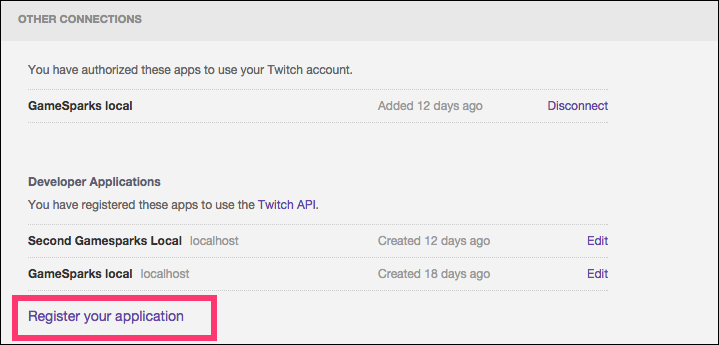
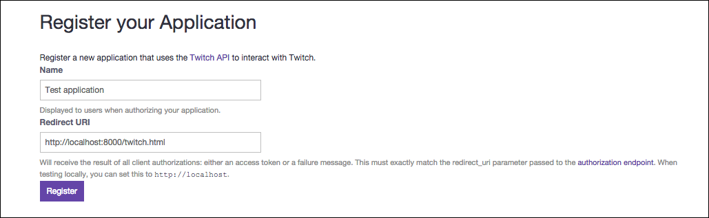
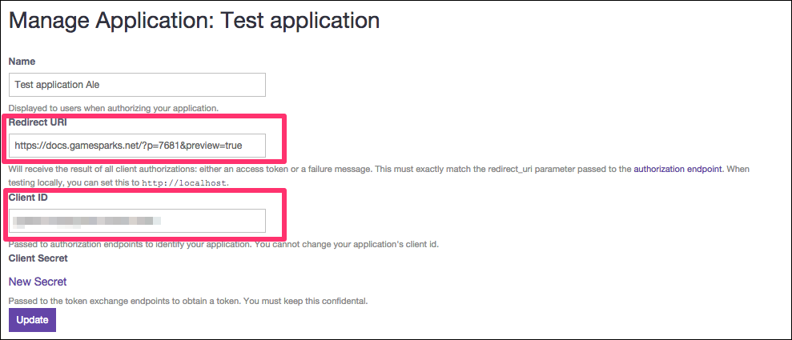
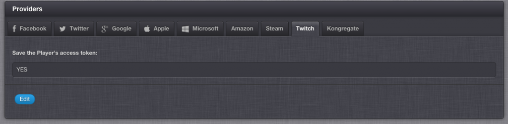

# How to Authenticate a Player Using their Twitch Account

You can use Twitch authentication to offer your players a simple way to sign in with their Twitch account. The GameSparks platform can then use a player’s profile to drive its social features.

In this tutorial, we’ll go through setting up the necessary configuration with Twitch and explain how you can then use that to connect your players.

## Setting up a Twitch Application

*1.* Go to [Twitch Connections](http://www.twitch.tv/settings/connections) and sign in.

*2.* Now click the *Register your application* link at the bottom of the page:



*3.* Fill in your application name and the Redirect URI. Twitch implements oAuth 2.0 for authorization, so this Redirect URI is the one that is involved in the authentication flow.

*4.* After these details have been filled in, press *Register*:



After the application was created, you'll be redirected to a page where you can obtain your client details:



*5.* You'll need the highlighted details for obtaining an access token from Twitch and that you will later need to pass as parameter to the [TwitchConnectRequest](/API Documentation/Request API/Authentication/TwitchConnectRequest.md).

For more details about the authentication flow, you can refer to the [Twitch documentation](https://github.com/justintv/Twitch-API/blob/master/authentication.md).

## Configuring your GameSparks Game

The only configuration you will need to make in the GameSparks portal is whether to save the player's Twitch access token or not. By default, the access token is saved.

*6.* If you want to change this, go to *Configurator > Integrations > Twitch*. The following screen appears:

 

*7.* You can press Edit and change this setting.

## Making a TwitchConnectRequest

*8.* The first thing you need to do is get an access token for your player and your application using the oAuth 2.0 flow. Please make sure that the Redirect URI field matches the Redirect URI set in Twitch.

*9.* In the GameSparks developer portal, click on the *Test Harness* button. Within *Authentication* click [TwitchConnectRequest](/API Documentation/Request API/Authentication/TwitchConnectRequest.md).

*10.* At this point, if you are using the sample application, all you need to do is copy the request provided. Alternatively, you can replace the "accessToken" field with your own token.

Here is an example of a *TwitchConnectRequest*:

    ```
    {
     "@class": ".TwitchConnectRequest",
     "accessToken": "6xpdb71zt9a7euk87nm9awksc58gd3",
     "doNotLinkToCurrentPlayer": false,
     "errorOnSwitch": false,
     "switchIfPossible": false,
     "syncDisplayName": false
    }

    ```

Here is an example of a successful *AuthenticationResponse*:

    ```
    {
     "@class": ".AuthenticationResponse",
     "authToken": "2636933a-6943-40a5-ba6e-871c7b24a4be",
     "displayName": "alexandracoldea",
     "newPlayer": true,
     "scriptData": null,
     "userId": "5565cd4ae4b01ae882fa82da"
    }

    ```
