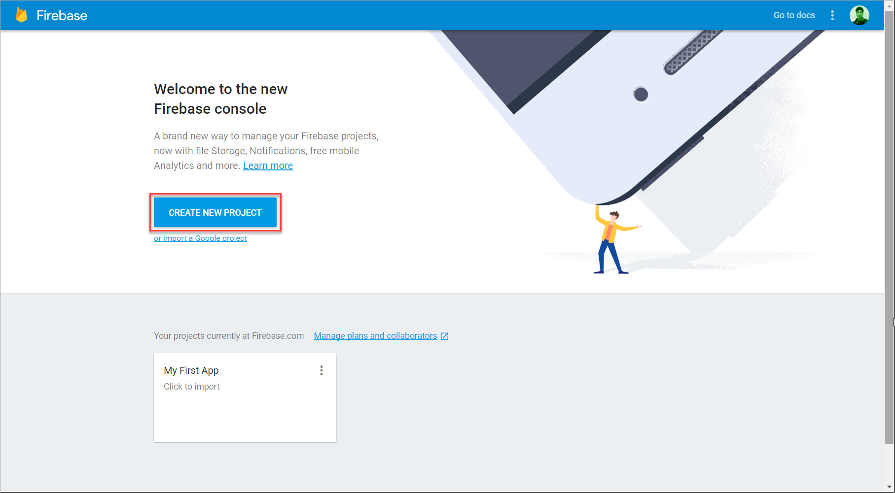
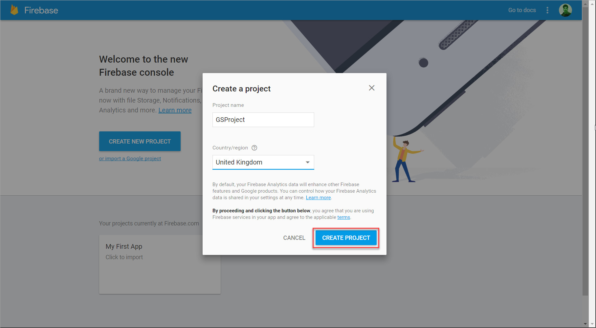
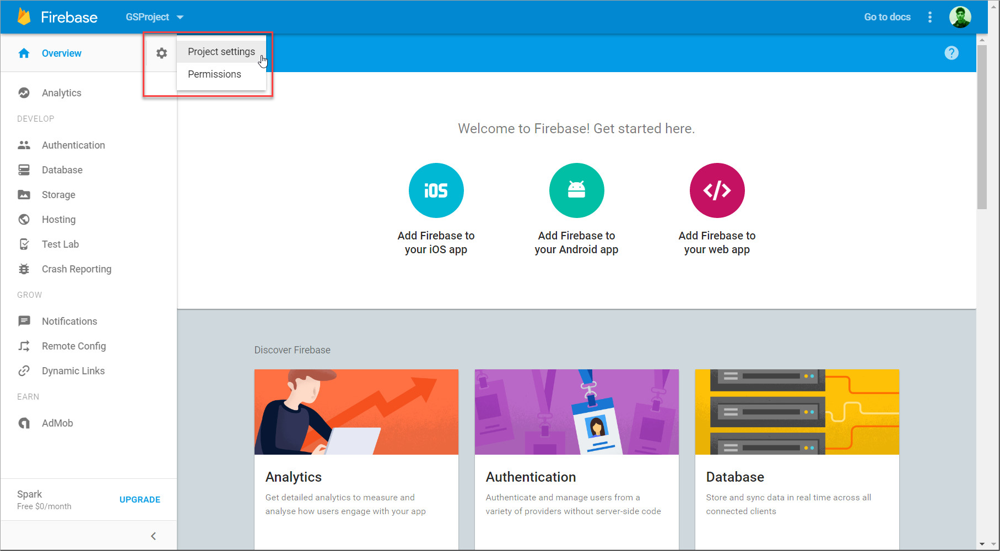
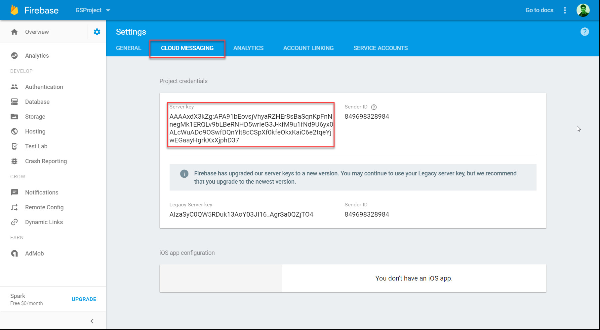
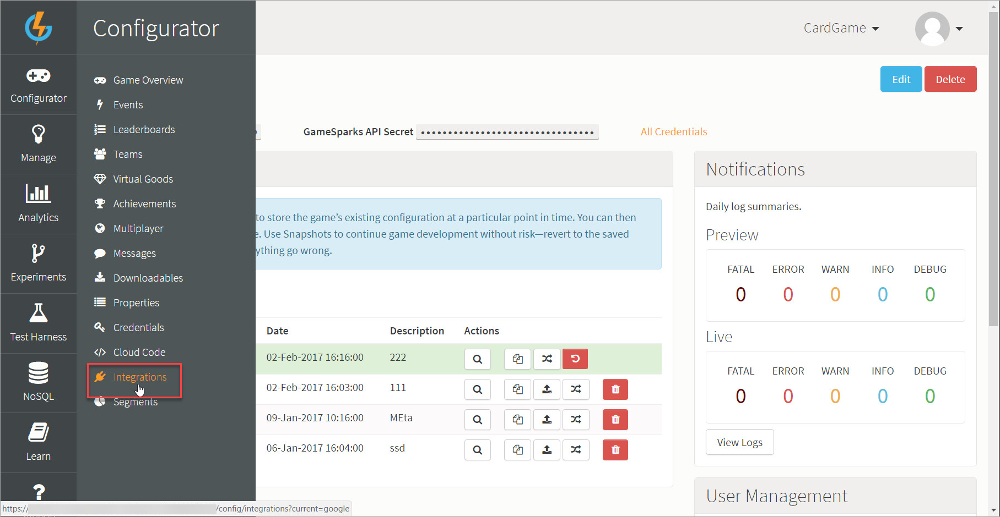
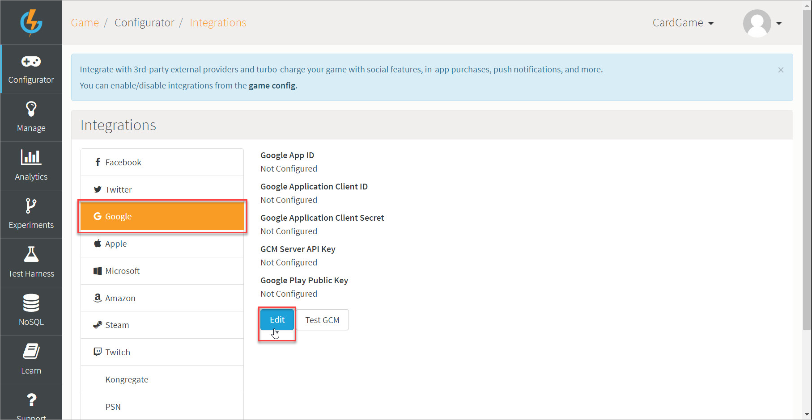
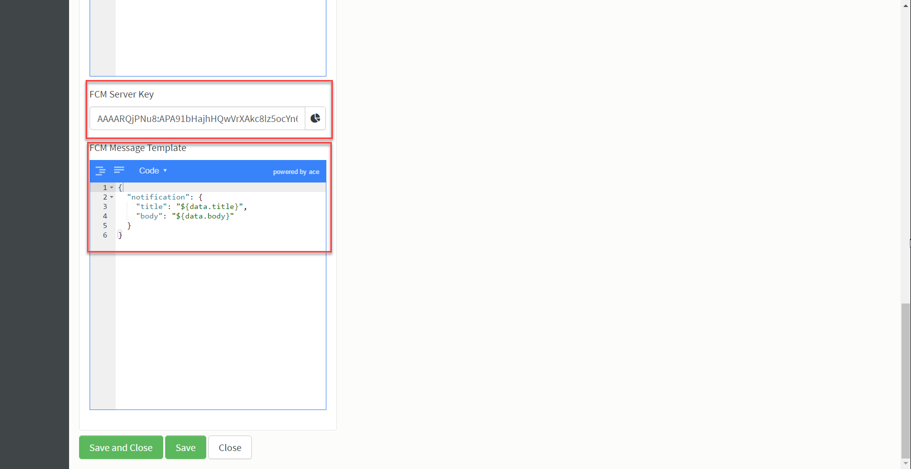

# How to Configure Google Firebase Cloud Messaging Service

Google allows push notifications through its Firebase Cloud Messaging service (FCM). FCM is a multi-platform service available on Android, iOS, and Web based applications. In this tutorial, you'll learn how to set up your application with FCM, enable push notifications, and get your GameSparks game set up to allow it to send notifications to your players on your behalf.

The GameSparks implementation for Firebase Cloud Messaging supports both data messaging and notifications - for more information on Firebase messaging, see [here](https://firebase.google.com/docs/cloud-messaging).

## Creating your Application on Firebase

Firstly, you need to set up an application with [Firebase](https://console.firebase.google.com/):
* Click *Create New Project*, give your project a name and a region, then click *Create*:





## Finding your FCM Server Key  

Once your app has been created:

*1.* Click the *Settings* button (Cog under your project name) and then select *Project Settings*:



*2.* Click the *CLOUD MESSAGING* tab and you'll see your key:




## Configuring your GameSparks Game

Now that you have the Server key, it's time to configure your GameSparks game to enable us to send push notifications on your behalf.

*1.* Navigate to *Configurator > Integrations* and select *Google* (Your game must have Google integration enabled):





*2.* Click *Edit*.

*3.* Scroll down the edit page and enter the Server key from the Firebase Console into the *FCM Server Key* field.

*4.* Under *FCM Message Template*, create a message template, here's our example:

```
{
  "notification": {
  "title": "${data.title}",
  "body": "${data.body}"
  }
}

```




The data object is created when sending a message through Cloud Code. Our data object has two string values, *title* and *body*. These values are set by you:
* An example our message creation can be found in the testing section of this guide [below](#Testing your FCM Push Notification).
* For more information [click here](/Documentation/Configurator/Messages.md).

*5.* Click *Save*.

That's all there is to it! Your GameSparks game is now configured to send push notifications to your players on your behalf.


## Implementing FCM on your Application

The details of the FCM implementation for your app are beyond the scope of this tutorial, but there are excellent resources available to help you get going with this - check out [the official Firebase documentation](https://firebase.google.com/docs/cloud-messaging) as a great place to start. This covers how to register your player's device with FCM depending on your platform.


## Registering a Device for Push Notifications

The final step required to actually deliver a push notification is for the GameSparks service to be able to identify your player's device to be able to send the notifications. This is accomplished with a [PushRegistrationRequest](/API Documentation/Request API/Misc/PushRegistrationRequest.md).

For an authenticated player in the GameSparks Test Harness, send:

```
{

"@class": ".PushRegistrationRequest",
"deviceOS": "FCM",
"pushId": "DEVICE_REGISTRATION_ID"

}

```

Where *DEVICE_REGISTRATION_ID* is the registration id returned from the call to:

| Platform/Language  | Call  |
|---|---|
| Android  |  FirebaseInstanceID.getToken() |
| iOS/OC  | NSString *refreshedToken = [[FIRInstanceID instanceID] token];  |
| iOS/Swift  | let token = FIRInstanceID.instanceID().token()!  |
| Web  | firebase.messaging()  |

The GameSparks platform is now capable of pushing messages to this player, even while they're not playing your game. For more details on push notifications within the GameSparks platform, check out [Messaging](/Documentation/Key Concepts/Messaging.md).

## Testing your FCM Push Notification

You can quickly test to see if your set up works:

*1.* Create an Event.

*2.* In your Event's Cloud Code, create a message and send a message. Here's our example:


```
var msg = Spark.message(null);
msg.setPlayerIds([Spark.getPlayer().getPlayerId()]);
msg.setMessageData({"title":"test title","body":"test body"});
msg.send();


```

*3.* Head over to the *Messages* section in *Configurator*.

*4.* On the *Standard Messages* tab, edit the *ScriptMessage* and set the *Send Via Socket* to *Off* and *Send As Push* to *On*. This will allow you receive the notification through push even if you have the game on.

*5.* Run your app on your mobile device and call the Event in app or through the Test Harness. Your message and title should appear as a notification on your phone.
