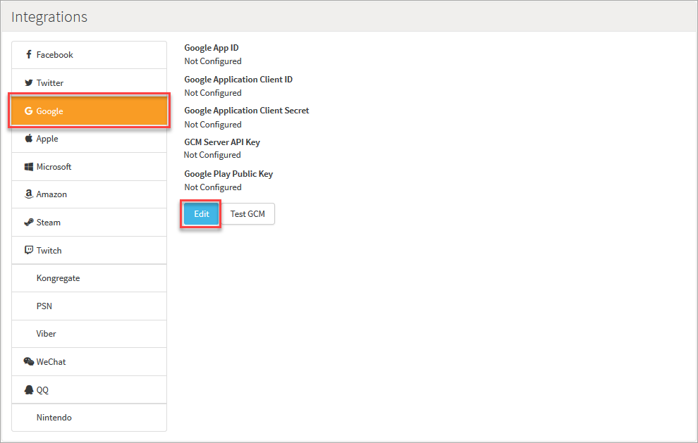

# How to Configure Google Cloud Messaging Push Notifications

Google allows push notifications through its Google Cloud Messaging service (GCM). In this tutorial, you'll learn how to set up your application with GCM, enable push notifications, and get your GameSparks game set up to allow it to send notifications to your players on your behalf.

<q>**Firebase Cloud Messaging!** The GameSparks platform is now enabled for Google's [Firebase Cloud Messaging](/Tutorials/Social Features/Configuring Firebase Cloud Messaging.md), which is the new version of Google's Cloud Messaging.</q>


## Configuring your GameSparks Game

Now that you have the API key, it's time to configure your GameSparks game to enable us to send push notifications on your behalf.

*1.* Navigate to *Configurator > Integrations* and under *Providers*, select *Google*:



*2.* Click *Edit*. The *Edit Google Configuration* dialog appears.

*3.* Enter the API key from the Google Developers Console into the *GCM Server API Key field*:


*4.* Click *Save*. You'll then see the API key under the *Providers > Google* configuration:


That's all there is to it! Your GameSparks game is now configured to send push notifications to your players on your behalf.

## Implementing a GCM Client

The detail of the GCM client is beyond the scope of this tutorial, but there are excellent resources available to help you get going with this. Check out [the official android documentation](http://developer.android.com/google/gcm/client.html) as a great place to start. This covers registering your player's device with GCM and obtaining a registration id, which you will use in the next step. If you follow the steps in the official tutorial, the method you will hook into in the next step is:

```
private void sendRegistrationIdToBackend() {
   // Your implementation here.
 }

```

## Registering a Device for Push Notifications

The final step required to actually deliver a push notification is for the GameSparks service to be able to identify your player's device to be able to send the notifications. This is accomplished with a [PushRegistrationRequest](/API Documentation/Request API/Misc/PushRegistrationRequest.md).

For an authenticated player in the GameSparks Test Harness, send:

```
{ "@class": ".PushRegistrationRequest",
"deviceOS": "ANDROID",
"pushId": "DEVICE_REGISTRATION_ID",
"requestId": "1399640846121" }

```

Where *DEVICE_REGISTRATION_ID* is the registration id returned from the call to *GoogleCloudMessaging.register* in the client.

The GameSparks platform is now capable of pushing message to this player, even while they're not playing your game. For more details on push notifications within the GameSparks platform, check out [Messaging](/Documentation/Key Concepts/Messaging.md).
