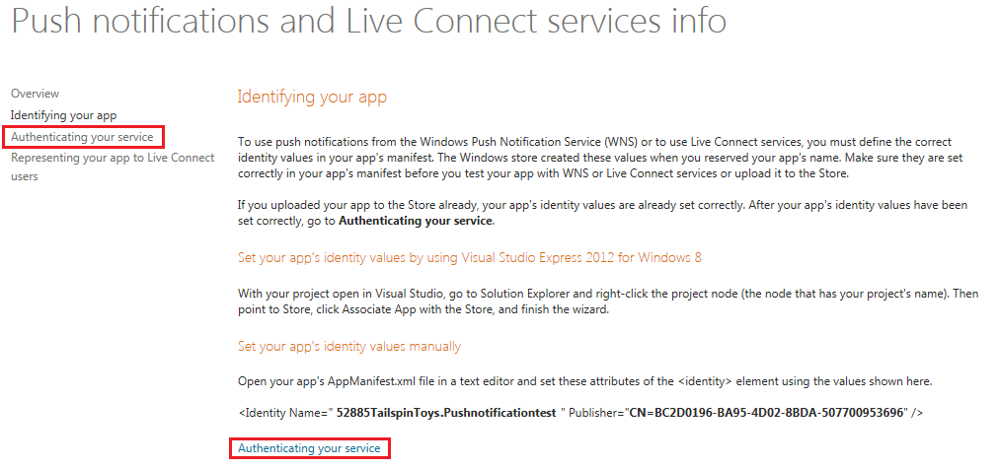

# How to Configure Windows Phone Push Notifications

## Introduction

When an event of interest occurs, the server-side component can send the app a push notification. If your game is not currently in use, you can still notify the user when an event takes place. For example ‘Challenge Received’ or when someone on the user’s friends list has beaten their high score. There are three things a push notification can do:

  * Display a short text message
  * Play a brief sound
  * Set a number in a badge on the game’s icon

## Obtaining WNS Authentication details

Your app must be registered with the Windows Store to use the Windows Push Notification Service (WNS).  

GameSparks requires two pieces of information to integrate with WNS, the Package Security Indentifier (SID) and a client secret.

First log in to the Dashboard and select your app. Then select *Services*.

On the Services page, select *Live Services site* found under the Windows Azure Mobile Services section.

On the Push notifications and Live Connect services info page, select *Identifying your app*.

Click *Authenticating your service* at the bottom of that same Identifying your app page.

The Authenticating your service page provides your SID and client secret.

  1. Make a note of the SID and client secret and navigate to the GameSparks Portal.
  2. Select *Configuration* then [Integrations](/Documentation/Configurator/Integrations.md) from the Left Hand Navigation.
  3. Select the *Windows Tab*, then select *Edit.*
  4. Enter the SID into the field titled *Windows Package SID*.
  5. Enter the client secret into the field titled Windows *Secret Key*.
  6. *Save*
  7. Your GameSparks game is now configured to receive  Windows Phone Push Notifications!
 

## Editing Messages for Push Notifications

To edit a message select the edit option next to the desired message.

You can then toggle if you want the messages to be sent as push notifications:

