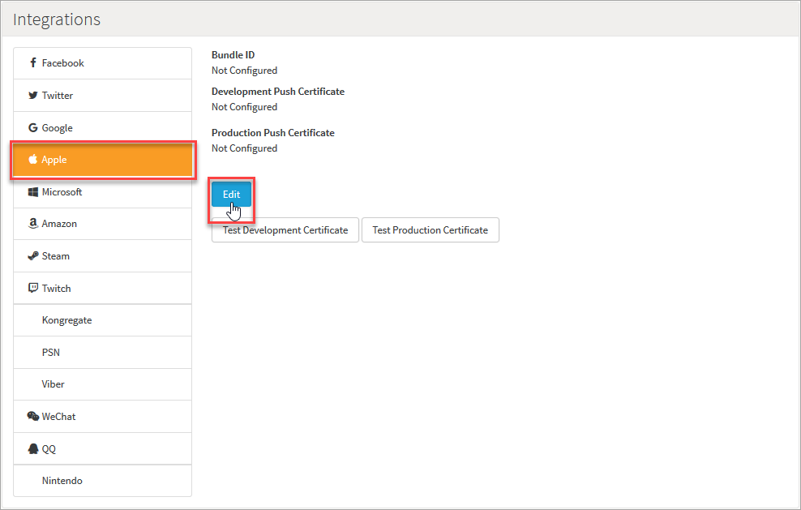
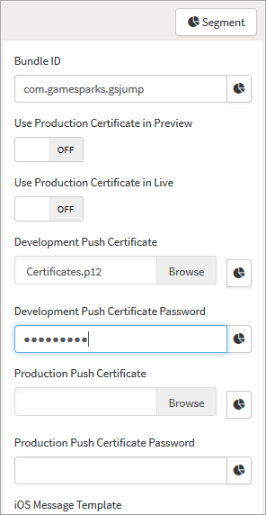
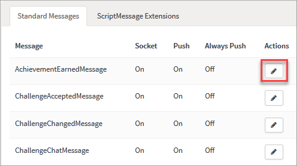
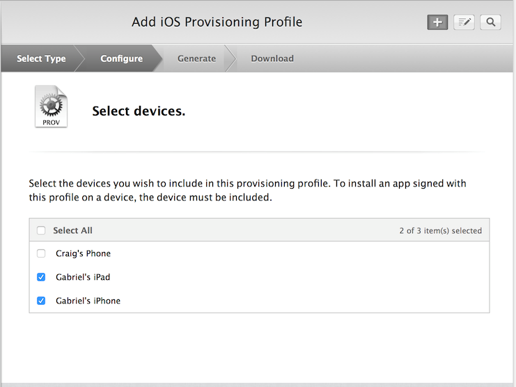

# How to configure iOS Push Notifications

## Introduction

When an Event fires, the server-side component can send the app a push notification. If your game is not currently in use, you can still notify the user when an Event takes place. For example, *Challenge Received* or when someone on the user’s friends list has beaten their high score. There are three things a push notification can do:

  * Display a short text message..
  * Play a brief sound.
  * Set a number in a badge on the game’s icon.

## Provisioning Profiles and Certificates

To enable push notifications in your app it has to be signed with a provisioning profile. The provisioning profile and SSL certificate are only valid for a single App ID. This ensures that only you can send push notifications to instances of your app.

Apps use different provisioning profiles for development and distribution. Each uses a different push server certificate:

  * *Development* If your app is running in Debug mode and is signed with the Development provisioning profile (Code Signing Identity is “iPhone Developer”), then your server must be using the Development certificate.
  * *Production* Apps that are distributed as Ad Hoc or on the App Store (when Code Signing Identity is “iPhone Distribution”) must talk to a server that uses the Production certificate.

If there is a mismatch between the profile and certificate, push notifications cannot be delivered to your app.

<q>**Note:** The following tutorial is based on using Mac OSX. If you use a different operating system such as Linux or Windows, some of the steps will differ slightly.</q>

## Generating the Certificate Signing Request (CSR)

Digital certificates are based on public-private key cryptography and certificates always work in combination with a private key. The certificate is the public part of this key pair so it can be given to others, but you can’t use the certificate if you don’t have the private key. When you apply for a digital certificate you must provide a Certificate Signing Request. Once the CSR is created, a new private key will be generated and put into your Keychain. You then send the CSR to the iOS Developer Portal, which will generate the SSL certificate for you.

*1.* Open Keychain Access on your Mac (you can find it in the Applications/Utilities folder).

*2.* From the menu, navigate to *Keychain Access *-> *Certificate Assistant *-> and choose the option *Request a Certificate from a Certificate Authority…*


If this menu option is not available or it says “Request a Certificate from a Certificate Authority With key”, you need to download and install the *WWDR Intermediate Certificate*. Also ensure no private key is selected in the main Keychain Access window. Otherwise, if key *XYZ* is already selected before going to the Certificate Assistant, you'll see “Request a Certificate from a Certificate Authority With *XYZ*”. You should now see the following window:


*3.* Enter an e-mail address and a descriptive Common Name, because this will allow you to easily find the private key later.

*4.* Check *Saved to disk* and click *Continue*. Save the file as *yourGamePush.certSigningRequest*.

*5.* In the Keys section of Keychain Access, you should now have a new private key in your keychain. Right click the *Private* key and choose *Export*.


*6.* Save the *Private* key as *YourGamePushKey.p12* and enter a password. Choose a password that is easy to remember, or you won’t be able to use the private key later.  

### *Making the App ID and SSL Certificate*

*7.* Log in to the [iOS Dev Center](https://developer.apple.com/account/overview.action) and Select the* "Certificates, Identifiers & Profiles*” from the right panel.


*8.* Select *Certificates* in the *iOS Developer Program* section.


Now we need to make a new App ID. Each game requires its own unique ID because push notifications are sent to a specific application.

*9.* Go to *App IDs* in the sidebar and click the *+* button.


*10.* Enter a meaningful *App ID Description*, check the *Push Notifications* checkbox and put your app’s Bundle Identifier in the *Explicit App ID* field (it must be the same as the bundle ID in your Xcode project).


*11.* Once all the details are filled in press *Continue*.

*12. *Verify the details of the app is and click *Submit *then select *Done*. App registration will now be complete.


You can now generate the SSL certificate that GameSparks uses to make a secure connection to the Apple Push Notification Service. The certificate will be linked to your App ID. The *App ID* will now appear in the list:


*13.* Select the App ID from the list.

*14. *Click on the *Edit* button to configure the Push Notifications.


*15. *In the *Push Notifications* section select the *Create Certificate* button under the *Development SSL Certificate* title. The *Add iOS Certificate* wizard will appear.


*16.* As we have already generated a *Certificate Signing Request* we can click *Continue*.


*17.* Choose the CSR file generated earlier and click *Generate*.


*18.* After the SSL certificate has been generated (this may take a while) click *Continue*.

*19. *Click *Download* to get the certificate named *aps_development.cer*.


The certificate is now available for development. You can download the certificate again if needed. Each development certificate is valid for 3 months. Repeat this process when you release your game. *Production certificates are valid for a year only and must be renewed*.

*20. *Add the certificate to your Keychain by double-clicking the downloaded *aps_development.cer* file. This will now be associated with the private key. You can check this in the *My Certificates* category.


*21.* In the *Keys* section, select only the *certificate* inside the private key associated with it, and right click on the selection to export it to a *.p12* file.


The p12 file and password will be used in the GameSparks Portal to Setup Push Notifications for your game.

## Configuring the GameSparks Portal

### Upload your certificate and password to Gamesparks

*22.* Log in to the GamesSparks Portal and navigate to *Configurator > Integrations*.



*23.* Select *Apple* and click the *Edit* button.

*24.* Enter in the bundle ID for your app in the *Bundle ID* field.

*25.* Click the *Browse* button on the *Development Push Certificate* field.

*26.* Select the .p12 file created above and enter the password into the *Development Push Certificate Password* field.*

*27.* Once you have entered in all required details click to *Save and Close*.



<q>**Note:** When you release your app you will have to repeat these steps for the iOS Production Certificate.</q>


### Editing Push Notification Messages

*28.* To edit a Message, select the Edit option next to the desired message



*29.* Ensure the *Send As Push* toggle switch is enabled for your app. The Push toggle enables the message to be pushed to users, you may not need all messages to be pushed.

*30.* Enter you desired message in the Message template and click the *Save* button.   That is all that is required to test Push Notifications for iOS in the Portal!  To set up an iOS device to start receiving the Push Notifications, read on...  

### Creating a Provisioning Profile

To test push notifications with your App you will need to create a Provisioning Profile. *31.* Navigate back to the iOS Dev Center and click the *Provisioning Profiles* button in the sidebar then click the *+* button. This will open up the iOS provisioning profile wizard.


*31.* Select the *iOS App development* option button in the first step of the wizard and press *Continue*.

*32.* Select the App ID and click *Continue*.


*33.* Select the certificates you want to include in this Provisioning Profile and click *Continue*.


*34.* Select the devices you want to include in this Provisioning Profile and press *Continue*



*35.* Set the provisioning profile name and click *Generate*.


*36.* Press the *Download* button and save the profile to your local machine.

## Using Push Notifications in your Xcode Project

It is assumed that you are familiar with Xcode and and have an Xcode project already created. We can now add the Provision Profile we have just created to Xcode by double-clicking it or dragging it onto the Xcode icon.


<q>**Note:** Once again, when you release your app you will have to repeat this process with an Ad Hoc or App Store distribution profile.</q>

*37.* In your Xcode project, open *AppDelegate.m*. Change the application *didFinishLaunchingWithOptions* method to look like this:

```
- (BOOL)application:(UIApplication *)application didFinishLaunchingWithOptions:(NSDictionary *)launchOptions {
    // Let the device know we want to receive push notifications
    [[UIApplication sharedApplication] registerForRemoteNotificationTypes:
        (UIRemoteNotificationTypeBadge | UIRemoteNotificationTypeSound | UIRemoteNotificationTypeAlert)];

    return YES;
}

```

The new call to *registerForRemoteNotificationTypes* tells the OS that this app wants to receive push notifications. When your app registers for push notifications, it will attempt to obtain a device token. This token is a 32-byte number, which uniquely identifies your device.  The token is in an NSData object. For the GameSparks Api call an NSString is required.

*38.* Add the following to *AppDelegate.m*:
```
- (void)application:(UIApplication*)application didRegisterForRemoteNotificationsWithDeviceToken:(NSData*)deviceToken
  {
   NSString * dtoken;
   dtoken = [[[deviceToken description]
            stringByTrimmingCharactersInSet:[NSCharacterSet characterSetWithCharactersInString:@"<>"]]
            stringByReplacingOccurrencesOfString:@" "
            withString:@""];
  }

```

*39.* To enable the use of push notifications from the GameSparks service, we must perform a *Push Registration Request*. An example of this is below:

```
GSPushRegistrationRequest* req = [[GSPushRegistrationRequest alloc] init];
[req setPushId:dtoken];
[req setDeviceOS:@"iOS"];
[req setCallback:^ (GSPushRegistrationResponse* response) {
  NSLog(@"%@", [response getRegistrationId]);
}];
[gs send:req];

```

Your App can now receive Push Notifications via the GameSparks service!

*40.* Build and run the app.

<q>**Note:** You will need to do this on a physical device as the iOS Simulator tool does not support push notifications.</q>

Hopefully Xcode will automatically select the new Provisioning Profile. However, if you get a code sign error, ensure the proper profile is selected in the Code Signing build settings. When the app starts and registers for push notifications, it shows a message to inform the user that this app wishes to send push notifications.

 The app asks this only once (on the initial start of the app). If the user selects *OK*, then it is possible to send push notifications to them. App notification settings can be changed by the user in the Device settings.
