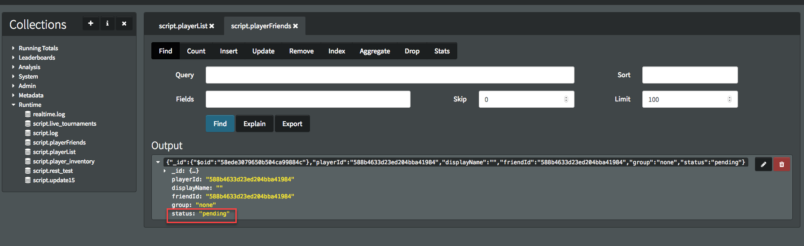

# Creating Custom Friends Lists

## Introduction

In this tutorial, we're going to build a very simple system for creating your own friends lists so your players can search for friends, send their friends invites, and get information about their current friends for use in challenges or chat later on in your game.

## Creating a Player List

Before we can start searching for players to add to our list we need to be able to get a collection of player information we can query so that we can filter our search requests. In this example, we'll be storing some of the important player information in this player list so we can search for user-names, countries, and so on.
To start, we'll create a new player-doc each time a player registers with GameSparks. We will do this in the [RegistrationResponse](/API Documentation/Request API/Authentication/RegistrationRequest.md) script.

You can find the *RegistrationResponse* script by going to the *Configurator>Cloud Code* tabs and choosing the Cloud-Code menu. You will then find the script under *Responses*:


All we'll put in this script for the moment will be the player’s ID, user name, and display name. In the next section we will add data to this so users can update it:

```
if(Spark.getData().error === undefined)
{
    Spark.runtimeCollection("playerList").insert(
        {
            "playerId" : Spark.getPlayer().getPlayerId(),
            "displayName" : Spark.getPlayer().getDisplayName(),
            "userName" : Spark.getPlayer().getUserName(),
        });
}


```

### Testing

To test this, we can go the Test Harness and register a new player:


Once the player has been registered we can see a new entry for this player in the playerList collection in the NoSQL explorer tab. Once you have the collection selected, click on the Find button to see the documents in this collection.


## Adding More Information to Players

Next we'll create a request so that we can add information to our player-documents so that others can use those details to search for us.

In this example, we'll use some set-fields like country, city, and level. However, you can add other fields you think your players might want to search for.

To create a new Event:

*1.* Go to *Configurattor>Events*.

*2.* Click the *Add* button.

In this example, we'll call the Event *updatePlayerInfo* because we're not only going add info here, but we can also update existing info (like display name or user-name).

<q>**Player's ID is not Updated!** Note that we'll never edit the player’s ID. This our link back to the player’s GameSparks account and it's important that the *playerId* always remains the same.</q>


Notice that we've added default values for these fields. This allows you to leave out the fields you don’t want to update. For instance, if you later wish to only update the username field, then you can just use that attribute in the request. We’ll see an example of this later.

Now that the *updatePlayerInfo* Event has been created, we need to open it up in the Cloud Code editor and start updating the player docs - go to *Configurator>Cloud Code* and you'll find the Event under *Scripts>Events*:


Here's the script:

```
if(Spark.getData().userName != "null")
{
    Spark.runtimeCollection("playerList").update({ "playerId" : Spark.getPlayer().getPlayerId() }, { $set : { "userName" : Spark.getData().userName } });
}

if(Spark.getData().displayName != "null")
{
    Spark.runtimeCollection("playerList").update({ "playerId" : Spark.getPlayer().getPlayerId() }, { $set : { "displayName" : Spark.getData().displayName } });
}

if(Spark.getData().country != "null")
{
    Spark.runtimeCollection("playerList").update({ "playerId" : Spark.getPlayer().getPlayerId() }, { $set : { "country" : Spark.getData().country } });
}

if(Spark.getData().city != "null")
{
    Spark.runtimeCollection("playerList").update({ "playerId" : Spark.getPlayer().getPlayerId() }, { $set : { "city" : Spark.getData().city } });
}

if(Spark.getData().level != -1)
{
    Spark.runtimeCollection("playerList").update({ "playerId" : Spark.getPlayer().getPlayerId() }, { $set : { "level" : Spark.getData().level } });
}


```

### Testing

We can test this through the Test-Harness. For this example, we'll only add info about my level, city, and country, excluding userName and displayName. You'll notice that the code above will ignore these fields because their values are null, while it will update everything else:


Now, if we go to the NoSQL explorer we'll see those fields updated in the player’s doc:


So now that players can be searched for and we can load players using the playerId, we are ready to make our search Events.

## Searching for Friends

We need to create an Event which will allow us to search for available players that we can send friend requests to. We'll create the *findPlayers* Event for this, which will have one JSON field. The JSON field will act as the query we'll search for:


In the script we attach to this Event, we're going to add some code to find all the players matching the query and return them. Later on we'll use the *playerIds* from this request to send friend invites:


```
var query = Spark.getData().query;
// we want to make sure this player isnt returned in the list //
query["playerId"] = { "$ne" :  Spark.getPlayer().getPlayerId() };
var results = Spark.runtimeCollection("playerList").find(query);
Spark.setScriptData("playerList", results);


```

We are also including another query in this code, to make sure that we don’t include ourselves in the player-search. So we use the not-equals operator to exclude ourselves for the search.

### Testing

At the moment we only have one player registered, so we are going to have to register a few more players and add information to their documents in order for this to work properly. Once you have some new players registered, we can test this out in the Test Harness. The query field we are going to use here is just the field we want to check and the value we want to search for.

For example, if we know our friend’s *userName* or *displayName*, then we put that in directly:


You could also perform a Regex query to find players with names containing a letter or word using the “$regex” operator:


This will also work for *level* or *city*. Just play around with the query to find out how you might want to use it. You could also add more complexity to this request, such as returning a limited number of players or filtering out the player data for privacy reasons.

## Creating Friend Requests

So now that we can get a list of players, it’s time to invite those players to our list of friends. We're going to use another collection for this called *playerFriends*. The process of inviting will have several steps:
1.	We need to check to see if the friend has declined a previous request. We'll track this in the *playerFriends* collection.
2.	We send a message to the player and create a log in *playerFriends* to track that we’ve a pending friend request with that player.

So we'll need to create a new [ScriptMessage](/API Documentation/Message API/Misc/ScriptMessage.md), and a new Event.

The message is going to be very simple. It’ll have a default title and message, and we’ll use the Short Code to send it from our Event.

To create a new ScriptMessage:

*1.* Go to the *Configurator>Messages* and select the *ScriptMessage Extensions* tab.

*2.* Click *Add*.

*3.* In the *Add Message* page, configure a new *friendRequestMessage*:


Don’t worry too much about this message at the moment because we'll be setting our data for it later.

Next we need to create the *friendRequest* Eevent. This Event is going to have 3 attributes:
* The most important is going to be the *playerId* - for the friend we are inviting.
* We'll also add a *group* attribute - so we can group our friends by family, work, college, and so on.
* Finally, we're going to add a *message* attribute - to allow us to send a custom message to the player we want to invite.


Notice that we've also added default values to the *group* and *message* attributes. This is because we shouldn’t require these to send a friend request. We can leave these out and just send the basic template of the message.

### Cloud Code

We have discussed what the Cloud Code for this request is going to look like earlier, so the request will appear as follows:


```
var playerId = Spark.getData().player_id;
var group = Spark.getData().group;
var message = Spark.getData().message;
// now we check the pending requests to see if the player has declined a previous request //
var declinedCheck = Spark.runtimeCollection("playerFriends").findOne({ "status" : "declined", "friendId" : playerId, "playerId" : Spark.getPlayer().getPlayerId() });
if(!declinedCheck)
{
    // this is the data we want to track on the pending request //
    var requestData = {
        "playerId" :  Spark.getPlayer().getPlayerId(),
        "displayName" : Spark.loadPlayer(playerId).getDisplayName(),
        "friendId" : playerId,
        "group" : group,
        "status" : "pending"
    };
    // then we update the friend list to show that we have a pending friend-request //
    Spark.runtimeCollection("playerFriends").insert(requestData);

    // if we havent been blocked then we send a message //
    var newMessage = Spark.message("friendRequestMessage");
    newMessage.setPlayerIds(playerId);
    newMessage.setMessageData({
        "message" : message,
        "requestId" : requestData._id.$oid,
        "senderId" : Spark.getPlayer().getPlayerId(),
        "displayName" : Spark.getPlayer().getDisplayName()

    });
    newMessage.send();

    // and return a script message to show the the request was completed successfully //
    Spark.setScriptData("success", "request-sent")
}
else // if a request has already been declined then send back an error
{
    Spark.setScriptError("errorCode", "player-declined")
}

```

### Testing

To test this out we need to log two players in through the Test Harness. You can get the *playerId* for the player you want to send the request to using the *findPlayers* request. Once you have the player selected, fill in the details of the *friendRequest*:


Once you send the request:
* You should see that the other player has received a message:


* And that there is a new document in the *playerFriends* collection, with this request marked as "pending". We'll use the *requestId* from the message above to either accept or decline the friend request:



## Accepting and Declining Requests

### Accepting Requests

Accepting the friends request is pretty straightforward. We simply need to create a new *acceptFriendRequest* Event which will take the *requestId* from the request we just sent to the other player. They'll use this Event to accept the friend request:


In the Cloud Code for this Event, we want to check that the *requestId* is valid, and, if so, we'll update the document in the *playerFriends* collection to say that the request has been accepted. This friend’s details will then show up in the players list of friends (which we'll create an Event for later).

We also want to send a message to the player who sent the friend request to tell them that their request has been accepted. In this example, we created another *ScriptMessage* with a simple template. There's no need to add extra data to this message because it just needs to say the request was accepted. If you need to add extra data, you can do so in the way that we did with the previous message:


```
var requestId = Spark.getData().request_id;
var request = Spark.runtimeCollection("playerFriends").findOne({ "_id" : { "$oid" : requestId }, "status" : "pending" });
if(request)
{
    // if the request is valid then we update the friend-list to say there this friend accepted the request
    Spark.runtimeCollection("playerFriends").update({ "_id" : { "$oid" : requestId }},{ $set : { "status" : "accepted" }});
    // and send a message to the original player //
    var newMessage = Spark.message("friendAcceptedMessage");
    newMessage.setPlayerIds(request.friendId);
    newMessage.send();
}
else
{
    // we return an error to say there was an invalid request id //
    Spark.setScriptData("errorCode", "invalid-request-id")
}


```
#### Testing

Now that we have this request created, we can log back into the Test Harness and get the *requestId* for the friend request we sent in the last section:


You will see that a message is sent to the original player too:


And that the document in the *playerFriends* collection has been updated to ‘accepted’:


### Declining Friend Requests

Declining a friend request works in a similar way as accepting a friend request. We'll create a new *declineFriendRequest* Event for it, which will take the *requestId*. We also need to create a new *ScriptMessage*, so we have a template for declined request messages:


The Cloud Code for this Event is identical to the accepted request, except  that we set the status of the request to “declined” and send out the *friendRequestDeclined* message instead:


```
var requestId = Spark.getData().request_id;
var request = Spark.runtimeCollection("playerFriends").findOne({ "_id" : { "$oid" : requestId }, "status" : "pending" });
if(request)
{
    // if the request is valid then we update the friend-list to say there this friend accepted the request
    Spark.runtimeCollection("playerFriends").update({ "_id" : { "$oid" : requestId }},{ $set : { "status" : "declined" }});
    // and send a message to the original player //
    var newMessage = Spark.message("friendRequestDeclined");
    newMessage.setPlayerIds(request.playerId);
    newMessage.send();
}
else
{
    // we return an error to say there was an invalid request id //
    Spark.setScriptData("errorCode", "invalid-request-id")
}

```

#### Testing

We can use the same setup as we did for accepting requests to test declining requests. All we need is a *requestId* we want to decline:


And you will see the declined message appear for the original sender:


You can also test that this player cannot send any more requests because our *friendRequest* Event checks to see if there are any declined requests before allowing the player to send new requests:


## Getting a Player's Friends List

Next we need to create a way for players to see a list of all their friends. So we'll create an Event called *getPlayerFriends*. This Event is going to have an attribute for selecting which group we want to search for, which will default to “all” if we want to return all friends:


The Cloud Code for this Event will be very simple. We'll just query the *playerFriends* collection for friends matching the group requested and return all the friends we find. In this example, we only need to return the playerId and displayName, so we will filter the results to only include this data


```
var group = Spark.getData().group;
var friendsCursor;
if(group === "all")
{
    var friendsCursor = Spark.runtimeCollection("playerFriends").find({ "playerId" : Spark.getPlayer().getPlayerId(), "status" : "accepted"  });
}
else
{
    var friendsCursor = Spark.runtimeCollection("playerFriends").find({ "playerId" : Spark.getPlayer().getPlayerId(), "status" : "accepted", "group" : group  });
}
// once we have the cursor, we want to take some data out of the doc, as we only need the name and playerId //
var friendsList = [];
while ( friendsCursor.hasNext())
{
   var friend =  friendsCursor.next();
   friendsList.push({
       "friendId" : friend.friendId,
       "displayName" : friend.displayName

   });
}
Spark.setScriptData("friendsList", friendsList);


```


### Testing

We can test this through the Test-Harness as we’ve done before. If we use the default group “all” you should see all of your friends returned.

For this example, I’ve added a group “family” into the friends requests, so we can also test that this returns specific groups too.


## Player Online Message

The last thing we are going to do is implement a system for notifying players when their friends come online. This is going to require a new ScriptMessage and in this case we will use a system-script instead of creating a new event.
GameSparks already has a script that runs when the player comes online which we can use in this case. You can find this in the System folder in the cloud-code menu of your portal.


### Testing

To test this all we need is to login through the test harness with two players. To show is occurring, you’ll want to login the first player and keep them logged on.
Now, if you login the second player you should see that the first player gets a message through the test-harness if they are on the other player’s friend’s list.

## Additional Options or Features

This tutorial implements a very basic set of features to send and receive friend requests and to get a players list of friends. There is a lot you can do to add additional functionality to this. You can, for example add the players info from the playerList collection to the list of data returned when you get your friends. This would allow you to include things like avatars or other personal information about your friends to your game.
You can also allow friends to use privacy options to check which details they want you to have access to, or how they appear when you search for them.
The important thing is that once you have the friends list, you have access to your friend’s playerId, and you can use this throughout the GameSparks APIs to setup events, matches, challenges or teams to include your friends.
Try it out for yourself and contact customer support or the forums if you need any help in implementing specific features regarding your friends in GameSparks.
