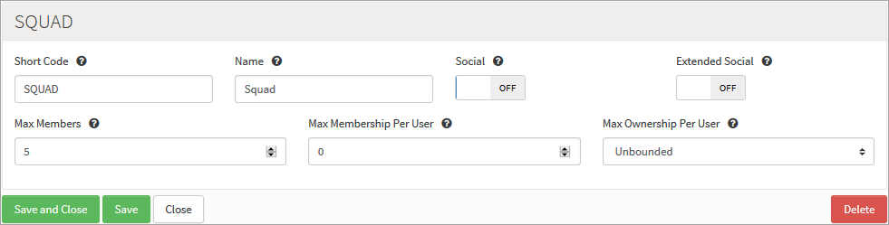
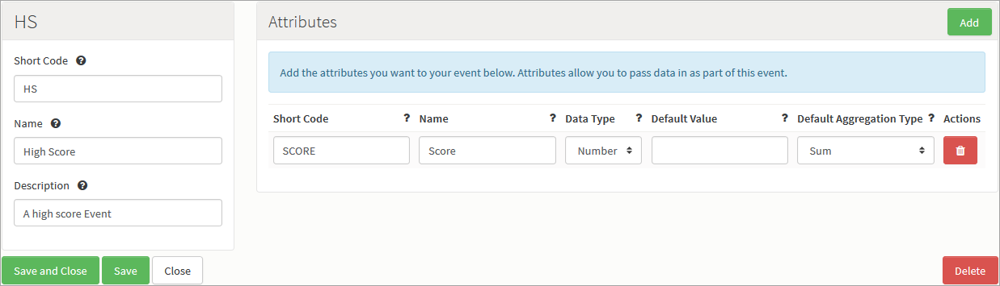
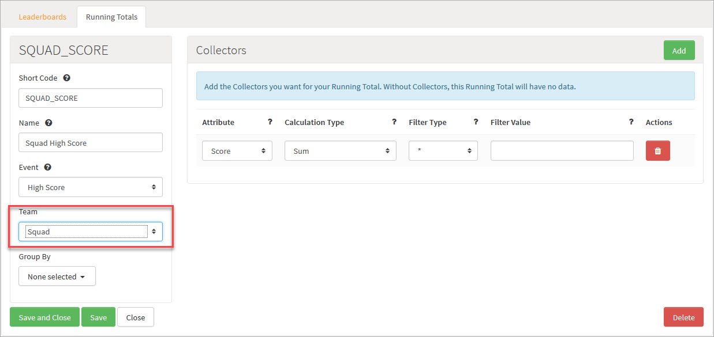
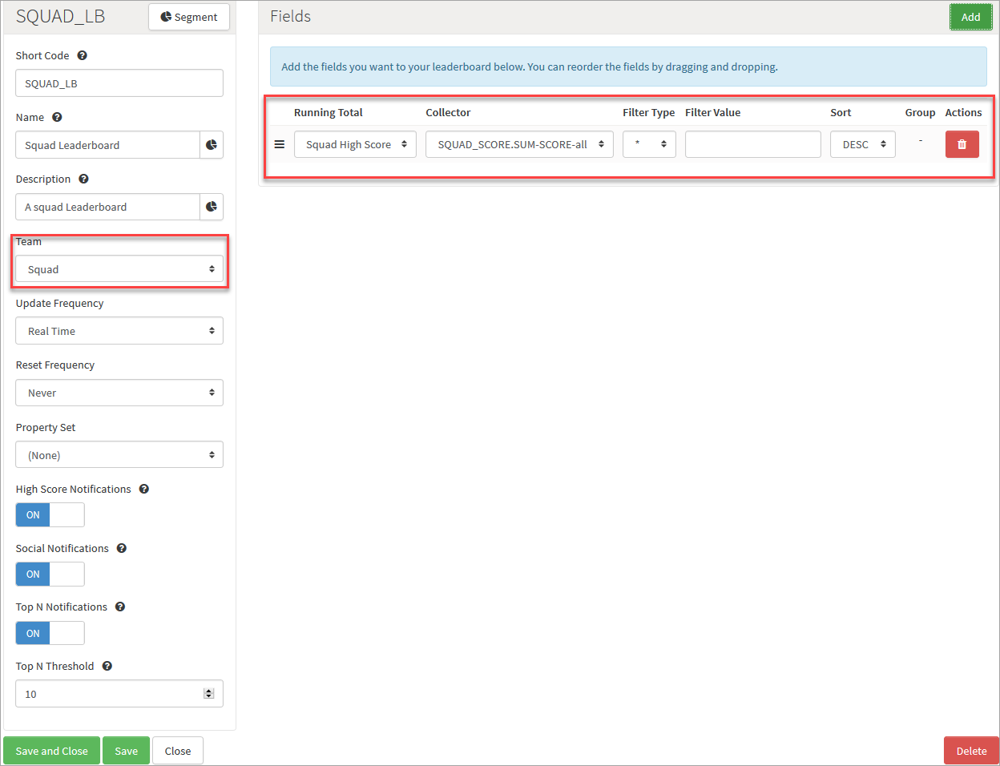

# How to Create a Team Leaderboard

You can create a Leaderboards that shows the performance of a *team* rather than the performance of a single player. For team-based Leaderboards, you need a few things in place. This tutorial will take you through the process of getting them set up.

In this example, we'll create a team type called *Squad*. When a player posts a score, the team they belong to will be credited with the score. This team score can then be used on a Leaderboard for the team.

## Creating a Team Type

*1.* Navigate to *Configurator > Teams*.

*2.* Click to *Add* a new Team Type. The *Add Team Type* page opens.

*3.* Enter the details for the new Team Type:



Here we've called the team type *Squad* and set the team to have a maximum of 5 members (*Max Members*).

*4.* Click to *Save and Close* the new Team Type.

## Creating the Event

We'll create a simple high score Event that takes a single score Attribute.

*1.* Navigate to *Configurator > Events*.

*2.* Click to *Add* a new Event. The *Add Event* page opens.

*3.* Enter the details for the new Event:



* In this example, the score we are passing should be added to all the previous scores submitted towards that team. So we've set the *Default Aggregation Type* for the Event Attribute to *SUM* them up. This will create the default Running Total for the Event, allowing us to track the score for a player.

*4.* Click to *Save and Close* the new Event.

## Creating the Team Running Total

We also want to track the score for the team. We'll need to create another Running Total for the High Score Event, one that tracks the value for a *team* instead of tracking the score for a single player.

*1.* Navigate to *Configurator > Leaderboards*.

*2.* Select the *Running Totals* tab.

*3.* Click to *Add* a new Running Total. The *Add Running Total* page opens.

*4.* Enter the details for the new Running Total:



* We select the *High Score* Event but the key change in this Running Total is that we have set the *Team* parameter to the team type we want this running total to track - *Squad*. We are now in a position where the GameSparks platform is going to track a Running Total for each Squad and will sum each score submitted by each team member.

*5.* Click to *Save and Close* the Running Total.

## Creating the Leaderboard

*1.* Navigate to *Configurator > Leaderboards*.

*2.* On the *Leaderboards* tab, click to *Add* a new Leaderboard. The *Add Leaderboard* page opens.

*3.* Enter the details for the new Leaderboard:

* We create the Leaderboard in the same way we would for personal Leaderboards, but we specify the team type that the Leaderboard is for in the *Type* parameter.

*4.* Under Fields, click to *Add* a Running Total for the new Squad Leaderboard:



* We use the *Squad High Score* Running Total we created proviously:
  * Note that the *Collector* is referenced using this Running Total's *Short Code* of *SQUAD_SCORE*.
  * Note also the *all* suffix that is appended to the *Collector* reference string - this shows that the filter we used was to include *all values* posted by the Team's members.

*5.* Click to *Save and Close* the new Leaderboard.

## Team Notifications

Notifications are processed slightly differently for personal Leaderboards and team Leaderboards:

|Notification   |Personal Leaderboard  |Team Leaderboard
|---|---|---|
|New High Score   |When a player posts a new high score to this Leaderboard, they will receive a [NewHighScoreMessage](/API Documentation/Message API/Leaderboards/NewHighScoreMessage.md).|When a player posts a new high score to this Leaderboard, they will receive a [NewTeamScoreMessage](/API Documentation/Message API/Leaderboards/NewTeamScoreMessage.md).   |
|Social Notifications  |When a player beats his friends, they will receive a [SocialRankChangedMessage](/API Documentation/Message API/Leaderboards/SocialRankChangedMessage.md).   |When a player posts new high score to this Leaderboard, the other team members will receive a [NewTeamScoreMessage](/API Documentation/Message API/Leaderboards/NewTeamScoreMessage.md). |
|Top N Notifications  |When a player's rank is increased due to a new score being posted (and they are in the top N of the Leaderboard) they will receive a [GlobalRankChangedmessage](/API Documentation/Message API/Leaderboards/GlobalRankChangedMessage.md).   |When a teams rank is increased due to a new score being posted (and they are in the top N of the Leaderboard) they will receive a [TeamRankChangedmessage](/API Documentation/Message API/Teams/TeamRankChangedMessage.md). |

## Testing the Configuration

### Create the First Player

#### Request

```
    {
     "@class": ".RegistrationRequest",
     "userName": "Testing1",
     "password": "password",
     "displayName": "Test User 1",
     "requestId": "1403266652739"
    }
```
#### Response

```
    {
     "@class": ".RegistrationResponse",
     "authToken": "406da13f-a124-43cb-ac96-b545aab0245a",
     "displayName": "Test User 1",
     "requestId": "1403266652739",
     "userId": "53a426ea79b42ce7ea4c4570"
    }
```
### Create a Squad

We'll use *CreateTeamRequest* to create a SQUAD that's owned by the current player.

#### Request

```
    {
     "@class": ".CreateTeamRequest",
     "teamId": "53a426ef79b42ce7ea4c4576",
     "teamName": "First Test Squad",
     "teamType": "SQUAD",
     "requestId": "1403266702171" }
```
#### Response

The response contains the team details, notice the current player is automatically added as a member.

```
    {
     "@class": ".CreateTeamResponse",
     "requestId": "1403266702171",
     "scriptData": null,
     "owner": {
      "id": "53a426ea79b42ce7ea4c4570",
      "displayName": "Test User 1",
      "online": true
     },
     "teamId": "53a426ef79b42ce7ea4c4576",
     "teamType": "SQUAD",
     "members": [
      {
       "id": "53a426ea79b42ce7ea4c4570",
       "displayName": "Test User 1",
       "online": true
      }
     ]
    }
```
### Create the Second Player

#### Request

```
    {
     "@class": ".RegistrationRequest",
     "userName": "Testing2",
     "password": "password",
     "displayName": "Test User 2",
     "requestId": "1403266652739"
    }
```

#### Response

```
    {
     "@class": ".RegistrationResponse",
     "authToken": "23ec1f1a-ca15-4a2c-b7fa-3d2d28cfd643",
     "displayName": "Test User 2",
     "requestId": "1403266652739",
     "userId": "53a4274479b42ce7ea4c459b"
    }

```
### Join the Squad

#### Request

To join the squad, we'll pass in the teamId of the previously created team

```
    {
     "@class": ".JoinTeamRequest",
     "teamId": "53a426ef79b42ce7ea4c4576",
     "requestId": "1403266924118"
    }
```

#### Response

The response contains the new team details, you'll see that the current player has now been added to the team as a member.

```
    {
     "@class": ".JoinTeamResponse",
     "requestId": "1403266924118",
     "scriptData": null,
     "owner": {
      "id": "53a426ea79b42ce7ea4c4570",
      "displayName": "Test User 1",
      "online": false
     },
     "teamId": "53a426ef79b42ce7ea4c4576",
     "teamType": "SQUAD",
     "members": [
      {
       "id": "53a426ea79b42ce7ea4c4570",
       "displayName": "Test User 1",
       "online": false
      },
      {
       "id": "53a4274479b42ce7ea4c459b",
       "displayName": "Test User 2",
       "online": true
      }
     ]
    }

```
### Post a Score as Player 2

#### Request

We post a score of 10 into the platform.

```
    {
     "@class": ".LogEventRequest",
     "eventKey": "HS",
     "SCORE": "10",
     "requestId": "1403267110914"
    }

```

#### Response

```
    {
     "@class": ".LogEventRequest",
     "eventKey": "HS",
     "SCORE": "10",
     "requestId": "1403267110914"
    }

```

#### Message

Because we know this is the first score posted for this team, we receive a *NewTeamScoreMessage* showing that the Squad we've created has a new high score of 10.

```
    {
     "@class": ".NewTeamScoreMessage",
     "messageId": "53a4286d79b465bde20a475c",
     "notification": true,
     "summary": ".NewTeamScoreMessage",
     "leaderboardData": {
      "teamId": "53a426ef79b42ce7ea4c4576",
      "SUM-SCORE": 10,
      "teamName": "First Test Squad",
      "when": "2014-06-20T12:26Z"
     },
     "rankDetails": {
      "globalTo": 1
     },
     "achievementsEarned": [
      "GT1"
     ],
     "leaderboardName": "Team LB",
     "leaderboardShortCode": "SQUAD_LB"
    }

```
### Authenticate as Player 1

#### Request

```
    {
     "@class": ".AuthenticationRequest",
     "userName": "Testing1",
     "password": "password",
     "requestId": "1403267256818"
    }

```

#### Response

```
    {
     "@class": ".AuthenticationResponse",
     "authToken": "baaeef21-d4f3-4354-83ad-3fb39097e0bb",
     "displayName": "Test User 1",
     "requestId": "1403267256818",
     "userId": "53a426ea79b42ce7ea4c4570"
    }

```

### Post a Score as Player 1

#### Request

This time we'll post a score of 15.

```
    {
     "@class": ".LogEventRequest",
     "eventKey": "HS",
     "SCORE": 15,
     "requestId": "1403267448095"
    }

```

#### Response

```
{
 "@class": ".LogEventResponse",
 "requestId": "1403267448095",
}

```

#### Message

We receive a *NewTeamScoreMessage*, showing that the teams score is now 25 (10 + 15)

```
{
 "@class": ".NewTeamScoreMessage",
 "messageId": "53a42a3379b466eb3efde616",
 "notification": true,
 "summary": ".NewTeamScoreMessage",
 "leaderboardData": {
  "teamId": "53a426ef79b42ce7ea4c4576",
  "SUM-SCORE": 25,
  "teamName": "First Test Squad",
  "when": "2014-06-20T12:33Z"
 },
 "rankDetails": {
  "globalFrom": 1,
  "globalTo": 1
 },
 "leaderboardShortCode": "SQUAD_LB",
 "leaderboardName": "Team LB"
}

```
