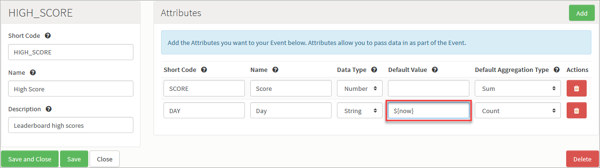
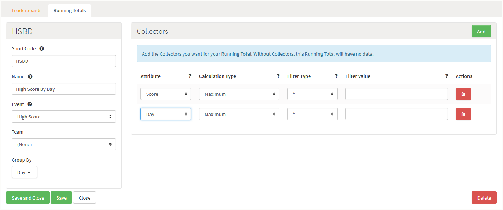
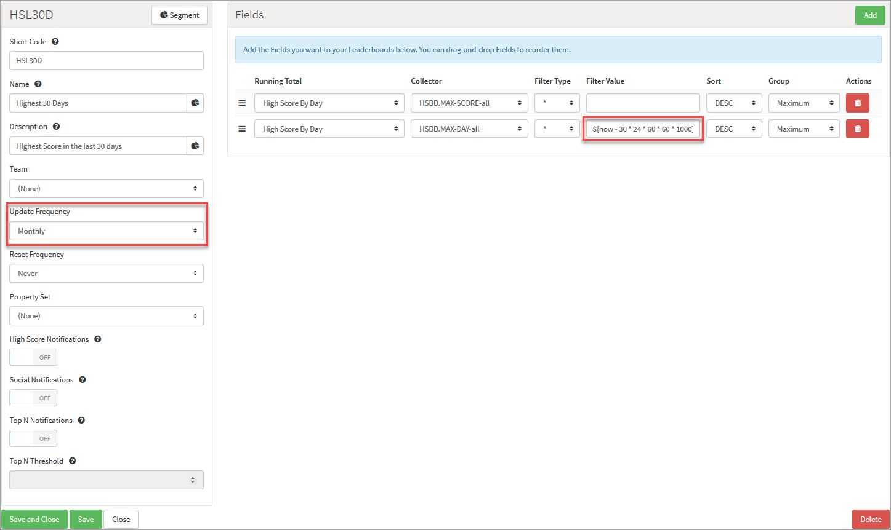

# How to Create Time Based Leaderboards

You can use the GameSparks platform to create Leaderboards that are based on time. Examples of these are:

  * Highest Score in the last 30 days
  * Most improved in the last 7 days

To implement time based Leaderboards, you'll need to perform some specific set up tasks.

This tutorial explains how to set up a time based Leaderborad. We'll go through the process of creating a *Highest score in the last 30 days* Leaderboard, one that is built once a month. After following the tutorial, you should be able to create other combinations for time based Leaderboards that meet your own requirements.

## Creating the Event

*1.* To start, we need to start tracking in our Running Total the day a particular score was made. We'll create:
* A new Event with a *SCORE* Attribute.
* A second *DAY* Attribute to hold the day of the score.

Note that we've added a default value to the *DAY* Attribute:
* Adding this default value means you don't need to pass a *DAY* Attribute as part of the [LogEventRequest](/API Documentation/Request API/Player/LogEventRequest.md) and the platform will calculate it.
* We're using an expression (starting with a *$* sign). There are a few expressions available that allow you to automatically calculate a value for the default. The one we are using is *${today}*, which will automatically resolve to the epoch time of midnight today.

<q>**Expressions?** See [below](#Expressions) for a list of available expressions.</q>

*2.* Click to *Save and Close* the new Event.

## Creating the Running Total

*3.* Once we've configured the Event, we need to create a custom Running Total for the Event, one that allows us to have an entry for each player and day combination:

In this Running Total, note that we've included *Day* under *Group By*. This means the Running Total will keep a track of the player's scores for each day.

*4.* Click to *Save and Close* the Running Total.

## Creating the Leaderboard

*5.* We can now create the Leaderboard to consume the Running Total data. Because it's a time based, we'll create a scheduled Leaderboard that:
* Runs once a month.
* Only consumes data for the last 30 days when being built.

Note that we've configured this Leaderboard:
* To be built every month by setting *Update Frequency* to *Monthly*.
* To only consume the last 30 days by adding a *${today:minusDays(30)}* expression under *Filter Value*

With this kind of Leaderboard set up:
* When the Leaderboard is built, it will have a *Short Code* formatted as *HSL30D.SCHEDULED.YYYY-MM-DD*, where the date components are the date of the Leaderboard build.
* With this process, each previous scheduled Leaderboard is preserved, and you can query for historical data using the date component of the *Short Code*.
* When you make a [ListLeaderboardsRequest](/API Documentation/Request API/Leaderboards/ListLeaderboardsRequest.md), each of the built Leaderboards will be returned in the Response so you can query which Leaderboards are available.

*6.* Click to *Save and Close* the new Leaderboard.

## Expressions

The current list of expressions available is

  * *${today}* - The epoch time of midnight today.
  * *${now}* - The current epoch time.
  * *${today:minusDays(N)}* - The epoch time of midnight N days ago.
  * *${today:plusDays(N)}* - The epoch time of midnight N days in the future.
