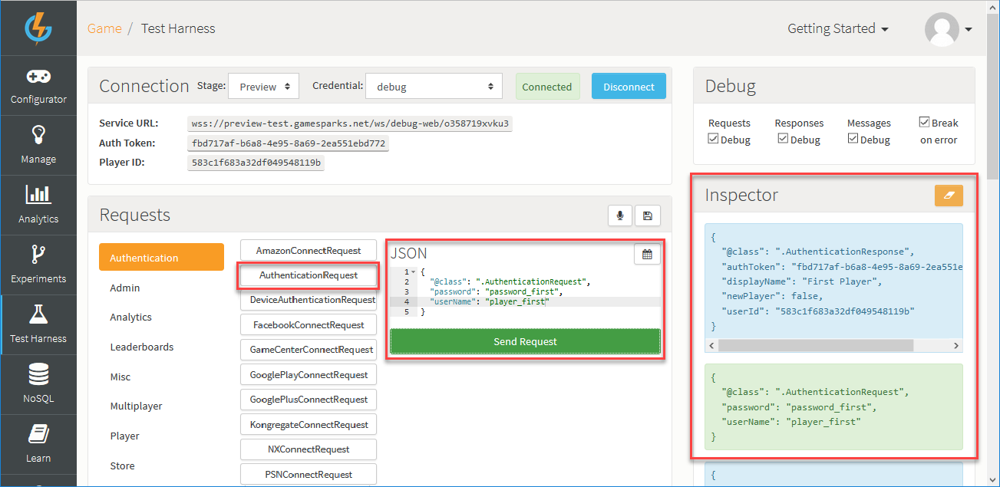

# How to Create and Use a Leaderboard

In this tutorial we follow an example of how to create and use a Leederboard. We'll:
* Create an Event which we'll use to log player scores.
* Create a Leaderboard that will act as a high score table by arranging all the players' scores from highest to lowest.
* Lastly, test the configuration in the Test Harness.

## Creating an Event

In this section we'll use the Configurator to create an Event that will allow your game code to post player scores into the GameSparks platform and have the platform store the highest score for each player.

*1.* Go to *Configurator > Events*:

*2.* Click to *Add* a new Event. The *Add Event* page opens.

*3.* Enter the details for the new Event:

*4.* In the *Attributes* panel, click to *Add* a new Attribute to the Event:.

*5.* Now fill in the Event Attribute details:

* *Short Code* - This will be used as the key for the score that you post into the platform from your game code.
* *Name* - The Name of the Attribute - remember that one Event can have several Attributes.
* *Data Type* - Set to Number in the case of a high score table because the incoming scores are integers and we want to be able to sort them into numerical order.
* *Default Value* - For our example, you can leave this blank.
* *Default Aggregation Type* - In the case of a high score table, we want to track the highest score posted by each of the game's players. Hence, we select *Maximum* for the default aggregation. This will result in one record per player been stored in the GameSparks platform and that record will contain the player's highest score.

<q>**Note:** Leaderboards are driven by Running Totals. Any Events that you create with an Attribute which doesn't have *Default Aggregation Type* set to *Used in Script* will appear for selection as a Running Total when you configure a Leaderboard.</q>

*6.* Click to *Save and Close* the new Event.

## Creating a Leaderboard

In this section we'll create a Leaderboard which arranges all the players' scores in order from highest to lowest.

*1.* Start by going to *Configurator > Leaderboards*.

*2.* Click to *Add* a new Leaderboard. The *Add Leaderboard* page opens:

*3.* Enter the Leaderboard details:

* *Short Code* - A mandatory field which will be used when your game posts scores in to the GameSparks platform.
* *Name* - Mandatory field for name of the Leaderboard.
* *Description* - A mandatory field, typically used to describe the Leaderboard's purpose.
* *Team* - Leave this at the default of *None*, which means the Leaderboard is a *Player* type.
* *Update Frequency* - Set this to *Real Time*.

<q>**Other Configuration Options?** For our example, you can leave the other Leaderboard options at their default settings.</q>

*4.* In the *Fields* panel, click to *Add* a *Running Total* to the Leaderboard.

*5.* Now fill in the *Running Total* details.

* *Running Total* and *Collector* - These will default to the Attribute you created for the Event above (or if you have already created other Events you can select *Score Event* and *SCORE_EVT.SCORE_ATTR* respectively from the drop downs). Note that Running Totals are an advanced topic that we don't need to worry about for this exercise.
* *FilterType* - Set to '\*' (wildcard) so that *all values* are included.
* *Filter Value* - This is not relevant in this example.
* *Sort* - Set to DESC (descending) to order the Leaderboard from highest player score to lowest.

*6.* Click to *Save and Close* the new Leaderboard.

## Testing the High Score Leaderboard and Event in the Test Harness

In this section we'll:
* Use the Test Harness to register some test players with the preview version of the game.
* Authorize these players and post a score to the Leaderboard for each one.
* We'll see the JSON requests and responses as well as asynchronous messages generated by the platform.
* We'll then query the Leaderboard data in various ways.

### Registering Test Players

*1.* Go to the Test Harness section and select [RegistrationRequest](/API Documentation/Request API/Authentication/RegistrationRequest.md) from the *Authentication* menu and change the *userName* and *displayName* as shown below.

*2.* To send this JSON request to the GameSparks platform, click *Send Request*. The *Inspector* shows:

* The request (in green text) that was sent to the GameSparks platform via the WebSocket.
* The response (in blue text).

Repeat the registration step for four additional users.

### Authenticating a Test Player

Now we'll authorize our first Player: *player_first*.

*1.* Select the [AuthenticationRequest](/API Documentation/Request API/Authentication/AuthenticationRequest.md) from the *Authentication* menu and change the *userName* to *player_first* as shown below.

*2.* To send this JSON request to the GameSparks platform, click *Send Request*. The *Inspector* shows:

* The request (in green text) that was sent to the GameSparks platform via the WebSocket.
* The response (in blue text).

### Posting a Score to the Leaderboard

*1.* To log a score for our first Player, under *Requests* click *Log Event* and then select *SCORE_EVT* - this is the Event you created above. Notice that the Short Code of the Event Attribute that we chose earlier, *SCORE_ATTR*, has been inserted as one of the keys in the JSON request.

*2.* Change the value to 110 as shown and click *Send Request*. This will register a score of 110 for the first Player:

Note that as well as the request and response shown in the *Inspector* that there is also an asynchronous [NewHighScoreMessage](/API Documentation/Message API/Leaderboards/NewHighScoreMessage.md) (in orange text):
* This message includes the score posted as well as the global rank details.
* Every time a player beats their previous best they will receive a message of this type.
* If the first Player logs another score that is 10 or less they will not receive a *NewHighScoreMessage*.

*3.* Now repeat the Authorization and Log Event step for the other four users that you registered. Use an increasing score for each user, for example, 210 for the second  Player, 310 for the third Player, and so on.

### Retrieving Leaderboard Data

*1.* To view the Leaderboard, select [LeaderboardDataRequest](/API Documentation/Request API/Leaderboards/LeaderboardDataRequest.md) from the Leaderboards menu.

*2.* Change the *leaderboardShortCode* in the JSON request to *HIGH_SCORE_LB*, which is the Short Code that you used when you created the Leaderboard:

*3.* Click *Send Request*. The response message can be seen in the *Inspector* and should contain entries for all five users that you logged Score Events for in the previous steps along with their ranks.

To control the number of entries returned by the *LeaderBoardDataRequest*, set the *entryCount* field to the required value. Also, to view a different part of the Leaderboard, set the *offset* field. The offset is relative to the current authorized player's position in the Leaderboard.

If the current authorized player was linked to their Facebook account in the GameSparks platform and they had friends who had logged scores in this game, then setting the social field value to true would return Leaderboard data containing just the player and player's friends:

### Getting Players "Around Me"

*1.* Authenticate the third Player (go to *Authentication > AuthenticationRequest* and then change the *userName* in the JSON request to *Third Player*).

*2.* Next, under *Requests* click *Leaderboards* and then select *AroundMeLeaderboardRequest*.

*3.* In the JSON request, set the count field to 1 to show the Leaderboard entries either side of the third Player (the currently authorized player). Notice that the player's rank and score are included in the response:

If you were to authenticate the first Player and repeat the *AroundMeLeaderboardRequest*, the response would only include two entries. This is because the first Player is at the bottom of the Leaderboard so only the player one rank higher than this Player is shown in the response.
