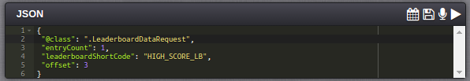

# How to Create and Use a Leaderboard

In this tutorial we follow an example of how to create and use a Leederboard. We'll:
* Create an Event which we'll use to log player scores.
* Create Leaderboard that will act as a high score table by arranging all the players' scores from highest to lowest.
* Lastly, test the configuration in the Test Harness.

## Creating an Event

In this section we'll use the Configurator to create an Event that will allow your game code to post player scores into the GameSparks platform and have the platform store the highest score for each player.

*1.* Go to *Configurator > Events*:

*2.* Click the plus  icon. The *Create Event* dialog appears.

*3.* Enter details for the new Event's details:

*4.* Click the plus  icon to add an Attribute to the Event.

*5.* Now fill in the Event Attribute details:

* *Name* - The Name of the Attribute - remember that one Event can have several Attributes.
* *Short Code* - This will be used as the key for the score that you post into the platform from your game code.
* *Data Type* - Set to Number in the case of a high score table because the incoming scores are integers and we want to be able to sort them into numerical order.
* *Default Value* - For our example, you can leave this blank.
* *Default Calc* - In the case of a high score table we want to track the highest score posted by each of the game's players. Hence, we select *Maximum* for the default calculation. This will result in one record per player been stored in the GameSparks platform and that record will contain the player's highest score.

<q>**Note:** Leaderboards are driven by Running Totals. Any Events that you create with an Attribute which doesn't have *Default Calc* set to *Used in Script* will appear for selection as a Running Total when you configure a Leaderboard.</q>

*6.* Click *Save*.

## Creating a Leaderboard

In this section we'll create a Leaderboard which arranges all the players' scores in order from highest to lowest.

*1.* Start by going to *Configurator > Leaderboards*:

*2.* Click the plus  icon. The *Create Leaderboard* dialog appears. Don't click the 'Quick Create' button - that's an advanced feature.

*3.* Enter the Leaderboard details:

* *Name* - Mandatory field for name of the Leaderboard.
* *Description* - A mandatory field, typically used to describe the Leaderboard's purpose.
* *Short Code* - A mandatory field which will be used when your game posts scores in to the GameSparks platform.
* *Update Schedule* - Set this to *Real Time*.

<q>**Other Configuration Options?** For our example, you can leave the other Leaderboard options at their default settings. (They are advanced features that allow you to notify players when player positions in the Leaderboard changes)</q>

*4.* Click the plus  icon to add a *Running Total* to the Leaderboard.

*5.* Now fill in the *Running Total* details.

* *Running Total* and *Summary* - These will default to the Attribute you created for the Event above (or if you have already created other Events you can select *Score Event* and *Score attribute* respectively from the drop downs). Note that Running Totals are an advanced topic that we don't need to worry about for this exercise.
* *FilterType* - Set to '\*' (wildcard) so that all values are included.
* *Filter Value* - This is not relevant in this example.
* *Sort* - Set to DESC (descending) to order the Leaderboard from highest player score to lowest.

*6.* Click *Save*.

## Testing the High Score Leaderboard and Event with the Test Harness

In this section we'll:
* Use the Test Harness to register some test players with the preview version of the game.
* Authorize these players and post a score to the Leaderboard for each one.
* We'll see the JSON requests and responses as well as asynchronous messages generated by the platform.
* We'll then query the Leaderboard data in various ways.

### Registering Test Players

*1.* Go to the Test Harness section and select [RegistrationRequest](/API Documentation/Request API/Authentication/RegistrationRequest.md) from the *Authentication* menu and change the *userName* and *displayName* as shown below.

*2.* To send this JSON request to the GameSparks platform press the play  icon.

The *Inspector* shows the request (in green text) that was sent to the GameSparks platform via the WebSocket and the response (in blue text).

Repeat the registration step for four additional users.

### Authenticating a Test Player

Now we'll authorize Player1.

*1.* Select the [AuthenticationRequest](/API Documentation/Request API/Authentication/AuthenticationRequest.md) from the *Authentication* menu and change the *userName* to *Player1* as shown below.

*2.* To send this JSON request to the GameSparks platform press the play  icon.

The *Inspector* shows the request (in green text) that was sent to the GameSparks platform via the WebSocket and the response (in blue text).

### Posting a Score to the Leaderboard

*1.* To log a score for Player1, select *SCORE_EVT* from the LogEvent menu - this is the Event you created above. Notice that the Short Code of the Event Attribute that we chose earlier, *SCORE_ATTR*, has been inserted as one of the keys in the JSON request.

*2.* Change the value to 100 as shown and press the play  icon. This will register a score of 100 for Player1:

Note that as well as the request and response shown in the *Inspector* that there is also an asynchronous [NewHighScoreMessage](/API Documentation/Message API/Leaderboards/NewHighScoreMessage.md) (in orange text):
* This message includes the score posted as well as the global rank details.
* Every time a player beats their previous best they will receive a message of this type.
* If Player1 logs another score that is 10 or less they will not receive a *NewHighScoreMessage*.

*3.* Now repeat the authorization and log event step for the other four users that you registered. Use an increasing score for each user, fro example, 200 for Player2, 300 for Player3, and so on.

### Retrieving Leaderboard Data

*1.* To view the Leaderboard, select [LeaderboardDataRequest](/API Documentation/Request API/Leaderboards/LeaderboardDataRequest.md) from the Leaderboards menu.

*2.* Change the *leaderboardShortCode* in the JSON request to *HIGH_SCORE_LB*, which is the Short Code that you used when you created the Leaderboard.

*3.* Click the play  icon icon. The response message can be seen in the Inspector and should contain entries for all five users that you logged score events for in the previous steps along with their ranks.

To control the number of entries returned by the LeaderBoardDataRequest set the entryCount field to the required value. Also to view a different part of the Leaderboard set the offset field. The offset is relative to the current authorized player's position in the Leaderboard.

If the current authorized player was linked to their Facebook account in the GameSparks platform and they had friends who had logged scores in this game then setting the social field value to true would return Leaderboard data containing just the player and player's friends. Now authenticate Player3.

### Getting Players "Around Me"

Authenticate Player3 (go to Authentication/AuthenticationRequest and then change the userName in the JSON request to "Player3"). Next select the AroundMeLeaderboardRequest on the Leaderboards menu. In the JSON request set the count field to 1 to show the Leaderboard entries either side of Player3 (the currently authorized player). Notice that the player's rank and score are included in the response.

If you were to authenticate Player1 and repeat the AroundMeLeaderboardRequest the response would only include two entries. This is because Player1 is at the bottom of the Leaderboard so only the player one rank higher than Player1 is shown.
