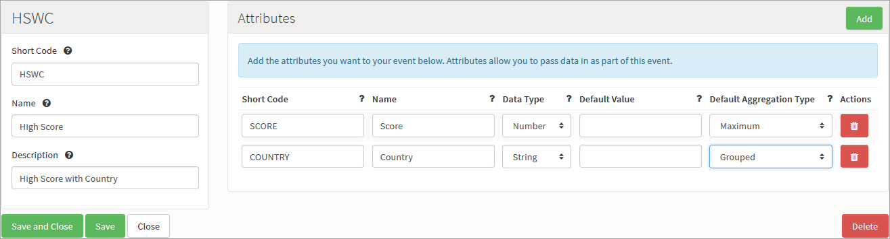
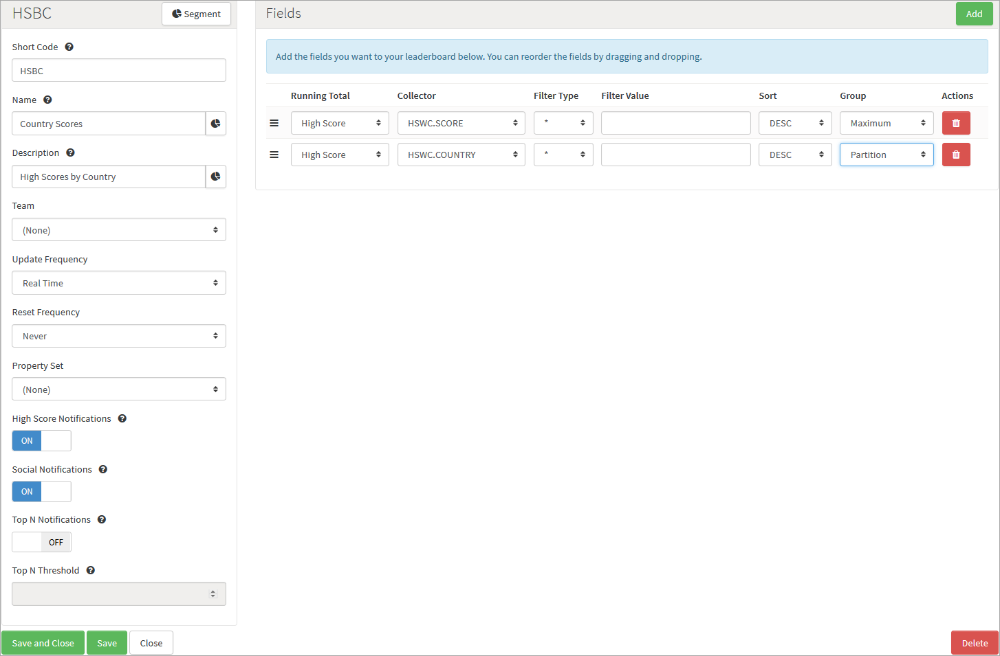

# How to Partition Leaderboards

There are times when you want multiple Leaderboards where the difference between them is based on a value in the Leaderboard. An example of this would be where you are passing a country code as part of the Event, and you want a Leaderboard for each country. Rather then creating a Leaderboard for each country with a filter value, you can configure the Leaderboard to partition itself based on the country code. This allows you to use a single configuration, but have multiple runtime Leaderboards. We'll run through this example in this tutorial.

## Create the Event

*1.* We'll create a single Event with two Attributes where the player is passing a score and a country code.



<q>**Note:** We've set the *COUNTRY* Attribute to be grouped. This will cause the Running Total to group the entries by country, allowing us to partition the Leaderboard in the next step.</q>

*2.* Click to *Save and Close* the new Event.

## Create the Leaderboard

*3.* Now we have the Event configured, we can create the Leaderboard to consume the Event data.



<q>**Note:** We've set the Group value of Country to *PARTITION*, this option is available for attributes that are grouped in the Running Total, and tells the platform to create a new Leaderboard each time it gets a new value for this field.</q>

* Each Leaderboard partition has it's own Short Code that will use the format: HSBC.<< PARTITION_CODE >>.<< PARTITION_VALUE >>.
  * For example, If you posted UK in as the country code, the Leaderboard that would be created would HSBC.COUNTRY.UK.

* You can have multiple partitions for each Leaderboard, in which case the format for Short Codes of the resulting Leaderboards would be:

HSBC.<< PARTITION_1_CODE >>.<< PARTITION_1_VALUE >>.<< PARTITION_2_CODE >>.<< PARTITION_2_VALUE >>...and so on.

## Testing the Configuration.

After authenticating pass the following [LogEventRequest]((/API Documentation/Request API/Player/LogEventRequest.md).

```    
    {
     "@class": ".LogEventRequest",
     "eventKey": "HSWC",
     "SCORE": "1",
     "COUNTRY": "UK",
     "requestId": "1403085343961"
    }

```
This will automatically create the UK Leaderboard and you'll receive a [NewHighScoreMessage](/API Documentation/Message API/Leaderboards/NewHighScoreMessage.md).

  ```  
    {
     "@class": ".NewHighScoreMessage",
     "messageId": "53a16224e4b04db4cea3e741",
     "notification": false,
     "summary": ".NewHighScoreMessage",
     "leaderboardData": {
      "userId": "52e27a77e4b0309a6e507954",
      "SCORE": 1,
      "COUNTRY": "UK",
      "city": "York",
      "country": "GB",
      "userName": "displayName",
      "when": "2014-06-18T09:55Z"
     },
     "rankDetails": {
      "globalTo": 1
     },
     "leaderboardName": "Country Scores",
     "leaderboardShortCode": "HSBC.COUNTRY.UK",
     "playerId": "52e27a77e4b0309a6e507954"
    }

```

You'll see the *leaderboardShortCode* value is set to *HSBC.COUNTRY.UK*. Sending a second request with a different country will create a new Leaderboard but will not affect the UK one.

```    
    {
     "@class": ".LogEventRequest",
     "eventKey": "HSWC",
     "SCORE": "10",
     "COUNTRY": "US",
     "requestId": "1403085343961"
    }

```

The resulting *NewHighScoreMessage* is as follows:

```    
    {
     "@class": ".NewHighScoreMessage",
     "messageId": "53a16376e4b04db4cea3ef6a",
     "notification": false,
     "summary": ".NewHighScoreMessage",
     "leaderboardData": {
      "userId": "52e27a77e4b0309a6e507954",
      "SCORE": 10,
      "COUNTRY": "US",
      "city": "York",
      "country": "GB",
      "userName": "displayName",
      "when": "2014-06-18T10:01Z"
     },
     "rankDetails": {
      "globalTo": 1
     },
     "leaderboardName": "Country Scores",
     "leaderboardShortCode": "HSBC.COUNTRY.US",
     "playerId": "52e27a77e4b0309a6e507954"
    }

```

Again, you'll see a new Leaderboard has been created with a *leaderboardShortCode* of *HSBC.COUNTRY.US* and the new score has been added to that.

To validate that the UK Leaderboard has not been updated you can make the following [LeaderboardDataRequest](/API Documentation/Request API/Leaderboards/LeaderboardDataRequest.md).

```    
    {
     "@class": ".LeaderboardDataRequest",
     "leaderboardShortCode": "HSBC.COUNTRY.UK"
     "requestId": "1403085790633"
    }

```

The response will contain the data for the UK Leaderboard, which still has the SCORE of 1

```    
    {
     "@class": ".LeaderboardDataResponse",
     "data": [
      {
       "userId": "52e27a77e4b0309a6e507954",
       "SCORE": 1,
       "COUNTRY": "UK",
       "city": "York",
       "country": "GB",
       "userName": "displayName",
       "when": "2014-06-18T09:55Z",
       "rank": 1
      }
     ],
     "leaderboardShortCode": "HSBC.COUNTRY.UK",
     "requestId": "1403085790633",
     "scriptData": null
    }

```
