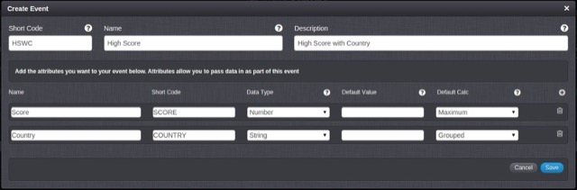
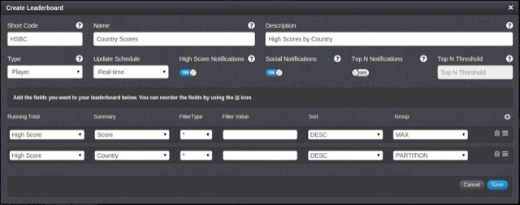

# How to Partition Leaderboards

There are times when you want multiple Leaderboards where the difference between them is based on a value in the Leaderboard. An example of this would be where you are passing a country code as part of the event, and you want a leaderboard for each country. Rather then creating a Leaderboard for each country with a filter value, you can configure the Leaderboard to partition itself based on the country code. This allows you to use a single configuration, but have multiple runtime leaderboards. We'll run through this example in this post.

## Create the Event

We'll create a single event where the player is passing a score and a country code.



Note, we've set the COUNTRY attribute to be grouped. This will cause the running total to group the entries by country, allowing us to partition the leaderboard in the next step.

## Create the Leaderboard

Now we have the event configured, we can create the leaderboard to consume the event data.



<q>**Note:** We've set the Group value of Country to PARTITION, this option is available for attributes that are grouped in the running total, and tells the platform to create a new leaderboard each time it gets a new value for this field.</q>

Each leaderboard partition has it's own short code that will use the format HSBC.<PARTITION_CODE>.<PARTITION_VALUE>. For example, If you posted UK in as the country code, the leaderboard that would be created would HSBC.COUNTRY.UK.

You can have multiple partitions for each leaderboard, in which case the format for short codes of the resulting leaderboards would be:

HSBC.<< PARTITION_1_CODE >>.<< PARTITION_1_VALUE >>.<< PARTITION_2_CODE >>.<< PARTITION_2_VALUE >>...and so on.

## Testing the Configuration.

After authenticating pass the following LogEventRequest.

```    
    {
     "@class": ".LogEventRequest",
     "eventKey": "HSWC",
     "SCORE": "1",
     "COUNTRY": "UK",
     "requestId": "1403085343961"
    }
```
This will automatically create the UK leaderboard and you'll receive a NewHighScoreMessage.

  ```  
    {
     "@class": ".NewHighScoreMessage",
     "messageId": "53a16224e4b04db4cea3e741",
     "notification": false,
     "summary": ".NewHighScoreMessage",
     "leaderboardData": {
      "userId": "52e27a77e4b0309a6e507954",
      "SCORE": 1,
      "COUNTRY": "UK",
      "city": "York",
      "country": "GB",
      "userName": "displayName",
      "when": "2014-06-18T09:55Z"
     },
     "rankDetails": {
      "globalTo": 1
     },
     "leaderboardName": "Country Scores",
     "leaderboardShortCode": "HSBC.COUNTRY.UK",
     "playerId": "52e27a77e4b0309a6e507954"
    }
```

You'll see the leaderboardShortCode value is set to "HSBC.COUNTRY.UK" Sending a second request with a different country will create a new leaderboard but will not affect the UK one.

```    
    {
     "@class": ".LogEventRequest",
     "eventKey": "HSWC",
     "SCORE": "10",
     "COUNTRY": "US",
     "requestId": "1403085343961"
    }
```

The resulting NewHighScoreMessage is as follows:

```    
    {
     "@class": ".NewHighScoreMessage",
     "messageId": "53a16376e4b04db4cea3ef6a",
     "notification": false,
     "summary": ".NewHighScoreMessage",
     "leaderboardData": {
      "userId": "52e27a77e4b0309a6e507954",
      "SCORE": 10,
      "COUNTRY": "US",
      "city": "York",
      "country": "GB",
      "userName": "displayName",
      "when": "2014-06-18T10:01Z"
     },
     "rankDetails": {
      "globalTo": 1
     },
     "leaderboardName": "Country Scores",
     "leaderboardShortCode": "HSBC.COUNTRY.US",
     "playerId": "52e27a77e4b0309a6e507954"
    }
```

Again, you'll see a new leaderboard has been created with the shortcode "HSBC.COUNTRY.US" and the new score has been added to that.

To validate that the UK leaderboard has not been updated you can make the following LeaderboardDataRequest.

```    
    {
     "@class": ".LeaderboardDataRequest",
     "leaderboardShortCode": "HSBC.COUNTRY.UK",
     "entryCount" : 1,
     "requestId": "1403085790633"
    }
```

The response will contain the leaderboard data for the UK Leaderboard, which still has the SCORE of 1

```    
    {
     "@class": ".LeaderboardDataResponse",
     "data": [
      {
       "userId": "52e27a77e4b0309a6e507954",
       "SCORE": 1,
       "COUNTRY": "UK",
       "city": "York",
       "country": "GB",
       "userName": "displayName",
       "when": "2014-06-18T09:55Z",
       "rank": 1
      }
     ],
     "leaderboardShortCode": "HSBC.COUNTRY.UK",
     "requestId": "1403085790633",
     "scriptData": null
    }

    ```
