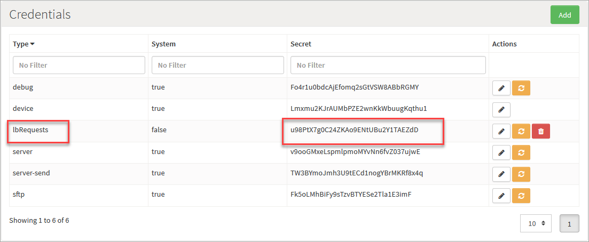
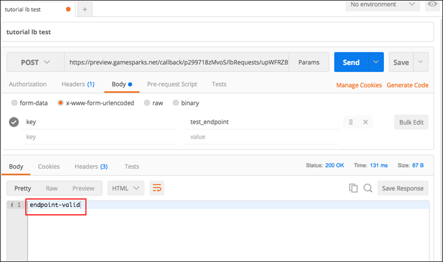
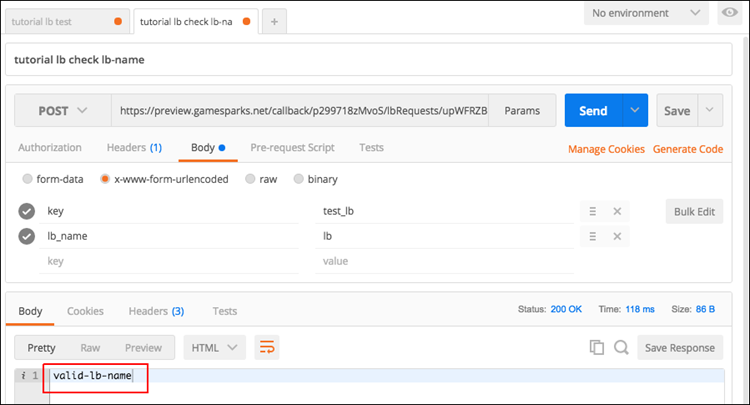
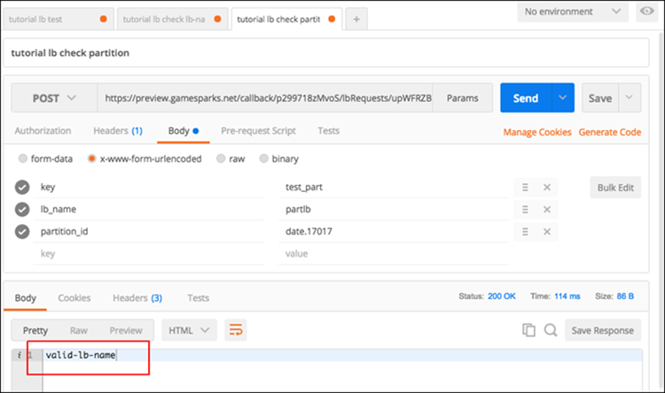
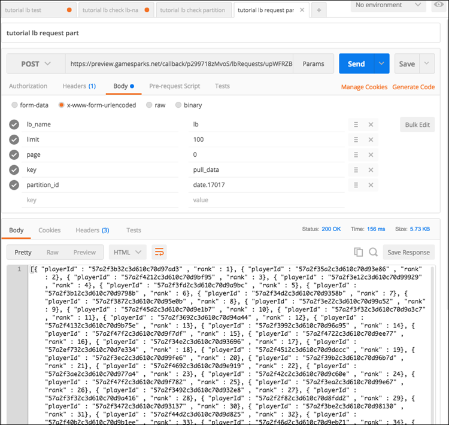

# Pulling Leaderboard Data Using Python and Rest

## Introduction

Many of our customers like to use their Leaderboard data for analytics or comparison purposes. This can be difficult to do through the portal because the maximum number of documents you can request through the NoSQL explorer is 1000. The solution to this is to use the [NoSQL REST API](/API Documentation/NoSQL REST API.md) to pull-down the Leaderboard data. However, if your Leaderboard has a huge amount of data, this can take some time.

This tutorial attempts to solve this problem by offering a method to speed up Leaderboard data extraction. We'll use a custom callback and a simple python-script to automatically check your Leaderboard and paginate the response from the server into a single document (text-file) containing the information you need for analysis.

</br>
<q>**General Method for Data Extraction!** This tutorial applies to extracting *Leaderboard* data, but you can easily modify the method to pull data from any collection for your own backup or analysis.</q>


### Downloadables

* **Example Scripts** for this tutorial can be downloaded [here](http://repo.gamesparks.net.s3.amazonaws.com/docs/tutorial-assets/Pulling%20Leaderboard%20Data%20Using%20Python.zip).

We've included in this tutorial download:
* JavaScript for the GameSparks callback used in this tutorial.
* A python 3.3 script.
* A python 2.7 script.

You'll notice that the python scripts have more content than described and discussed in this tutorial. We've done this to give you an example of how you could automate this program, given that the url, Leaderboard name, limit, and so on are known - simply hard-code those variables and the program can auto-run, validating each parameter itself.

## Custom Callback Script

We'll first need to create a custom-callback script, which will be the endpoint that our python program will post data to and receive a response from.

<q>**More about Custom Callbacks?** Check out the tutorial [here](/Tutorials/Cloud Code and the Test Harness/Using Custom Callback Urls.md).</q>

For this tutorial, let's call this callback *lbRequests*. It's not important what you call your callback. However, you'll have to keep track of the name and secret of your callback:




## Leaderboard Request Script

This script is designed in several parts which are tied into the separate stages that the python program will go through. The script is designed this way so that you use the program to test multiple endpoints, Leaderboards, and Partitions, instead of hard-coding all these parameters.

The callback script will have the following steps:

*1.* Test that the endpoint is valid.
* *If this endpoint is hit, then we'll return a message.*

*2.* Given a Leaderboard name, we'll check to make sure that the Leaderboard exists.

*3.* After we test the Leaderboard name, we'll determine if the Leaderboard is partitioned.
* *If the Leaderboard is partitioned, we should ask the program for the partition-id.*

*4.* If we need a Partition, we should test that the Partition also exists.

*5.* We'll pull the Leaderboard data.

*6.* Lastly, we'll print the appended Leaderboard data to a file.


### Testing the Endpoint

To start:
* We'll get the request-data that hits this endpoint and check the key that was sent from the program.
* The key we'll send for endpoint testing is *test_endpoint*.

```

var requestRaw = Spark.getData();
Spark.getLog().debug("TEST RAW_REQUEST:"+JSON.stringify(requestRaw));
if(requestRaw.key === 'test_endpoint'){
    // this is used to test the endpoint is working correctly
    Spark.setScriptData("RESPONSE_RAW", "endpoint-valid");
}


```

You can then test this using whatever method you want. However, we recommend the Postman App because you can generate the code you'll need for python later on in this tutorial.

You can just add the key to the body of the request as url-encoded form data:




### Testing the Leaderboard

Next:
* We're going to test a Leaderboard name sent to this script from the python program.
* While we are doing this, we'll check to see if the Leaderboard is partitioned and then either return a message indicating that a *partition-id* is needed or that the Leaderboard name is correct and the program can continue:

```

else if(requestRaw.key === 'test_lb'){
    // check that this lb is valid
    var lb = Spark.getLeaderboards().getLeaderboard(requestRaw.lb_name);
    if(lb){
        if(lb.isPartitioned()){
            Spark.setScriptData("RESPONSE_RAW", "requires-partition");
        }else{
            Spark.setScriptData("RESPONSE_RAW", "valid-lb-name");
        }
    }else{
        Spark.setScriptData("RESPONSE_RAW", "invalid-lb-name");
    }
}


```

In this case, we're sending the Leaderboard name as the attribute *lb_name* and the key this time will be *test_lb*.

So this example in Postman would look like this:




### Testing the Partition

If the previous test requested a partition-id, then we'll send one from the program. In this case:
* We'll be sending the fields:
  * *partition-id*
  * *lb-name*.
* The key will be *test_part*.

This code will be very similar to the code for the Leaderboard name check, but here the Leaderboard name is the *lb-name* and *partition-id* fields concatenated to create the full Leaderboard name. We'll also have to add a period between the name and *partition-id* because the shortcode of a partitioned Leaderboard includes this:
* For example, if the Leaderboard name is *lbpart* and it has the partition *partition_1*, then the full name is *lbpart.partition_1*.

```

else if(requestRaw.key === 'test_part'){
var lb = Spark.getLeaderboards().getLeaderboard(requestRaw.lb_name+’.’+requestRaw.partition_id);
    if(lb){
        Spark.setScriptData("RESPONSE_RAW", "valid-lb-name");
    }else{
        Spark.setScriptData("RESPONSE_RAW", "invalid-partition-id");
    }
}

```



## Pulling Leaderboard Data

The next request will pull Leaderboard data. In order to do this, we'll need to send a few fields to this callback:
* The key, which will now be *pull data*.
* The limit:
  * *This is the number of documents to return (maximum 1000).*
* The page number:
  * *This is the current group of documents you require. For example, if the page is 1 and the limit is 50, then you are requesting documents 50-100 (page 0 would be for documents 1-50).  So the python script works by incrementing the page, each time it gets a response from the previous page-request. It will keep going until there is no data being returned.*
* The Leaderboard name.
* The *partition-id*.

So...

*1.* First we get the offset of this request. The offset is always the limit multiplied by the page number, as explained above.

*2.*  We then use the *getEntries()* function to get the current cursor and then iterate through that cursor to get the specific data we want to return. In this example, we're only interested in the player’s Id and rank, but you could adapt this for score or supplemental data if required.

*3.* We then return an array of data we collected from each document in the cursor.

```

else if(requestRaw.key === 'pull_data'){

    var limit = parseInt(requestRaw.limit);
    var offset = limit * parseInt(requestRaw.page);
    var lbName = requestRaw.lb_name;
    if(requestRaw.partition_id != “”){
        lbName += "."+requestRaw.partition_id;
    }
    var lb = Spark.getLeaderboards().getLeaderboard(lbName);
    var data = [];
    var cursor = lb.getEntries(limit, offset)
    while (cursor.hasNext()) {
        var entry = cursor.next();
        data.push({"playerId": entry.getUserId(), "rank": entry.getRank()});
    }
    Spark.setScriptData("RESPONSE_RAW", data)
}


```



## Python Script

The next step is to set up the python script. This will be a very simple script and will have several steps:

*1.* Set up some null variables, which will be used to store the input from the user. Later they'll be null-checked to make sure we have valid data before trying to pull the data from the Leaderboard.

*2.* Import the relevant packages:
* *We will need the 'requests' package.*

*3.* Prompt the user for the endpoint URL and test it.

*4.* Prompt the user for the Leaderboard name and test it.

*5.* Prompt the user for the partition name and test it.

*6.* Prompt the user for the limit (which we'll check is less than 1000).

*7.* When we have all the information above checked, we'll run a loop, starting at page *0*, until we get no information in the response.

*8.* We'll then prompt the user for a filename to save the file as.


### Variables

The variables will be set up as follow:

```

callback_url = None
lb_name = None
partition_id = None
limit = None
file_name = None
request_details = None
import requests


```

The *request_details* field is important here, because it will be used to check when we have complete information. The program will not start pulling Leaderboard data until this variable is set.

### User Prompts

Our user-prompts are going to be simple. We'll print some dialog to the console and then save the user’s input. At each step, we'll send off a specific HTTP request with that information.

To construct the request:
* We create a payload variable, which will store the post-data as a url-string.
* We'll then assign the post-headers (we only need to do this once).
* And then we send the request with the callback URL, headers, and post-data.

When we’ve sent this once, all we need to do for any additional requests is change the payload and send the request again:

```

print('Step 1 - Please Enter the endpoint URL for your leaderboard callback.')
    callback_url = input('Enter Endpoint URL: ')
    print('>>> callback url', callback_url)
    # check that the callback is valid
    payload = "key=test_endpoint"
    headers = {'content-type': "application/x-www-form-urlencoded", 'cache-control': "no-cache" }
    response = requests.request("POST", callback_url, data=payload, headers=headers)
    print("Response From Server: "+response.text)
    if response.text == 'endpoint-valid':
        print('End Point URL Valid...')
        # prompt the user for a leaderboard name
	etc…


```

The code-snippet above is incomplete, because the script gets quite repetitive - it's simply requesting input from the user, validating it, and then checking the next input.

<q>**Complete Code?** Remember, there is a complete example of the code available to download with this tutorial - see top of page.</q>

An important part is missing - when the user has entered the limit, you set the *request_details* variable to ‘true’:

```

if response.text != 'invalid-partition-id':
                    if float(limit) <= 1000:
                        request_details = 'true'
                    else:
                        print('limit must be less than 1000');


```


## Compiling Leaderboard Data

Pulling and compiling the data is simple, once we have the information we need. All we need to do is create a loop which will send a request and check for Leaderboard data until the requests are no longer returning data. At that point, it will break from the loop and prompt the user for a file-name. It will then save the file under that name, in the same folder where the script was run.

```

if request_details:
    print('Sending Request')
    page = 0
    data = ""
    if partition_id == None:
        partition_id = ""
    while (page >= 0):

        requestBody = "key=pull_data&lb_name="+lb_name+"&partition_id="+partition_id+"&limit="+str(limit)+"&page="+str(page)
        print('request-body: '+requestBody)
        payload = requestBody
        response = requests.request("POST", callback_url, data=payload, headers=headers)
        #print(response.text)
        if page == 0:
            data += response.text[:-1]
        elif response.text != '[]':
            data += "," +response.text[1:-1]
        elif response.text == None:
            print('Error: Invalid Response from server...')
            break
        elif response.text == "[]":
            data += "]"
            print('No More Data In Leaderboard...')
            break
        page += 1
    print('Extracted '+str(page-1)+' pages...')

    fileName = input('Enter File Name:')
    text_file = open(fileName+".txt", "w")
    text_file.write(data)
    text_file.close()
    print('File Saved...')
    print('File can be found in the folder this program was run from')
else:
    print('Details Incorrect, Closing Program...')


```

You’ll notice from this code that we do several things with the response. All responses come back as array-strings, so in order to get the file in the correct format, we need to append these strings together. However, these array-strings are bracketed - [array-string ] - at the start and end and which we'll need to remove at certain points so that, after we have appended all responses together, we get a valid JSON array.

So, we perform the following steps to append this data correctly:
1.	First, if we have the response from the first page, we need to remove the bracket at the end but keep the one at the start.
2.	The second thing to check is for all other requests - we remove the start and ending brackets so they can be joined together without any problems.
3.	Then we check to see if we have received the last of the data from the Leaderboard (that is, the requests are returning empty arrays) and add a final bracket to the end, and break out of the loop.
4.	We also added in for the case where no data is returned from the Leaderboard. In this case, the program should break out of the loop and print an error.

Once this loop has run, we should have a valid JSON string enclosed within one opening array bracket and one closing array bracket. *Then* we save the file in the location given by the user.


## Summary

With these two scripts you can pull down Leaderboards of any size and store specific attributes you want for backup or analysis.

However, there are many uses for this program and not related to Leaderboards. For example, you could modify this program to extract data from collections instead of Leaderboards. By using the collection name instead of the Leaderboard name, this program can be used for backups of your own database collections if you wish.

This is just one of the examples that our customers use this kind of program for. If you can think of any other examples and you would like us to build tutorials for them, please leave a comment on this tutorial.
