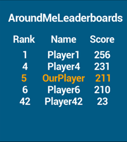
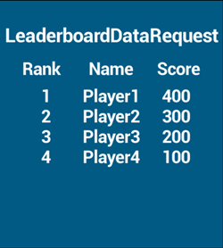
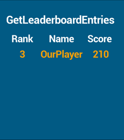

# Leaderboards - Listing Entries

## Introduction

There are two requests which retrieve entries from Leaderboards. The first being AroundMeLeaderboardRequest the second being LeaderboardDataRequest. There is also the GetLeaderboardEntriesRequest which retrieves the current or specified player's ranking in selected Leaderboards. In combination or individually these requests can easily be used to return lists of entries which can be used to display them in-game.

## The Requests

### AroundMeLeaderboardRequest

Retrieves a set amount of entries above and under the current players position with an added option to include entries from the top or bottom of the Leaderboard.  In depth documentation [here](/API Documentation/Request API/Leaderboards/AroundMeLeaderboardRequest.md).

### LeaderboardDataRequest

This request returns a set amount of entries from the top of the list counting down. This is the simple way to return a list from the Leaderboard.  In depth documentation [here](/API Documentation/Request API/Leaderboards/LeaderboardDataRequest.md).

### GetLeaderboardEntriesRequest

This request returns the current player or a given player's ranking and score for a selected Leaderboard or Leaderboards.  In depth documentation [here](/API Documentation/Request API/Leaderboards/GetLeaderboardEntriesRequest.md).

