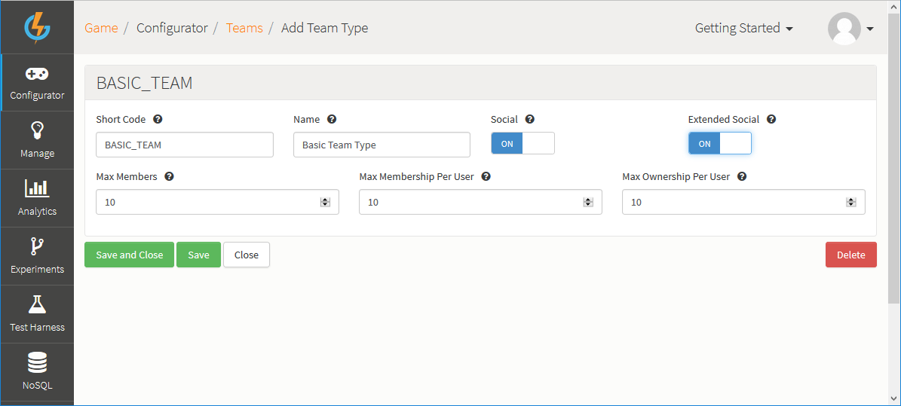

# Setting Up a Team/Clan/Party Including Chat

## Introduction

GameSparks allows your players to easily create Teams which act as groups where players can:
* Join Teams and quickly send chat messages to each other.
* Pass information between Team members.
* Submit a score as a Team instead of submitting as individual scores, which is very handy for team-based challenges or games.

This system can be used for Parties, Clans, Teams, and so on, and is very easy to set up. This tutorial shows you how to set up a Team through an owner, have another player join the Team, and how that new player can send a message to other Team members.

## Setting Up a Team Type

To set up a Team Type:

*1.* Go to the *Configurator > Teams*.

*2.* Under Team Types, click to *Add* a new Team Type. The page adjusts:



*3.* Enter the configuration details for the new Team Type:

  1. *Short Code* - The unique reference to this Team Type in code.
  2. *Name* - The Team Type name of your reference.
  3. *Social* options:
    * *Social*: If enabled, this means every member of a team of this type is regarded as a friend of the owner.
    * *Extended Social*: If enabled, this means that all team members are regarded as friends with each other.
  4. *Max Members* - How many members are allowed to belong to a Team of this Type team. 0 would declare no limit.
  5. *Max Membership* - How many Teams of this Type a player can join simultaneously.
  6. *Max Ownership* - How many Teams of the same Type can the owner have simultaneously.

Once you're happy with your configuration, that's all you have to do to create a Team Type for your players to use.

*4.* Click to *Save and Close* the new Team Type.

<q>**More Details**. For more details on Team Type creation and management, click [here](/Documentation/Configurator/Teams.md).</q>
 
## Creating a Team

Once you've created a Team Type, you can allow your players to create Teams as instances of that Team Type. A Team inherits the configuration you've set up for the Team Type and you enable players to create Teams using the SDK's API(CreateTeamRequest):
* Players can then use [CreateTeamRequest](/API Documentation/Request API/Teams/CreateTeamRequest.md) to create a team.
* As long as the player inputs the Team Type they wish to use and the Team name that will be enough to create a Team.
* However, the player can also use the *teamID* parameter in the request to specify a unique ID for their Team, which makes it easier for them to find and search for the Team:
  * If the *teamID* parameter is omitted from the request, then the platform auto-generates a unique string ID for the new Team.
  * If the *teamID* parameter is included in the request but is left empty, then the platform will use an empty string as the unique ID for the Team.
* The response will come back including data about the owner, the Team ID, Team type and members (Currently only the owner).


#### Request default:

```
    {
     "@class": ".CreateTeamRequest",
     "teamId": "",
     "teamName": "",
     "teamType": ""
    }

```

#### Request example:

```
    {
     "@class": ".CreateTeamRequest",
     "teamId": "GSTeam",
     "teamName": "GSTeam",
     "teamType": "BASIC_TEAM"
    }

```

#### Response:

```
{
  "@class": ".CreateTeamResponse",
  "members": [
    {
    "displayName": "PLAYER_1",
    "externalIds": {},
      "id": "5792408c6cc8e27fffe92149",
      "online": true
    }
    ],
    "owner": {
    "displayName": "PLAYER_1",
    "externalIds": {},
      "id": "5792408c6cc8e27fffe92149",
      "online": true
    },
    "teamId": "GSTeam",
    "teamName": "GSTeam",
    "teamType": "BASIC_TEAM"
}

```

## Joining a Team

Once the Team has been created other players can join it by simply using the [JoinTeamRequest](/API Documentation/Request API/Teams/JoinTeamRequest.md) and passing in the *teamId* or *ownerId*. When the response comes back, it includes the data for the owner, team details, and Team members, which will now be the owner and the player that sent the *JoinTeamRequest*.

#### Request default:

```
    {
     "@class": ".JoinTeamRequest",
     "ownerId": "",
     "teamId": "",
     "teamType": ""
    }

```

#### Request example:

```
    {
     "@class": ".JoinTeamRequest",
     "teamId": "GSTeam"
    }

```

#### Response:

```
{
  "@class": ".JoinTeamResponse",
  "members": [
    {
      "displayName": "PLAYER_1",
      "externalIds": {},
        "id": "5792408c6cc8e27fffe92149",
        "online": false
      },
      {
        "displayName": "PLAYER_2",
        "externalIds": {},
        "id": "579240d56cc8e27fffe92360",
        "online": true
      }
      ],
      "owner": {
        "displayName": "PLAYER_1",
        "externalIds": {},
          "id": "5792408c6cc8e27fffe92149",
          "online": false
      },
      "teamId": "GSTeam",
      "teamName": "GSTeam",
      "teamType": "BASIC_TEAM"
}

```


## Team Chat

GameSparks allows players to send messages to the team easily using the native [SendTeamChatMessageRequest](/API Documentation/Request API/Teams/SendTeamChatMessageRequest.md), which sends a message to every player that is part of the Team. When the message is sent, it can be caught by listeners in the SDK and outputted to the player easily because it contains data about the sender, the Team, the message, and Team owner ID.


#### Request example:

```
    {
     "@class": ".SendTeamChatMessageRequest",
     "message": "Hi guys!",
     "teamId": "GSTeam"
    }

```

#### Message:

```

{
  "@class": ".TeamChatMessage",
  "chatMessageId": "582301163a32df0491c47069",
  "fromId": "579240d56cc8e27fffe92360",
  "message": "Hi Guys!",
  "messageId": "582301163a32df0491c47075",
  "notification": true,
  "ownerId": "5792408c6cc8e27fffe92149",
  "playerId": "579240d56cc8e27fffe92360",
  "summary": "TeamChatMessage",
  "teamId": "GSTeam",
  "teamType": "BASIC_TEAM",
  "who": "PLAYER_2"
}

```
