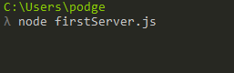
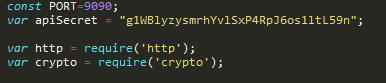
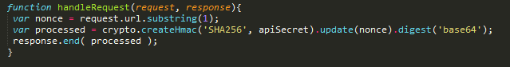
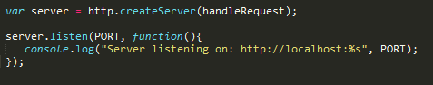
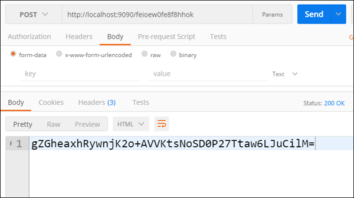
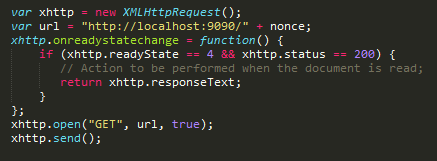

# Using Node JS with GameSparks to Store your API Secret

## Introduction

Many Clients often ask about how to secure their API Secret when using the SDK's that GameSparks provide. Security is a huge concern for any game that has a potentially large playerbase, and we understand the need for a better approach to initializing Gamesparks with the API Secret as an alternative to directly embedding the key in the application code. This is of most concern to developers using our [JavaScript SDK](/SDK Center/JavaScript SDK.md), where all scripts are publicly available to their users during play.

One such solution is to store your API secret on a Node JS server. If you're not familiar with Node JS, it's a JavaScript environment and utility used primarily to build server-side web applications. One of its main benefits is the ability to get a simple webserver up and running with very little code. Once you have written your Node script, you can run it locally or anywhere else through the "Node" command:

Traditionally, when it comes to web applications, it's common practice to keep secure information on the server side. A secure server that encrypts sensitive data such as passwords and secrets is possibly one of the more effective uses of Node JS. For our case, we want to store the API Secret on the Node Server, and then using the [nonce](https://en.wikipedia.org/wiki/Cryptographic_nonce) generated by the client application, will return a token, with which the client can then initialize GameSparks.

This tutorial explains how to set up and store your API secret on the Node JS server when using the GameSparks platform.

## Downloading Node

First, make sure you download and install Node on your system so that you are able to run the "node" command from the terminal. If you would like to, you can then download the GameSparks Node utility from our [bitbucket repo](https://bitbucket.org/gamesparks/gamesparks-node-server-sdk) or by running the npm command "npm install gamesparks-node". However, it will not be necessary for this tutorial.

## Writing the Node Script

With this done, we're ready to write our Node script. Let's call it "secretKeeper.js":
* We want to start up a server and have our server handle requests asking for the secret, given a nonce.
* It will then hash the secret with the nonce, and respond with a token for the client to authenticate.
* We're going to be using both the http and crypto packages for our functionality (if you find that you can't require these modules, make sure to install them via npm, for example, "npm install crypto").

First we'll define the PORT we want to use, then embed the API Secret right in the application. Don't worry, it's perfectly secure as long as your server is. We then require the packages we would like to use:

Next, let's create a function that will handle the requests and spit back the response to the client. The request should have the nonce in the url, so we'll look for this, and then using the crypto package, we'll process the hash with Base64 SHA256. This is the auth-token that the client will use to authenticate:

Finally, we'll start up the server and have it listen for incoming requests:

That's it! You should be able to hit whatever endpoint you created (in this case localhost:9090) with a url containing a nonce, and received a token to authenticate with. You can try this out by sending the nonce in your onNonce function in JavaScript (via an XMLHttpRequest), or by hitting the endpoint with curl or Postman.

In JavaScript, you could use XMLHttpRequest to get the token from the server:

If you are verifying the hmac token being returned by comparing it to a pre-computed nonce though the [Test-Harness](/Documentation/Test Harness/README.md), be sure to use the *same* Credential to connect with the platform through the Test Harness as the one you used when generating the nonce.

And that about wraps it up!

<q>**Not Exclusive!** Again, this method isn't exclusive to the JavaScript SDK. Any application that can make requests to a server can utilize this method. Just send the request to the server before your app is looking to authenticate with GameSparks. You'll soon come to think of many more use cases for Node JS and server-side solutions in general, so have fun exploring!</q>
