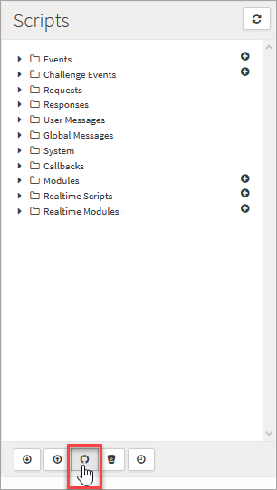
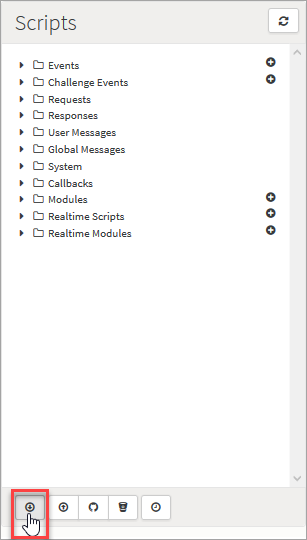
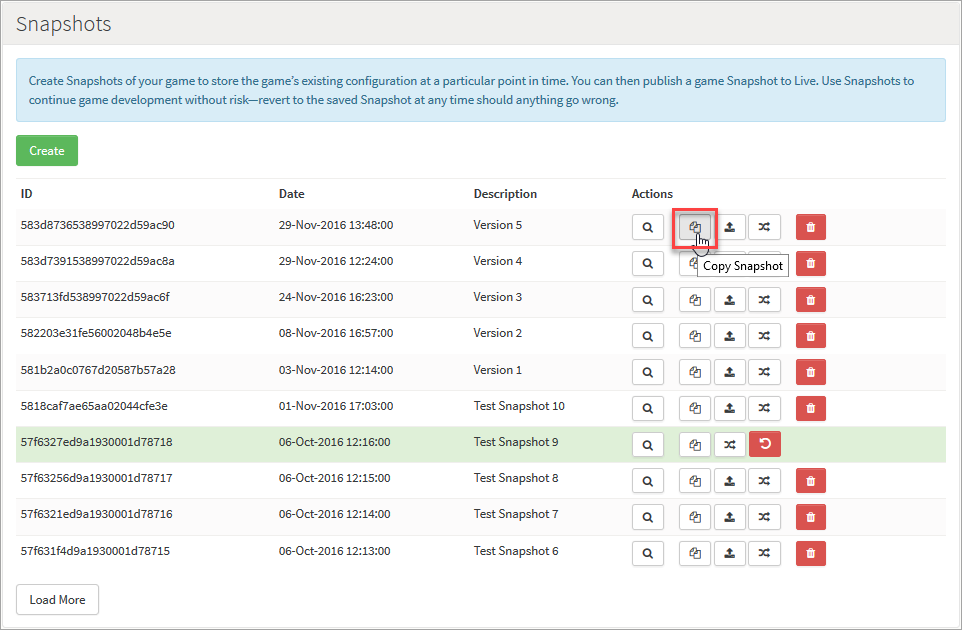
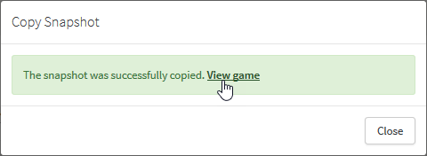
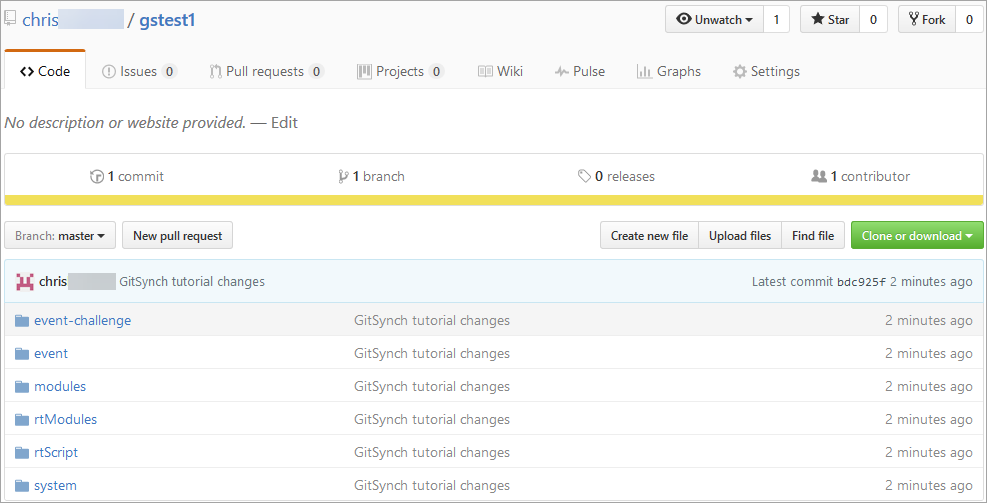
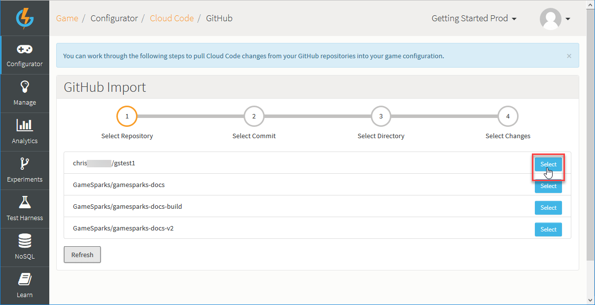
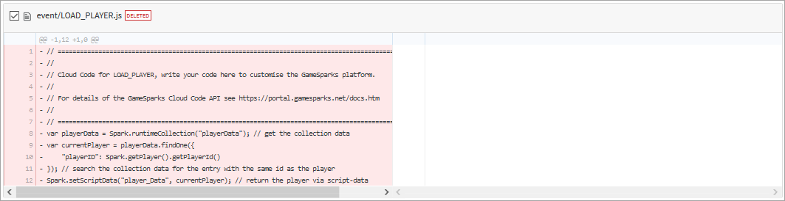

# Git Synchronization with Cloud Code Import / Export

If you're using GitHub for your repositories, Good News! It's possible to synchronize your Cloud Code with GitHub via the Import / Export features available in the platform.

In this tutorial, we assume that you already know what [GitHub](http://www.github.com) is and that you have a Git repository already created.

## Exporting Cloud Code

The first thing we can do is export our Cloud Code to our local machine.

 *1.* In your game, navigate to *Cloud Code* and select the *Export* button at the bottom of the *Scripts* section.

 

 The entire Cloud Code for the game will be downloaded as a *.zip* file to your local machine.

 The contents of the .zip archive is structured on folders which resemble the categories as seen in the Portal's *Cloud Code* section. The contents of the .zip can look something like this:

You will only see the directories in which you have created Cloud Code for. For example, if you only have code for *Events*, *User Messages*, and *Modules*, you'll only be able to see those directories in your export.

In each directory where Cloud Code exists, you will see a JavaScript (.js) file for every Cloud Code Event, Message, or Module:

This is the exported Cloud Code and it's structural layout.

*2.* Navigate back to the *Game Overview* page and click to *Create* a Snapshot of the existing game.

*3.* Click to copy  the Snapshot:

A *Copy Snapshot* dialog appears:

* Make sure you select to include the game configuration so that we can retain the corresponding Events and Cloud Code that was created for the source game.
* You can select to copy:
  * Over an existing game - the game configuration of the Snapshot will be copied over the existing game's configuration.
  * To a *New Game* - a new game will be created using the saved Snapshot configuration and the new game will be named using the convention: *COPY- << name of current game >>*.

*4.* Click *Copy*. When the Snapshot copy process has successfully completed, you'll get a message to that effect and you can click to be taken straight to the new game you have created:

## Merging Cloud Code into a GitHub Repository

In the following steps, some type of versioning control application will be useful in adding the Cloud Code to your choice of repository.

*4.* Extract the contents of the .zip archive into the local working directory that is the path of your GitHub repository.

*5.* Make changes to the overall collection of Cloud Code files you exported earlier:
* Edit some of the Cloud Code in the .js files with an IDE or text editor.
* You can also delete some of the .js files from the local machine.

*6.* Commit and push the changes that include the exported Cloud Code into the remote repository.

*7.* Navigate to your project on [GitHub](http://www.github.com). You will notice that the Cloud Code changes have been successfully pushed to your remote repository.

 

## Importing Cloud Code

*8.* In the Portal, go to the *Cloud Code* section and select *GitHub Import*.

A page opens where you can connect the gamesparks platform to your GitHub account:

*9.* Click the red *Connect GitHub*. A GitHub *Authorize* page opens:

*10.* Click to *Authorize application*. This will allow the GameSparks platform to link to your GitHub account.
* You might have to confirm you GitHub account password:

When the connection completes, you'll see that GitHub button has changed to green:

* You can use this to disconnect the platform from your GitHub account at any time.

Now that the platform is connected to your GitHub account, you'll be able to select your data from your GitHub account repositories.

*11.* Click the blue *Configure Your Games* button:

You are taken to the *GitHub Import* page:

* You will see all of the repositories for your GitHub account listed.
* You can now follow a 4-step process to pull Cloud Code changes you want from your Git repositories into your game configuration.

*12.* Step 1: Select the repository from which you want import. The page shows the commits to the selected repository:

*13.* Step 2: Select the commit you want to import from. The commit is loaded:

* You'll see that the directory structure from the commit is replicated

*14.* Step 3: Select the **root directory**. The changes are loaded for ALL directories:

<q>**Select ROOT Directory!** Although the directory structure is shown, you must select the root directory.</q>

*15.* Step 4: Select the changes you want to import. You can scroll down to inspect the changes made to Cloud Code in all directories and decide which changes you want to import:

* Any *ADDED* Cloud Code is shown in green:

* Any *DELETED* Cloud Code is shown in red:

* For any eidted and *CHANGED* Cloud Code, the location of the editing change is identified and the before/after Cloud Code is shown:

<q>**All Changes Selected!** All Cloud Code changes are selected by default for import - unselect the check box for any changes that you don't want import.</q>

*16.* If you want to create a Snapshot of your game before you import the Cloud Code changes, select the *Create Game Snapshot* at the bottom of the page:

* Creating a Snapshot before importing Cloud Code changes from your Git repository will allow you to revert to the current game configuration, should anything go wrong after you import the changes.

*17.* Click *Import* to import the selected Cloud Code changes.
* When the import process has successfully completed, you'll see a message.
