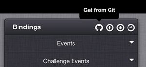
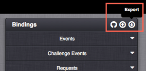
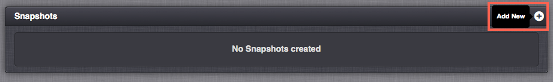
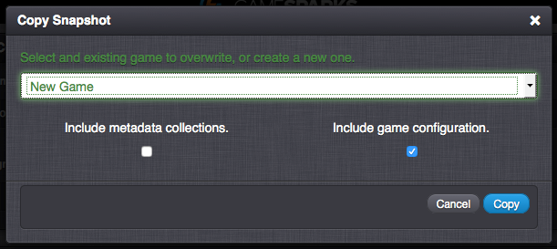
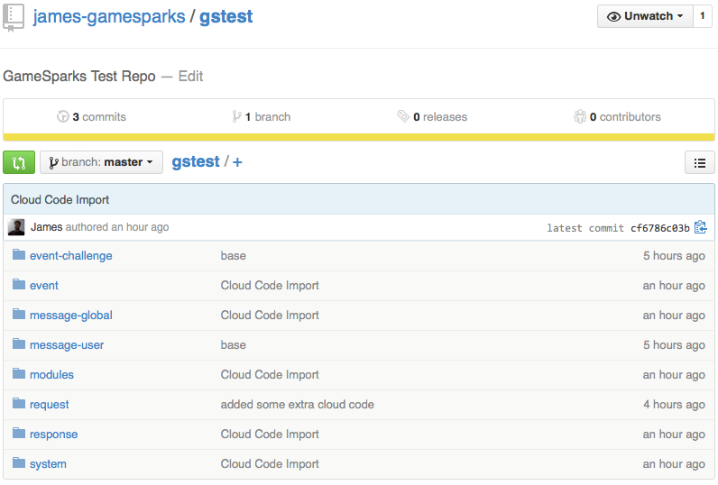
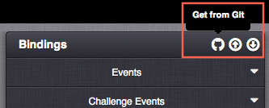

# Git Synchronization with Cloud Code Import / Export

If you're using GitHub for your repositories, Good News! It is possible to synchronize your Cloud Code with GitHub via the Import / Export features available in the platform.

In this article, we assume that you already know what [Git](http://www.github.com) is and that you have a Git repository already created.

## Exporting Cloud Code

The first thing we can do is export our Cloud Code to our local machine.

 *1.* In your game, navigate to *Cloud Code* and select the *Export* button at the top of the *Bindings* section.

 

 The entire Cloud Code for the game will be downloaded as a *.zip* file to your local machine.

 The contents of the .zip archive is structured on folders which resemble the categories as seen in the Portal's *Cloud Code* section. The contents of the .zip can look something like this:

 */event*

 */event-challenge*

 */message-global*

 */message-user*

 */modules*

 */request*

 */response*

 */system*

 You will only see the directories in which you have created Cloud Code for. For example, if you only have code for *Events*, *User Messages* and *Modules*, you will only be able to see those directories in your export.

 In each directory where Cloud Code exists, you will see a JavaScript .js file for every Cloud Code Event, Message or Module:

 */event/deleteLBEntry_evt.js*

 */event/helloWorld_evt.js*

 */event-challenge/challenge_evt.js*

 */modules/STORE_CREDIT.js*

 */response/AuthenticationResponse.js*

 */system/GS_CALLBACK_URL.js*

This is the exported Cloud Code and it's structural layout.

*2.* Navigate back to the *Overview* page and create a Snapshot of the existing game.

*3.* Copy the new Snapshot to a new game. Include the game configuration so that we can retain the corresponding events and Cloud Code that was created for the source game.

## Merging Cloud Code into a GitHub Repository

In the following steps, some type of versioning control application may be useful in adding the Cloud Code to your choice of repository.

*4.* Extract the contents of the .zip archive into the local working directory that is the path of your GitHub repository.

*5.* Edit some of the Cloud Code in the .js files with an IDE or text editor. You can also delete some of the .js files from the local machine. in this example, some files have been renamed with invalid characters as a result of what can happen if the correct file naming convention is not used.

*6.* Commit and push the changes that include the exported Cloud Code into the remote repository.

*7.* Navigate to your project on [GitHub](http://www.github.com). You will notice that the Cloud Code changes have been successfully pushed to your remote repository.

 

## Importing Cloud Code

*8.* In the Portal, go to the *Cloud Code* section and select *Get from Git*.

If this is the first time using *Get from Git* within the platform, you will be navigated to the GitHub sign-in page.

*9.* Sign in to your existing GitHub account and link it to the platform, or create a new one.*

*10.* Authorize the application to link to your GitHub account by selecting *Authorize application.*

By doing this, you will now be able to select your data from your GitHub account as it will be accessible within the platform.

*11.* Once the GitHub account is linked to the platform, the modal form will be displayed. This form has 3 selections that need to be made before being able to import successfully from GitHub. A project Repository must be chosen, as well as a Branch of that Repository, and finally, the root folder of where where the Cloud Code is stored. *

*12* Choose the *Repository* that has the imported Cloud Code from earlier. It will be available from the *Repository* dropdown menu.

*13* Choose the *Branch* of your repository. For this example, I only have the master branch. If you have more branches for your project, they will displayed in the dropdown list.

*14* Choose the *root folder* of your repository. Ideally, this should be the location of where the directories of Cloud Code are located in your account. In this example, they were included at the top-level so my root folder selection would be *'/'*. If I wanted to only synchronize what is in the Events category, I would choose *event*.

*15.* Once the selections are made, select *Preview*. The modal form will close and another window will open where you can review what is to be imported. The items listed will be color coded based on what their status will be after the import. Here are some examples:

* Green : *Cloud Code that does not already exist in the game.*
* Blue : *Cloud Code that has changed since the import.*
* Yellow : *Cloud Code that is removed as a result of the import.*
* Red : *Cloud Code that is invalid to import or created an error during the import.*

*16.* Review the items within the import. Select or de-select the items that you want confirmed by their status. For example, if an item is described as *Removed*, if the check-box is not checked, the item won't be removed.

*17.* Press *Save*. The changes will be imported.

<q>**Note:** After your first previewing of an import, the form to select the Repository, Branch and root folder will be slightly different. It will remember your chosen settings from your previous visit. These drop-down menus will be locked until you select the *Change Selection* button. You will then be able to make your changes to which Repository, Branch, or folder you want to import from.</q>

